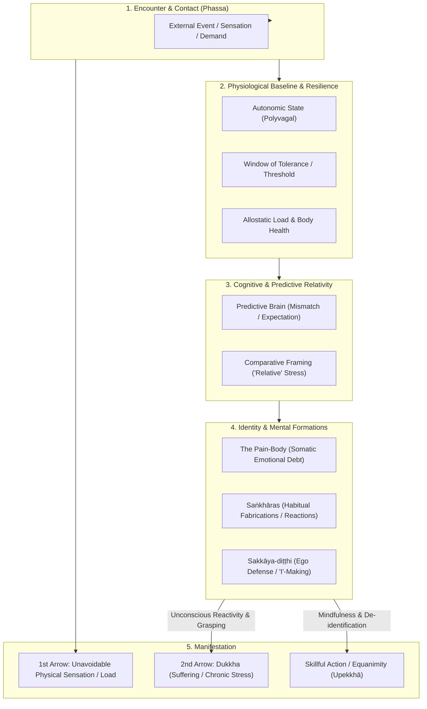
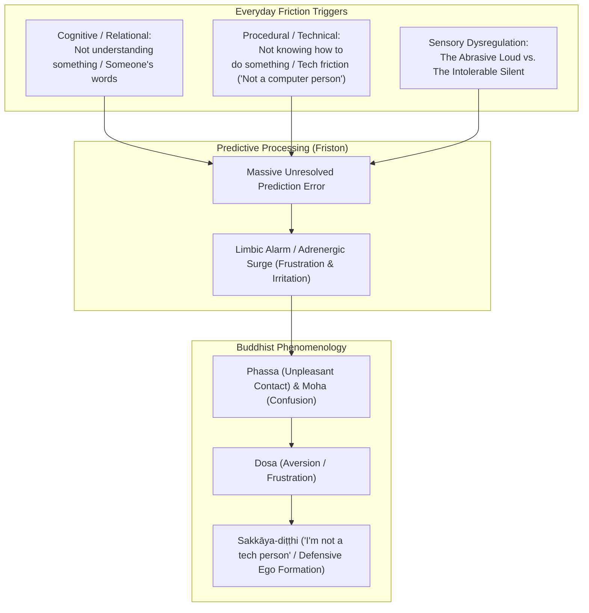
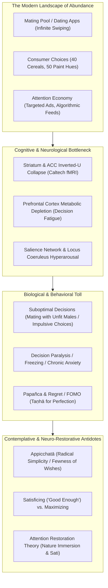
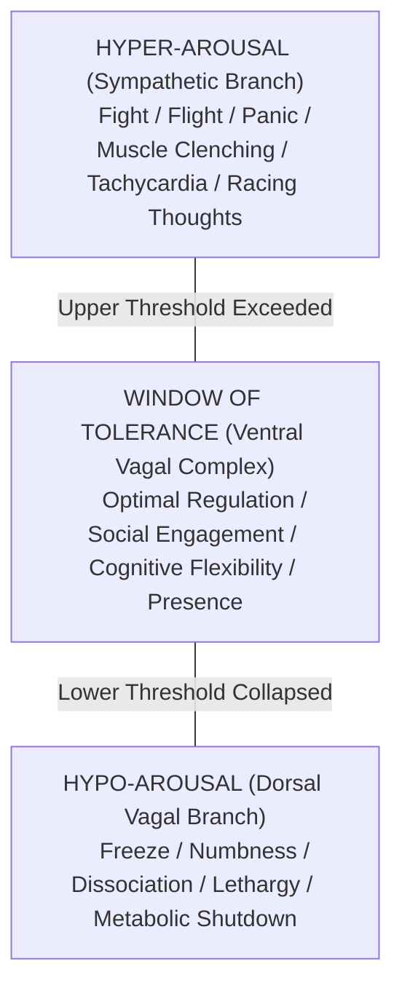
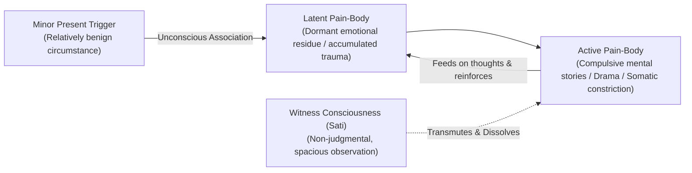
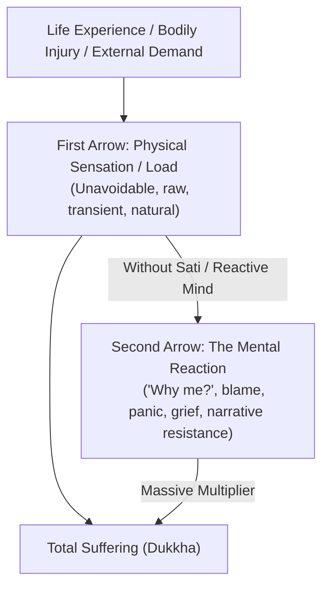

---
tags:
  - stress
  - dukkha
  - conditionality
  - four-noble-truths
  - sakkaya-ditthi
  - sankharas
  - pain-body
  - resilience
  - relative-stress
  - choice-overload
  - attention-economy
  - decision-fatigue
Created: 2026-10-03
Companion Notes: "[[The Architecture of Trauma - Somatic Imprints, Karma, and Healing]]", "[[Report - The Architecture of Recovery - Sakkāya-Diṭṭhi, Trauma, Sangha, and the Path from Compulsion to Liberation]]"
Status: Draft - Awaiting Daily Note Sync
comments: ""
---

# The Architecture of Stress and Suffering: A Multi-Dimensional Framework

> *"Stress is not what happens to us. It is our response to what happens, and response is something we can choose."* — Viktor Frankl  
> *"When this exists, that comes to be; with the arising of this, that arises. When this does not exist, that does not come to be; with the cessation of this, that ceases."* — *[[Idappaccayatā]]* (The Principle of Conditionality, Majjhima Nikāya 79)  
> *"Companion Notes: See [[The Architecture of Trauma - Somatic Imprints, Karma, and Healing]] and [[Report - The Architecture of Recovery - Sakkāya-Diṭṭhi, Trauma, Sangha, and the Path from Compulsion to Liberation]] for clinical, somatic, and recovery models."*

---

## Executive Summary & Foundational Synthesis

Stress is commonly treated as a crude, monolithic biological burden—a quantitative spike in cortisol or an abrasive external load. However, a rigorous examination across **neurobiology, predictive neuroscience, somatic psychology, evolutionary ecology, and Buddhist phenomenology** reveals that stress is fundamentally **relational, subjective, and fabricated**.

Stress does not exist in isolation within circumstances; rather, it emerges at the intersection of:
1. **The External Demand / Sensory Contact** (*Phassa* / Physical Trigger).
2. **The Biological Baseline & Capacity** (Window of tolerance, allostatic load, vagal tone).
3. **The Cognitive Frame of Reference** (Expectation, predictive error, perceived relativity).
4. **The Micro-Phenomenology of Everyday Friction** (Cognitive incomprehension, miscommunication, procedural helplessness, technological alienation, and sensory dysregulation—from abrasive noise to the dread of silence).
5. **The Landscape of Overabundant Choice & Attention Hijacking** (Decision fatigue, striatal/ACC collapse, and the weaponization of novelty—from tree frogs to consumer markets).
6. **The Somatic Shadow** (The accrued emotional inertia and reactivation of the *Pain-Body*).
7. **The Existential Misapprehension** (*[[Sakkāya-diṭṭhi]]*—the reification of a rigid ego-identity that must be defended).

This treatise unifies these paradigms into a coherent map, bridging modern Western physiological science with ancient Eastern contemplative insight.

---



---

## 1. The Core Insight: The "Relativity" of Stress

### 1.1 The Subjective Frame of Reference
A central insight of contemplative and psychological inquiry is that **stress is inherently relative**. There is no objective SI unit for psychic stress; its felt intensity is determined entirely by the baseline against which it is measured.

$$\text{Felt Stress} = \frac{\text{Perceived Demand} - \text{Perceived Control / Capacity}}{\text{Baseline Adaptation Frame}}$$

* **Adaptation-Level Theory (Harry Helson)**: Organisms evaluate stimuli relative to past exposure and current habituation levels. What constitutes overwhelming friction for an individual accustomed to low turbulence is perceived as inconsequential background noise by an individual acclimated to high turbulence.
* **The Hedonic & Stress Treadmill**: When acute external existential threats vanish, the human nervous system recalibrates its threshold downward. Minor inconveniences (digital notifications, micro-delays, trivial social friction) expand to occupy the same subjective volume previously occupied by survival imperatives.
* **Predictive Processing & Free Energy (Karl Friston)**: The brain is not a passive receiver of sensory data; it is an active prediction engine. Stress is the neurological registration of **prediction error**—a sharp discrepancy between *how reality is anticipated to be* versus *how reality presents itself*. The stress is not generated by the event, but by the magnitude of the delta between expectation and actuality.

---

### 1.2 Clinical Field Insight: The Pharmacist Consultation on Stress
During a clinical telephone consultation with Kaiser Permanente Clinical Pharmacist Mitra Najmi, PharmD (documented in [[Daily Note 261002]] / Plaud Transcripts), a routine clinical question brought this exact paradox to light:

> **Pharmacist**: *"How do you handle stress? Are you stressed?"*  
> **Andy**: *"You know, that's a good question because I meditate. I feel like... I know how I handle stress, but how that relates to... that's kind of a relative thing really to say how I handle stress. I think I do pretty good, but do I feel stress all the time? You know... but it's how I do, my mental outlook towards it is, I think, healthy."*

This exchange exposes the profound limitation of conventional medical definitions of stress:
* **The Binary Medical Trap**: Western clinical intake treats stress as a monolithic, binary variable—something you either "have" or "don't have," akin to a pathogen or an elevated blood sugar number.
* **The Dual Phenomenological Reality**:
  1. *Continuous Somatic Vibration*: *"Do I feel stress all the time?"* The biological organism living in modern conditions experiences a continuous baseline of sensory demand, bodily sensation, and autonomic currents.
  2. *Contemplative Decoupling*: *"My mental outlook towards it is healthy."* Because of sustained meditation practice, the secondary panic, narrative elaboration, and catastrophic grasping are decoupled from the somatic activation. Stress is recognized as a transient, relative phenomenon rather than an existential crisis.

---

### 1.3 Critical Principle: "Fabricated" Does Not Mean Imaginary (The Tangible Weight of Suffering)

> [!CAUTION]  
> **Warning Against Spiritual Bypassing**:  
> To recognize that stress is "relative" or that experience is "fabricated" (*Saṅkhāra*) must **never** be co-opted to dismiss, invalidate, or gaslight the raw reality of suffering. 

1. **The Biological Reality of Fabrications**:
   - In Pali, *Saṅkhāra* means "put together from causes and conditions." It does **not** mean an illusion or a fictional ghost.
   - A brick wall is "fabricated" out of clay, heat, and mortar—yet crashing into it will shatter physical bones. 
   - In precisely the same way, fabricated stress cascades through physical neurology: it pumps real cortisol, constricts real blood vessels, taxes real immune cells, and inflicts real cellular wear and tear.
2. **The Capacity to Traumatize**:
   - What we experience in life—loss, relational rupture, illness, bodily pain, systemic hostility—is **viscerally real, profoundly stressful, and fully capable of deeply traumatizing the human organism**.
   - The nervous system possesses finite evolutionary thresholds. When impact exceeds that threshold, the psyche and body undergo genuine traumatic rupture (*see companion note [[The Architecture of Trauma - Somatic Imprints, Karma, and Healing]]*).
3. **The Middle Way of Understanding**:
   - We do not deny the visceral punch of the **First Arrow** (life's unavoidable pain and shock).
   - We honor the genuine weight of grief and terror while understanding that the **Second Arrow** (the reactive, looping identity story) is where freedom can eventually be cultivated. Understanding that something is conditioned is what provides the doorway to its eventual unbinding.

---

### 1.4 Systemic & Collective Reality: War, Poverty, Racism, Famine, and Political Rupture

> [!IMPORTANT]  
> **Never Diminish Structural and Material Suffering**:  
> The recognition that stress is relational or subjective at an individual cognitive level must **never** be used to minimize, sanitize, or dismiss the crushing realities of **war, severe political divide, famine, systemic poverty, racial oppression, and societal violence**.

1. **The Fallacy of "It's All in Your Mind"**:
   - Reducing stress to individual psychology when people are surviving under artillery bombardment, racial terror, starvation, or economic deprivation is a form of spiritual violence ("toxic positivity" or co-opted "McMindfulness").
   - When a nervous system lives under systemic oppression or war, its hyperarousal or freeze response is **not a dysfunction or a failure of mindfulness**—it is an accurate, intelligent biological detection of lethal existential threat.
2. **Structural First Arrows**:
   - Poverty, systemic racism, political disenfranchisement, and displacement are massive, ongoing, institutional **First Arrows**. 
   - They deny the physical nervous system its foundational biological requirements: physical safety, adequate nourishment, clean shelter, and social dignity.
3. **Collective Kamma and Engaged Dhamma**:
   - In early Buddhist texts (such as the *Cakkavatti Sīhanāda Sutta*, DN 26), the Buddha explicitly demonstrated how economic inequality, poverty, and corrupt governance inevitably generate crime, social violence, breakdown of trust, and collective suffering.
   - Systems of oppression are the institutionalized crystallization of the Three Poisons (*Akusala-mūla*): collective greed (*lobha*), collective institutional hatred/aversion (*dosa*), and systemic delusion/ignorance (*moha*).
   - True liberation cannot be divorced from compassion in action (*[[Engaged Buddhism]]*); it demands transforming external unjust conditions just as rigorously as we cultivate inner clarity.

---

### 1.5 The Anatomy of Everyday Friction: Incomprehension, Technological Alienation, and Sensory Mismatch

While macro-level systemic crises and existential dread weigh heavily on the human psyche, a tremendous volume of daily, compounding nervous system friction stems from **the micro-phenomenology of immediate, everyday trouble**: the mundane moments where reality resists our capacity, our comprehension, or our sensory comfort.

> *"What is stressful? Stressful is not understanding something, not understanding someone's words, not knowing how to do something, getting frustrated with certain things that cause you trouble. For instance, being 'not a computer person' or not liking technology. It's loud—or there's not, or it's silent, so you don't like silence."*



#### 1. The Agony of Incomprehension: Cognitive & Communicative Friction
* **Not Understanding Something (Epistemic Helplessness)**:
  - When confronted with concepts, instructions, manuals, or situations that defy comprehension, the brain's predictive engine is starved of a coherent generative model.
  - In predictive neuroscience (Friston), a sudden spike in **unresolvable prediction error** is registered neurochemically as a threat. The organism experiences a sense of vulnerability, disorientation, and acute cognitive strain.
  - In Buddhist psychology, this is the raw discomfort of **Moha** (confusion, delusion, lack of clarity). When the mind cannot discern what is happening, confusion quickly precipitates restlessness (*Uddhacca*) and distress.
* **Not Understanding Someone's Words (Relational & Linguistic Disconnect)**:
  - Few experiences produce faster irritation than communicative misattunement: being spoken to in opaque technical jargon, dealing with ambiguous directives, listening to rapid or convoluted speech, or feeling that words are being used as a barrier rather than a bridge.
  - Language is an ancient evolutionary instrument of social cohesion and safety. When someone's words cannot be understood, the nervous system suspects deception, exclusion, or hierarchy enforcement. One feels talked down to, alienated, or made to feel inadequate—immediately activating defensive emotional posturing.
* **Not Knowing How to Do Something (Procedural Paralysis)**:
  - Encountering a broken household mechanism, an obscure bureaucratic form, or an unfamiliar software workflow without knowing the required steps induces visceral procedural paralysis.
  - The acute gap between an urgent need (*"I must get this done"*) and the absence of practical know-how creates a sharp spike of frustration (*Dosa* / aversion), often manifesting physically as clenched jaws, raised shoulders, and shallow breathing.

#### 2. Technological Alienation: The "Not a Computer Person" Complex
* **The Tyranny of Inflexible Systems**:
  - Modern existence forces human biological systems to interact constantly with rigid digital interfaces, mandatory software updates, automated phone trees, and cryptographic authentication hurdles.
  - Unlike human interactions, machines cannot be reasoned with, negotiated with, or appealed to for empathy. When an interface fails to behave intuitively, the user experiences a unique form of cold, unyielding friction.
* **The Defensive Ego Defense (*Sakkāya-diṭṭhi*)**:
  - To cope with repeated technological hurdles and feelings of inadequacy, the mind constructs an identity shield: *"I'm just not a computer person,"* or *"I hate technology."*
  - In Buddhist terms, this is a textbook manifestation of **Sakkāya-diṭṭhi** (identity view) fashioned to defend against the sting of aversion (*Dosa*). Instead of seeing the moment as an impersonal, transient event—a human nervous system interacting with poorly designed software—the ego crystallizes a permanent self-narrative of incapacity or rebellion. While this identity protects against the immediate shame of struggling, it simultaneously ensures that every future technological encounter is met with pre-emptive stress and dread.

#### 3. Sensory Dysregulation: The Polar Extremes of Sound and Stillness
Stress does not arise only from cognitive complexity or tasks; it is profoundly anchored in **sensory and environmental regulation**:

* **"It's Loud" — The Auditory Assault (Sensory Hyper-Arousal)**:
  - Unwanted, intrusive noise—street traffic, television chatter, blaring notifications, construction, leaf blowers, or overlapping loud conversations—violates auditory boundaries.
  - The auditory cortex is a direct sentinel for survival and cannot be voluntarily shut off. Abrasive sound keeps the **Salience Network** and **Locus Coeruleus** firing in tonic sympathetic alarm, depleting prefrontal metabolic reserves and provoking irritability and exhaustion.
* **"It's Silent" — The Auditory Vacuum (Sensory Under-Arousal & Introspective Dread)**:
  - Paradoxically, for many people, total silence is equally or even more stressful than noise (*"they don't like silence"*).
  - When ambient noise vanishes, external distraction drops to zero. Deprived of external targets, the brain's **Default Mode Network (DMN)** turns aggressively inward:
    - The untamed internal mental monologue—worries, regrets, catastrophic projections, self-criticism—suddenly echoes with deafening clarity.
    - Physical somatic sensations (tinnitus, racing pulse, muscular tightness) take center stage.
    - An individual who has not developed the contemplative capacity for calm abiding (*Samatha*) experiences silence not as peace, but as an intolerable void of isolation and restlessness (*Kukkucca*). They feel an urgent compulsion to turn on background television, radio, or podcasts simply to fill the silence and drown out their own unquiet mind.

#### 4. Practical Antidotes for Everyday Friction
* **Name the Sensation, Drop the Story**: When feeling lost or frustrated with a task or machine, immediately notice: *"Unpleasant feeling-tone (Dukkha-vedanā) and frustration (Dosa) are present."* Refuse to let it solidify into the identity story *"I am incompetent"* or *"I'm not a tech person."*
* **De-Personalize the Resistance**: Treat the computer bug, the confusing sentence, or the unfamiliar tool as an impersonal web of causes and conditions (*Idappaccayatā*), not a malicious assault on your sanity.
* **Somatic Sensory Stewardship**: Honor your nervous system’s current window. If an environment is abrasively loud, use noise-reduction earplugs or remove yourself; if pure silence triggers dread and spinning rumination, use gentle ambient sound (nature sounds, rainfall, steady breathing) as an intentional stepping stone toward inner stillness.

---

## 2. Choice Overload, Hyper-Stimulation, and the Attention Economy

> *"If you've ever felt overwhelmed by menu options at a restaurant, cereal varieties at the grocery store, or potential partners while scrolling through dating apps, you've experienced choice overload."* — Dr. Claire Therese Hemingway (Ecology & Evolutionary Biology)



---

### 2.1 The Biological Universal: The Gray Tree Frog Experiment
A groundbreaking 2026 evolutionary biology study published in *iScience* by Dr. Claire Therese Hemingway, Dr. Jessie Tanner, and colleagues (*see vault PDF [[Too many males to choose from can overwhelm female frogs - and change who gets to mate.pdf]]*) demonstrates that **choice overload is an ancient, cross-species biological constraint**:

1. **The Experimental Arena**:
   - Researchers placed female gray tree frogs (*Hyla versicolor*) in a circular test arena to observe mate selection based on male acoustic calls.
   - Mating calls in this species signal genetic fitness: longer calls indicate superior offspring viability.
   - Females were given a choice between one high-quality "target" call and either 1, 3, or 7 shorter "distractor" calls.
   - **Crucially**, all calls played sequentially without overlapping, completely eliminating **energetic acoustic masking** (perceptual sound-drowning).
2. **The Degradation of Decision-Making**:
   - As the number of options increased from 1 to 7 distractor calls:
     - Females took significantly longer to make a decision.
     - They became far more likely to freeze, defer choosing, or abandon selection within the 10-minute breeding window entirely.
     - **Most critically, their ability to pick the superior mate collapsed**: overwhelmed females frequently selected lower-fitness males they would have normally rejected.
3. **The Cross-Species Evolutionary Principle**:
   - The breakdown was driven purely by **cognitive overload**—the brain's finite information-processing capacity—not auditory failure.
   - Identical cognitive bottlenecks have been documented in honeybees evaluating flower patches, ants selecting nest cavities, field crickets choosing mates, and humans navigating modern consumer and dating landscapes.

---

### 2.2 The Neuroscience of Choice Overload: Striatum, ACC, and the Inverted-U Curve
What happens inside the human nervous system when confronted with vast arrays of options? Pioneering neuroeconomic fMRI research conducted at the **California Institute of Technology (Caltech)** by Elena Reutskaja, Colin Camerer, and colleagues (*published in Nature Human Behaviour*) mapped the exact neural architecture of choice overload:

* **The Inverted-U Activation Pattern**:
  - Brain activity in two key structures—the **striatum** (the basal ganglia hub that encodes anticipated reward and subjective value) and the **anterior cingulate cortex (ACC)** (the executive region that monitors decision conflict and weighs effort vs. payoff)—does **not** scale linearly with choice.
  - Instead, neural activity traces an **inverted U-curve**:
    - *Small sets (e.g., 6 items)*: Perceived as too restrictive; moderate striatal reward signal.
    - *Intermediate sets (e.g., 12 items)*: Optimal balance; peak striatal reward encoding and robust ACC evaluation.
    - *Large sets (e.g., 24+ items)*: **Neural collapse**. Activity in both the striatum and ACC plunges precipitously.
* **The Cognitive Cost / Benefit Threshold**:
  - The brain evaluates choice as an economic equation: $\text{Net Value} = \text{Anticipated Reward} - \text{Cognitive Computational Cost}$.
  - When options proliferate, the cognitive energy required by the ACC to compare multidimensional trade-offs outstrips the anticipated marginal gain of finding an incrementally better item.
  - The striatum ceases to assign a clear value signal to the set, plunging the individual into decision paralysis, regret, and low-grade autonomic anxiety.

---

### 2.3 The Modern Human Dilemma: Hyper-Stimulation & Prefrontal Depletion
Modern human life represents an unprecedented evolutionary mismatch between an ancient Pleistocene nervous system and a hyper-stimulated, hyper-commercialized environment:

1. **The Proliferation of Trivial Micro-Decisions**:
   - Humans are forced to navigate 50 shades of wall paint, 40 varieties of breakfast cereal, 80 dish restaurant menus, and thousands of algorithmic consumer goods.
   - Prefrontal executive control (the *Dorsolateral Prefrontal Cortex*, dlPFC) runs on finite cellular metabolic reserves (astrocytic glycogen, dopamine, and norepinephrine turnover).
   - **Decision Fatigue (Baumeister & Vohs)**: Every micro-evaluation depletes executive bandwidth. By mid-afternoon, the exhausted prefrontal cortex defaults to either:
     - *Passive inertia / paralysis* (procrastination, doom-scrolling).
     - *Impulsive, low-quality choices*—mirroring the female tree frogs mating with low-fitness males under cognitive overload.
2. **The Attention Economy as Warfare on the Salience Network**:
   - Advertising, commercial marketing, and algorithmic feeds are engineered to weaponize the brain's **dopaminergic reward prediction error (RPE)** system.
   - Push notifications and variable-reward feeds keep the **Salience Network** and the **Locus Coeruleus-Norepinephrine (LC-NE)** system in chronic tonic hyper-arousal.
   - This induces **Continuous Partial Attention** (Linda Stone): the brain is never fully focused and never fully at rest, leading to chronic sympathetic tonus, shallow breathing, and mental exhaustion.
3. **The Dating App Paradox**:
   - Dating applications (Tinder, Bumble, Hinge) transform the primal mating chorus into an infinite swipe deck.
   - Just as in tree frogs, the illusion of infinite options paradoxically undermines partner satisfaction, inflates perceived opportunity cost, delays relational commitment, and generates profound existential loneliness.

---

### 2.4 The Contemplative Buddhist Diagnosis: *Papañca* and the Myth of the "Perfect" Choice
Buddhist phenomenology offers an extraordinary diagnostic lens on why excessive choice and hyper-stimulation generate suffering (*Dukkha*):

* **Papañca (Mental Proliferation)**:
  - The sensory encounter with multiple options (*Phassa*) triggers feeling-tone (*Vedanā*), which immediately launches *Papañca*—the rapid, runaway conceptual proliferation of comparisons, hypothetical scenarios, and anxiety loops (*"What if option B was better? Did I miss out on option C?"*).
* **Taṇhā and the Consumerist Illusion**:
  - Modern marketing relies on stimulating **Kāma-taṇhā** (craving for sensory perfection) and **Bhava-taṇhā** (craving to construct an optimized identity through what we purchase).
  - It creates the false cognitive prior that an absolute, friction-free "best choice" exists. The impossibility of achieving perfection in an impermanent world (*Anicca*) ensures chronic dissatisfaction (*Saṅkhāra-dukkha*).
* **The Radical Antidote: Appicchatā and Santuṭṭhi**:
  - In the monastic rules (*Vinaya*) and the Suttas, the Buddha advocated for **Appicchatā** (fewness of wishes / radical simplicity) and **Santuṭṭhi** (contentment with whatever is present).
  - Monastics were limited to four basic requisites: simple robes, almsfood, basic shelter, and medicine.
  - This was **not ascetic self-punishment**; it was the **supreme preservation of cognitive bandwidth and nervous system peace**. By deliberately pruning the choice architecture of life to the essentials, the mind is liberated from the exhausting churn of constant comparative evaluation.

---

### 2.5 Evidence-Based Protocols for Overcoming Choice & Attentional Overload

| Strategy | Neurological & Psychological Mechanism | Contemplative Alignment |
| :--- | :--- | :--- |
| **"Satisficing" over Maximizing (Herbert Simon)** | Set clear, sufficient threshold criteria. Once an option meets the criteria, choose it immediately and cease browsing. Prevents ACC/striatal collapse. | **Santuṭṭhi (Contentment)**: Resting in "good enough" rather than chasing an illusory fabricated ideal. |
| **Pre-Determined Choice Architecture** | Eliminate daily trivial decisions by establishing defaults (e.g., fixed rotational meal plans, simplified minimalist wardrobe, predetermined shopping lists). Preserves prefrontal glycogen. | **Sīla as Boundary Setting**: Moral and practical guidelines that eliminate the cognitive friction of constant renegotiation. |
| **Digital Fasting & Batch Processing** | Turn off non-human notifications; batch communication into discrete windows; institute a weekly 24-hour digital sabbath. Resets the Locus Coeruleus and downregulates the Salience Network. | **Samatha (Calm Abiding)**: Removing sensory agitation to allow mental settling. |
| **Nature Immersion (Attention Restoration Theory)** | Kaplan’s ART demonstrates that natural environments engage "soft fascination," allowing the depleted voluntary attentional circuits of the dlPFC to replenish. | **Arañña (Forest Practice)**: Meditating in nature where sensory inputs are organic, non-commercial, and harmonious. |
| **Spacious Open Monitoring (Panoramic Sati)** | Shifting attention from narrow, graspy foveal focus to broad panoramic peripheral awareness reduces sympathetic arousal and disengages the Default Mode Network. | **Upekkhā (Equanimity)**: Observing options as transient phenomena rather than urgent imperatives that define identity. |

---

## 3. Biological Architecture: Thresholds, Resilience, and Allostasis

### 2.1 The Window of Tolerance (Daniel Siegel & Polyvagal Theory)
The autonomic nervous system moves through three primary functional tiers, conceptualized through Stephen Porges’ Polyvagal Theory and Dan Siegel’s Window of Tolerance model:



1. **Ventral Vagal (Within the Window)**:
   - Parasympathetic brake engaged via the myelinated vagus nerve.
   - Heart Rate Variability (HRV) is dynamic; respiration is rhythmic.
   - The prefrontal cortex maintains executive top-down control over the limbic structures. Stressors are processed as solvable challenges rather than existential threats.
2. **Sympathetic Inundation (Hyper-Arousal)**:
   - The stress threshold is breached upward.
   - Norepinephrine, epinephrine, and cortisol flood the bloodstream.
   - Blood shunts to peripheral muscles; peripheral vision narrows (tunnel vision); temporal perception warps.
3. **Dorsal Vagal Collapse (Hypo-Arousal)**:
   - When hyper-arousal fails or cannot be sustained, the primitive unmyelinated dorsal vagal system triggers an evolutionary freeze response.
   - Characterized by paralysis, apathy, emotional blunting, and despair.

### 2.2 Allostatic Load vs. Resilience
* **Homeostasis**: The maintenance of physiological equilibrium at a fixed set point (e.g., core body temperature of 98.6°F).
* **Allostasis (Sterling & Eyer, McEwen)**: "Stability through change." The active biological process by which the body alters its internal parameters (blood pressure, heart rate, immune mediators) to match dynamic environmental loads.
* **Allostatic Load & Overload**: The cumulative biological tax paid by the organism when allostatic mechanisms remain continuously engaged. Chronic allostatic load leads to hippocampal neurotoxicity, systemic low-grade inflammation ($IL-6$, $TNF-\alpha$), suppressed neurogenesis ($BDNF$), and cellular senescence (accelerated telomere shortening).
* **Biological Resilience**: Resilience is not stubborn endurance or rigidity; it is the **velocity of recovery** back into the Window of Tolerance once the acute stressor has ceased.

---

## 4. Somatosensory & Emotional Inertia: The "Pain-Body"

Formulated by spiritual teacher Eckhart Tolle, the **Pain-Body** (*Schmerzkörper*) provides a powerful psychological and energetic heuristic for understanding why humans frequently overreact to minor stressors:



### 4.1 Mechanics of the Pain-Body
* **Accumulated Negative Energy**: Every time an emotion is resisted, suppressed, or incompletely processed in the past, an energetic residue remains trapped in the soma and subconscious psyche.
* **Semi-Autonomous Nature**: The pain-body operates like an energetic parasite. It possesses a survival drive: it seeks opportunities to awaken and feast on emotional conflict, resentment, righteous indignation, anxiety, and self-pity.
* **Symbiosis with Compulsive Thinking**: The active pain-body commandeers the narrative voice of the mind. It manufactures catastrophic or adversarial narratives that justify and amplify its own vibration. The individual becomes completely identified with the pain-body, believing *"This is who I am right now."*

### 4.2 Transmutation Through Presence
The pain-body cannot survive direct, sustained, non-judgmental presence (*Sati*). The moment attention is withdrawn from the mental narrative and placed purely into the raw bodily sensation—feeling the knot in the solar plexus, the constriction in the throat, or the heat in the chest without labeling it—the identification is broken. The pain-body is uncoupled from the narrative engine and metabolized.

---

## 5. Physiology of Transmutation: Physical Wellness & Meditation

To elevate the threshold of stress tolerance and accelerate the recovery velocity, interventions must operate on both the biological hardware and the cognitive-phenomenological software.

| Modality | Biological Mechanism | Impact on Stress Threshold & Relativity |
| :--- | :--- | :--- |
| **Zone 2 Aerobic Base** | Increases mitochondrial density; optimizes lactate clearance; lowers resting sympathetic tone. | Expands aerobic ceiling; prevents physiological panic during metabolic spikes. |
| **Sleep Architecture (Slow-Wave & REM)** | Activates glymphatic brain clearance; downregulates amygdala reactivity; clears neurochemical debris. | Resets emotional reactivity baseline; prevents low-threshold sensory irritability. |
| **Somatic Breathwork (Physiological Sigh)** | Two rapid inhales followed by prolonged exhale activates pulmonary stretch receptors and the vagal motor nucleus. | Induces near-instantaneous parasympathetic brake engagement; slows heart rate via respiratory sinus arrhythmia. |
| **Vipassanā / Insight Meditation** | Decouples bare sensation (*Vedanā*) from reactive evaluation (*Saṅkhāra*); quiets the Default Mode Network (DMN). | Neutralizes the "second arrow"; dismantles automatic affective reaction loops. |
| **Śamatha / Concentrative Meditation** | Stabilizes attention onto a single object (*e.g., breath*); quiets mental scattering (*Vikkhepa*). | Builds neural capacity to stay anchored inside the Window of Tolerance under load. |

---

## 6. The Contemplative Buddhist Framework: The Deepest Diagnostics

Where modern psychology views stress as an inconvenient physiological dysregulation, Buddhist philosophy diagnoses it as the core existential dilemma of conditioned existence: **[[Dukkha]]**.

```mermaid
graph TD
    subgraph Origin["The Root of Stress (Paticcasamuppāda)"]
        Ignorance["Avijjā (Delusion / Misunderstanding of Reality)"]
        SankharasNode["Saṅkhāras (Volitional Fabrications)"]
        ContactNode["Phassa (Sensory Contact)"]
        VedanaNode["Vedanā (Pleasant / Unpleasant / Neutral Feeling-Tone)"]
        TanhaNode["Taṇhā (Craving / Aversion)"]
        UpadanaNode["Upādāna (Clinging / Attachment)"]
        BhavaNode["Bhava (Becoming / Identity Construction)"]
        DukkhaNode["DUKKHA (Stress / Unsatisfactoriness / Suffering)"]
    end

    Ignorance --> SankharasNode
    SankharasNode --> ContactNode
    ContactNode --> VedanaNode
    VedanaNode -->|Without Mindfulness| TanhaNode
    TanhaNode --> UpadanaNode
    UpadanaNode --> BhavaNode
    BhavaNode --> DukkhaNode
    
    VedanaNode -.->|WITH MINDFULNESS (Sati)| Equanimity["Upekkhā (Equanimity & Non-Clinging)"]
```

---

### 6.1 The Four Noble Truths (*[[4 Noble Truths|Cattāri Ariyasaccāni]]*)

1. **Dukkha (The Truth of Stress / Suffering)**:
   The Buddha categorized Dukkha into three distinct layers:
   * **Dukkha-dukkha**: Ordinary physical and emotional pain (injury, sickness, aging, grief). Unavoidable facets of incarnate biology.
   * **Viparināma-dukkha**: Suffering born of impermanence and change (*Anicca*). The stress of clinging to pleasant experiences that inevitably dissolve, or fearing the loss of security.
   * **Saṅkhāra-dukkha**: The existential friction of conditioned existence itself. The deep, subtle unease arising because all fabricated phenomena are inherently unstable, contingent, and incapable of providing permanent rest.

2. **Samudaya (The Arising / Cause of Stress)**:
   The cause of stress is **Taṇhā** (thirst / craving):
   * *Kāma-taṇhā*: Craving for sensory gratification and pleasant feelings.
   * *Bhava-taṇhā*: Craving to become, to maintain a recognized identity, to achieve and perpetuate status.
   * *Vibhava-taṇhā*: Craving for non-existence, annihilation, or escape from unpleasant experiences (resistance/aversion).

3. **Nirodha (The Cessation of Stress)**:
   The total unbinding (*Nibbāna*) that occurs when craving and delusion are completely relinquished. Stress ceases when the causes of stress cease.

4. **Magga (The Path Leading to Cessation)**:
   The Noble Eightfold Path (*Ariya Aṭṭhaṅgika Magga*), organized into three pillars:
   * **Sīla (Virtue/Integrity)**: Eliminates the cognitive friction and stress of guilt, remorse, dishonesty, and relational conflict.
   * **Samādhi (Mental Cultivation)**: Stabilizes the attention and stills the mental turbulence.
   * **Paññā (Wisdom/Direct Seeing)**: Penetrates the three marks of existence: *Anicca* (impermanence), *Dukkha* (stressfulness), and *Anattā* (non-self).

---

### 6.2 Sakkāya-Diṭṭhi: Identity View as the Multiplier of Suffering
**[[Sakkāya-diṭṭhi]]** is the belief in a personal, permanent, autonomous "self" or "soul" inside the five aggregates (*Khandhas*: form, feeling, perception, mental formations, consciousness).

* **The Primary Illusion**: The untrained mind automatically assigns an "I" or "Mine" to whatever experience arises.
  - Sensation arises $\rightarrow$ "My pain."
  - Anxiety arises $\rightarrow$ "I am stressed."
  - Threat to reputation $\rightarrow$ "They are attacking *me*."
* **Why Sakkāya-diṭṭhi Magnifies Stress**:
  $$\text{Suffering} = \text{Pain} \times \text{Resistance} \times \text{Identification}$$
  When an event threatens an imagined identity, the nervous system mobilizes as if physical survival were at stake. The ego must continuously defend its perimeter, status, boundaries, and validation.
* **The Liberating Realization**: In the absence of an unchanging entity called "self," experiences are seen simply as impersonal phenomena arising and passing away according to causes and conditions. Without a reified self to defend, the primary target of psychic stress dissolves.

---

### 6.3 Saṅkhāras: Mental Formations and Fabrications
The word **[[Saṅkhāras|Saṅkhāra]]** denotes that which has been put together, fabricated, or fashioned through volitional intent (*Kamma*).

* **The Factory of Stress**: An external stimulus makes contact (*Phassa*) $\rightarrow$ generates a raw feeling-tone (*Vedanā*, neutral/pleasant/unpleasant) $\rightarrow$ the mind's cognitive machinery immediately begins fabrications (*Saṅkhāras*).
* **The Fabricated Cascade**:
  1. *Bodily fabrication (Kāya-saṅkhāra)*: Breathing shortens; shoulders tense.
  2. *Verbal fabrication (Vacī-saṅkhāra)*: Internal mental monologue starts spinning: *"This shouldn't be happening; this is unfair; what if this ruins everything?"*
  3. *Mental fabrication (Citta-saṅkhāra)*: Perceptions (*Saññā*) and moods solidify into resentment, terror, or defeat.
* Stress is therefore not the raw input; **stress is the output of uninspected, automated saṅkhāras**.

---

### 6.4 Conditionality: Idappaccayatā and Paṭiccasamuppāda
* **[[Conditionality|Idappaccayatā]] (Specific Conditionality)**:
  The absolute law that everything that arises is conditioned by antecedent causes:
  > *Imasmiṃ sati idaṃ hoti; imassuppādā idaṃ uppajjati.*  
  > *(When this exists, that comes to be; with the arising of this, that arises.)*
* **The Strategic Lever in Dependent Origination**:
  In the twelve-link chain of Dependent Origination (*Paṭiccasamuppāda*), the critical juncture is between **Vedanā (Feeling-Tone)** and **Taṇhā (Craving)**.
  - An unpleasant sensation (*Dukkha-vedanā*) is an unavoidable law of biological existence.
  - **However**, the arising of Craving/Aversion (*Taṇhā*) is **not** inevitable.
  - If awareness meets *Vedanā* with clear seeing and equanimity (*Upekkhā*), the causal chain is severed right there. The spark of physical contact never ignites the wildfire of psychic suffering.

---

### 6.5 The Two Arrows (*Sallatha Sutta*, SN 36.6)
The classic Buddhist exposition distinguishing between primary reality and manufactured stress:



* **The First Arrow**: The physical arrow strikes the body. It produces genuine biological sensation and pain. Even an enlightened being (*Arahant*) experiences the first arrow.
* **The Second Arrow**: The uninstructed run-of-the-mill person shoots a second arrow into themselves: *"Why did this happen to me? What will happen tomorrow? I cannot bear this!"*
* The vast majority of modern human stress is composed entirely of **clouds of second arrows** circling imagined targets.

---

## 7. Integrated Comparative Taxonomy of Stress Paradigms

| Dimension | Modern Neurobiology | Somatic Psychology (Tolle / Levine) | Contemplative Buddhism |
| :--- | :--- | :--- | :--- |
| **Primary Definition** | Autonomic dysregulation; allostatic load; HPA axis activation. | Reactivation of the trapped emotional pain-body; somatic trauma loop. | *Dukkha*: The inherent unsatisfactoriness of conditioned phenomena (*Saṅkhārā*). |
| **Origin of Friction** | Mismatch between environmental demand and metabolic resources. | Identification of the conscious self with unresolved emotional energy and mental narrative. | *Taṇhā* (craving/aversion) rooted in *Avijjā* (delusion of a permanent, separate self). |
| **Role of Identity** | Ego threat; status preservation; social hierarchy anxiety. | The false ego using drama and victimhood to perpetuate its survival. | *Sakkāya-diṭṭhi*: Identity view creating attachment to the transient five aggregates. |
| **Remediation Mechanism** | Vagal stimulation, sleep, exercise, heart rate variability training, cognitive reframing. | Disidentification; witnessing the felt sense without mental narrative; anchored presence. | Noble Eightfold Path: *Sīla* (ethics), *Samādhi* (calm focus), *Paññā* (liberating insight into *Anattā*). |
| **Ultimate Goal** | Robust physiological resilience and rapid recovery to baseline. | Complete freedom from the pain-body; living in the timeless "Now." | Complete unbinding (*Nibbāna*); the eradication of all manufactured suffering. |

---

## 8. Practical Synthesis: The Protocol for De-Fabricating Stress

When stress is detected in real time, apply this integrated five-tier protocol:

1. **Biological Grounding (Physiological Reset)**:
   - Perform two deep nasal inhalations followed by an extended, audible oral exhale (Physiological Sigh).
   - Drop the tongue from the roof of the mouth; unclench the jaw; soften the belly.
2. **Locate the First Arrow (Somatic Verification)**:
   - Ask: *"What is the actual sensory data right now?"*
   - Strip away the story. Feel the raw sensations: temperature, pressure, pulse, constriction. Treat them as bare physical vibrations.
3. **Audit Choice Overload & Relativity (Cognitive Framing)**:
   - Ask: *"Am I experiencing ACC/Striatal collapse from too many competing options or sensory inputs?"*
   - Immediately apply **satisficing**: pick the option that meets the minimum threshold criteria and close down alternative browsing.
4. **Identify the Pain-Body Infiltration**:
   - Notice if an old, familiar emotional script is attempting to hijack the present moment (*"People always do this to me," "I am trapped"*).
   - Shine the light of witness consciousness directly upon the somatic knot without feeding it new thoughts.
5. **Dismantle Sakkāya-Diṭṭhi (The Non-Self Inquiry)**:
   - Ask: *"Who or what is being stressed right now?"*
   - Observe that the sensation is an object of awareness, not the subject. The awareness itself is neither stressed nor threatened. Experience returns to the peaceful rhythm of conditionality (*Idappaccayatā*).
