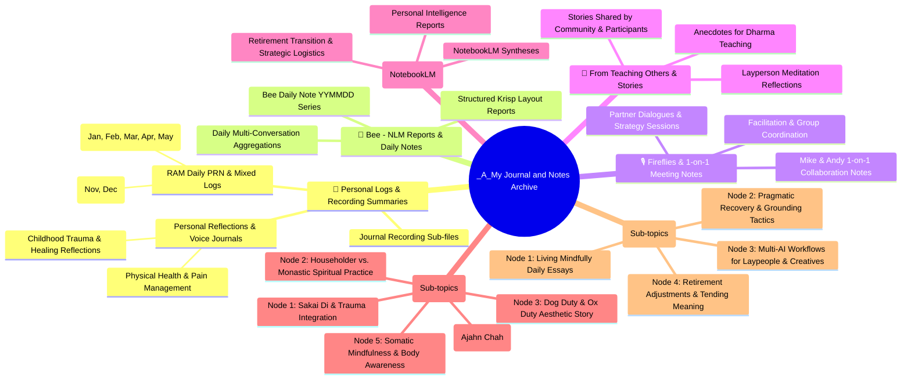

# Master Mind Map - Journal Archive & Content Nodes

This master mind map maps your entire **`_A_My Journal and Notes`** folder structure—including your historical RAM daily logs, personal recording summaries, Fireflies meeting notes, daily transcripts, Bee reports, and NotebookLM intelligence summaries—into structured content nodes for your future **books** and **blog posts**.

---

## 🗺 Interactive Master Mind Map

---

## 📂 Vault Folder Architecture Mapping

Below is how your actual `_A_My Journal and Notes` subfolders align with these content creation nodes:

| Vault Folder Path | Folder Purpose | Target Use for Books / Blogs |
| :--- | :--- | :--- |
| `_A_My Journal and Notes\Personal Logs Recording Summaries\` | Voice journal transcripts, RAM daily PRN logs (2025–2026) | Primary raw material for memoirs, trauma integration, and personal story chapters. |
| `_A_My Journal and Notes\Bee - NLM Reports\` | Formatted daily reports combining Bee AI conversations | Daily structured summaries for blog post topics and weekly review nodes. |
| `_A_My Journal and Notes\Fireflies\` | 1-on-1 meeting notes (Mike & Andy, partner meetings) | Collaboration insights, team teaching structure, and dialogue extracts. |
| `_A_My Journal and Notes\From Teaching Others\` | Stories and experiences shared by retreat/group participants | Anecdotes and case illustrations for teaching chapters and blog stories. |
| `_A_My Journal and Notes\_Daily Log Notes (NotebookLM)\` | NotebookLM intelligence syntheses & logistics reports | High-level thematic overviews and strategic summaries. |
| `_A_My Journal and Notes\Daily Transcripts\` | Raw speech-to-text transcript files | Reference archives for exact quotes and participant dialogue. |

---

## 🚀 Next Steps: Expanding & Deconstructing Nodes

As you add more data from other folders in your vault (e.g. `Zen`, `Meditations`, `_A_My Teaching`, `_A_Head & Heart Together`), we can expand this master mind map into nested sub-node maps:

1. **Book Branch**: Create dedicated chapter outlines linking exact journal dates and transcripts to specific book chapters.
2. **Blog Branch**: Group recurring themes into series (e.g., *Mindfulness in Everyday Life*, *AI Tools for Creative Writing*, *Navigating Retirement*).
3. **Cross-Reference Linking**: Link nodes directly to related files across your Obsidian vault.
