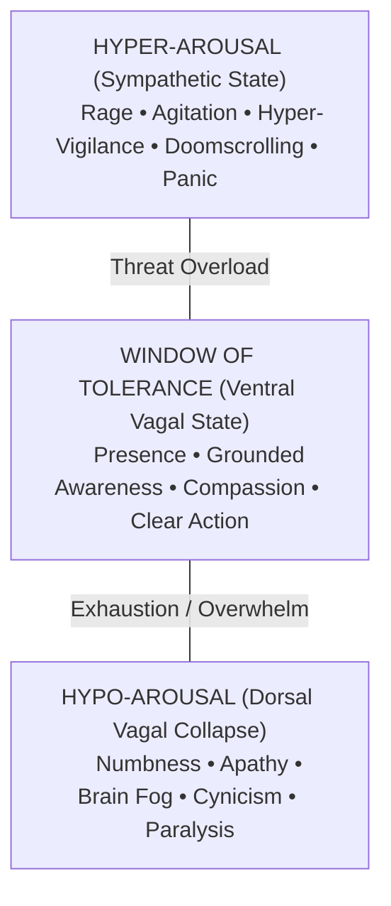

# Finding Ground in the Tremor: A Contemplative Guide Through Modern Overwhelm, Identity, and Collective Hope

> *"Stress is not what happens to us. It is our response to what happens, and response is something we can choose."* — Viktor Frankl[^1]  
> *"When this exists, that comes to be; with the arising of this, that arises. When this does not exist, that does not come to be; with the cessation of this, that ceases."* — *Idappaccayatā* (The Principle of Conditionality, Majjhima Nikāya 79)[^2]

---

## The Weight in the Room

If you feel like you are carrying a low-frequency hum of exhaustion in your chest—or an edge of irritation that flares over the smallest friction—you are not alone. And more importantly: **you are not broken.**

Look around at the landscape we are being asked to navigate every single morning:

- **The Economic Squeeze**: The cost of basic groceries, utility bills, housing, and healthcare climbs relentlessly while real wages struggle to keep pace.[^3] Even our leisure is commodified into a death by a thousand cuts—constant prompts to upgrade streaming tiers, subscribe to segmented regional sports networks, and pay subscription fees simply to watch the game or relax with family.[^4]
- **The AI Earthquake & Vocational Dread**: Artificial intelligence has accelerated into the core of human vocations. White-collar career tracks, creative livelihoods, and technical crafts built over decades are dissolving without clear replacements or societal safety nets, leaving millions wondering what tomorrow's labor even looks like.[^5]
- **The Crisis of Self-Worth and Changing Roles**: There is a profound, quiet ache around identity—especially for men. For generations, masculine identity was anchored in being the dependable economic provider, the protector, the builder of stable futures. As those traditional roles shift or are pulled out from underneath, many find themselves disoriented, asking: *What is my value? Where do I belong?*[^6]
- **The Micro-Frustrations of Everyday Friction**: Beyond the macro-crises, there is the immediate, visceral wear-and-tear of daily life: not understanding something that feels like it should be obvious, struggling to decode someone's confusing or jargon-laden words, or not knowing how to do something and feeling that sudden flash of hot frustration. It is the exhaustion of being forced to navigate digital mazes when you're "not a computer person," or feeling jarred by sensory whiplash—where life is either abrasive and intolerably loud on one hand, or so silent that your own unquiet thoughts echo deafeningly off the walls.[^7]
- **A Fractured Civic Fabric**: We live amidst an exhausting war between truth and manufactured reality. Anti-intellectualism and conspiracy clash with ideological litmus tests; quiet, back-handed discriminatory policies undermine progress; and deliberate spectacles of cruelty—from aggressive immigration crackdowns and militarized ICE actions to the systematic dismantling of basic public safety nets—are paraded across our feeds.[^8]
- **The Breathless Pause Before the Midterms**: We stand in a tense, suspended quiet right before national midterm elections. Society feels like a room holding its breath—suspended between dread of further division and a desperate, stubborn hope for a course correction.

When all of this bears down at once, the human organism inevitably reacts. Yet too often, our culture tells us that feeling overwhelmed is an individual failure of grit, mindset, or resilience. 

It is time to tell the truth about what is happening in our bodies, our minds, and our communities.

---

## 1. "Fabricated" Does Not Mean Imaginary: No Spiritual Bypassing

In contemplative traditions, particularly early Buddhist psychology, we often hear that our suffering is "conditioned" or "fabricated" (*Saṅkhāra*). In popular wellness culture, this is frequently twisted into toxic positivity: *"It's all in your head,"* or *"Change your mindset and change your reality."*

Let us be completely unequivocal: **Fabricated does not mean imaginary.**

In the original Pali texts, *Saṅkhāra* simply means "put together from causes and conditions." A brick wall is fabricated from clay, straw, and fire—yet if you collide with it, your physical bones will break. 

In precisely the same way, the economic pressures, systemic cruelties, and structural instabilities of our world are **visceral, material, and powerful**. They pump real cortisol through your bloodstream; they constrict physical blood vessels; they tax cellular health and keep your adrenal glands firing overtime through chronic allostatic load.[^9]

In Buddhist teachings, the Buddha offered the parable of the **Two Arrows** (*Sallatha Sutta*):[^10]
1. **The First Arrow** is the unavoidable impact of living in an impermanent, interdependent physical world. Getting sick, watching inflation drain your savings, losing a job to an algorithm, or witnessing injustice in your community—these are heavy, piercing First Arrows. They hurt. They produce genuine, biological distress.
2. **The Second Arrow** is the psychological compounding we shoot into ourselves: the self-blame, the catastrophic mental loops (*"I am worthless," "Nothing will ever get better," "It is all my fault"*), and the toxic narratives that multiply the primary wound tenfold.

Acknowledging that stress is conditioned is not about pretending the first arrow doesn't hurt. It is about understanding how the wound works so we stop shooting the second arrow into ourselves—and so we can band together to heal the conditions that fired the first arrow in the first place.

---

## 2. Honoring the Full Spectrum of Reactions

How have you been responding to this climate? 

Our nervous systems do not consult polite social etiquette when they perceive a threat. Through the lens of modern neurobiology and Polyvagal Theory, every reaction you are feeling is an evolutionary survival program attempting to protect you:[^11]

### The Fire of Anger & Rage
You might feel a burning fury when you see utility bills double, when you see vulnerable families terrorized by immigration sweeps, or when you see cynical politicians dismantle public services. 
* *Contemplative Understanding*: Anger is energy. It is the nervous system’s fight response detecting an assault on dignity and justice. It is not a moral failing; it is evidence that your moral compass still registers injustice. The practice is not to swallow the fire, but to keep it from burning down your own house.

### The Heaviness of Grief & Despair
You might weep in the car on the way home, mourn the career path you spent a lifetime preparing for, or grieve the loss of simple neighborly trust.
* *Contemplative Understanding*: Grief is love with nowhere to go. It is your heart acknowledging the sacredness of what is being lost. Grief softens the shell of ego; it reminds us that we are human beings, not production units.

### The Fog of Numbness & Dissociation
You might sit on the sofa staring at a wall, unable to feel much of anything, scrolling on autopilot, completely detached from the news.
* *Contemplative Understanding*: This is the evolutionary freeze response (dorsal vagal shutdown). When the nervous system calculates that fighting or fleeing is impossible, it numbs the sensory receptors to protect you from pain.[^12] Numbness is not laziness; it is a biological circuit breaker tripping to keep your wiring from frying.

Whatever is arising in you today—rage, grief, numbness, or a rapid cycle through all three—**welcome it without condemnation**. Meet your body where it actually is.

---

## 3. The Crisis of Modern Meaning: Beyond Utility and Traditional Roles

A particularly raw wound in our cultural moment centers on **self-worth**, deeply felt in the crisis facing men and their shifting roles.

For decades, the dominant cultural contract told men: *Your worth is equal to your utility. If you work hard, bring home a paycheck, protect the perimeter, and fix the physical problems, you are honorable.* 

Now, that entire architecture is shifting:
* Economic volatility and AI-driven automation mean that standard linear career tracks and the guarantee of a single "breadwinner" life are crumbling.
* Cultural conversations around toxic masculinity and traditional gender roles have dismantled old scripts—often without clearly offering healthy, celebrated, accessible new archetypes in their place.
* Many men feel caught in a bind: criticized for the past, stranded in the present, and uncertain how to offer strength without being perceived as domineering.

In Buddhist psychology, this agony is traced to **Sakkāya-diṭṭhi**—the deep-seated illusion of identity view.[^13] When we equate our fundamental "I" with our role (*"I am a software engineer," "I am the provider," "I am the strong one who never shows weakness"*), any threat to that role feels like physical death.

### The Rebirth of Value
Your worth was never your gross salary. Your value was never your title, your capacity to absorb punishment in silence, or your algorithmic productivity score. 

The task of our era is not to restore an outdated, brittle hierarchy, but to discover a **mature, sacred sovereignty**:
* **True strength** is the courage to stay tender and present in an unkind world.
* **True provision** is cultivating emotional safety, listening deeply, and offering steadiness to those trembling around you.
* **True leadership** is refusing to let cruelty become normalized.

When we decouple human dignity from economic exploitation, we give ourselves permission to exist as whole, worthy beings regardless of how the labor market shakes.

---

## 4. What We Can Do: A Practical Protocol for Sovereignty

When the global systems are shaking, where do we place our feet? We cannot single-handedly fix inflation or rewrite the macro-economy by tomorrow afternoon. But we can reclaim our sovereign ground.

Here is an integrated, practical roadmap:

### 1. Somatic Triage: Regulate Before You Reason
You cannot solve existential and systemic crises from a state of autonomic panic.
* **The Physiological Sigh**: Take two quick, full breaths in through your nose, followed by a long, slow, audible exhale through your mouth. Doing this two to three times directly stimulates the vagus nerve and activates the parasympathetic brake.[^14]
* **Sensory Grounding**: Drop your attention out of the spinning mental narrative and into raw bodily contact. Feel the soles of your feet on the earth. Feel the weight of your sit bones on the chair. Soften your jaw; unclench your belly.

### 2. Audit Your Attention and Opt Out of Manufactured Noise
Modern corporate algorithms and media ecosystems are designed to keep your *pain-body* perpetually activated because outrage generates ad revenue and subscriptions.[^15]
* **Cancel the Non-Essential**: If keeping up with three different sports streaming tiers and four entertainment apps is draining your budget and fracturing your peace, reclaim your money and your time. Simplify. Walk outside. Read a real book.
* **Set Information Curfews**: Do not consume news or social media for the first hour after waking or the last hour before sleep. Give your nervous system a sanctuary of quiet.

### 3. Practice Radical Kindness as Resistance
When state institutions act with callous cruelty—when immigration policies weaponize fear, when public safety nets are gutted, when public rhetoric treats human beings as disposable—**kindness ceases to be a bland virtue. It becomes an act of defiance.**
* Smile at the cashier.
* Check in on your neighbors, especially immigrants, elderly folks, and those most vulnerable to administrative violence.
* Speak with gentleness in line at the grocery store.
* Every ounce of genuine human warmth you inject into your local environment counteracts the institutional chill.

### 4. Build Micro-Sanghas and Mutual Aid
Isolation is the soil where despair thrives.[^16]
* Form small circles of trust—what contemplative traditions call *Sangha*. You do not need a grand organization. You need two or three friends with whom you can sit around a kitchen table, share a pot of soup, and speak the raw, unvarnished truth about how hard things feel.
* Share tools, share meals, share child care, share listening ears. When macro-systems fail, micro-communities hold the line.[^17]

---

## 5. The Pause Before the Midterms: Holding the Breath and Cultivating Hope

As autumn 2026 unfolds, we find ourselves standing in a peculiar, pregnant silence. Midterm elections are weeks away. The air is thick with anticipation, nervous speculation, and fatigue.

It is easy during this pause to oscillate between cynicism (*"Nothing ever changes"*) and dread (*"What if everything gets worse?"*).

Contemplative wisdom offers us another way to hold this threshold: **Equanimity paired with Active Hope.**

* **Equanimity (*Upekkhā*)** is not cold indifference. It is the steady balance of mind that sees the vast, shifting currents of history without drowning in panic. It understands *Idappaccayatā*—that all regimes, policies, crises, and moments are conditioned, impermanent, and subject to change. Nothing is fixed forever.[^18]
* **Hope is not passive wishing.** As the writer Rebecca Solnit reminds us, hope is not a lottery ticket you sit on the sofa holding, waiting for someone to call your number. Hope is an axe you use to break down doors in an emergency. Hope is the stubborn commitment to act in alignment with dignity, justice, and compassion, regardless of the odds.[^19]

Use this pre-election pause not to drown in cable television prognostications, but to gather your strength. 

Cast your vote with clarity and purpose. Speak up for those who have been marginalized by racist rhetoric and bureaucratic violence. Stand with the workers whose livelihood is destabilized. 

And above all, remember that the true vitality of human life is never decided exclusively in government corridors. It lives in how we hold each other through the storm, how we comfort our children in the dark, and how we refuse to surrender our humanity to despair.

Take a slow breath. Feel your feet on the floor. We are walking through this together, one grounded step at a time.

---

## References & Supporting Evidence

[^1]: **Frankl, Viktor E.** (1946 / 1984). *Man's Search for Meaning*. Beacon Press. Frankl’s foundational observation on existential freedom under extreme duress: *"Between stimulus and response there is a space. In that space is our power to choose our response. In our response lies our growth and our freedom."*

[^2]: **Majjhima Nikāya 79 (*Cūḷasakuludāyi Sutta*)** & **Saṃyutta Nikāya 12.21 (*Dasabala Sutta*)**. The universal formula of *Idappaccayatā* (specific conditionality): *"Imasmiṃ sati idaṃ hoti; imassuppādā idaṃ uppajjati. Imasmiṃ asati idaṃ na hoti; imassa nirodhā idaṃ nirujjhati."* (When this exists, that comes to be; with the arising of this, that arises. When this does not exist, that does not come to be; with the cessation of this, that ceases).

[^3]: **U.S. Bureau of Labor Statistics (BLS)**. *Consumer Price Index Summary & Real Earnings Reports* (2024–2026). Cumulative inflation indices demonstrate persistent, compounding escalations in non-discretionary expenditure—specifically shelter, food-at-home, electricity, and health insurance premiums—outpacing real median disposable wage growth.

[^4]: **Federal Trade Commission (FTC)** (2024). *Negative Option Rule & 'Click-to-Cancel' Protections for Consumer Subscriptions*; **Antenna State of Subscriptions Report** (2024–2025). Documents the rapid unbundling and re-bundling of sports broadcasts and streaming networks, resulting in consumer "subscription fatigue," multi-tier paywalls for previously public broadcasts, and increased administrative friction in managing household entertainment expenses.

[^5]: **Eloundou, T., Manning, S., Mishkin, P., & Rock, D.** (2023). "GPTs are GPTs: An Early Look at the Labor Market Impact Potential of Large Language Models." *Working Paper*, OpenAI and University of Pennsylvania; **World Economic Forum**. *The Future of Jobs Report* (2023/2025). Outlines how rapid generative AI adoption impacts 80%+ of the workforce, creating significant cognitive disruption and displacement across knowledge, administrative, and creative sectors without corresponding re-skilling or income stabilization frameworks.

[^6]: **Reeves, Richard V.** (2022). *Of Boys and Men: Why the Modern Male Is Struggling, Why It Matters, and What to Do about It*. Brookings Institution Press; **Case, Anne, & Deaton, Angus** (2020). *Deaths of Despair and the Future of Capitalism*. Princeton University Press. Explores structural declines in male labor force participation, the collapse of traditional working-class provider identity, and the surge in morbidity, isolation, and mental health crises among men disconnected from vocational purpose.

[^7]: **Tarafdar, M., Cooper, C. L., & Stich, J. F.** (2019). "The techno-pathology of modern life: Technostress, information overload, and work-life conflict." *Journal of Information Technology*, 34(2), 107–118; **Sweller, John** (1988). "Cognitive load during problem solving: Effects on learning." *Cognitive Science*, 12(2), 257–285; **Dunn, Winnie** (1997). "The impact of sensory processing abilities on daily life." *American Journal of Occupational Therapy*, 51(1), 23–35. Demonstrates how micro-frustrations—such as digital interface friction, technological jargon, cognitive over-demand, and sensory mismatch (abrasive auditory environments vs. sensory deprivation)—trigger acute sympathetic distress and feeling of helplessness.

[^8]: **Nichols, Tom** (2017). *The Death of Expertise: The Campaign Against Established Knowledge and Why It Matters*. Oxford University Press; **American Public Health Association (APHA)** & **Center for Migration Studies** (2021–2024). Policy statements documenting the severe psychological and somatic trauma inflicted on communities and children by aggressive immigration enforcement, detention, and workplace raids, including chronic hyper-vigilance, social isolation, and disrupted healthcare utilization.

[^9]: **McEwen, Bruce S.** (1998). "Stress, adaptation, and disease: Allostasis and allostatic load." *Annals of the New York Academy of Sciences*, 840(1), 33–44; **Sterling, P., & Eyer, J.** (1988). "Allostasis: A new paradigm to explain arousal pathology." In *Handbook of Life Stress, Cognition and Health*. Establishes the cumulative wear and tear on the neuroendocrine, cardiovascular, and immune systems when the physiological stress response is chronically mobilized.

[^10]: **Saṃyutta Nikāya 36.6 (*Sallatha Sutta* / The Dart)**. Translated by Bhikkhu Bodhi (2000). *The Connected Discourses of the Buddha*. Wisdom Publications. The Buddha distinguishes between the primary painful bodily feeling (*kāyika vedanā*, the first dart) experienced by both the wise and the uninstructed, and the secondary mental proliferation and sorrow (*cetasika vedanā*, the second dart) fabricated solely by unmindful reactivity.

[^11]: **Porges, Stephen W.** (2011). *The Polyvagal Theory: Neurophysiological Foundations of Emotions, Attachment, Communication, and Self-Regulation*. W. W. Norton & Company; **Siegel, Daniel J.** (1999 / 2020). *The Developing Mind: Toward a Neurobiology of Interpersonal Experience*. Guilford Press. Articulates the autonomic nervous system’s hierarchical responses (ventral vagal social engagement, sympathetic mobilization, and dorsal vagal immobilization) and the "Window of Tolerance" framework.

[^12]: **Van der Kolk, Bessel A.** (2014). *The Body Keeps the Score: Brain, Mind, and Body in the Healing of Trauma*. Penguin Books; **Levine, Peter A.** (2010). *In an Unspoken Voice: How the Body Releases Trauma and Restores Goodness*. North Atlantic Books. Details the neurobiology of tonic immobility, dissociation, and dorsal vagal numbing as involuntary adaptive survival mechanisms when active defensive fight-or-flight fails.

[^13]: **Majjhima Nikāya 2 (*Sabbāsava Sutta*)** & **Saṃyutta Nikāya 22.85 (*Yamaka Sutta*)**. Analyzes *Sakkāya-diṭṭhi* (personality belief / identity view)—the cognitive reification of the five aggregates (*khandhas*) as "me," "myself," or "mine"—as the root generator of psychic existential vulnerability and defensiveness.

[^14]: **Balban, M. Y., Neri, E., Kogon, M. M., Weed, L., Nouriani, B., Jo, B., Holl, G., Zeitzer, J. M., Spiegel, D., & Huberman, A. D.** (2023). "Brief structured respiration practices enhance mood and reduce physiological arousal." *Cell Reports Medicine*, 4(1), 100895; **Vlemincx, E., Van Diest, I., De Peuter, S., Bresseleers, J., & Van den Bergh, O.** (2010). "Why do we sigh? Respiratory sighed reset of autonomic regulation." *Physiology & Behavior*, 101(1), 67–74. Demonstrates that deliberate physiological sighs (two cyclic inhalations followed by extended exhalation) rapidly reset alveolar capacity, activate the pulmonary vagal reflex, and downregulate sympathetic heart rate.

[^15]: **Tolle, Eckhart** (1999). *The Power of Now: A Guide to Spiritual Enlightenment*. New World Library; **Zuboff, Shoshana** (2019). *The Age of Surveillance Capitalism: The Fight for a Human Future at the New Frontier of Power*. PublicAffairs. Identifies how algorithmic media architecture systematically exploits the biological pain-body and negative affect loops to maximize user dwell time and platform monetization.

[^16]: **Murthy, Vivek H.** (2023). *Our Epidemic of Loneliness and Isolation: The U.S. Surgeon General’s Advisory on the Healing Effects of Social Connection and Community*. U.S. Department of Health and Human Services. Demonstrates that systemic social disconnection produces health consequences equivalent to smoking up to 15 cigarettes a day, directly exacerbating stress-related morbidity and existential despair.

[^17]: **Spade, Dean** (2020). *Mutual Aid: Building Solidarity During This Crisis (and the Next)*. Verso Books. Examines how grassroots collective care and mutual aid fulfill immediate survival needs while fostering social solidarity, combating alienation, and resisting institutional abandonment.

[^18]: **Dīgha Nikāya 26 (*Cakkavatti Sīhanāda Sutta* / The Lion's Roar on the Turning of the Wheel)**. Translated by Maurice Walshe (1995). *The Long Discourses of the Buddha*. Wisdom Publications. Canonical exposition demonstrating how macroeconomic mismanagement, poverty, and political inequity inexorably trigger social fragmentation, crime, and moral breakdown—illustrating the non-accidental, conditioned nature of collective societal strain and the necessity of structural righteousness.

[^19]: **Solnit, Rebecca** (2004 / 2016). *Hope in the Dark: Untold Histories, Wild Possibilities*. Haymarket Books. Elaborates the radical distinction between passive optimism and active hope, framing hope as a demanding historical commitment to possibility in uncertain times.

---

*Companion Pieces & Recommended Reading:*
* *[[The Architecture of Stress and Suffering|The Architecture of Stress and Suffering: A Multi-Dimensional Framework]]*
* *[[The Architecture of Trauma - Somatic Imprints, Karma, and Healing|The Architecture of Trauma: Somatic Imprints, Karma, and the Unbinding of Suffering]]*
