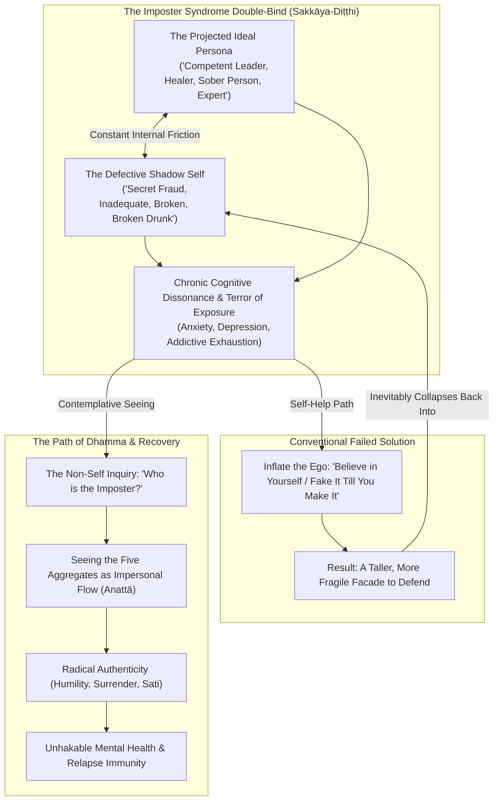
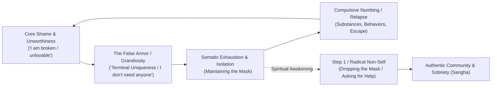

---
tags:
  - sakkaya-ditthi
  - authenticity
  - imposter-syndrome
  - recovery
  - mental-health
  - addiction
  - non-self
  - anatta
  - book-draft
  - personal-reflections
Created: 2026-10-03
Author: Andy McGuire
Book Project: "[[_Book - Sakkaya Ditthi]]"
Companion Reports: "[[Report - Personality View, Identity, Worldly Winds, and Protection]]", "[[The Architecture of Stress and Suffering]]", "[[The Architecture of Trauma - Somatic Imprints, Karma, and Healing]]"
Status: Core Chapter Draft
---

# Authenticity, Imposter Syndrome, Recovery, and Mental Health: The Dissolution of *Sakkāya-Diṭṭhi*

> *"And I kind of give them a look like, 'Oh boy, look at this guy' kind of thing, you know? And it's funny—I'm a drunk. Why would I do that? It's really questioning my egotism and how I can add a lot of labels that aren't really accurate..."*  
> — Andy McGuire, *Personal Reflection on Selfish Ego* (October 13, 2024)
>
> *"He regards feeling as self, or self as possessing feeling, or feeling as in self, or self as in feeling... This is called personality view (sakkāya-diṭṭhi). For an uninstructed run-of-the-mill person, touched by the feeling born of contact with ignorance, there arises 'I am.'"*  
> — *Mahāpuṇṇama Sutta* (Majjhima Nikāya 109)

---

## The Great Human Pretense: An Introduction

We live in a culture obsessed with identity. From early childhood, we are coached to fashion a coherent "somebody"—an armor of preferences, credentials, defensive postures, and public masks. We are told to "find our authentic self," to "believe in ourselves," and to project confidence to the world.

Yet beneath that polished surface, millions of people walk through daily life with a quiet, sickening terror: **Imposter Syndrome**. 

We sit in boardrooms, recovery circles, classrooms, spiritual sanghas, and family gatherings feeling like secret frauds. We obsess: *"If they really knew who I was—if they saw my messy mind, my old addictions, my pettiness, my shameful past, my stumbling doubts—they would cast me out."*

When viewed through standard self-help culture, the prescribed cure for imposter syndrome is almost always **more ego**: *puff yourself up, write positive affirmations, practice power-posing, convince yourself you deserve to be in the room.*

Early Buddhist psychology diagnoses this problem with surgical precision and reveals that self-help has it completely backward. **Imposter syndrome is not a failure of self-esteem; it is the inevitable symptom of *Sakkāya-Diṭṭhi* (Personality View / Identity View).** 

You cannot cure the agony of carrying a heavy, counterfeit armor by forging an even heavier, shinier suit of armor. Freedom begins when you discover that **there is no monolithic, permanent entity inside that armor to protect, prove, or hide.**

---

---

## 1. What Is "Authenticity" When the Self Is Conditioned?

### 1.1 The Capitalist & Pop-Spiritual Fallacy of "The True Self"
Modern pop-psychology treats "authenticity" as a museum piece—a pristine, static "True Self" buried under societal conditioning that must be excavated and broadcast to the world. In the digital age, this has degenerated into **curated authenticity**: performing vulnerability for social capital, personal branding, or audience approval.

This creates a hidden neurosis: people become desperately anxious trying to figure out if their thoughts, wardrobe, career, or relationships are "truly authentic." 

### 1.2 Authenticity as *Yathābhūta-Ñāṇadassana* (Seeing Things As They Are)
In the teachings of the Buddha, there is no permanent, unchanging self (*Anattā*) hidden behind the aggregates. Experience is a dynamic, conditioned flow of:
1. *Rūpa* (physical body and sensory inputs)
2. *Vedanā* (feeling-tones: pleasant, unpleasant, neutral)
3. *Saññā* (labels, perceptions, memories)
4. *Saṅkhāra* (mental fabrications, habits, volitions)
5. *Viññāṇa* (bare sense consciousness)

True spiritual authenticity is not cementing a fixed, stylized ego-monument. **Authenticity is the cessation of pretense (*māyā*) and deceit (*sāṭheyya*).** It is alignment with reality (*Yathābhūta-ñāṇadassana*)—having the courage and spaciousness to acknowledge what is actually happening in the present moment without defensiveness:
* *"Right now, there is fear in this body."*
* *"Right now, an arrogant, judgmental thought arose at the fish market."*
* *"Right now, I feel confused and don't know the answer."*

Authenticity is not a static identity you possess; **it is an ethical and contemplative posture of radical non-deception**. When you no longer have a reputation or a rigid self-image to defend, you are entirely authentic because there is nothing left to stage-manage.

---

## 2. Deconstructing Imposter Syndrome Through *Sakkāya-Diṭṭhi*

### 2.1 The Two Fabricated Poles
Imposter syndrome is a psychological prison built by *sakkāya-diṭṭhi* upon two fictional pillars:

1. **The Heroic / Competent Persona**: The image we try to project to our boss, our students, our recovery group, or our family. We think: *"I must be seen as wise, capable, fully healed, and in command."*
2. **The Defective Core**: The painful collection of past mistakes, intrusive thoughts, bodily frailties, and biological vulnerabilities. We think: *"This is the real, ugly me that nobody must ever see."*

Every moment spent in imposter syndrome is spent desperately trying to prevent Pole #1 from collapsing into Pole #2. It consumes immense neurological glucose, keeps the sympathetic nervous system on high alert, and leaves the individual constantly braced for catastrophe.

### 2.2 The Buddhist Koan: *Who Is the Imposter?*
The breakthrough occurs when we apply the radical diagnostic of *Anattā*:

> **If you look directly into the five aggregates right now—strip away the memories, strip away the social commentary, feel the bare physical sensations and thoughts arising and passing—where is the "fraud"? Where is the "expert"?**

In objective reality:
* *Skills* are learned neural adaptations.
* *Speech* is vocal chords vibrating air.
* *Mistakes* are informational feedback loops.
* *Emotions* are transient neurochemical tides.

There is no solid, unchanging "imposter" lurking inside your chest. **The imposter is a phantom fabricated by *sakkāya-diṭṭhi*.** It is a mental concept taking itself too seriously. 

When you realize that nobody in the room possesses an unchanging, perfected ego—that everyone from corporate CEOs to spiritual teachers is an impermanent, conditioned human organism learning and stumbling in real time—the bottom falls out of the fraud narrative. You stop needing to be an "imposter" or an "expert"; you simply become a willing servant of the task at hand.

---

## 3. The Recovery Dimension: Addiction, The Mask, and Terminal Uniqueness

For anyone with a history of addiction or compulsion, *sakkāya-diṭṭhi* is not an abstract philosophical riddle; **it is a matter of life and death**.

### 3.1 The Mask That Kills
Addiction is fueled by the unbearable friction between inner shame and outer pretense. We construct grand, charming, defiant, or self-righteous personas to hide our terror and loneliness. 

In Twelve-Step rooms, this is called **Terminal Uniqueness**—which is nothing other than *sakkāya-diṭṭhi* and *māna* (conceit / comparative evaluation):
* *"My pain is unique."*
* *"Nobody could possibly understand how dark my mind is."*
* *"The rules that apply to ordinary people don't apply to me."*
* *"I am too intelligent / too damaged to be helped by simple spiritual practices."*

Terminal uniqueness isolates the addict from the healing power of community (*Sangha*). It whispers: *"Don't let them see who you really are, or they'll reject you."*

### 3.2 Imposter Syndrome in the Rooms of Recovery
When someone steps into recovery, imposter syndrome often follows them through the door:
* *"I've been sober a year, but I had a resentful, petty thought today—I'm a total fake."*
* *"I lead a meeting, but my personal life feels chaotic—who am I to speak?"*
* As recorded in Andy's personal reflection: *"Look at this drunk in the fish market... and it's funny, I'm a drunk. Why would I judge him? It's really questioning my egotism and the labels I apply."*

That exact moment of self-honesty—catching the ego in the act of manufacturing superiority to cover its own past vulnerability—is the **holy ground of recovery**. 

Recovery does not mean building an untouchable "sober superstar" identity. Recovery means having the humility to laugh gently at the ego's antics, drop the moral posturing, and stand shoulder-to-shoulder with our fellow human beings as equals in suffering and healing.

### 3.3 Relapse Prevention through Non-Self
Relapse is rarely an ambush out of nowhere; it is almost always the culmination of **ego fatigue**. 
Maintaining a high-pressure, defensive persona—trying to prove to the world that you have it all together—exhausts the prefrontal cortex, depletes allostatic reserves, and spikes cortisol. Eventually, the scream of the nervous system becomes unbearable, and the craving to numb that pressure with alcohol, drugs, or compulsive behaviors takes over.

**Dismantling *sakkāya-diṭṭhi* is the ultimate relapse prevention.** When you have nothing to hide, nothing to prove, and no rigid persona to defend, the pressure dissolves. The nervous system relaxes into safety.

---

## 4. Mental Health: Anxiety, Depression, and Cognitive Defusion

### 4.1 Depression: The Petrification of Identity
In clinical depression, *sakkāya-diṭṭhi* turns toxic and inward. Aaron Beck’s classic Cognitive Triad describes depression as automatic negative schemas about:
1. *The Self* ("I am defective, unlovable, useless.")
2. *The World* ("The world is hostile and demanding.")
3. *The Future* ("Nothing will ever improve.")

Notice the grammatical trap: **"I am defective."**  
This is the pure reification of personality view. A transient state of biological exhaustion, neural inflammation, grief, or neurochemical depletion (*dukkha-vedanā*) is hijacked by the mind and forged into an absolute, permanent identity.

The contemplative and clinical cure (found in Mindfulness-Based Cognitive Therapy, MBCT) is not arguing with the thought ("No, you're actually great!"), which only keeps the ego engaged in endless litigation. The cure is **decentering**:
* Shifting from: *"I am depressed and broken."*
* To: *"There is a depressive thought arising in awareness; there is a heavy sensation in the chest; these are transient mental and physical phenomena, not my identity."*

### 4.2 Social Anxiety: The Tyranny of the Inner Camera
Social anxiety is *sakkāya-diṭṭhi* operating as an internal panopticon. The socially anxious individual is trapped in perpetual self-monitoring:
* *"How did my voice sound?"*
* *"Are they judging my appearance?"*
* *"Did I say something stupid?"*

The mind assumes that everyone in the room is watching, evaluating, and cataloging the "self." But as non-self reveals, **everyone else is trapped inside their own internal panopticon worrying about their own fictional self!** 

When you realize that there is no solid "you" on trial, and that other people's opinions are simply transient cognitive weather conditioned by their own histories, social anxiety loses its fuel. Attention turns outward—toward kindness, listening, curiosity, and service.

### 4.3 Acceptance & Commitment Therapy (ACT): Self-as-Content vs. Self-as-Context
Modern contextual behavioral science (ACT, developed by Steven C. Hayes) mirrors Buddhist non-self with astonishing precision:

| ACT Model | Buddhist Phenomenology | Experiential Reality |
| :--- | :--- | :--- |
| **Self-as-Content** (The Conceptualized Self) | **Sakkāya-Diṭṭhi** (Personality View) | The rigid narrative story: *"I am a failed parent, a recovering alcoholic, an imposter, a success."* Clinging to this story creates chronic psychological inflexibility and distress. |
| **Cognitive Fusion** | **Taṇhā & Upādāna** (Craving & Clinging) | Treating thoughts and labels as literal objective realities that must be obeyed or fought. |
| **Self-as-Context** (The Observing Self) | **Sati & Citta-Anupassanā** (Mindfulness & The Witness) | The spacious, unchanging awareness in which all thoughts, sensations, and roles appear. The context cannot be damaged by the content. |

---

## 5. The Spiritual Writer's Vow: Notes for the Book

For Andy's book on *Sakkāya-Diṭṭhi*, these four insights serve as vital guideposts:

1. **Write from the Dirt, Not from the Pedestal**:
   - The moment a spiritual author attempts to sound like an enlightened master who has transcended all human frailty, *sakkāya-diṭṭhi* has hijacked the keyboard.
   - Readers do not heal through reading about perfected gurus; they heal when an author shares real, unvarnished human moments—like catching oneself judging a drunk at the fish market, or feeling the sudden grip of imposter syndrome before teaching a class.
2. **Normalize the Fragility of Identity**:
   - Show how identity is a constructed convenience, like a driver's license. You need a name and an address to navigate civil society, but you don't mistake the plastic card for your living soul.
3. **Bridge Buddhism, 12-Step Recovery, and Neurobiology**:
   - The convergence between ancient Dhamma (Pali Canon), somatic traumatology, and practical 12-Step principles is the book's superpower. It translates high-level metaphysics into down-to-earth tools for people struggling with real pain, addiction, and self-doubt.
4. **The Ultimate Message of Grace**:
   - You don't have to fix the self to be free. You don't have to perfect the imposter.
   - **You just have to see through the illusion of the owner.** 
   - When the owner is gone, what remains is life itself—breathing, feeling, loving, stumbling, laughing, and showing up with open hands in the sacred ordinary world.
