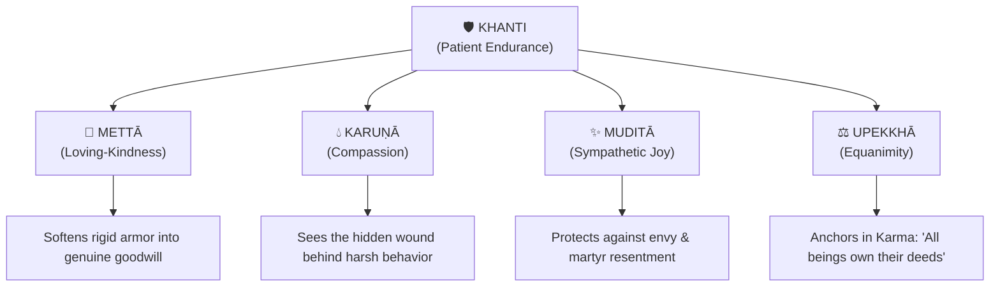

# 🛡️ Khanti: The Art of Patient Endurance
### *Cultivating Unshakeable Resilience in Body, Mind, and Relationships*

> [!QUOTE] Canonical Foundation — The Ovāda Pāṭimokkha (Dhp 184)
> *"Khantī paramaṁ tapo tītikkhā, Nibbānaṁ paramaṁ vadanti buddhā."*  
> **"Patient endurance is the highest spiritual purifier; Nibbāna is supreme, say the Buddhas."**

---

## 🧭 1. What Khanti Is — and What It Is Not

In the modern world, "patience" is often misunderstood as passive resignation, weak passivity, or grim teeth-gritting suppression. In early Buddhism and the living Thai Forest lineage, **Khanti** (Sanskrit: *Kṣānti*) is an active, awake, heroic spiritual power—the sixth of the **Ten Perfections (Pāramīs)**.

```
                  ┌────────────────────────────────────────┐
                  │          THE SPECTRUM OF KHANTI        │
                  ├───────────────────┬────────────────────┤
                  │  WHAT IT IS NOT   │    WHAT IT IS      │
                  ├───────────────────┼────────────────────┤
                  │ Passive doormat   │ Awake presence     │
                  │ Teeth-gritting    │ Softened body      │
                  │ Repression / guilt│ Conscious feeling  │
                  │ Victim mentality  │ Sovereign choice   │
                  │ Cold suppression  │ Compassionate room │
                  └───────────────────┴────────────────────┘
```

* **Khanti literally means**: Forbearance, enduring, bearing with, tolerance, spacious acceptance.
* **The Core Mechanism**: Khanti is the capacity of the heart-mind (*citta*) to **stand firm in the presence of the unpleasant** (*dukkha*) without contracting into anger (*dosa*), without panicking into escapism (*taṇhā*), and without blaming the world.
* **Ajahn Chah’s Insight**:
  > *"If you don't practice patience, you can't be a practitioner. When heat comes, endure it. When cold comes, endure it. When pain comes, endure it. Whatever comes, don't let it knock you off the path. Khanti burns away the impurities."*

---

## 🧘 2. Khanti on the Physical Level: Working with the Body

The physical body is an unending laboratory for cultivating Khanti. Sickness, physical aches, joint tension on the meditation cushion, fatigue, hunger, thermal discomfort, and the inevitable decay of aging constantly test our equanimity.

### The Anatomy of Physical Resistance: Two Darts (*Salla Sutta*, SN 36.6)
When physical pain arises:
1. **The First Dart (Physical Sensation)**: The raw somatic signal—throbbing, burning, sharpness, stiffness. This is natural and unavoidable (*vipāka*).
2. **The Second Dart (Mental Reaction)**: The mental panic, frustration, fear, and resentment—*"Why is this happening? When will this stop? I hate this pain!"* This is self-inflicted suffering.

```
                      [ Physical Ache / Illness ]  ◄── 1st Dart (Natural)
                                   │
                     ┌─────────────┴─────────────┐
                     ▼                           ▼
          [ Aversion & Panic ]          [ Khanti & Softness ]
          "Make this stop!"             "Let me feel this."
                   │                             │
                   ▼                             ▼
          ◄── 2nd Dart Struck!          ◄── 2nd Dart Deflected!
          (Suffering Multiplies)        (Pain Remains Clean, Pure)
```

### 🛠️ Somatic Practices for Physical Khanti:
* **Drop the Timeline**: Physical suffering multiplies when the mind projects into the future (*"How will I sit another 20 minutes?"* or *"What if this chronic ache never heals?"*). Khanti shrinks awareness down to **just this single in-breath, just this single out-breath**.
* **Softening the Perimeter**: When pain arises, the nervous system reflexively clenches around it (tightening the jaw, belly, and shoulders). Khanti consciously relaxes the perimeter around the sensation, giving the pain vast space to breathe.
* **The "Wait 60 Seconds" Rule**: When an intense itch, twitch, or urge to shift posture arises during meditation, do not react immediately. Apply Khanti: observe the sensation crest like a wave for 60 seconds. In 90% of cases, the sensation dissolves on its own.

---

## 🌊 3. Khanti on the Mental & Emotional Level: Inner Weather

Mental Khanti is the courageous willingness to stay present with uncomfortable internal states—boredom, loneliness, grief, anxiety, restlessness, disappointment, self-criticism, and unfulfilled craving.

### Breaking the Addiction to the "Exit Door"
Whenever an unpleasant emotion arises, the untrained ego immediately looks for an escape:
* Reaching for the phone / social media
* Opening the refrigerator
* Obsessive rumination and future planning
* Numbing out with entertainment or substances

**Khanti closes the escape hatch.** It allows you to sit in the fire of the emotion without acting it out and without shoving it into the shadow.

### 🛠️ Inner Practices for Emotional Khanti:
1. **The 90-Second Neurochemical Wave**: Neuroscientists note that the physical surge of an emotion lasts roughly 90 seconds in the bloodstream. If we don't feed it new stories, it naturally crests. Khanti is the anchor that holds you steady during those 90 seconds.
2. **Naming the Weather**: Use a soft, non-judgmental mental note:  
   `"Ah, restlessness is here."` • `"Grief is present."` • `"Fear has arrived."`  
   Notice you are not saying *"I am broken"*; you are observing a passing visitor.
3. **Resting as the Knowing Heart (*Buddho*)**: Remind yourself: *The mind is the sky; emotions are only weather.* You do not need to fight the thunderstorm; the sky simply endures.

---

## 👥 4. Khanti in Relationships: Dealing with Difficult People

Interpersonal relationships are the supreme testing ground for Khanti. We constantly encounter criticism, misunderstandings, broken promises, passive-aggressive remarks, arrogance, rudeness, and divergent viewpoints.

### The Simile of the Saw (*Kakacūpama Sutta*, MN 21)
The Buddha offered one of his most radical teachings on patience:
> *"Monks, even if bandits were to sever your limbs with a two-handled saw, whoever gave rise to a mind of hatred toward them would not be carrying out my teaching. You should train thus: 'Our minds will remain unaffected, and we shall utter no harsh words; we shall abide compassionate for their welfare, with a heart of loving-kindness, without inner hate.'"*

```
              [ Provocation / Insult / Rudeness ]
                               │
                ┌──────────────┴──────────────┐
                ▼                             ▼
       [ Immediate Reaction ]         [ The Sacred Gap (Khanti) ]
       • Lash out / Defend            • 3 Conscious Breaths
       • Passive-aggressive jab       • Somatic check-in
       • Resentful brooding           • Compassionate evaluation
                │                             │
                ▼                             ▼
       (Cycles of Conflict)          (Sovereign, Wise Response)
```

### 🛠️ Practical Guidelines for Dealing with People:
* **The 10-Second Pause Before Speaking / Typing**: When an email, text, or spoken word triggers defensive rage, take three deliberate breaths before responding. Never send a message while the heart rate is elevated.
* **Separate the Person from the Defilement**: When someone is angry or manipulative, recognize: *"This person is under the influence of delusion and pain. The defilement is speaking, not their true Buddha-nature."*
* **Accepting Others' Limitations**: Expecting an unmindful person to act with enlightened wisdom is like expecting a lemon tree to produce sweet mangoes. Khanti accepts people as they are right now, while holding clear, healthy boundaries.

---

## 🌺 5. How the Brahmavihāras Transform and Empower Khanti

Without the **Four Sublime Abodes (Brahmavihāras)**, patience risks becoming cold, bitter, or resentful. When infused with the Brahmavihāras, Khanti transforms into luminous, fearless compassion.



### 1. 💖 Mettā (Loving-Kindness) — Softening the Armor
* **Role**: Prevents patience from turning into hostile tolerance.
* **Internal Shift**: Instead of *"I will grit my teeth and endure you,"* Mettā whispers: *"May you be safe. May you be free from the internal friction driving your behavior."*

### 2. 💧 Karuṇā (Compassion) — Seeing the Hidden Wound
* **Role**: Reveals the vulnerability underneath aggressive behavior.
* **Internal Shift**: Aggressive people are almost always hurting people. When someone attacks you, Karuṇā realizes: *"How much pain must this person be carrying to speak like that?"* Patience becomes spontaneous sympathy.

### 3. ✨ Muditā (Sympathetic Joy) — Dissolving Resentment
* **Role**: Frees patience from comparison and bitter envy.
* **Internal Shift**: When others seem to get an easy ride while you bear heavy burdens, Muditā genuinely rejoices in their good fortune: *"May your ease continue."* It purges the toxic thought: *"Why do I have to suffer while they get off free?"*

### 4. ⚖️ Upekkhā (Equanimity) — The Anchor of Karma
* **Role**: The ultimate backbone of Khanti.
* **Internal Shift**: Grounded in the universal reflection:  
  `"All beings are the owners of their actions, heirs to their actions."`  
  Equanimity reminds you: *Their bad behavior is their karma; your reaction is yours.* You cannot control their actions, but you have 100% control over your own response.

---

## ⚡ 6. Everyday Micro-Practices for Daily Life

| Situation | Unconscious Reaction | Khanti + Brahmavihāra Response |
| :--- | :--- | :--- |
| **Traffic Jam / Red Light** | Gripping steering wheel, cursing | Breathe into the belly: *"This is a 2-minute meditation retreat in my car."* |
| **Long Line at Grocery / Clinic** | Checking watch, fidgeting, annoyance | Look at the cashier/clerk with Mettā: *"May you have an easy shift today."* |
| **Unfair Criticism / Insult** | Instant verbal counterattack, defensiveness | Pause, feel the tightness in the chest, allow the sensations to settle before choosing speech. |
| **Physical Sickness / Headache** | Whining: *"Why today? I have too much to do!"* | Soften body, rest as the observer: *"The body is doing what bodies do. I will care for it."* |
| **Meditation Wandering / Agitation** | Frustration: *"I'm a terrible meditator!"* | Soft smile, forgive the mind, gently return to the breath. |

---

## 📝 7. Summary Contemplation

> *"Khanti does not mean giving up or letting others walk over you. It means having a heart so vast, so rooted in the unconditioned, that no storm in this world is large enough to overturn it."*

---

Tags: #khanti #parami #patience #buddhism #brahmaviharas #metta #karuna #upekkha #emotional-resilience #thai-forest-tradition #somatic-mindfulness
