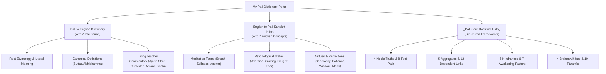

# _Master Mind Map — Pāli-English Dictionary & Doctrinal Reference_
### *Living Buddhist Vocabulary from the Canon & My Teachers*

---

## 🧭 Dictionary Navigation Portal

| Module | Direct Note Link | Description |
| :--- | :--- | :--- |
| 📖 **Section 1** | [[Pali to English Dictionary]] | Complete alphabetical Pāli/Sanskrit terms with root meanings, full definitions, and teacher commentary. |
| 🔤 **Section 2** | [[English to Pali-Sanskrit Index]] | English concepts, psychological terms, and themes mapped to their classical Pāli equivalents. |
| 📊 **Section 3** | [[_Pali Core Doctrinal Lists & Formulas]] | Foundational numbered frameworks (4 Noble Truths, 8-fold Path, 5 Aggregates, 12 Links, 7 Bojjhaṅgas). |

---

## 🗺️ Visual Architecture Mind Map

---

## 🔤 Pāli Pronunciation & Diacritical Guide

Pāli is a phonetic language. The diacritical marks indicate precise vowel length and consonant articulation:

### Vowels
* **a, i, u**: Short vowels *(e.g., 'a' as in *cup*, 'i' as in *pin*, 'u' as in *put*)*.
* **ā, ī, ū**: Long vowels, held for twice the duration *(e.g., 'ā' as in *father*, 'ī' as in *machine*, 'ū' as in *flute*)*.
* **e, o**: Always long when open; short before double consonants.

### Consonants
* **Retroflex / Cerebrals (ṭ, ṭh, ḍ, ḍh, ṇ, ḷ)**: Pronounced with the tip of the tongue curled upward touching the hard palate.
* **Dentals (t, th, d, dh, n)**: Pronounced with the tip of the tongue against the upper teeth.
* **Aspirated Consonants (kh, gh, ch, jh, th, dh, ph, bh)**: Pronounced with a distinct, audible puff of air *(like the *ph* in *shepherd's pie*, never as 'f')*.
* **Nasals (ṅ, ñ, ṇ, n, m, ṁ / ŋ)**: `ṅ` as in *sing*; `ñ` as in Spanish *señor* / *canyon*; `ṁ` / `ŋ` (*niggahīta*) nasalizes the preceding vowel.
* **c**: Always pronounced as a soft **ch** *(as in *church*, never as 'k' or 's')*.

---

## 🏷️ Core Topic Tag Bank

Tags: #pali #sanskrit #pali-dictionary #buddhism #theravada #thai-forest-tradition #dhamma #suttas #meditation #master-mind-map