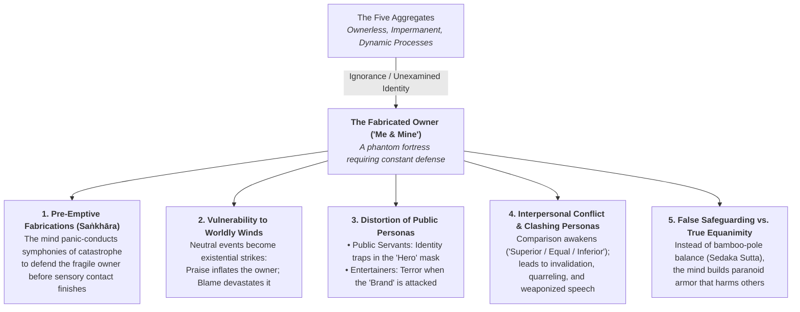
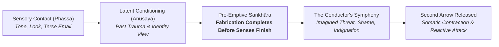
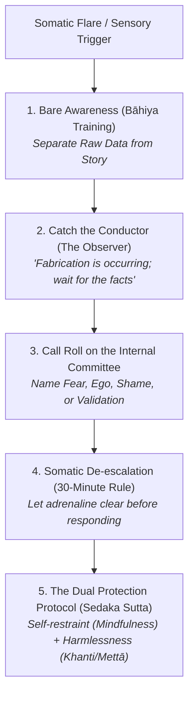
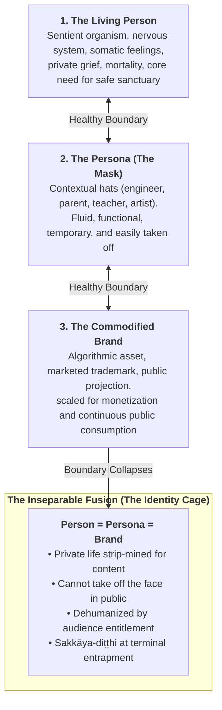
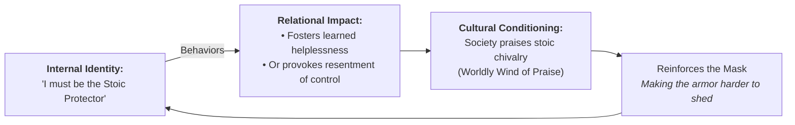
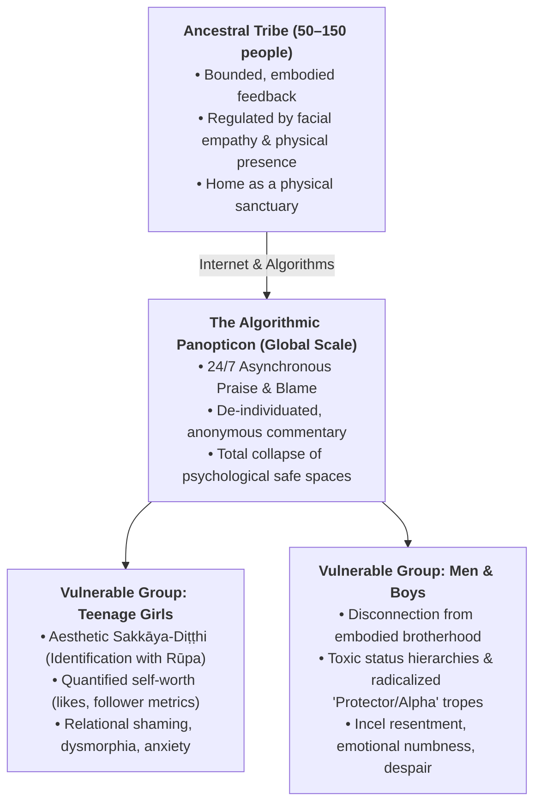
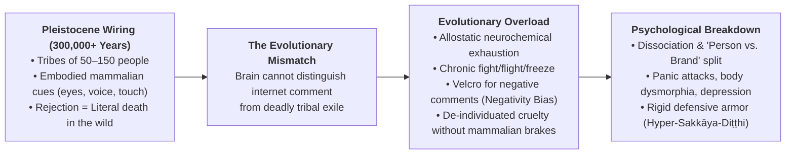
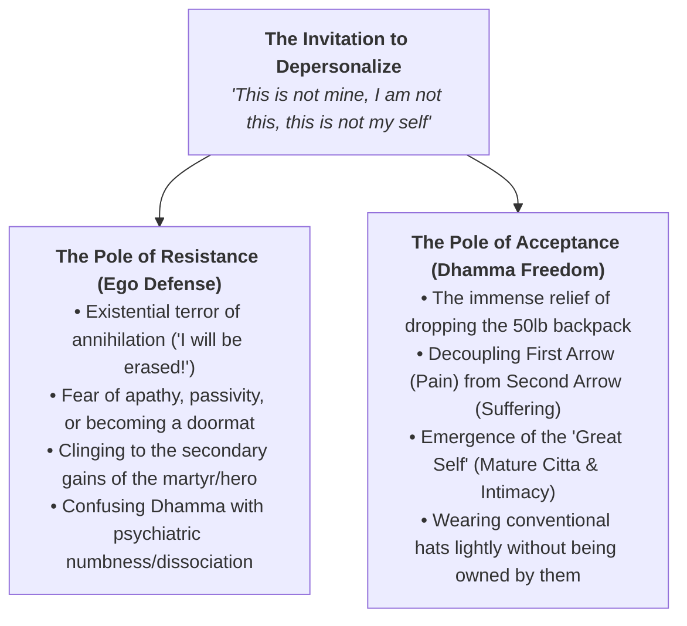

# Comprehensive Report: Personality View (*Sakkāya-Diṭṭhi*), Identity, the Eight Worldly Winds, and Safeguarding Against Attacks

> **Location:** `_A_My Research/_Buddhism/Sakkayaditthi/`  
> **Source Synthesis:** Vault research including *Understanding Identity View*, *Can a Person Realize Enlightenment*, *Belonging and Identity*, *Personality View*, *Developing the Self*, *Sedaka Sutta (The Acrobats)*, *Navigating the Storm: Eight Worldly Winds*, *Entertainers & Public Feedback*, and *Eight Verses of Training the Mind*.  
> **Created:** 2026-10-01 11:31:00-07:00  
> **Last Updated:** 2026-10-02 13:45:00-07:00  
> 
> ### Version History & Updates
> * **v1.0.0 (2026-10-01 11:31:00-07:00) — Initial Release:** Synthesized vault research on personality view (*sakkāya-diṭṭhi*), identity attachment, the eight worldly winds, public servants vs. entertainers, and safeguarding against attacks.
> * **v1.1.0 (2026-10-01 11:57:46-07:00) — Master Consolidation & Expansions:** Integrated deep-dive sections on Pre-Emptive Fabrication (*saṅkhāra*), the Ownerless Aggregates cascade, the Economy of Praise (public safety vs. invisible labor), the Stoic Protector, Persona vs. Brand collapse, Evolutionary Overload, and the polarities of Depersonalization.
> * **v1.2.0 (2026-10-01 12:01:30-07:00) — Strategic Integration & Creative Roadmap:** Documented central authorial intent establishing *Sakkāya-diṭṭhi* as the cornerstone theme across forthcoming books, blogs, meditation dharma talks, daily voice journal recordings, and workflow note synthesis.
> * **v1.3.0 (2026-10-02 11:30:00-07:00) — The Triad Integration:** Formally cross-linked with its two sister master reports: [[Report - Saṅkhāra, Mental Fabrications, Ajahn Sumedhos Teaching on the Mother, and Mindful Recovery]] (`_A_My Research/_Buddhism/sankhara/`) and [[Report - The Observer, Reacting vs. Observing in Meditation, Mediation, and Active Life]] (`_A_My Research/_Buddhism/The Observer/`).
> * **v1.4.0 (2026-10-02 13:45:00-07:00) — Taxonomy & Publication Hub:** Added standard YAML frontmatter tags for cross-vault indexing across books, blogs, Sunday/Thursday meditation groups, and recovery archives.
> * **v1.5.0 (2026-10-02 14:15:00-07:00) — Tetralogy Expansion (Pillar 4 Integration):** Formally cross-linked with [[Report - Karma, Skillfulness, Sakkayaditthi, and Sankharas, How to Treat Experience]] (`_A_My Research/_Buddhism/Karma/`).
> * **v1.6.0 (2026-10-02 14:24:00-07:00) — Foundational Overture Integration (Pentology):** Formally cross-linked with the book's primary opening treatise: [[Report - The Conditioning Process in Humans, Evolution, Consciousness, Karma, Trauma, and the Architecture of Freedom]] (`_A_My Research/_Buddhism/Conditioning/`), anchoring personality view (*sakkāya-diṭṭhi*) as a conditioned survival suit within the broader evolutionary, somatic, and karmic matrix.
> 
> > [!IMPORTANT] Master Book Architecture Hub: The Five Works of Human Liberation
> > This report is an integrated component in a five-part contemplative, scientific, and clinical master series:
> > 0. **Foundational Overture:** [[Report - The Conditioning Process in Humans, Evolution, Consciousness, Karma, Trauma, and the Architecture of Freedom|The Conditioning Process in Humans]] — The primal predicament: evolution, consciousness, karma, somatic trauma, and the de-conditioning runway to freedom.
> > 1. **Pillar 1 (Current File):** [[Report - Personality View, Identity, Worldly Winds, and Protection|Sakkāya-diṭṭhi (The Phantom Owner)]] — The architecture of self-defense, role entrapment, and vulnerability to the 8 Worldly Winds.
> > 2. **Pillar 2:** [[Report - Saṅkhāra, Mental Fabrications, Ajahn Sumedhos Teaching on the Mother, and Mindful Recovery|Saṅkhāra (The Dramatic Conductor)]] — Cognitive construction, predictive processing, Ajahn Sumedho's Mother teaching, morphic resonance, and habit loops.
> > 3. **Pillar 3:** [[Report - The Observer, Reacting vs. Observing in Meditation, Mediation, and Active Life|The Observer (The Seat of Freedom)]] — Moving from compulsive reaction to spacious awareness in meditation, mediation, and active daily life.
> > 4. **Pillar 4:** [[Report - Karma, Skillfulness, Sakkayaditthi, and Sankharas, How to Treat Experience|Karma & Skillfulness (The Craft of Experience)]] — The operational engine: treating experience as old karma (*purāṇa-kamma*) met by liberating new action (*nava-kamma*).
> > 
> > **Multi-Channel Publication & Teaching Tracking:**
> > • **Book & Essay Pillars:** `#book-draft` `#book-foundation` `#blog-essay`  
> > • **Active Weekly Teaching:** `#living-mindfulness-sunday` (Sunday Evenings) | `#escom-club-thursday` (Thursdays 2 PM)  
> > • **Recovery & Urge Surfing Archives:** `#recovery-archive` `#mindful-recovery`  
> > • **Contemplative Core:** `#sakkayaditthi` `#sankhara` `#the-observer` `#anatta`

---

## Executive Summary

Across the documentation in your vault, **Personality View (*Sakkāya-diṭṭhi*)** emerges not as an abstract philosophical theory, but as the foundational psychological mechanism by which human beings create, defend, and suffer through constructed identities. It is the first of the ten fetters (*saṃyojana*) abandoned at Stream Entry (*sotāpanna*). 

Your writings explore personality view across multiple intersecting planes:
1. **The Architecture of Identity & The Ownerless Aggregates:** Taking conventional roles ("masks" or "hats") as ultimate truths; confusing the conjoined aggregates (*pañcakkhandhā*) with an owner, which cascades into every sphere of suffering.
2. **Pre-Emptive Mental Fabrications (*Saṅkhāra*):** The cognitive and somatic phenomenon where mental fabrication becomes full before sensory experience finishes, driving unnecessary suffering and interpersonal conflict.
3. **Vulnerability to the Eight Worldly Winds (*Aṭṭha Lokadhamma*):** How ego-identification turns external shifts in fortune into violent internal crises.
4. **The Economy of Social Praise & Inseparable Public Personas:** Career realities of public safety, psychological drivers (self-worth, structure), the erasure of invisible essential workers, the Stoic Protector dilemma, and the catastrophe of inseparable brands.
5. **The Ups and Downs of Personality View:** Internal manic/depressive swings and relational territorial clashes.
6. **The Digital Storm & Evolutionary Overload:** How social media industrializes the worldly winds, breaks safe refuges, and overwhelms Pleistocene biology, devastating vulnerable groups (teenage girls, men and boys).
7. **Safeguarding Against Attacks:** Depersonalizing hostility through Buddhist psychology, the "Observer," the Sedaka Sutta acrobat dynamic, and tactical mental models (the "Pink Tattletail," the "30-Minute Rule").
8. **Considering Depersonalization:** The polarities of resistance (existential terror, fear of apathy, spiritual shoulds) versus acceptance (the relief of dropping the backpack, radical intimacy, and the "Great Self").
9. **Returning to *Mundus*:** Anchoring in nature as a self-organizing system where identity view dissolves into vast equanimity.

---

## 1. The Anatomy of Personality View (*Sakkāya-Diṭṭhi*) & Attachment to Identity

### 1.1 Conventional Reality vs. Ultimate Reality
As reflected in your notes on Ajahn Amaro and the *Majjhima Nikāya*, the root delusion is taking relative, functional truths and solidifying them into absolute, fixed realities:
* **The Etymology of Persona:** A persona is literally a "mask." In daily life, we cycle through countless hats: corporate engineer, parent, teacher, meditator, recovery fellow, patient, or citizen.
* **The Problem of Fixity:** Conventional roles are natural and functionally necessary. Suffering begins when the mind crystallizes a role into an enduring "I" that must be maintained, proven, or protected.
* **The Five Aggregates (*Khandhas*):** Form (*rūpa*), feeling (*vedanā*), perception (*saññā*), mental fabrications (*saṅkhāra*), and consciousness (*viññāṇa*) are conjoined processes (like the taste, temperature, and viscosity of water). When ignorance (*avijjā*) claims ownership over these processes, the illusion of an autonomous self is born.

### 1.2 The Aggregates Without an Owner: The Upstream Root of the Downstream Cascade
As emphasized in your notes on *Can a Person Realize Enlightenment* and *Teaching on Non-Self (MN 22, MN 35)*, none of the five aggregates can be demonstrated to possess an owner:
* **The Fallacy of the Proprietor:** Form is subject to aging and injury; feeling arises and vanishes uninvited; perceptions shift with environment; fabrications surge from habit; consciousness registers whatever impinges upon the senses. None of them submit to sovereign control (*MN 35.19*).
* **The Fabrication of "Me" and "Mine":** Unexamined consciousness makes the catastrophic leap from *process* to *proprietorship*. It posits an imaginary "owner" behind the aggregates—an "I" who owns this body, feels these emotions, and authored these thoughts.

#### The Domino Effect: How Unexamined Ownership Cascades into Every Sphere

Once this initial fiction of an "owner" is accepted, it triggers an inevitable chain reaction across all dimensions of psychological and social life:

1. **Cascade into Pre-Emptive Fabrication (*Saṅkhāra*):**
   * If there is an "owner," that owner is fragile, mortal, and constantly under threat.
   * To keep this phantom entity safe, the mind's cognitive machinery is commandeered by hyper-vigilance. The "Conductor" pre-empts reality, running worst-case simulations and writing catastrophic narratives before sensory experience has even concluded. The conductor is frantically trying to protect a client who does not actually exist.
2. **Cascade into the Eight Worldly Winds (*Aṭṭha Lokadhamma*):**
   * Without an owner, praise and blame are merely vibrations of air against ear-drums; gain and loss are simply materials redistributing across the biosphere.
   * But the moment ownership is imputed to the aggregates, the winds become lethal missiles. Praise feeds the owner's addiction to superiority (*māna*); blame feels like the owner's existential annihilation.
3. **Cascade into Public Personas (Public Servants & Entertainers):**
   * When a **public servant** falsely believes *they* own the uniform and role of "Heroic Protector," the persona hardens into armor. When praise is replaced by public scrutiny or moral injury, the entire architecture of the self collapses.
   * When an **entertainer** identifies their core being with the commodified image perceived by the public (*rūpa* and *saññā*), online hostility is experienced as a literal physical dismemberment rather than the noise of an uninstructed mob.
4. **Cascade into Relational Discord and Invalidation:**
   * When two people interact while harboring unexamined ownership of their respective aggregates, they cannot meet as conscious presences. They meet as competing territorial claims.
   * As documented in *Belonging and Identity*, the instinct to compare, compete, judge, and invalidate arises solely because the owner feels perpetually insecure. This gives rise to the tragic escalation described in MN 18: *"the taking up of rods and bladed weapons, of accusations, and divisive speech."*
5. **Cascade into Weaponized Defense:**
   * Believing there is an owner inside, human beings build spiky defensive perimeters—cynicism, preemptive aggression, secrecy, and retribution.
   * By contrast, when the five aggregates are recognized as an **open, ownerless landscape**, there is no target left for hostile arrows to pierce. True safeguarding (the *Sedaka Sutta*) becomes possible: protecting self through mindful composure and protecting others through harmlessness and compassion.

---

## 2. Pre-Emptive Mental Fabrications (*Saṅkhāra*): Mechanics, Fallout, and Mindful De-escalation

A central architectural insight uncovered in your teaching notes (*Navigating the Storm*) is that **"mental fabrication becomes full before sensory experience is complete."** Understanding this cognitive mechanism is essential for uprooting both internal suffering and relational conflict.

### 2.1 The Architecture of Pre-Emptive Fabrication
The human mind functions as a predictive coding engine. When sensory contact (*phassa*) occurs, rather than passively receiving data, the mind rapidly projects anticipated meanings based on past conditioning (*saṅkhāra*), latent trauma, and deep-seated survival instincts:

* **The Overzealous Conductor:** Your documentation compares the mind to a manic conductor who hears the very first note of an encounter (a colleague’s sigh, a supervisor’s question, a loved one’s distant expression) and, before the orchestra has played the bar, immediately conducts a full-blown **symphony of catastrophe, rejection, or betrayal**.
* **The Script Precedes the Facts:** By the time the sensory signal has fully registered in conscious awareness, the ego has already authored the script, assigned villainous motives to the other party, cast itself as the wounded victim or righteous defender, and mobilized full defensive countermeasures.
* **The Root in Evolutionary Biology:** In ancestral environments, mistaking a benign wind for a predator was a low-cost false positive; mistaking a predator for wind was lethal. The nervous system evolved to over-anticipate threat. In modern psychological life, however, this survival mechanism fires constantly against social, professional, and relational cues, fabricating attacks where none exist.

### 2.2 How Pre-Emptive Fabrication Causes Stress and Suffering (*Dukkha*)

#### A. Internal Suffering (Inflicted Upon Ourselves)
1. **Firing the Second Arrow in Advance:** In the *Sallatha Sutta* (SN 36.6), the Buddha distinguishes the physical/external prick of the first arrow from the mental second arrow. Pre-emptive fabrication launches the second arrow *before the first arrow has even arrived*, inflicting grief, outrage, and shame over events that exist purely in imagination.
2. **Visceral Somatic Strain:** The body does not know the difference between an imagined threat and a physical one. Pre-emptive narratives trigger immediate somatic contractions: gut clenching, tightness in the throat, adrenaline surges, and shallow breathing. Living in constant fabrication keeps the organism in chronic autonomic hyper-arousal.
3. **Cognitive Distortion & Confirmation Bias:** Once a pre-emptive story is constructed (*"They don't respect my work"*), the mind filters all subsequent incoming data to validate the story, blinding itself to genuine goodwill, neutral facts, or supportive intentions.

#### B. Interpersonal Suffering (Inflicted Upon Others)
1. **Pre-Emptive Retaliation:** When we believe an attack has already occurred, we respond with "pre-emptive self-defense"—a sharp barb, a defensive sneer, icy withdrawal, or accusatory speech. The other person is blindsided by our hostility because, in their reality, they did nothing to warrant it.
2. **The Infectious Nature of Defilements (*Greed, Hate, Delusion*):** As Nyanaponika Thera observes in your notes on the *Sedaka Sutta*, unwholesome states are deeply contagious. When we unleash pre-emptive defensiveness, our tone and body language instantly ignite the *other person's* latent insecurities and defensive fabrications. Two people quickly end up in a battle between two fictional scripts, neither seeing the human being before them.
3. **Escalation to Weapons and Quarrels:** In the *Madhupiṇḍika Sutta* (MN 18), the Buddha traces the lineage of global and interpersonal warfare (*"taking up rods and bladed weapons, quarrels, disputes, accusations, and divisive speech"*) directly back to this mental proliferation (*papañca*) and pre-emptive objectification.

---

### 2.3 Actionable Tools: Disarming Pre-Emptive Fabrications

To prevent stress for ourselves and harm to others, we must intercede at specific pressure points in the cognitive chain:

#### 1. Cultivating the "Gap" via Bare Awareness (*The Bāhiya Instruction*, Ud 1.10)
* **The Practice:** Train the mind to distinguish between **Sensory Data** and **Cognitive Interpretation**.
* **Formula:** *"In the seen, let there be merely what is seen; in the heard, merely what is heard."*
* When an uncomfortable email or comment lands, pause and note:
  * *Raw Data:* "Black text on a white monitor reading: 'Please revise this section.'"
  * *Fabrication:* "They think I am incompetent and want to push me out."
* By drawing a clear line between the raw input and the added mental drama, you starve the narrative of momentum.

#### 2. Catching the Conductor (Activating the "Observer")
* Instead of identifying with the rising symphony, step back into the role of the **Observer**.
* Use the diagnostic inquiry: *"Has the sensory experience actually concluded, or is the mind already writing the ending?"*
* Catching the conductor with its baton raised disarms the automaticity of the habit loop. The moment you see that the mind is fabricating, you are no longer possessed by the fabrication.

#### 3. Calling Roll on the "Internal Committee"
* As framed in your *Navigating the Storm* curriculum, the mind is a noisy boardroom. When pre-emptive panic or indignation strikes, ask:
  * *"Who is speaking right now?"*
  * *"Is this Fear anticipating abandonment?"*
  * *"Is this Ego trying to defend its superiority?"*
  * *"Is this Shame assuming I am intrinsically flawed?"*
  * *"Is this the desperate need for Validation?"*
* By explicitly naming the sub-personality, you strip it of executive authority and reinstate the calm, impartial Observer as the chair of the meeting.

#### 4. Somatic Quarantining & The "30-Minute Rule"
* Pre-emptive fabrication is always accompanied by somatic distress. When neurochemicals flood the bloodstream, higher-order reasoning is hijacked.
* **The Rule:** Institute a mandatory pause—whether 30 seconds in conversation, 30 minutes in correspondence, or the 30-minute transitional buffer between corporate engineering work and home life.
* Refuse to speak, type, or make decisions while the biological alarm is ringing. Breathe, feel the feet on the floor, unclench the belly, and let the hormonal wave recede.

#### 5. The "Pink Tattletail" Filter
* When feedback arrives, resist the pre-emptive leap to self-indictment.
* View critique as dental plaque-disclosing dye: it is purely impersonal diagnostic data indicating where adjustments are needed, not a moral assessment of your dignity or competence.

#### 6. The Dual-Protection Practice (*Sedaka Sutta*)
* **Self-Protection:** Maintain mindful composure (*satipaṭṭhāna*). By catching your own pre-emptive anger or greed before it leaks into speech or action, you protect everyone in your environment from emotional shrapnel.
* **Protecting Others:** Approach others through patience (*khanti*), harmlessness (*ahiṃsā*), and loving-kindness (*mettā*). When someone else attacks or criticizes you, recognize with compassion that *they are trapped in their own pre-emptive fabrications*. Their hostility is not about you; it is the overflow of their own uninspected mental symphony.

---

## 3. Personality View and the Eight Worldly Winds (*Aṭṭha Lokadhamma*)

The Eight Worldly Winds blow through all conditioned existence in four reciprocal pairs:

| The Wind Pair | The Positive Pull (Elation / Pride) | The Negative Pull (Dejection / Grief) |
| :--- | :--- | :--- |
| **Gain & Loss (*Lābha / Alābha*)** | Material profit, new assets, security | Financial loss, property damage, scarcity |
| **Pleasure & Pain (*Sukha / Dukkha*)** | Bodily ease, sensory indulgence, dopamine hits | Physical illness, visceral somatic contractions |
| **Praise & Blame (*Pasaṃsā / Nindā*)** | Ego validation, compliments, likes, status | Criticism, being "called out," feeling scolded |
| **Fame & Disrepute (*Yasa / Ayasa*)** | High social standing, widespread renown | Loss of reputation, public rejection, ostracization |

### The First and Second Arrows (SN 36.6)
* **The First Arrow (Unavoidable):** The contact of the wind itself—someone criticizes a technical drawing, a financial loss occurs, or praise is lavished. This is conditioned reality (*vipāka*).
* **The Second Arrow (Personality View):** The mental proliferation attached to the event: *"Why did they do this to ME? What does this say about MY competence? Am I inferior, equal, or superior?"*
* Without *sakkāya-diṭṭhi*, the winds are merely atmospheric pressures passing through space. With *sakkāya-diṭṭhi*, every draft threatens the collapse of the self.

---

## 4. The Economy of Social Praise: Public Servants, Essential Laborers, and Entertainers

Your vault materials, combined with Buddhist social ethics (*Belonging and Identity*), illuminate how society selectively dispenses the worldly winds of **Praise and Blame** to sustain political, economic, and institutional systems.

### 4.1 The Career Reality: Compensation, Socioeconomic Mobility, and Psychology
A candid examination of public safety professions (police, firefighting, military) requires dismantling the myth of pure, ascetic self-sacrifice and recognizing the concrete socioeconomic and psychological realities that drive these career choices:

#### A. The Transactional Career Foundation
* **Livelihood and Security:** People enter these fields predominantly as **career paths**, not monastic vows. They are compensated through reliable wages, overtime opportunities, specialized healthcare, early retirement packages, and defined-benefit pensions that are virtually extinct in the private sector.
* **Socioeconomic Mobility:** Historically and practically, military enlistment and municipal civil service exams have served as premier vehicles of upward mobility for working-class populations, individuals without expensive college degrees, or those raised in economically depressed environments. It offers immediate financial stability, trade training, and institutional backing.

#### B. The Psychological Landscape: Why Choose the Uniform?
Behind the career decision lies a complex tapestry of conscious and unconscious psychological motivations:
1. **The Armor for Fragile Self-Worth:** For individuals wrestling with internal inadequacy, lack of agency, or feelings of insignificance, the uniform provides an **instant, pre-packaged identity of authority, status, and respect**. The badge confers automatic deference from the public that the unadorned ego does not feel it possesses on its own.
2. **External Scaffolding for Internal Chaos:** Structured, hierarchical institutions (chain of command, strict protocol, clear rules of engagement) offer profound psychological relief to individuals from turbulent, unstructured, or traumatic childhoods. External discipline acts as a surrogate for internal emotional regulation.
3. **Purpose, Camaraderie, and Adrenaline:** The visceral reality of emergency response satisfies the drive for dopamine, urgency, and unambiguous moral purpose ("saving lives" vs. corporate spreadsheet maintenance), alongside deep tribal bonding (*ubuntu* in uniform).
4. **The Sakkāya-Diṭṭhi Trap:** When an individual enters the profession to shore up deficient self-worth, the uniform ceases to be a functional work tool and becomes an **impenetrable ego fortress**. Any public critique of the uniform is experienced as an existential attack on their personal dignity.

---

### 4.2 The Selective Economy of Praise: The "Hero" vs. The Invisible Worker
Why does society ritualize lavish ceremonial praise ("Thank you for your service," national anthems, hero parades) on armed forces and first responders, while withholding status and praise from other vital contributors—such as **farm workers, teachers, grocery store clerks, and sanitation crews**?

| Worker Category | Societal Function | Ritualized Praise Received | Economic & Social Reality |
| :--- | :--- | :--- | :--- |
| **Police, Fire, Military** | Physical security, border defense, state monopoly on force, acute crisis suppression | **Extremely High:** Sacred cultural elevation, "heroes," public ceremonies, discounts | Institutional support, strong unions, state-backed authority, guaranteed pensions |
| **Farm Workers** | Stoop labor in extreme heat, harvesting sustenance that keeps 100% of the population alive | **Near Zero / Negative:** Often criminalized, socially invisible, marginalized | Exploitative wages, zero pensions, minimal healthcare, pesticide exposure |
| **Grocery Clerks / Warehouse** | Maintaining continuous food supply chains and domestic logistics during crises | **Temporary / Performative:** Dubbed "essential heroes" during COVID-19, quickly forgotten | Minimum wages, erratic scheduling, easily replaced, lacked protective gear |
| **Teachers** | Developing human consciousness, socialization, literacy, and future generations | **Rhetorical Only:** Praised in speeches, ignored in budgets | Chronic underfunding, stagnant pay, high burnout, scrutinized by culture wars |

#### Why Is Societal Praise Distributed So Unequally?
1. **The Fear-Driven Hierarchy of State Power:**
   * Society organizes its highest honors around the forces that preserve state stability and protect property from immediate destruction (violence, invasion, fire). Fear of acute catastrophe commands immediate reverence; maintenance of daily life does not.
2. **Praise as an Economic Substitute for Compensation:**
   * During the pandemic, front-line grocery clerks and delivery drivers were briefly baptized as "essential heroes." This ceremonial praise was **purely transactional**—a cheap psychological substitute used to keep low-wage workers risking their health without granting hazard pay, equity, or permanent benefits.
3. **The Suppression of Agricultural and Service Dignity:**
   * As documented in your notes on Dominant and Subordinate group dynamics (*Belonging and Identity*), the comfort of society relies upon cheap, invisible, subordinate labor.
   * If society culturally elevated farm workers and cleaners to the level of celebrated heroes, it would create irresistible moral and political pressure to pay them thriving wages and grant full civic rights. Denying them the Worldly Wind of Praise keeps food prices artificially low and power balances undisturbed.

---

### 4.3 Why Entertainers Face Catastrophic Backlash
As captured in `entertainers_public_feedback_discussion Copy.pdf`, entertainers occupy an entirely different, highly volatile social dynamic:

1. **Evolutionary Limits of the Human Nervous System:**
   * The human brain evolved to process social cues and critique within tribes of 50 to 150 people. No human nervous system is adapted to absorb the vitriolic, synchronized hostility of thousands or millions of strangers simultaneously.
2. **The "Person vs. Brand" Split:**
   * Audiences view entertainers not as living beings, but as commodified consumer products. Online mobs attack the public caricature without recognizing the human nervous system underneath.
3. **The Illusion of Preparation & Broken Contracts:**
   * Artists expect feedback on their craft (an album, a performance). Instead, public attacks target their appearance, character, families, and right to exist in public.
   * Entertainers enter a trade of performance for compensation and attention; they did not consent to stalking, harassment, or loss of fundamental physical safety.
4. **Boiling Frog Syndrome & Identity Enclosure:**
   * Fame arrives incrementally. By the time the spotlight becomes predatory, the entertainer's identity has become an inescapable cage, stripping away the simple freedom of moving through everyday life unobserved.

---

#### 4.3.1 Persona vs. Brand: The Catastrophe of Inseparable Identity

A critical dimension of modern public exposure is the boundary collapse between the **Living Person**, the **Persona**, and the **Brand**—and the acute psychological devastation that occurs when they become inextricably fused.

#### A. Defining the Tripartite Spectrum
To understand where the suffering originates, we must distinguish between three distinct levels of human presentation:
1. **The Living Person (The Sentient Human):** The vulnerable biological organism of flesh, blood, breath, and direct consciousness. It has mammalian limits: it requires rest, safe non-evaluative spaces, unconditional love, and protection from predators.
2. **The Persona (The Contextual Mask):** Rooted in the Greek theatrical tradition, a *persona* is an adaptable role. As explored in *Can a Person Realize Enlightenment*, we wear "many hats"—the engineer on a job site, the monk on the cushion, the parent at the kitchen table. In a healthy mind, the persona is recognized as temporary and functional. You put the hard hat on for work and hang it up at the door.
3. **The Brand (The Commodified Asset):** A brand is an intellectual property, a commercial trademark, an algorithmic avatar designed for public projection, marketability, and mass consumption. It is optimized to generate attention, engagement, and financial capital.

#### B. The Mechanics of Inseparability: The Faustian Bargain
In modern media culture (entertainers, public figures, influencers, solo entrepreneurs, and artists), the boundary between these three layers collapses. **The person becomes the product.**

1. **The Monetization of Authenticity:**
   * Modern audiences refuse to buy just art or professional service; they demand "authenticity," behind-the-scenes intimacy, and 24/7 personal disclosure.
   * To sustain market relevance, the individual is coerced into **strip-mining their private life**—their romantic relationships, domestic grief, mental health struggles, and children—to feed the brand's algorithmic furnace.
2. **The Permanent Biological Panopticon:**
   * An engineer can hang up their hard hat. A lawyer can leave the briefcase at the office. But when your brand is your face, voice, body, and personality, **you cannot take the costume off.**
   * As noted in the entertainer transcript: walking down the street to buy groceries with your children becomes a public performance. Strangers feel entitled to approach, film, judge, or criticize because they possess a false sense of parasocial ownership over the "Brand."
3. **Sakkāya-Diṭṭhi at Maximum Entanglement:**
   * When livelihood, social belonging, financial security, and personal dignity all depend on the brand’s public approval, the mind completely confuses the fabricated commercial projection with the living self.
   * The individual can no longer discern: *"Where does my actual consciousness end, and where does the marketed avatar begin?"*

#### C. The Psychological and Spiritual Catastrophe
When the person and brand cannot be separated, specific forms of severe suffering take root:

1. **Dehumanization & Parasocial Entitlement:**
   * Consumers do not view a brand as a human being with feelings; they view it as a purchased product. If a consumer dislikes a movie, an album, or a tweet, they attack the brand with the same savage entitlement they would use to review a broken toaster on Amazon.
   * Because the boundary has collapsed, **blows intended for the commercial brand land directly upon the raw, unshielded nervous system of the human being.**
2. **The "Living Corpse" Syndrome (Dissociation):**
   * Living in a 24/7 performance forces the psyche to dissociate. The true person retreats deep into hiding, feeling hollow, fraudulent, and numb, while a synthetic avatar walks through the world shaking hands and smiling.
   * This breeds chronic anhedonia, severe anxiety, and chemical dependency (using alcohol or sedatives simply to turn down the biological panic).
3. **The Existential Terror of the Wind Shifting:**
   * When ordinary workers face career setbacks, they lose a job; they do not lose their existence.
   * For the individual fused with their brand, the worldly winds of **Blame and Disrepute** (a public backlash, cancellation, or loss of marketability) are experienced as **capital execution**. Because they believe *they are the brand*, the death of the brand feels like the annihilation of their right to exist in the physical universe.

#### D. The Dhamma Pathway: De-coupling the Human from the Trademark
* **Dissecting the Brand into Empty Aggregates (*Anattā*):** The brand is not a person; it is a mental fabrication (*saṅkhāra*) and a set of collective labels (*saññā*) existing exclusively in the minds of strangers, conditioned entirely by external market forces.
* **Radical Boundary Reconstruction:** Establishing fierce, inviolable sanctuaries where the commercial persona is strictly forbidden. Cultivating relationships where one is known and loved purely as an ordinary, imperfect, un-monetized human being.
* **Returning to *Mundus*:** The biological person breathes 10 sextillion atoms per breath and is held by the earth. The brand is merely digital noise. Recognizing this distinction restores internal sovereignty and protects the tender human heart from being ground to dust by the machinery of public commerce.

---

### 4.4 The "Stoic Protector": Internal vs. External *Sakkāya-Diṭṭhi* in Personal Life

A profound personal manifestation of identity view is the deeply felt impulse to be the **"Stoic Protector"**—specifically toward those perceived as vulnerable (women, children, and loved ones). Examining this impulse through the dual mirrors of **internal *sakkāya-diṭṭhi*** (our self-concept) and **external *sakkāya-diṭṭhi*** (how others and society mirror and reinforce the role) reveals both its nobility and its psychological perils.

#### A. The Noble Impulse vs. The Identity Trap
* **The Wholesome Action (Dhamma):** Protecting and caring for the vulnerable is an ancient biological and moral instinct rooted in basic decency, *mettā* (loving-kindness), and *karuṇā* (compassion). In your notes on *Can a Person Realize Enlightenment*, you explicitly acknowledge: *"wanting to protect ourselves, wanting to protect others—and this is not a bad thing."*
* **Where Sakkāya-Diṭṭhi Infiltrates:** Suffering does not arise from compassionate protective action. Suffering arises the exact instant action crystallizes into a **fixed identity**: *"I AM THE PROTECTOR."* The shift is from verb (*protecting when conditions call for it*) to noun (*a permanent persona that defines my worth*).

---

#### B. Internal *Sakkāya-Diṭṭhi*: The Burden of the Solo Shield
When the "Stoic Protector" becomes an internal self-view, it creates specific psychological distortions:

1. **The Delusion of Omnipotent Control:**
   * Sakkāya-diṭṭhi manufactures the belief that through sufficient willpower, vigilance, and self-sacrifice, *I* can prevent suffering, bad choices, heartbreak, illness, relapse, or death for another human being.
   * This directly collides with the core Dhamma truth of Kamma: *"All beings are the owners of their actions, heirs of their actions"* (Five Daily Reflections). You cannot live another person's karma for them.
2. **The "Indefinite Provider" Syndrome:**
   * As captured in your *Navigating the Storm* family case study (a loved one relapsing to "square one"): the Stoic Protector reflexively steps in to absorb all the consequences, financial blows, and emotional fallout.
   * Believing *"it is my duty to fix this,"* the protector drains their own internal reservoir, jeopardizing their own foundational balance (such as 26 years of sobriety) to fix what is fundamentally unfixable.
3. **Pre-Emptive Catastrophizing (*Saṅkhāra* in Overdrive):**
   * Because the protector believes the entire security of the family rests upon their shoulders alone, the mind's pre-emptive conductor is trapped in chronic hyper-vigilance. Every late phone call, ambiguous text, or external threat triggers a symphony of panic and dread.
4. **Devastating Shame & Self-Condemnation:**
   * When a loved one inevitably gets hurt, makes a destructive life choice, or faces hardship, internal sakkāya-diṭṭhi turns viciously inward: *"I failed. It was my job to protect them. If I were stronger/wiser, this wouldn't have happened."* The second arrow strikes with full force.

---

#### C. External *Sakkāya-Diṭṭhi*: The Relational & Societal Echo Chamber
How does the external world interact with and reinforce this internal persona?

1. **The Relational Double-Bind (Dependency vs. Resentment):**
   * **Learned Helplessness:** When we aggressively protect others from the consequences of their actions, we deny them the chance to develop their own resilience and balance. They remain perpetually fragile on the bamboo pole because they rely entirely on us to hold them up.
   * **The Perception of Control:** Adult children or partners often do not experience the "Protector" mask as pure love; they experience it as paternalistic, suffocating, or anxious management. The unstated message feels like: *"I don't believe you are capable of navigating reality on your own."* This breeds friction, rebellion, and emotional distancing.
2. **The Cultural Seduction (The Praise Wind):**
   * Traditional culture strongly sanctifies the chivalrous, stoic protector. This societal praise acts as a potent ego-reward, convincing the practitioner that clinging to the persona is a moral necessity rather than an attachment to self-view.

---

#### D. The Dhamma Resolution: From "Stoic Protector" to "The Acrobat / Sovereignty Coach"

The path out of this trap is not callousness or abandoning care; it is **unlinking protection from identity**:

1. **The Sedaka Sutta Correction (SN 47.19):**
   * In the Acrobat teaching, the father insisted on the "Stoic Protector" model: *"I'll watch you, you watch me."*
   * The daughter offered the profound Dhamma correction: *"Father, you protect yourself by maintaining your own mindfulness and balance; I will protect myself by maintaining mine."*
   * **The Ultimate Act of Altruism:** Your primary duty to women, children, and loved ones is **holding your own center on the pole**. When you are sober, mindful (*satipaṭṭhāna*), emotionally regulated, and non-reactive, you become an immovable island of safety for them. If you overreach and fall off the pole trying to catch them, both crash.
2. **Transitioning from Indefinite Provider to Sovereignty Coach:**
   * An **Indefinite Provider** tries to control outcomes and shield others from reality.
   * A **Sovereignty Coach** respects their autonomy, lets them experience life on life's terms, and remains a loving, stable, and bounded resource when they seek guidance.
3. **Compassion Paired with Equanimity (*Karuṇā* + *Upekkhā*):**
   * Compassion wants others to be free from suffering; Equanimity understands that their growth, choices, and karma belong to them.
   * When protection is rooted in *Upekkhā* rather than *Sakkāya-diṭṭhi*, the heart remains wide open, but the ego drops the impossible burden of being the savior of the universe.

---

## 5. The Ups and Downs of Personality View: Ours and Others

### 5.1 Internal Ups and Downs (Our Own Self-View)
* **The Highs:** When conditions align with our persona (praise, promotion, creative accolades), the ego experiences an artificial surge of worth (*ahaṅkāra / mamankāra*—"I-making" and "mine-making"). This fuels conceit (*māna*)—judging oneself as superior.
* **The Lows:** When external conditions turn (blame, failure, sickness, aging), identity view collapses into shame, inadequacy, or depression (*"I am inferior"*).
* **The Constant Burden:** Maintaining a persona requires relentless energy ("propping it up"). Even in spiritual practice, as noted in *Personality View.md*, creating a "spiritual persona" (the hard-working meditator, the perfect monk) merely builds a more refined trap.

### 5.2 Relational Ups and Downs (Navigating the Personas of Others)
* **Identity Clashes:** When two people interact from rigid personas, conflict is inevitable. Each demands that reality conform to their respective mental fabrications.
* **The Trap of Invalidation:** As reflected in *Belonging and Identity*, critical, dismissive, or judgmental self-talk and interpersonal speech stems directly from comparing and competing.
* **The Freedom of Non-Contention:** In MN 18, the Buddha declares that when objectification ceases, *"that is the end of taking up rods and bladed weapons, of arguments, quarrels, disputes, accusations, divisive tale-bearing, and false speech."*

---

## 6. The Digital Storm: Compounding *Sakkāya-Diṭṭhi* in the Era of Social Media and Commentary

The creation of the internet and algorithmic social media has not merely expanded communication; it has **industrialized and hyper-scaled the Eight Worldly Winds**, placing unprecedented, unnatural psychological pressure on the human nervous system.

### 6.1 The Industrialization of the Eight Worldly Winds
In the classical Dhamma framework, the worldly winds blew intermittently—a crop failure, a village dispute, or royal praise. Today, algorithms harvest human attention by transforming these winds into a perpetual, weaponized gale:
* **Gamified Praise & Fame (*Lābha / Yasa*):** Social media turns identity validation into a quantifiable slot machine. Every "like," "retweet," follower spike, or positive comment delivers a sharp hit of dopamine, hooking the ego into constant dependency on external metrics. Identity view (*sakkāya-diṭṭhi*) fuses with the digital avatar.
* **Automated Blame & Disrepute (*Nindā / Ayasa*):** The negative winds have been magnified into digital mobbing, viral pile-ons, "canceling," and anonymous comment vitriol. The second arrow is now fired not by a single neighbor, but by thousands of faceless strangers simultaneously.

---

### 6.2 The Anatomy of Evolutionary Overload: When Pleistocene Biology Meets the Global Grid

A core concept emerging from your vault's entertainer transcript and evolutionary psychology is **Evolutionary Overload**—the total biological mismatch between our paleolithic nervous systems and modern digital telecommunications.

#### A. The Biological Baseline: The Dunbar Tribe (50 to 150 People)
For more than 99% of human history, the nervous system evolved under very specific environmental parameters:
* **Bounded Social Scale:** Humans lived in hunter-gatherer bands typically bounded between 50 and 150 individuals (Dunbar’s number). Everyone was known personally, historically, and contextually.
* **Embodied Mammalian Brakes:** Conflict was mediated through physical co-presence. When one human attacked another, mammalian mirror neurons registered the victim's flinching, tears, posture, and facial micro-expressions. These somatic cues act as **hardwired biological brakes** that naturally inhibit unchecked cruelty in social primates.
* **Rejection Equal to Mortal Peril:** In the ancestral wild, being cast out of the tribe meant starvation, exposure, predation, and genetic extinction. Consequently, the subcortical brain hardwired a non-negotiable survival imperative: **Social disapproval is a code-red existential threat to biological life.**

#### B. The Four Drivers of Digital Evolutionary Overload

1. **The Scale Mismatch (The Infinite Tribe):**
   * The primitive amygdala has no cognitive architecture to understand global telecommunications. When a post goes viral or a comment section turns hostile, the subcortical brain does not perceive *"strangers typing on keyboards in another state."*
   * It perceives: *"My entire tribe of thousands has turned its weapons toward me. I am about to be exiled or slaughtered."* The body dumps lethal doses of adrenaline and cortisol into the bloodstream in response to abstract pixels.
2. **The Asymmetry of the Negativity Bias ("Velcro vs. Teflon"):**
   * In the wild, remembering where a venomous snake hid was essential for survival; remembering where a flower bloomed was merely pleasant. As neuropsychologist Rick Hanson notes in your *Belonging and Identity* reflections: **the brain is velcro for the negative and teflon for the positive**.
   * On social media, an individual might receive 5,000 complimentary comments and **three vicious, hostile attacks**. The ego derives a passing, fragile dopamine hit from the praise (Teflon), while the nervous system latches onto the three attacks with terror and obsessive hyper-focus (Velcro), triggering sleeplessness, somatic gut spasms, and panic.
3. **De-individuation and the Erasure of Mammalian Brakes:**
   * Text on a screen strips away the living organism. Attackers cannot see the target's flushed face, shallow breathing, or trembling hands.
   * Without these visceral mammalian feedback loops, attackers become completely uninhibited, releasing levels of sadistic cruelty, harassment, and death threats that they would be biologically incapable of uttering to someone's face over a kitchen table.
4. **Asynchronous, 24/7 Threat Surveillance:**
   * Ancestral predators slept; tribal disputes ended when night fell around the campfire. The parasympathetic nervous system had guaranteed downtime to restore equilibrium (*rest and digest*).
   * The internet never sleeps. The smartphone buzzes with notifications on nightstands at 2:00 AM. The modern human exists in a state of **continuous, low-grade autonomic alarm**, never knowing when the next digital spear will arrive.

#### C. The Psychological and Somatic Fallout
* **Allostatic Load:** The physiological wear-and-tear of chronic stress hormones leads to adrenal exhaustion, autonomic neuropathy, cardiovascular strain, and autoimmune dysfunction.
* **The "Person vs. Brand" Dissociation:** To endure the barrage, the psyche splits in two: the tender, feeling human retreats deep inside, while an armored, commodified "brand" or "avatar" is thrown forward to absorb the blows. Over time, the individual loses all connection to authentic being (*sakkāya-diṭṭhi* in its most alienated, hollow form).
* **Paranoid Armor & Hyper-Reactivity:** Overloaded nervous systems do not develop wisdom naturally; they contract into extreme rigidity. This produces ideological tribalism, pre-emptive aggression, and bunker mentalities.

---

### 6.3 The Collapse of Safe Refuge (The 24/7 Living Panopticon)
Historically, when individuals encountered schoolyard friction, workplace embarrassment, or social gossip, they could retreat into the sanctuary of the home. The front door provided a physical and temporal boundary to decompress and regulate the nervous system.
* **The Annihilation of Boundaries:** The smartphone eliminates all sanctuary. The comment section, group chat, and algorithmic feed follow the individual into the bedroom, onto the dinner table, and into deep night.
* **Permanent Digital Stigmatization:** In offline life, awkward adolescent mistakes or verbal blunders dissolve into memory. Online, every misstep is screenshotted, immortalized, and weaponized, trapping developing identities in permanent shame.

---

### 6.4 Impact on Vulnerable Populations

#### A. Teenage Girls: Aesthetic *Sakkāya-Diṭṭhi* and Quantified Insecurity
Teenage girls suffer disproportionate psychological damage from image-driven social media platforms (Instagram, TikTok):
1. **Identification with the Form Aggregate (*Rūpa*):** Girls are pressured from early puberty to objectify their living bodies into marketable visual products. Filters, cosmetic tutorials, and AI-enhancements present an impossible, algorithmically curated standard of beauty. The internal dialogue is consumed by the comparative fetter: *"I am inferior; I am inadequate."*
2. **Quantified Self-Worth:** Fundamental human needs for love and belonging (*Belonging and Identity*) are hijacked by metrics. Value is determined by likes, view counts, and peer commentary. When an image fails to perform, the fragile identity collapses into self-loathing.
3. **Continuous Relational Aggression:** Relational bullying (exclusion, subtle snubs, ostracization) is no longer confined to school hallways. It is executed ambiently via excluded group chats, public callouts, and malicious comments.
4. **Clinical Fallout:** This algorithmic grinder has directly fueled an unprecedented epidemic of severe body dysmorphia, eating disorders, major depression, non-suicidal self-injury, and suicidal ideation among young women.

#### B. Men and Boys: The Crisis of Disconnection and Radicalized Identity
Men and young boys face an equally devastating, though differently manifested, digital crisis:
1. **The Collapse of Embodied Brotherhood:** Real-world male socialization—physical play, team sports, hands-on mentorship, and face-to-face community—has been largely replaced by solitary gaming, pornographic escapism, and anonymous forums. Boys experience profound social isolation masked by the illusion of digital connection.
2. **Toxic Status Hierarchies & The "Manosphere":** Online spaces predatory monetize young men’s anxieties over dating, financial autonomy, and physical standing. Algorithms funnel insecure boys into radicalized subcultures preaching hyper-materialistic, hyper-aggressive caricatures of manhood ("Alpha," "Sigma," looksmaxxing, incel culture).
3. **The Perversion of the "Protector" Archetype:** Rather than learning healthy emotional regulation, spiritual strength, and respectful responsibility (the Sedaka Sutta balance), boys are taught that their worth exists exclusively in domination, wealth signaling, and stoic emotional repression. Vulnerability is branded as weakness.
4. **Despair, Addiction, and Resentment:** When young men inevitably fail to match the wealth and sexual conquests peddled by digital influencers, the unexamined identity turns to bitter cynicism, misogyny, online trolling, chemical addiction, and catastrophic rates of male suicide.

---

### 6.5 The Comment Section as a Proliferation Factory (*Papañca-Yāna*)
The comment section is the modern engine of *papañca* (mental proliferation):
* **Depersonalization of the Target:** Communicating through glowing screens strips away the living biological human on the other side. Attackers do not see a person crying or flinching; they see pixels. This removes the natural neurological brakes of empathy, allowing cruelty that no one would dare voice in person.
* **The Contagion of Ill-Will (*Byāpāda*):** Reading hostile commentary instantly triggers pre-emptive mental fabrications in the reader. The mind conducts a defensive symphony, drafting counter-attacks and fueling an escalating firestorm of mutual grievance.

---

## 7. Safeguarding Against Attacks: Tactical & Philosophical Anchors

Your documentation outlines concrete methodologies to insulate the mind from hostility, blame, and systemic turbulence without closing the heart:

### 7.1 The Two Acrobats (*Sedaka Sutta* / SN 47.19)
* **The Metaphor:** Balancing on a swaying bamboo pole, the master says "watch me and I'll watch you," but the young apprentice corrects him: *"You protect yourself, and I shall protect myself; thus self-protected and self-guarded, we will perform safely."*
* **Protecting Yourself $\rightarrow$ Protecting Others:** Achieved through the steadfast cultivation of mindfulness (*satipaṭṭhāna*). When you are grounded and ethically centered, you do not pollute the shared space with greed, anger, or reactive panic.
* **Protecting Others $\rightarrow$ Protecting Yourself:** Achieved through patience (*khanti*), harmlessness (*ahiṃsā*), loving-kindness (*mettā*), and compassion (*karuṇā*). By refusing to counter hostility with violence, you disarm opponents and extinguish conflict before it escalates.

### 7.2 Tactical Mental Filters
1. **The "Sovereignty Coach" Model:**
   * Transition from an "indefinite provider" who tries to fix the unfixable (draining own sobriety and energy) to a bounded guide. You hold your end of the bamboo pole, maintaining internal sovereignty so you remain a stable refuge for loved ones.
2. **The "Stump-Foot Bird":**
   * Inspired by the wild bird that hopped gracefully with a stump instead of a foot: persisting without the "added weight of self-pity" or the "ego of disability." Simply meeting conditions as they are without layering existential complaint on top.
3. **Digital Quarantining & The 30-Minute Rule:**
   * Recognize digital commentary as an artificial atmospheric storm. Shut the screens down, step away from comment sections, and reconnect with physical embodiment, nature, and tangible human presence before the nervous system gets caught in an algorithmic cycle of reactivity.
4. **The Eight Verses of Thought Transformation (*Geshe Langri Thangpa*):**
   * *"Whenever someone out of envy does me wrong by attacking or belittling me, I will take defeat upon myself, and give the victory to others."*
   * By letting go of the need for the digital persona to "win" online arguments, there is no surface area left for anonymous vitriol to strike.

---

## 8. Considering Depersonalization: The Polarities of Resistance and Acceptance

When an individual first confronts the invitation to **depersonalize**—to loosen the grip on *sakkāya-diṭṭhi* and look upon their thoughts, roles, emotional wounds, and social standing as empty, conditioned processes (*anattā*)—the mind typically experiences a violent clash between **instinctive resistance** and the deep, intuitive yearning for **liberating acceptance**.

### 8.1 Clarifying the Term: Clinical Dissociation vs. Dhamma Non-Identification
Before evaluating resistance, an essential semantic distinction must be made:
* **Psychiatric Depersonalization (Dissociation / Trauma Defense):** In clinical psychology, depersonalization is a dissociative pathology—a defense mechanism where a traumatized individual feels detached from their body, robotic, emotionally deadened, or estranged from reality. It is a contracted state of avoidance.
* **Dhamma Depersonalization (*Anattā* / Non-Identification):** In early Buddhist practice, depersonalization means **depersonalizing phenomena**. It is the direct insight that form, feeling, perception, and thought are impersonal natural processes arising from causes and conditions. It does not numb experience; **it brings radical presence, clarity, and unarmored intimacy.**

---

### 8.2 The Resistance Perspective: Why the Ego Fights Depersonalization
When we even begin to entertain the prospect of letting go of our personal self-narrative, deep evolutionary and psychological defenses flare up:

1. **The Existential Terror of Annihilation (*Ego Death*):**
   * The uninstructed ego equates *not-self* with total oblivion or nihilism (*ucchedavāda*). The thought of letting go of "I" feels like jumping off a cliff into the void.
   * In the *Alagaddūpama Sutta* (MN 22), a seeker asks the Buddha if one can feel inner anxiety over non-existent things. The Buddha responds: *Yes. When an uninstructed worldling hears: "This is not mine, I am not this, this is not my self," he grieves, laments, and falls into bewilderment, crying: "Alas, I shall be utterly annihilated! Alas, I shall be destroyed!"*
2. **The Fear of Apathy, Passivity, and Becoming a Doormat:**
   * Resistance whispers: *"If I don't take things personally, how will I stay motivated? Will I stop caring about my children? Will I lose my ambition at work? If someone attacks or insults me and I depersonalize it, will I just become a passive victim?"*
   * The mind cannot fathom how strong, ethical action can occur without the kerosene of ego-defense fueling it.
3. **Attachment to Secondary Gains (The Seduction of the Martyr):**
   * Personas provide enormous psychological payoffs. Identifying as the "Stoic Protector," the "Wounded Survivor," or the "Rigorous Truth-Teller" gives the ego moral elevation, pity, respect, and identity coherence.
   * Dropping the persona requires giving up our grievances, our victimhood, and our entitlement to retaliate. The ego hates giving up its drama.
4. **The "Spiritual Shoulds" Trap:**
   * As noted in your reflections in *Personality View.md*: when we decide to practice Buddhism, the ego often hijacks the practice itself: *"I have to work really hard at this; I have to be a great, strict meditator."*
   * Instead of letting go of personality view, we merely craft a **new, high-status spiritual persona**. The ego fights true depersonalization by disguising itself as spiritual striving.

---

### 8.3 The Acceptance Perspective: The Vast Relief and Mature Liberation
When the mind moves through the barrier of fear and tastes genuine non-identification, the experience is not emptiness in the sense of loss, but profound, unburdened liberation:

1. **The Immense Sigh of Relief ("Dropping the Backpack"):**
   * As captured in your *Personality View.md*: *"What a relief—don't have to be anything. Just get on things. Very simple."*
   * Propping up a persona—curating it, proving it, guarding it from criticism, nursing its injuries—requires exhausting, 24/7 psychological labor. Acceptance is the physical and mental sensation of dropping a 50-pound pack of armor in the desert.
2. **Decoupling Pain from Suffering:**
   * When an insult, a technical mistake ("Pink Tattletail"), or physical sickness arrives, the First Arrow still makes contact.
   * But because there is **no owner inside**, the Second Arrow has nowhere to land. It passes through empty space. Criticism becomes neutral diagnostic data; physical pain remains pure bodily sensation without the cognitive agony of *"Why is this happening to ME?"*
3. **Radical Intimacy and Compassion (The "Great Self"):**
   * Non-identification does not make someone cold or robotic. On the contrary, as Peter Harvey observes in *Developing The Self*, an enlightened being possesses a **"great self" (*mahatta*)**—a mind (*citta*) so self-contained, stable, and selfless that it is completely free from outside stimuli and internal mood swings.
   * When you are not busy defending your castle walls, you can finally listen to another human being with wholehearted tenderness, unbound by comparison, competition, or defensive calculation.
4. **Holding Conventional Hats Lightly:**
   * Acceptance does not mean abandoning conventional roles. You still put on the hat of the father, the engineer, the friend, or the recovery sponsor.
   * The profound difference is that **you hold the hat lightly**. You wear it as an actor wears a costume for a meaningful play—fully committed to your craft and your care for the other players, but never foolishly believing that you *are* the costume.

---

## 9. Conclusion: Returning to *Mundus* and True Freedom

Personality view thrives on the illusion of permanency, boundary, and control. When viewed through the lens of **Mundus**—the universe as a self-organizing natural reality:
* We are transient configurations of 10 sextillion atoms per breath, hosts to 38 trillion bacteria destined to return to the biosphere under the Second Law of Thermodynamics.
* As Ajahn Chah famously observed: *"I do not have an age; I don't live anywhere. If you do, then there is suffering."*
* When identity is recognized as an open, fluid process rather than an embattled fortress, attacks pass through empty space. 

By grounding yourself in bare awareness, arresting pre-emptive mental fabrications at the root, shedding the need to prop up arbitrary masks, and anchoring in the reciprocal balance of the Sedaka Sutta, you navigate both praise and blame with undisturbed equanimity.
