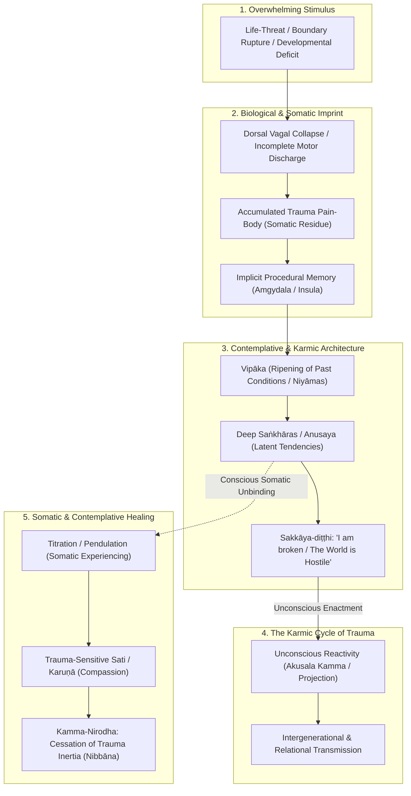
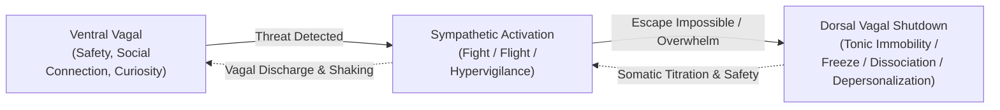

---
tags:
  - trauma
  - karma
  - dukkha
  - conditionality
  - sakkaya-ditthi
  - sankharas
  - pain-body
  - polyvagal
  - somatic-healing
  - relative-trauma
Created: 2026-10-03
Companion Notes: "[[The Architecture of Stress and Suffering]]", "[[Report - The Architecture of Recovery - Sakkāya-Diṭṭhi, Trauma, Sangha, and the Path from Compulsion to Liberation]]"
Status: Complete
---

# The Architecture of Trauma: Somatic Imprints, Karma, and the Unbinding of Suffering

> *"Trauma is not what happens to you. Trauma is what happens inside you as a result of what happens to you."* — Dr. Gabor Maté  
> *"Intention (Cetanā), monastics, is what I call kamma. Having willed, one acts through body, speech, or mind."* — *Nibbedhika Sutta* (AN 6.63)  
> *"Companion Notes: See [[The Architecture of Stress and Suffering]] and [[Report - The Architecture of Recovery - Sakkāya-Diṭṭhi, Trauma, Sangha, and the Path from Compulsion to Liberation]] for foundational models on stress thresholds, relativity, and recovery from compulsion."*

---

## Executive Summary & Foundational Synthesis

While **stress** represents the organism's dynamic response to perceived demands, **trauma** is the biological and psychic aftershock when demand categorically overwhelms the organism's capacity to cope. Trauma is an incomplete, frozen defensive response—a neurological and somatic rupture where past survival states remain perpetually active in the present nervous system.

When viewed through the dual lens of **modern somatic traumatology (Van der Kolk, Levine, Porges)** and **early Buddhist philosophy (Abhidhamma, [[Karma]], [[sankhara|Saṅkhāras]], [[Sakkayaditthi|Sakkāya-diṭṭhi]])**, trauma reveals itself not as an irreversible defect, but as a dense constellation of **conditioned impressions** held in the body-mind (*nāma-rūpa*).



---

## 1. The Relativity of Trauma: Inside vs. Outside

### 1.1 Why Trauma is Fundamentally Relative
Just as stress is relative to the baseline and predictive framing of the observer, **trauma is not defined by the external event, but by the internal nervous system's capacity to process and integrate it at that specific moment**.

* **Contextual & Developmental Relativity**: An experience that is mildly jarring to an adult with robust emotional buffering, strong community, and autonomic safety can shatter the developing nervous system of an isolated child. Trauma is relative to:
  1. *Developmental maturity* of the prefrontal cortex and autonomic brakes.
  2. *Relational safety and co-regulation* available immediately following the impact.
  3. *Internal resource bandwidth* (current allostatic load and energetic reserves).
* **Subjective Rupture**: Two individuals in the same physical accident can walk away with fundamentally divergent outcomes: one discharges the shock through trembling and social connection; the other enters a frozen dorsal collapse that solidifies into Post-Traumatic Stress Disorder (PTSD).
* **The Predictive Model of Trauma**: Trauma fundamentally distorts the brain's predictive processing engine. The traumatized brain updates its Bayesian prior to: *"The present moment is an ambush."* Neutral stimuli (a tone of voice, a sudden silence, a neutral glance) are erroneously assigned high threat precision.

---

### 1.2 "Fabricated" Does Not Mean Imaginary: The Tangible Reality of Trauma

> [!IMPORTANT]  
> **The Indisputable Reality of the Wound**:  
> Even though Buddhist psychology classifies our emotional reactions and conceptual worlds as "fabricated" (*Saṅkhāras*—constructed complexes), **what we experience in life is genuinely stressful, viscerally agonizing, and fully capable of deeply traumatizing us**.

* **No Spiritual Bypassing**: When spiritual traditions state that suffering is conditioned or fabricated, it is never an invitation to dismiss, minimize, or invalidate the pain of trauma. The Buddha did not teach that suffering was an optical illusion; he declared it to be the **First Noble Truth** (*Dukkha-sacca*).
* **The Physical Weight of Fabricated Formations**: A house is fabricated, yet it shelters us or collapses upon us. Similarly, traumatic *saṅkhāras* manifest as physical contractions, neurochemical floods, sympathetic exhaustion, and altered brain architecture (e.g., amygdala hyper-reactivity, hippocampal volume reduction). 
* **The Bodily Toll**: The fact that trauma is constructed out of causes and conditions (*nidānas*) does not make it painless; it makes it a tangible biological catastrophe when survival capacities are exceeded.
* **The True Purpose of Understanding Fabrication**: We acknowledge fabrication not to pretend trauma does not hurt, but because **what has been constructed can eventually be deconstructed**. If trauma were an immutable, eternal essence, healing would be impossible. Because it is fabricated through conditionality, it can be unwound through skillful somatic holding, compassion, and wise insight.

---

## 2. Karma (Kamma), Causality, and Trauma

One of the most dangerous misinterpretations in spiritual discourse is the weaponization of **[[Karma]]** to blame victims of trauma (*"You must have done something in a past life to deserve this"*). Early Buddhist phenomenology provides a far more sophisticated, compassionate analysis.

```mermaid
graph TD
    subgraph TheFiveNiyamas["The Five Cosmic Orders (Pañca-Niyāma)"]
        Utu["Utu-Niyāma: Physical / Inorganic Laws (Earthquakes, storms, accidents)"]
        Bija["Bīja-Niyāma: Biological / Genetic Laws (Disease, inheritance, physiology)"]
        Kamma["Kamma-Niyāma: Intentional Moral Actions & Consequences"]
        Citta["Citta-Niyāma: Psychological Processes & Mental Laws"]
        Dhamma["Dhamma-Niyāma: Universal Natural Laws (Anicca, Dukkha, Anattā)"]
    end

    subgraph TraumaExperience["Trauma Experience"]
        Rupture["Direct Harm / Abuse / Disaster / War"]
    end

    Utu --> Rupture
    Bija --> Rupture
    Kamma --> Rupture
    
    subgraph Ripening["Vipāka vs. New Kamma"]
        Vipaka["Vipāka: The Received Result (Passive / Somatic Experiencing of Pain)"]
        Volition["New Cetanā (Intentional Response / New Karma)"]
    end

    Rupture --> Vipaka
    Vipaka -->|Blind Reactivity (Rage, Blame, Numbness)| Volition
    Volition --> Cycle["Continuation of Trauma Karma (Saṃsāra)"]
    
    Vipaka -.->|Mindful Somatic Holding (Upekkhā & Metta)| Healing["Kamma-Nirodha (Breaking the Chain)"]
```

### 2.1 The Five Niyāmas & Structural Catastrophes: War, Poverty, Racism, Famine, and Political Divide
In the *Atthasālinī* (Buddhaghosa's commentary on the Dhammasaṅgaṇī), the Buddha's teaching outlines **five distinct orders of conditionality** (*Pañca-Niyāma*):
1. **Utu-Niyāma**: Physical, inorganic, and environmental laws (warfare destruction, storms, famines, toxins, physical accidents).
2. **Bīja-Niyāma**: Genetic, biological, and physiological constraints (epigenetic trauma, somatic vulnerability).
3. **Kamma-Niyāma**: The law of intentional, volitional moral causation.
4. **Citta-Niyāma**: The laws of psychological processes and perceptual cognition.
5. **Dhamma-Niyāma**: Universal natural laws of reality (impermanence, non-self, conditionality).

> [!CAUTION]  
> **Structural Violence Must Never Be Diminished or Moralized**:  
> **The devastating impacts of war, severe political polarization, famine, generational poverty, and systemic racism must never be diminished, psychologized, or trivialized.**  
> 
> * **Not Personal Karmic Fault**: A person born into an active war zone, generational poverty, or systemic racial subjugation is **not** being punished for personal misdeeds. They are bearing the crushing biological and physical brunt of:
>   - *Utu-Niyāma* (physical devastation, food scarcity, infrastructural ruin).
>   - *Collective Institutional Kamma* (the violent, predatory actions of warmongers, oppressors, and unjust social systems).
> * **The Biological Sanctity of the Trauma Response**: When bombs fall, when families are starved, or when a human being is racially targeted or politically persecuted, autonomic terror and hypervigilance are **not neuroses or failures of mindfulness**; they are the correct, intelligent biological defenses of an organism under genuine lethal threat.
> * **Spiritual Bypass as Complicity**: To tell someone enduring warfare, racism, or famine that "it is all their perception" or that they should "let go of attachment" is a grotesque betrayal of Dhamma. True Buddhist practice demands clear-eyed social ethics, moral outrage against cruelty, and compassionate action to dismantle oppressive systems (*[[Engaged Buddhism]]*).

---

### 2.2 Vipāka (Passive Ripening) vs. Kamma (Active Volition)
* **Vipāka (The Fruition)**: The sensory flash of pain, the somatic panic spike, the involuntary flashback, and the constricted chest are the *passive ripening* of conditions. You cannot choose what arises as *vipāka*; it is impersonal and non-volitional.
* **Kamma (The Active Choice)**: Karmic consequence is generated exclusively at the point of **volition (*Cetanā*)**. 
  - If trauma-induced panic leads automatically to violence, addiction, cruelty, or self-harm, that reactivity forms **new unwholesome karma (*Akusala Kamma*)**.
  - This is how trauma becomes intergenerational: an unhealed parent projects their dorsal collapse or sympathetic rage onto their child, transmitting the unresolved trauma into the next generation.
* **Kamma-Nirodha (Ending the Cycle)**: By bringing mindful awareness (*Sati*) and loving-kindness (*Mettā*) to the somatic flash of trauma *vipāka*, the reflexive reaction is stayed. The loop terminates in conscious presence.

---

## 3. The Trauma Pain-Body: Somatic Storage and Generational Debt

In Eckhart Tolle's framework, trauma is the very foundation and food source of the **Pain-Body**:

### 3.1 Personal vs. Collective Trauma Pain-Bodies
* **Personal Pain-Body**: The accumulation of every moment in personal history where emotional terror, grief, abandonment, or humiliation was rejected by conscious awareness and shoved into the basement of somatic storage.
* **Collective / Ancestral Pain-Body**: Entire populations subjected to war, slavery, persecution, famine, or structural violence carry an inherited collective pain-body. Epigenetic research (e.g., Rachel Yehuda's studies on cortisol receptor methylation in Holocaust survivors and their descendants) confirms that trauma alters gene expression across generations, manifesting as a heightened biological sensitivity in descendants.

### 3.2 The Seduction of the Trauma Narrative
The trauma pain-body maintains its existence through narrative addiction:
* It seeks situations, relationships, and conflicts that mimic the original traumatic rupture because it recognizes that energetic vibration.
* It whispers internal monologues of mistrust, cynicism, and paranoia: *"You cannot let your guard down; everyone betrays you eventually."*
* When the pain-body successfully triggers a rage outburst or a dissociative withdrawal, it feeds on the generated anguish, strengthening its hold over the nervous system.

---

## 4. Neurological & Somatic Freezes: Polyvagal Immobilization



### 4.1 Peter Levine & Incomplete Defensive Motor Actions
In *Waking the Tiger*, Peter Levine observed that wild animals under lethal attack routinely enter tonic immobility (freeze). If they survive, they immediately tremble, shake, convulse, and hyperventilate—discharging the massive electrical charge mobilized by the sympathetic nervous system—before resuming normal grazing.

* Humans, burdened by a rationalizing neocortex, frequently **suppress and interrupt this discharge**.
* The terror and motor impulses (to push away, to run, to scream) remain **trapped in the neuromuscular system as frozen kinetic energy**.
* This frozen survival energy is what somatic psychology terms *trauma* and what Buddhism recognizes as hardened somatic **[[sankhara|Kāya-saṅkhāras]]**.

### 4.2 Dissociation and the Dorsal Vagal Trap
When mobilization proves futile, the primitive unmyelinated dorsal vagus nerve drops blood pressure, releases endogenous endorphins (natural anesthetics), and induces dissociation. The traumatized individual feels numb, floating, distant, or lifeless. In meditation, this state is frequently mistaken for deep calm or emptiness (*Suññatā*), but it is actually a biological shutdown devoid of vibrant alertness.

### 4.3 Choice Overload & Sensory Hyper-Stimulation as Autonomic Triggers
As detailed in [[The Architecture of Stress and Suffering]] (and demonstrated in tree frog mate choice studies), **excessive choice options and sensory competition cause acute prefrontal metabolic exhaustion**:
* **The Traumatized Nervous System Under Load**: An individual carrying unresolved trauma already operates with a compressed Window of Tolerance and elevated baseline allostatic load.
* **The Cognitive Straw that Breaks the Camel's Back**: Navigating the hyper-stimulating modern environment—supermarkets with 40 cereals, algorithmic feeds, targeted advertising, endless micro-decisions—rapidly depletes the ventromedial and dorsolateral prefrontal cortex.
* **Rapid Collapse into Freeze**: When cognitive load overwhelms executive capacity, the traumatized system does not merely experience fatigue; it flips into **dorsal vagal paralysis or hyper-aroused panic**. 
* **Radical Simplicity as Trauma Medicine**: Pruning environmental stimuli, limiting daily choices, eliminating digital notification noise, and embracing the Buddhist principle of **Appicchatā** (fewness of wishes / simplicity) is not merely an aesthetic lifestyle preference; it is a vital neuro-somatic stabilizer for trauma recovery.

---

## 5. Buddhist Diagnostics: Sakkāya-Diṭṭhi & Saṅkhāras

### 5.1 Sakkāya-Diṭṭhi: The Traumatized Identity
The deepest wound of trauma is often not the initial physical injury, but the cognitive crystallizing of an identity around the wound:
* **The "I Am" Construction**:
  - *"I am broken."*
  - *"I am fundamentally unlovable."*
  - *"I am a victim; my fate is determined by what was done to me."*
* In Buddhist phenomenology, this is a severe manifestation of **[[Sakkayaditthi|Sakkāya-diṭṭhi]]** (personality/identity view). The mind takes transient, conditioned emotional aggregates (*Khandhas*) and identifies with them as the core, enduring "Self."
* **Liberation through Anattā (Non-Self)**: Healing accelerates when the practitioner realizes:
  > *"There is traumatic grief here, but there is no 'broken self.' The trauma is a conditioned physiological event arising and passing away across awareness; it is not who I am."*

---

### 5.2 Saṅkhāras as Trauma Grooves (Vāsanā & Anusaya)
* **Anusaya (Latent Tendencies)**: Unconscious biases and reactive tendencies dormant below conscious awareness. Trauma primes specific *anusaya*:
  - *Paṭighānusaya* (latent tendency toward irritation/aversion).
  - *Bhavarāgānusaya* (latent clinging to protective identities).
  - *Avijjānusaya* (latent ignorance of the true nature of reality).
* **Vāsanā (Karmic Imprints / Grooves)**: Like water carving a deep canyon into a riverbed, intense traumatic shock carves deep habitual grooves (*vāsanā*) into the neural and mental architecture. Even decades later, a trivial sensory match (a specific smell, a shadow, an abrupt slam) sends mental and somatic consciousness cascading down that groove.

---

## 6. Trauma-Informed Contemplative Healing

Standard meditation instructions (e.g., *"Just sit still, close your eyes, and watch your breath"*) can be re-traumatizing for an individual trapped in hypervigilance or dorsal numbness. A trauma-informed spiritual path requires specific adjustments:

| Classical Practice | Trauma Vulnerability | Trauma-Informed Contemplative Adjustment |
| :--- | :--- | :--- |
| **Eyes-Closed Stillness** | Can induce panic or trigger dissociative voids by cutting off visual safety signals. | **Eyes-Open Practice / Orienting**: Keep eyes soft and gently scan the physical room, registering visual cues of current safety. |
| **Pure Breath Focus** | The chest/breath can be the exact somatic locus of suffocation, panic, or terror. | **External Anchor / Periphery**: Place attention on the soles of the feet touching the floor, palms resting on the knees, or soundscapes. |
| **Forced Equanimity** | Can be co-opted by the mind as spiritual bypassing or intellectual dissociation. | **Somatic Titration & Pendulation**: Touch into the difficult somatic knot for 5 seconds, then deliberately pendulate back to a felt resource of comfort. |
| **Dry Insight / Vipassanā** | Deconstructs identity too rapidly without sufficient physiological regulation. | **Warm Somatic Compassion ([[Brahmavihara|Karuṇā]] & [[Mettā]])**: Infusing bodily sensations with profound kindness and relational safety before examining non-self. |

---

## 7. The Protocol: Somatic De-conditioning & Karmic Release

When trauma arousal or pain-body activation surges:

1. **Orient to the Exteroceptive Present**:
   - Open eyes. Look around the room. Name three colors, feel the solid pressure of the chair beneath you. Confirm to the nervous system: *"The historical event is over. The room is safe right now."*
2. **Track the Kāya-Saṅkhāra (Somatic Reading)**:
   - Without judgment, notice where the trauma charge is living in the body: throat constriction, stomach clenching, coldness in the hands.
3. **Allow the Tremor (Micro-Discharge)**:
   - If the body wishes to sigh, shake, swallow, or adjust, allow the physical impulse without inhibition. Let the frozen kinetic charge safely discharge.
4. **Decouple the Story (Neutralize the Narrative)**:
   - Identify the pain-body's attempt to weave an absolute story (*"Nobody cares," "I'm ruined"*). Acknowledge: *"This is a trauma narration, not absolute truth."*
5. **Rest in the Compassionate Witness (The Unbroken Awareness)**:
   - Recognize that the field of conscious awareness in which the trauma sensations arise is itself completely unstained, whole, and uninjured. The sky is never harmed by the lightning that passes through it.
