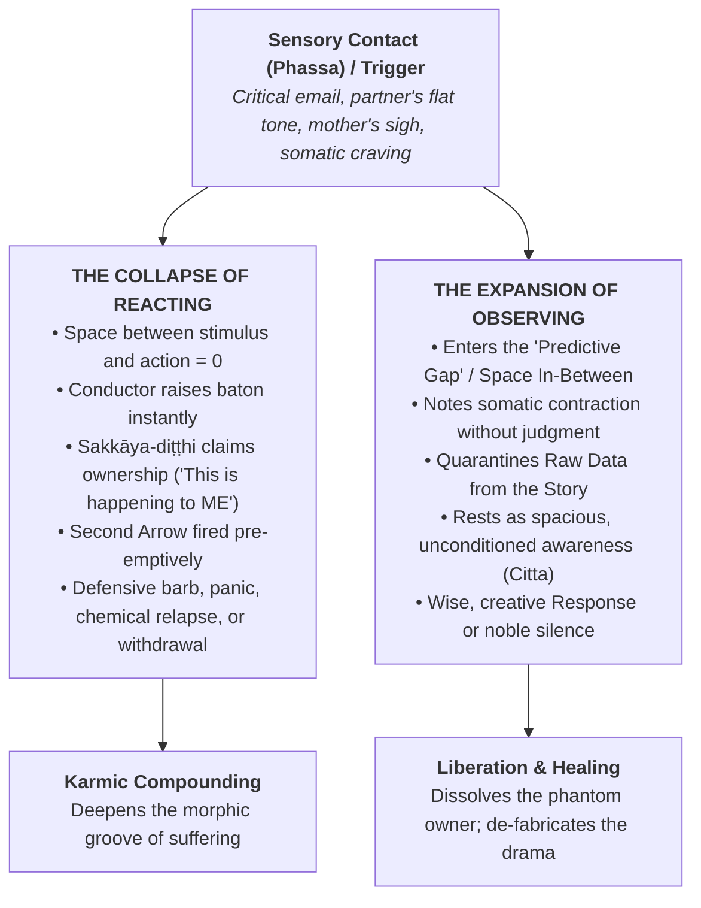
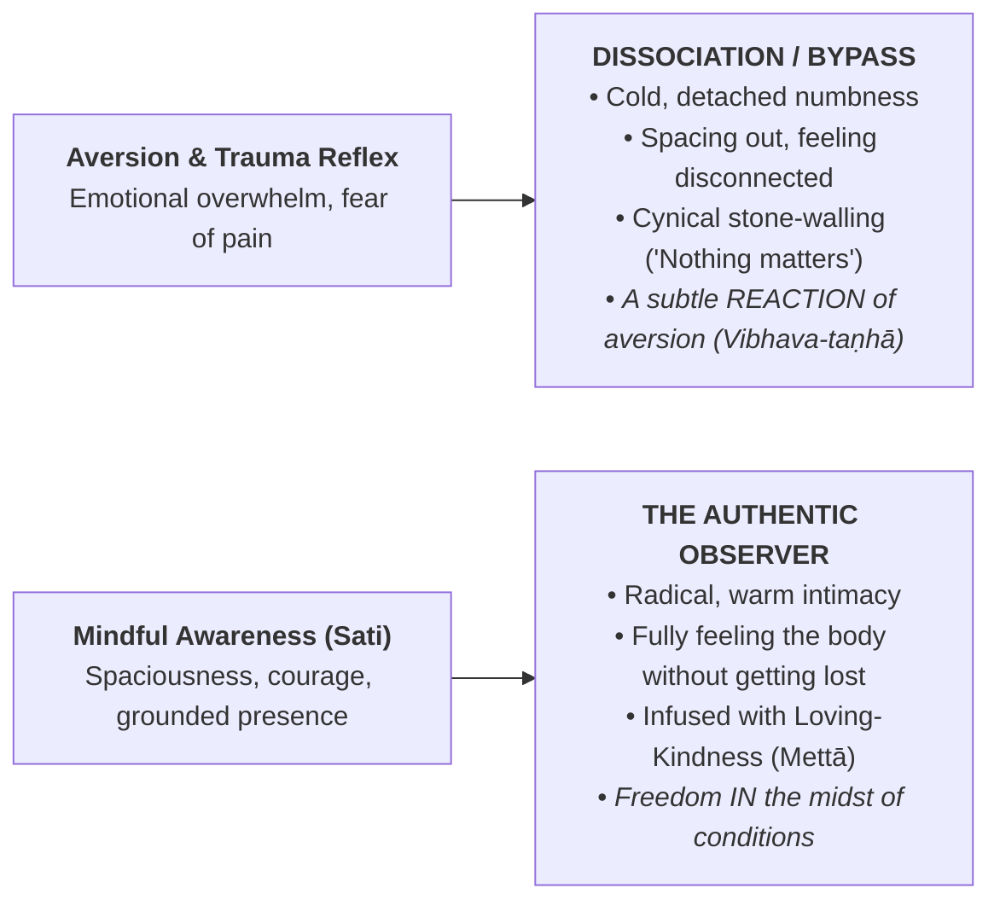

# Comprehensive Report: The Observer — Reacting vs. Observing in Meditation, Mediation, and Active Life Experience

> **Location:** `_A_My Research/_Buddhism/The Observer/`  
> **Source Synthesis & Cross-Vault Network:**  
> • **Sister Foundation 1:** [[Report - Saṅkhāra, Mental Fabrications, Ajahn Sumedhos Teaching on the Mother, and Mindful Recovery]] (`_A_My Research/_Buddhism/sankhara/`)  
> • **Sister Foundation 2:** [[Report - Personality View, Identity, Worldly Winds, and Protection]] (`_A_My Research/_Buddhism/Sakkayaditthi/`)  
> • **Contemplative Notes:** [[Mindfulness is beyond Conditioning - Ajahn Sumedho]], [[Paying Attention to the space in-between ]], [[Mindfulness and its Associated States]], [[Mindfulness Based Addiction Recovery meditations]]  
> • **Canonical Discourses:** *Bāhiya Sutta* (Ud 1.10), *Sallatha Sutta* (SN 36.6), *Cūḷavedalla Sutta* (MN 44), *Sedaka Sutta* (SN 47.19), *Madhupiṇḍika Sutta* (MN 18)  
> • **Lineage & Frameworks:** Ajahn Sumedho (*The Sound of Silence*, *Witnessing Experience*, *Asking Yourself Questions*), Thanissaro Bhikkhu (*The Wings to Awakening*), past Marin Mindful Recovery (MMR) archives, active weekly group curricula (Living Mindfulness Meditation Group on Sunday evenings; Living Mindfully ESCOM Club on Thursdays at 2:00 PM)  
> **Created:** 2026-10-02 11:27:00-07:00  
> **Last Updated:** 2026-10-02 13:45:00-07:00  
> 
> ### Version History & Updates
> * **v1.0.0 (2026-10-02 11:27:00-07:00) — Master Consolidation & Triad Integration:** Formally established *The Observer* as the operational engine uniting the twin conceptual pillars of *Sakkāya-diṭṭhi* (Personality View) and *Saṅkhāra* (Mental Fabrications). Detailed actionable protocols for the shift from reactivity to observation across seated meditation, interpersonal/internal mediation, and active daily life.
> * **v1.1.0 (2026-10-02 13:40:00-07:00) — Schedule & Platform Alignment:** Updated pedagogical references to reflect current weekly offerings: the **Living Mindfulness Meditation Group** (Sunday evenings) and the **Living Mindfully ESCOM Club** (Thursdays at 2:00 PM), contextualizing Marin Mindful Recovery as past talk archives.
> * **v1.2.0 (2026-10-02 13:45:00-07:00) — Taxonomy & Publication Hub:** Added standard YAML frontmatter tags for cross-vault indexing across books, blogs, Sunday/Thursday meditation groups, and recovery archives.
> * **v1.3.0 (2026-10-02 14:15:00-07:00) — Tetralogy Expansion (Pillar 4 Integration):** Formally cross-linked with [[Report - Karma, Skillfulness, Sakkayaditthi, and Sankharas, How to Treat Experience]] (`_A_My Research/_Buddhism/Karma/`).
> * **v1.4.0 (2026-10-02 14:28:00-07:00) — Foundational Overture Integration (Pentology):** Formally cross-linked with the book's primary opening treatise: [[Report - The Conditioning Process in Humans, Evolution, Consciousness, Karma, Trauma, and the Architecture of Freedom]] (`_A_My Research/_Buddhism/Conditioning/`), anchoring the witnessing capacity of the Observer as the unconditioned sanctuary beyond biological, traumatic, and karmic conditioning.
> 
> > [!IMPORTANT] Master Book Architecture Hub: The Five Works of Human Liberation
> > This report is an integrated component in a five-part contemplative, scientific, and clinical master series:
> > 0. **Foundational Overture:** [[Report - The Conditioning Process in Humans, Evolution, Consciousness, Karma, Trauma, and the Architecture of Freedom|The Conditioning Process in Humans]] — The primal predicament: evolution, consciousness, karma, somatic trauma, and the de-conditioning runway to freedom.
> > 1. **Pillar 1:** [[Report - Personality View, Identity, Worldly Winds, and Protection|Sakkāya-diṭṭhi (The Phantom Owner)]] — The architecture of self-defense, role entrapment, and vulnerability to the 8 Worldly Winds.
> > 2. **Pillar 2:** [[Report - Saṅkhāra, Mental Fabrications, Ajahn Sumedhos Teaching on the Mother, and Mindful Recovery|Saṅkhāra (The Dramatic Conductor)]] — Cognitive construction, predictive processing, Ajahn Sumedho's Mother teaching, morphic resonance, and habit loops.
> > 3. **Pillar 3 (Current File):** [[Report - The Observer, Reacting vs. Observing in Meditation, Mediation, and Active Life|The Observer (The Seat of Freedom)]] — Moving from compulsive reaction to spacious awareness in meditation, mediation, and active daily life.
> > 4. **Pillar 4:** [[Report - Karma, Skillfulness, Sakkayaditthi, and Sankharas, How to Treat Experience|Karma & Skillfulness (The Craft of Experience)]] — The operational engine: treating experience as old karma (*purāṇa-kamma*) met by liberating new action (*nava-kamma*).
> > 
> > **Multi-Channel Publication & Teaching Tracking:**
> > • **Book & Essay Pillars:** `#book-draft` `#book-foundation` `#blog-essay`  
> > • **Active Weekly Teaching:** `#living-mindfulness-sunday` (Sunday Evenings) | `#escom-club-thursday` (Thursdays 2 PM)  
> > • **Recovery & Urge Surfing Archives:** `#recovery-archive` `#mindful-recovery`  
> > • **Contemplative Core:** `#the-observer` `#reacting-vs-observing` `#sati` `#mindfulness` `#urge-surfing`

---

## Executive Summary

Across human experience, the boundary between suffering (*dukkha*) and freedom (*vimutti*) is defined by a single dynamic: **the capacity to move from Reacting to Observing.**

* **Reacting** occurs when sensory contact (*phassa*) strikes an unexamined identity (*sakkāya-diṭṭhi*), causing the mind’s internal "Conductor" (*saṅkhāra*) to immediately raise its baton and play out an ancient, automated symphony of defense, craving, panic, or blame. In a reaction, the space between stimulus and response collapses to zero.
* **Observing** is the activation of bare, lucid awareness (*sati-sampajañña*). It is stepping into what Ajahn Sumedho describes in vault notes as:
  > *"The purity before conditions arise, before you become anything."*

This report articulates the operational mechanics of the **Observer**, establishing practical protocols for cultivating this capacity in the **laboratory of meditation**, applying it in **interpersonal and internal mediation**, and deploying it in the high-stakes friction of **active life and recovery**.

---

## 1. The Core Paradigm: Reacting vs. Observing



### 1.1 Comparative Phenomenological Matrix

| Dimension | The Reactive Mind (*Kamma-Accumulation*) | The Observing Mind (*Sati-Sampajañña*) |
| :--- | :--- | :--- |
| **Philosophical Ground** | Entangled in [[Report - Personality View, Identity, Worldly Winds, and Protection\|Sakkāya-diṭṭhi]] (Personality View). | Grounded in *Anattā* (Not-Self) and *Śūnyatā* (Emptiness). |
| **Cognitive Process** | Driven by [[Report - Saṅkhāra, Mental Fabrications, Ajahn Sumedhos Teaching on the Mother, and Mindful Recovery\|Pre-Emptive Saṅkhāra]]; the script finishes before sensory contact finishes. | Inhabits the **Predictive Gap**; bare attention (*Bāhiya Sutta*: in the seen, merely the seen). |
| **Center of Gravity** | Trapped inside the movie; identified with the wounded character. | Resting as the cinema screen; holding the entire projection with equanimity (*upekkhā*). |
| **Somatic Signature** | Clenched diaphragm, tight solar plexus, adrenaline surge, tunnel vision. | Relaxed belly, dropped shoulders, grounded contact with feet and breath. |
| **Response Window** | Milliseconds; automated, impulsive, and past-conditioned. | Generous pause; response arises from the whole relational field. |
| **Karmic Result** | Carves deeper grooves in the individual and collective morphic field. | Dissolves karmic knots; heals the self and remediates the collective field. |

---

## 2. Working with the Observer in Meditation (The Cushion Laboratory)

Seated meditation is not an escape from reality; it is the **clean, low-velocity laboratory** where the nervous system unlearns the reflex of automatic reaction and stabilizes the capacity to observe.

### 2.1 Working with Physical Sensation (Pain in Knee, Back, or Hips)
* **The Reactive Habit:** Sensation arises $\rightarrow$ the mind slaps the concept *"Pain!"* on it $\rightarrow$ the Conductor plays the symphony: *"My knee is being destroyed; I can't sit for 40 minutes; I must move right now."* The physical sensation is 10% of the experience; the mental panic and resistance are the 90% second arrow.
* **The Observation Protocol:**
  1. **Stillness:** Freeze the physical urge to fidget or adjust posture immediately.
  2. **Strip the Label:** Silently drop the word *"pain."* Ask: *"What is actually occurring at the physical interface?"*
  3. **Deconstruct into Raw Elements:** Notice heat, pulsing, tightness, throbbing, or sharpness. These sensations are constantly shifting and vibrating.
  4. **Locate the Witness:** Ask: *"Is the awareness that knows this heat also burning? Is the space holding this pressure crushed?"*
  5. You discover that **awareness is completely free of the qualities of the object it knows.**
* **The Cellular & Somatic Ground (Dr. Michael Levin):** Recognize that somatic tensions and discomforts are not just mechanical signals; as Dr. Michael Levin demonstrates through basal cognition and somatic memory, cells and tissues hold their own non-neural memory (*kāya-saṅkhāra*). When the conscious Observer holds physical sensations in spacious, non-reactive presence, the body's bioelectric cellular network is freed from top-down panic, allowing physiological and somatic patterns to self-regulate and discharge without cognitive interference.

### 2.2 Working with Restlessness, Sloth, and Mental Proliferation (*Papañca*)
* **The Reactive Habit:** The mind wanders into a work fantasy or grievance. Upon realizing it, the meditator *reacts to the thought* with irritation: *"I'm terrible at this; my mind is out of control."*
* **The Observation Protocol:**
  1. **Catch the Awakening:** The exact millisecond you realize the mind was wandering, **you are already the Observer.** Celebrate that awakening.
  2. **The Soap Bubble Technique (Ajahn Sumedho):** Look directly at the thought-image or conversational snippet. Do not push it away; do not indulge it. Watch the energetic bubble burst in the wide-open expanse of awareness.
  3. **Pay Attention to the Space In-Between ([[Paying Attention to the space in-between ]]):**
     * Focus awareness on the brief, silent pause at the bottom of the exhale before the inhale begins.
     * Focus on the quiet interval between the ending of one thought and the arising of the next.
     * In that space, *sakkāya-diṭṭhi* is temporarily dormant, and *saṅkhāra* has paused. That gap is the taste of the Unconditioned (*Nibbāna*).

### 2.3 Ajahn Sumedho’s "Sound of Silence" (*Nāda*)
* In meditation, listen intently to the subtle, high-frequency inner tone—the "sound of silence."
* This sound is not a mental fabrication; it is the background acoustic resonance of conscious awareness itself.
* By resting attention in the *sound of silence*, you intentionally **detune** from the chatter of personal thoughts and tune into the timeless, unconstructed backdrop of being.

---

## 3. Working with the Observer in Mediation (Interpersonal Conflict & Internal Psychodynamics)

Whether facilitating a dispute between external parties or mediating warring internal voices within your own mind, **the Observer is the only seat from which true reconciliation occurs.**

### 3.1 External Mediation: Resolving Interpersonal Disputes
When two individuals are locked in conflict (in a professional team, recovery meeting, or family):
1. **The Entangled Trap:** If the mediator *reacts* to emotional accusations, righteous posturing, or victim narratives, they become absorbed into the toxic morphic field. They take sides or rush to impose superficial, artificial solutions.
2. **Embodying the Neutral Field Anchor:**
   * The skilled mediator sits as the **unshakable, compassionate Observer**.
   * You recognize that both parties are possessed by their respective [[Report - Saṅkhāra, Mental Fabrications, Ajahn Sumedhos Teaching on the Mother, and Mindful Recovery#3-cognitive-engine--predictive-processing-the-pre-emptive-conductor|Pre-Emptive Conductors]]. Their hostility is not objective malice; it is the overflow of their panicked, self-protective fabrications.
   * By remaining grounded (diaphragmatic breathing, unreactive posture), the mediator acts as a **parasympathetic tuning fork** for the room. Through non-local field resonance (Indra's Net), spacious neutral presence co-regulates the agitated nervous systems of both disputants.
3. **The Reframing Question:** The mediator helps the parties separate raw data from story:  
   * *"Can we state exactly what words were said, without the interpretation of what they meant about your worth?"*

### 3.2 Internal Mediation: Chairing the Internal Boardroom
* As outlined in *Protocol 5* of the Saṅkhāra report, when internal turmoil strikes, competing sub-personalities convene:
  * **The Wounded Child:** Demanding affection and reassurance.
  * **The Perfectionistic Judge:** Demanding flawless performance and berating mistakes.
  * **The Addict / Escape Artist:** Demanding immediate chemical or behavioral relief.
* **The Observer as Chairperson:**
  * The Observer does not exile or attack any part. 
  * The Observer invites each voice to speak: *"I see you, fear. I hear you, craving. I acknowledge you, righteous anger."*
  * By naming the sub-personality without identifying with it, you strip it of executive authority while honoring its underlying biological protective intent.

---

## 4. Working with the Observer in Active Life Experience

Active daily living is the ultimate crucible for the practice. Here, the challenge is transforming blind, past-driven **Reactions** into spacious, ethical **Responses**.

```
STIMULUS  ─────────► [ THE PREDICTIVE GAP / THE OBSERVER ] ─────────► CONSCIOUS RESPONSE
                                (Sati, Breath, Mettā)
```

### 4.1 The Relational Arena: The "Mother" & Family of Origin Archetypes
* **The Scenario:** A phone call with a parent or partner where a critical comment, flat tone, or passive-aggressive sigh lands.
* **The Automated Reaction:** An immediate defensive explosion (*"Why do you always criticize me?!"*), sullen emotional retreat, or hours spent mentally rehearsing courtroom speeches.
* **The Observer in Action:**
  1. **Somatic Tripwire:** Notice the sudden contraction in the stomach or throat.
  2. **The Sumedho Realization:** Silently remember:
     > *"The mother I am reacting to is a mental monument (saṅkhāra). The living person speaking is a changing human being conditioned by her own fears and upbringing."*
  3. **The 3-Second Breath Gap:** Refuse to let speech leave your lips during the first three seconds of physiological alarm.
  4. **The Wise Response:** Respond to the present reality rather than the historical ghost: *"I know you want the best for me, but I feel comfortable with this choice."*

### 4.2 Addiction & Compulsion: Urge Surfing (From Recovery Archives to Weekly Mindfulness Groups)
* **The Context:** While Marin Mindful Recovery meetings are no longer held, the profound clinical and contemplative tools developed there—especially **Urge Surfing**—remain vital practices shared in your active **Living Mindfulness Meditation Group** (Sunday evenings) and **Living Mindfully ESCOM Club** (Thursdays at 2:00 PM).
* **The Scenario:** A wave of restlessness, isolation, or fatigue strikes, accompanied by the urgent thought: *"I need a drink / substance / distraction / escape to make this feeling stop."*
* **The Automated Reaction:** Either succumbing to the compulsion (relapse) or fighting it with white-knuckle suppression (which only inflates the craving).
* **The Observer in Action (Urge Surfing):**
  1. **Depersonalize the Urge:** Through *Anattā*, recognize: *"This craving is not 'me' or 'mine.' It is an ancient, impersonal morphic wave passing through the receiver of this nervous system."*
  2. **Track the Wave:** A craving is an ocean wave. It rises, peaks, plateaus, and subsides within **20 to 30 minutes** if not fed by the fuel of reactive thinking.
  3. **The 30-Minute Somatic Quarantine:** Commit to doing nothing destructive for 30 minutes. Drink a glass of water, walk outside, feel the air against your skin. Watch the physical sensations of the urge (chest flutter, mouth dryness) crest and dissolve in the ocean of awareness.

### 4.3 Professional Friction & Public Criticism
* **The Scenario:** Receiving a harsh review, a scathing email, or public critique from colleagues.
* **The Automated Reaction:** An immediate email counter-attack, panic about job security, or agonizing impostor syndrome.
* **The Observer in Action:**
  1. **Deploy Protocol 3:** Quarantining the 10% raw data (words on a screen) from the 90% conductor's symphony (*"I am ruined"*).
  2. **The 30-Minute Rule:** Mandate a non-negotiable buffer before replying in writing. Let the cortisol and adrenaline clear the bloodstream.
  3. **The Plaque-Disclosing Dye Filter:** View critique not as an indictment of your soul, but as impersonal diagnostic information—identifying where technical adjustments are needed without taking it as a strike against your dignity.

---

## 5. Vital Discernment: The Observer vs. Dissociation

A perilous misunderstanding in spiritual and psychological practice is confusing the **Observer** with **Dissociation (Depersonalization)**:



* **Dissociation is a Reaction:** When pain is unbearable, the uninspected ego pulls the emergency brake, going numb, dissociating from the body, and pretending to be "above it all." This is not enlightenment; it is the subtle reaction of aversion (*vibhava-taṇhā*).
* **The Authentic Observer is Radical Intimacy:** The true Observer does not flee from sadness, anger, or pain. It leans in with immense gentleness. It holds the weeping child, the trembling nervous system, or the grieving heart in the infinite, loving embrace of unconditional presence (*mettā* infused with *paññā*).

---

## 6. The Triad Integration: Cross-Vault Synthesis

This document completes the architectural triad in your research vault:

| Pillar | Focus | Vault Document Link |
| :--- | :--- | :--- |
| **Pillar 1: Identity** | The phantom owner that demands defense and status. | [[Report - Personality View, Identity, Worldly Winds, and Protection]] |
| **Pillar 2: Fabrication** | The cognitive engine, predictive conductor, and morphic field. | [[Report - Saṅkhāra, Mental Fabrications, Ajahn Sumedhos Teaching on the Mother, and Mindful Recovery]] |
| **Pillar 3: The Witness** | The operational practice of non-reactive, spacious awareness. | [[Report - The Observer, Reacting vs. Observing in Meditation, Mediation, and Active Life]] |

---

## Concluding Reflection: The Art of Non-Contention

In the *Madhupiṇḍika Sutta* (MN 18), the Buddha declared that for someone who does not obsess, evaluate, or react to perceptions and mental fabrications:
> *"This is the end of the latent tendencies to lust, irritation, views, doubt, conceit, the desire for becoming, and ignorance. This is the end of taking up rods and bladed weapons, of arguments, quarrels, disputes, accusations, and divisive speech."*

To observe rather than react is the supreme act of non-violence (*ahiṃsā*). 

When you sit on the cushion and observe a restless thought without fighting it; when you sit in a mediation session and hold a safe, unreactive container; and when you pause in the heat of a family conflict and choose stillness over retaliation—you are not merely managing stress.

**You are stepping out of the wheel of conditioned suffering, breaking the ancestral chain of reactivity, and resting in the birthless, deathless silence of the Dhamma.**
