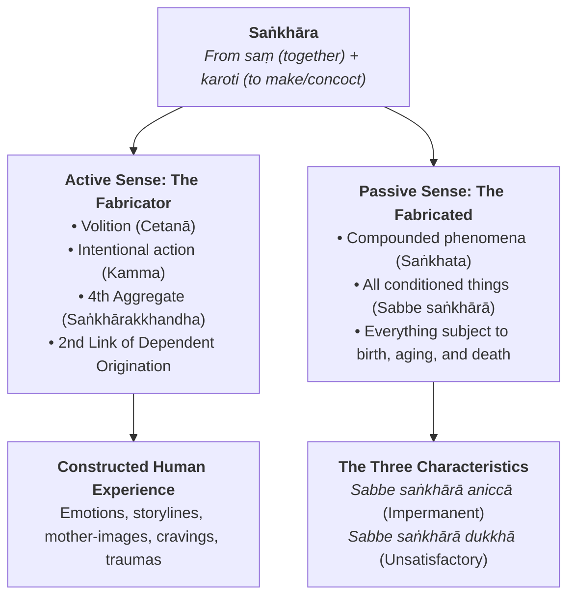
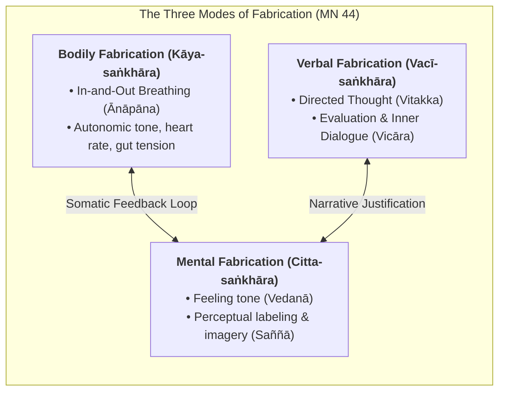
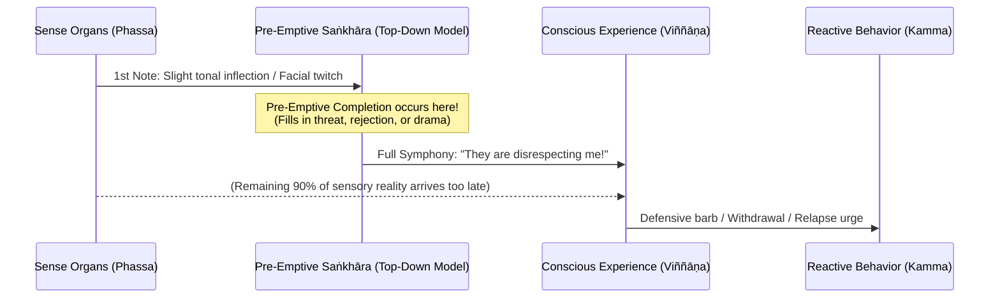
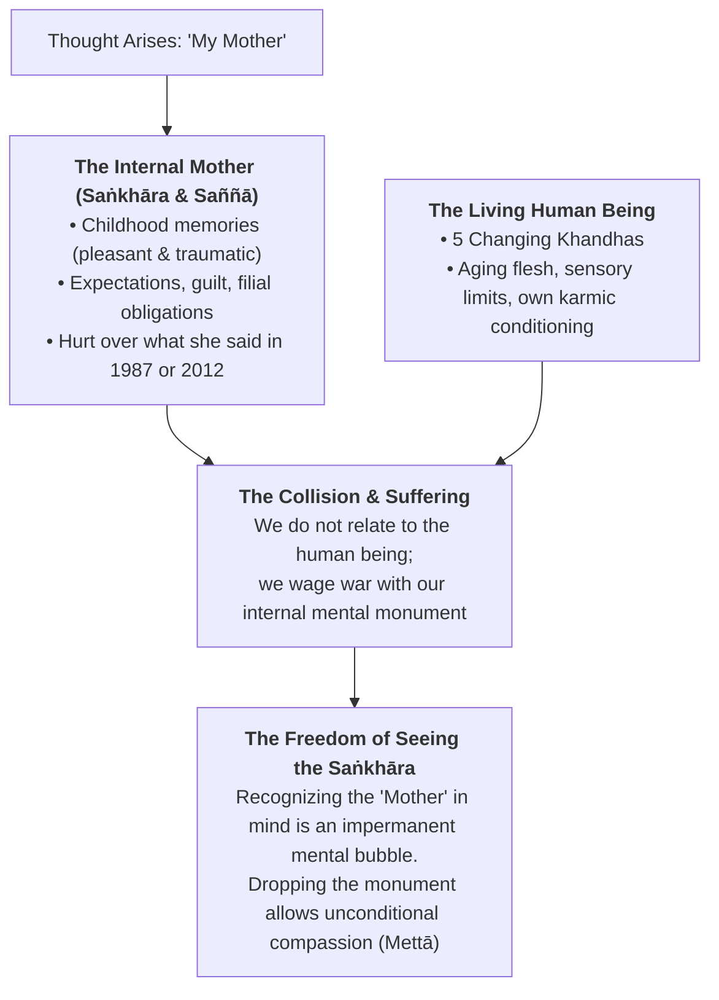
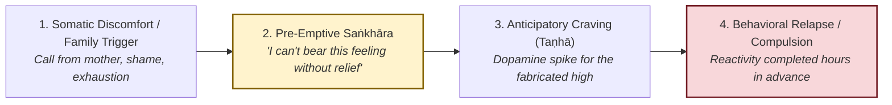
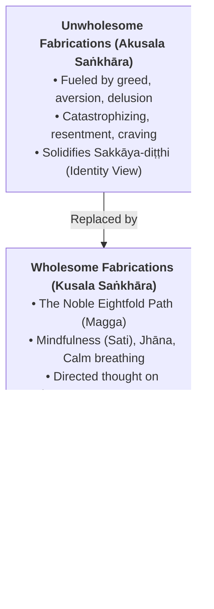
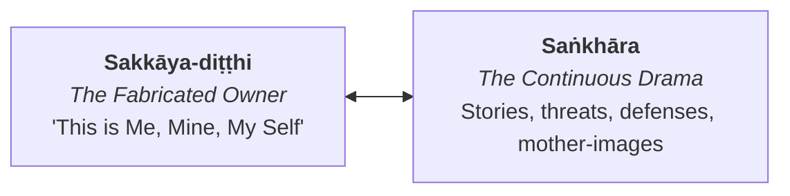
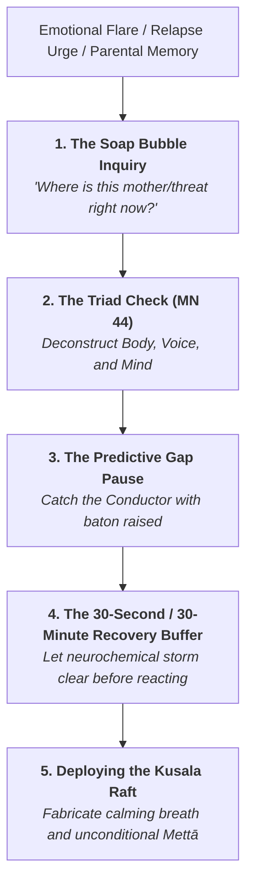

# Comprehensive Report: Saṅkhāra (Mental Fabrications), The Architecture of Experience, Ajahn Sumedho’s Teaching on the Mother, and Mindful Recovery

> **Location:** `_A_My Research/_Buddhism/sankhara/`  
> **Source Synthesis:** Vault research including Ajahn Sumedho (*Asking Yourself Questions - 1978*, *4 Noble Truths*, *The Way It Is*, *ChatGPT Perception Analysis*), Thanissaro Bhikkhu (*The Wings to Awakening*, *The Shape of Suffering*, *Mindful of the Body*), Ajahn Chah (*Clarity of Insight*, *Food for the Heart*), Larry Rosenberg (*Breath by Breath*), Marin Mindful Recovery curriculum and talk transcripts, classical Nikāya discourses (*Khajjaniya Sutta* SN 22.79, *Cūḷavedalla Sutta* MN 44, *Sallatha Sutta* SN 36.6, *Bāhiya Sutta* Ud 1.10, *Madhupiṇḍika Sutta* MN 18), and modern Cognitive Neuroscience (Predictive Processing, Active Inference, and Constructed Emotion).  
> **Created:** 2026-10-01 12:20:00-07:00  
> **Last Updated:** 2026-10-01 12:20:00-07:00  
> 
> ### Version History & Updates
> * **v1.0.0 (2026-10-01 12:20:00-07:00) — Master Consolidation & Synthesis:** Comprehensive research synthesis establishing *Saṅkhāra* (mental fabrication/concoction) as the sister cornerstone to *Sakkāya-diṭṭhi* (personality view). Deep exploration of canonical polysemy, predictive processing, Ajahn Sumedho’s seminal "Mother" discourse, the psychology of addiction and recovery (Marin Mindful Recovery), the raft of wholesome fabrication, and tactical meditative protocols.
> 
> > [!IMPORTANT] Author's Strategic Intent & Creative Roadmap
> > **Featured Twin Cornerstone Theme:** Alongside *Sakkāya-diṭṭhi* (Personality View), *Saṅkhāra* (Volitional Fabrication / Mental Formations) is established as an indispensable structural pillar across all pedagogical, clinical, literary, and contemplative initiatives:
> > 1. **Forthcoming Books & Essays:** Operating as the foundational framework explaining how the human mind actively constructs, projects, and suffers its experienced reality—and how conscious de-fabrication yields liberation.
> > 2. **Marin Mindful Recovery (MMR) & Addiction Programs:** Exposing how craving, compulsive relapse, and family-of-origin resentments are driven not by external substances or historical figures, but by instantaneous, unexamined mental fabrications (*saṅkhāra*).
> > 3. **Meditation Dharma Talks & Group Offerings (MMR, ESCOM Living Mindfully):** Translating Ajahn Sumedho’s visceral teaching on "Where is your mother right now?" into practical relational freedom and emotional healing.
> > 4. **Daily Voice Journal & Workflow Pipeline (Plaud/Bee Note Automation):** Ongoing real-time tracking of everyday cognitive habits, catching the "Conductor" in the act of fabricating narratives before sensory contact has finished.

---

## Executive Summary

If **Personality View (*Sakkāya-diṭṭhi*)** creates the imaginary owner inside the house of consciousness, **Mental Fabrications (*Saṅkhāra*)** are the relentless interior decorators, scriptwriters, and alarm systems constantly building, renovating, and defending the house.

In Early Buddhist psychology, *saṅkhāra* is one of the richest, most multifaceted, and most misunderstood terms in the Pāli Canon. It encompasses:
1. **The Compounded Nature of Reality (*Sabbe saṅkhārā aniccā*):** Everything in the physical and mental universe that is put together, conditioned, and subject to decay.
2. **The Active Engine of Karma (*Cetanā*):** The intentional volitions that shape future becoming (*bhava*) in the chain of Dependent Origination (*Paṭiccasamuppāda*).
3. **The Fourth Aggregate (*Saṅkhārakkhandha*):** The cognitive, emotional, and psychological machinery that flavors, cooks, interprets, and categorizes raw experience.

This comprehensive report integrates classical Theravāda phenomenology with modern cognitive neuroscience, clinical recovery insights from the **Marin Mindful Recovery (MMR)** tradition, and the radical, destabilizing wisdom of the Thai Forest lineage—culminating in **Ajahn Sumedho’s iconic teaching on "The Mother as a Saṅkhāra."**

---

## 1. The Anatomy & Polysemy of Saṅkhāra

### 1.1 Etymology and Dual Meaning: Fabricator and Fabricated
The word *saṅkhāra* derives from the prefix *saṃ* (together, joined, thoroughly) and the verbal root *kṛ* / *karoti* (to do, make, act, fashion). Etymologically, it signifies:
* *"That which puts together"* (active voice: fabricating, concocting, fashioning).
* *"That which has been put together"* (passive voice: fabricated, compounded, conditioned phenomena).

In your research across Thanissaro Bhikkhu’s writings (*The Shape of Suffering*, *Wings to Awakening*), Bhikkhu Ṭhānissaro renders *saṅkhāra* as **"fabrication"** rather than the conventional, bland translations of "mental formations" or "volitional activities." "Fabrication" preserves the dynamic, active, culinary sense of the Pāli: the mind is not merely registering reality; it is actively *cooking* it, seasoning it, and building castles out of raw sensory flour.

### 1.2 The Three Canonical Tiers of Saṅkhāra

To understand *saṅkhāra* in practice, the practitioner must navigate three distinct contextual levels across the Suttas:

| Level | Context | Canonical Formula | Practical Meaning |
| :--- | :--- | :--- | :--- |
| **1. Universal Conditioned Reality** | Metaphysics & Existential Reality | *Sabbe saṅkhārā aniccā, sabbe saṅkhārā dukkhā* (Dhp 277-278) | Every physical, biological, emotional, and astronomical phenomenon that is assembled from causes is impermanent and incapable of providing lasting satisfaction. The only thing *not* a saṅkhāra is the Unconditioned (*Asaṅkhata Dhātu* / *Nibbāna*). |
| **2. Dependent Origination (*Paṭiccasamuppāda*)** | The Causal Chain of Suffering | *Avijjā-paccayā saṅkhārā; saṅkhāra-paccayā viññāṇaṃ* (SN 12.2) | Ignorance conditions volitional formations, which in turn drive consciousness toward rebirth and moment-to-moment psychological becoming (*bhava*). |
| **3. The Fourth Aggregate (*Khandha*)** | Moment-to-Moment Cognition | *Saṅkhārakkhandha* (SN 22.79 *Khajjaniya Sutta*) | The inner workshop that crafts volitions, memories, plans, reactions, and concepts. It is the aggregate that *fabricates all five aggregates into experience*. |

### 1.3 The Master Chef of the Aggregates (SN 22.79)
In the *Khajjaniya Sutta* ("Chewed Up"), the Buddha gives an astonishing definition of the fourth aggregate that anticipates modern cognitive construction:

> *"And why, monks, do you say 'fabrications' (saṅkhāras)? Because they fabricate fabricated things, that is why they are called fabrications. And what are the fabricated things that they fabricate? They fabricate form into 'form'... feeling into 'feeling'... perception into 'perception'... fabrications into 'fabrications'... consciousness into 'consciousness'. Because they fabricate fabricated things, monks, they are called fabrications."*  
> — **SN 22.79**

The other four aggregates provide the raw material:
* **Form (*Rūpa*):** Raw light, sound vibrations, physical pressure.
* **Feeling (*Vedanā*):** Bare hedonic tone—pleasant, unpleasant, neutral.
* **Perception (*Saññā*):** The recognition label—"tree," "voice," "threat," "mother."
* **Consciousness (*Viññāṇa*):** Bare sensory awareness at the six sense doors.

**Saṅkhāra is the Master Chef.** It takes the raw temperature, the bare sound, and the momentary perception, adds past trauma, pride, fear, and desire, and serves up a three-course psychological banquet: *"My mother never respected my career, and her silence at dinner proves she favors my brother."*

---

## 2. The Triad of Fabrication: Kāya, Vacī, and Citta

In the *Cūḷavedalla Sutta* (MN 44), the enlightened nun Dhammadinnā provides the practical operational map for observing and deconstructing fabrications in meditation:

### 2.1 Bodily Fabrication (*Kāya-saṅkhāra*)
* **Definition:** The breath (*ānāpāna-sati*). Why is the breath called bodily fabrication? Because the breath shapes, enlivens, and modulates the physical body.
* **Contemplative Insight:** When the mind fabricates anger, anxiety, or craving, the breath immediately shifts—becoming short, shallow, hot, or tight. 
* **The Intercession Point:** You cannot always control a racing thought directly, but by calming the bodily fabrication (*passambhayaṃ kāyasaṅkhāraṃ*), you deprive the mental fire of somatic oxygen.

### 2.2 Verbal Fabrication (*Vacī-saṅkhāra*)
* **Definition:** Directed thought (*vitakka*) and evaluation (*vicāra*). Before you speak a word aloud, you speak to yourself internally.
* **Contemplative Insight:** Verbal fabrication is the continuous inner narrator—the running commentary that judges, analyzes, defends, and rehearses conversations that may never happen.
* **The Intercession Point:** Recognizing that internal self-talk is not "The Truth"—it is merely *vacī-saṅkhāra*, a sub-vocal acoustic fabrication produced by linguistic habit.

### 2.3 Mental Fabrication (*Citta-saṅkhāra*)
* **Definition:** Feeling (*vedanā*) and Perception (*saññā*).
* **Contemplative Insight:** Why are feeling and perception called mental fabrications? Because they color, flavor, and condition the mind (*citta*). A pleasant feeling tone lures the mind into greed; an unpleasant tone triggers aversion; a perception of "enemy" triggers defensiveness.
* **The Intercession Point:** Seeing how an image or feeling tone hijacks the mind allows the meditator to uncouple the perception from the ensuing emotional storm.

---

## 3. Cognitive Engine & Predictive Processing: The Pre-Emptive Conductor

As documented in your foundational research (*Navigating the Storm*), a central psychological discovery is that:
> **"Mental fabrication becomes full before sensory experience is complete."**

### 3.1 The Mind as a Predictive Engine (The Neuroscience Bridge)
Modern cognitive science (Karl Friston's *Active Inference*, Andy Clark's *Predictive Brain*, and Lisa Feldman Barrett's *Theory of Constructed Emotion*) confirms precisely what the Buddha outlined 2,500 years ago:
1. **The Brain Does Not Wait for the World:** The nervous system is not a passive receiver of sensory input. If the brain waited for bottom-up sensory signals to reach the cortex and finish processing, ancestral humans would have been eaten by predators.
2. **Top-Down Projection:** The brain is a **prediction engine**. It constantly projects top-down generative models (*saṅkhāras* and *saññās*) onto the incoming stream of sensory data.
3. **Sensory Data as Error Signals:** Incoming sensory data (*phassa*) is only used to correct prediction errors. When conditioning is deep and trauma is active, the top-down prediction completely overpowers the bottom-up sensory facts.

### 3.2 The Manic Conductor
In your talks and writings, you describe the mind as a **manic conductor** standing before an orchestra. The conductor hears the very first scrape of a violin bow (a curt text message, a partner’s sigh, an ambiguous email from a boss) and, before the musicians have even played three measures, frantically conducts an entire **five-movement tragedy of abandonment, disrespect, or impending ruin**.

By the time the actual person finishes their sentence, the mind has already convicted them, executed them, mourned the relationship, and retreated into fortress walls. **The fabrication finished before the senses completed their work.**

---

## 4. Ajahn Sumedho’s Radical Teaching: "Where is Your Mother Right Now?"

In your notes on teacher lineages, one of the most transformative, destabilizing, and liberating discourses on *saṅkhāra* comes from **Ajahn Sumedho’s 1978 talk at Osel Ling / Chithurst**, titled *"Asking Yourself Questions."*

### 4.1 The Dialogue: Deconstructing the Mother
Ajahn Sumedho directly confronts the student's unquestioned conceptual reality:

> *"Seeing your own conceptions about meditation, about Buddhism, about practice, about methods, about yourself, about the people you live with...  
> **Where is your mother right now?**  
> In that very doubt, that very image, that very memory, perception that comes as a saṅkhāra.  
> **It's not your mother.**  
> Then you go home and you look directly at your mother with your physical eye. You say, 'That's my mother. You are my mother.'  
> **But that's also saṅkhāra.**  
> It's consciousness of a physical object. It's impermanent. And your concept of mother.  
> And then you start thinking: 'Mother means this, mother did this, mother was this way, that way.' On and on like this. Memories of history, of past experience. Pleasant, unpleasant.  
> And so we create mothers in our minds out of all these perceptions, imaginations.  
> **In actuality, all it is, are the five khandhas and their natural state of changing.**"  
> — **Ajahn Sumedho (1978)**

### 4.2 The Student’s Existential Panic: "A Soap Bubble?"
When the student hears this, ego-panic (*saṃvega* mixed with resistance) erupts:

> *"The question arises: 'You mean my mother is only a soap bubble? You're trying to say that my mother doesn't really exist?'  
> And that's a thinking conceptualization. But surely, how can you just dismiss the whole universe as a soap bubble?  
> And that's doubting, not being sure, feeling angry, worried, or fearful, feeling aversion...  
> We cherish certain concepts about the universe, about mothers and fathers, about ourselves, about husbands and wives, the nature of existence.  
> And when those concepts are threatened, somebody says it's only a delusion, we feel upset.  
> **But that feeling upset is a saṅkhāra!**  
> Fear, doubt—just keep that constant reflection, looking at it closely rather than trying to figure out, rationalize, justify, explain."  
> — **Ajahn Sumedho (1978)**

### 4.3 Why the "Mother" is the Ultimate Test of Saṅkhāra
Why did Ajahn Sumedho choose the archetype of the **Mother** rather than a tree, a cup, or a car?
1. **The Deepest Emotional Imprint:** The mother is the original ground of biological survival, warmth, trauma, and identity. If the Dhamma can deconstruct the "Mother" into an impermanent, ownerless *saṅkhāra*, it can deconstruct anything.
2. **The Living Person vs. The Internal Monument:** Most adult human beings never actually meet their living mothers. They meet their *childhood memory* of their mother, their *resentment* of their mother, or their *unmet longing* for their mother. When the living 75-year-old mother speaks, the adult child does not hear the fragile, imperfect elderly woman; they hear the omnipotent maternal authority from their childhood bedroom.
3. **The Shifting Personality in the Mother's Presence:** As Ajahn Sumedho further illuminates in *Direct Realization (Collected Works Vol. 3)*:
   > *"In order to become your personality, you have to start thinking and remembering things: 'I am Ajahn Sumedho, and I don't like to be called Bob!' Then I become that person, and that person arises and ceases. You begin to really see how personality-view (sakkāya-diṭṭhi) is always dependent on other conditions. You are not really a permanent person; your personality changes. You are a different person at different times. When you are with your mother, when you are with your best friend, when you are with the boss at work, your personality changes to fit the different perceptions that exist between mother, boss, and best friend. There is no kind of permanent personality there."*
4. **The Compassion of De-Fabrication:** Seeing that "Mother" is a *saṅkhāra* is **not callous nihilism**. It does not mean treating your mother coldly. Paradoxically, **it is the only way to truly love her.** When you dismantle the rigid mental monument of what a mother "should" be, you finally see the frail, conditioned human being standing before you, carrying her own generational karma and fears. Compassion (*karuṇā*) replaces grievance.

---

## 5. Saṅkhāra in the Architecture of Recovery (Marin Mindful Recovery Synthesis)

In your teaching talk for **Marin Mindful Recovery (MMR)**, you brought this profound Thai Forest teaching into the trenches of addiction, trauma, and behavioral relapse.

### 5.1 The Relapse Before the Relapse: Mental Fabrication as the First Slip
In traditional 12-Step and recovery parlance, it is well known that *"relapse occurs long before the substance touches the lips."* In Buddhist psychology, **relapse begins as a subtle saṅkhāra**:
1. **The Fabricated Rescue Narrative:** When unpleasant feeling tone (*vedanā*) arises—loneliness, resentment, physical restlessness—the mind fabricates a narrative of chemical or behavioral escape: *"Just one drink / one pill / one binge will take the edge off and reset me."*
2. **The Anticipatory Dopamine Spike:** Modern addiction neuroscience demonstrates that dopamine does not peak during consumption; it peaks during **anticipation** (*saṅkhāra*). The mind fabricates the fantasy of relief, flooding the brain with longing before the physical act occurs.
3. **Fabricating Justification:** The inner committee convenes: *"I've worked hard all week,"* *"My family was impossible today,"* *"Nobody understands the pressure I'm under."* These are purely verbal fabrications (*vacī-saṅkhāra*) manufactured to rationalize crossing a boundary.

### 5.2 Family of Origin & The Mother Saṅkhāra in Recovery
In Marin Mindful Recovery meetings, family dynamics—and particularly relationships with mothers and fathers—remain the single highest trigger for emotional dysregulation and substance cravings:
* **The "Tape Loop" of Resentment:** The recovering individual sits in a room, entirely safe, but their mind is playing a 30-year-old audio-visual tape loop of maternal criticism or parental neglect.
* **The Chemical Solution to a Mental Ghost:** People relapse trying to medicate an unpleasant emotional state created entirely by an **internal ghost**—a *saṅkhāra* that exists nowhere in physical space.
* **The MMR Awakening:** When a member realizes that the mother they are angry at right now is *a mental formation arising in the present moment*, a tectonic shift occurs. You cannot fix the past, nor can you compel an aging parent to give you the validation you crave. But you *can* observe the "Mother Saṅkhāra" arise, recognize it as impermanent, and refuse to pick up a substance to extinguish a soap bubble.

---

## 6. The Spectrum: From Toxic Fabrication to the "Raft" of Noble Fabrication

A dangerous trap in spiritual practice is **Premature De-Fabrication**—believing that because all fabrications are impermanent, one should immediately stop all planning, thinking, striving, and intentional effort.

### 6.1 Unwholesome vs. Wholesome Fabrications

The Buddha did not teach the immediate cessation of all fabrications. He taught the deliberate cultivation of **Wholesome Fabrications (*Kusala Saṅkhāra*)** to dismantle Unwholesome ones (*Akusala Saṅkhāra*):

### 6.2 The Raft Simile (MN 22) and "Skill in Fabrication"
In the *Alagaddūpama Sutta* (MN 22), the Buddha compares the Dhamma to a **raft fabricated from grass, twigs, branches, and leaves**:
* A traveler comes to a great expanse of water with perils on this side and safety on the other.
* They gather materials and construct a raft (*saṅkhāra*). Using the raft, paddling with hands and feet, they cross safely to the far shore.
* Once on the far shore, would it be wise to hoist the raft onto their head and carry it everywhere because it was so useful? No. They leave the raft behind and walk on.
* **The Practical Lesson:** You do not discard the raft in mid-river! Mindfulness, ethical restraint (*sīla*), breath regulation (*ānāpāna*), and loving-kindness (*mettā*) are all **deliberately fabricated states**. They are constructed rafts used to cross the river of delusion. Only when the far shore is attained is the fabrication abandoned.

---

## 7. The Twin Pillars: The Interlocking Dance of Sakkāya-Diṭṭhi and Saṅkhāra

Your research documents the intimate symbiosis between **Personality View** and **Mental Fabrication**:

1. **Sakkāya-diṭṭhi Needs Saṅkhāra to Exist:**  
   The "Self" is not a solid substance; it is an active verb. It must be continuously re-fabricated every millisecond through memory, self-talk, and pride. If the mind stops fabricating stories for ten seconds, the illusion of an autonomous self temporarily dissolves into bare presence.
2. **Saṅkhāra Needs Sakkāya-diṭṭhi for Gravity:**  
   Without an assumed "owner," mental fabrications are harmless passing clouds—thoughts arise, play for a second, and vanish without leaving a scratch. But the moment *sakkāya-diṭṭhi* attaches to the thought (*"This thought is ABOUT ME; this is MY mother; this is MY career"*), the cloud turns into a hurricane.

---

## 8. Tactical Contemplative Toolset: Protocols for De-Fabricating Experience

To translate these deep insights into daily life, recovery, and meditation, use the following five actionable protocols:

### Protocol 1: Ajahn Sumedho’s "Soap Bubble" Inquiry
* **When to Use:** When overwhelmed by grief, family resentment, or childhood baggage.
* **The Inquiry:**
  1. Close your eyes and ask: *"Where is the person I am angry at / worried about right now?"*
  2. Notice the mental picture, the sound of their voice, the contraction in the chest.
  3. Recognize: *"This image is not the person. It is a saṅkhāra. A memory bubble floating in the spacious room of awareness."*
  4. Watch the bubble pop on its own without trying to force it away.

### Protocol 2: The Triad Check (MN 44 Deconstruction)
When emotional activation spikes, systematically scan the three levels of fabrication:
1. **Check Kāya-saṅkhāra (Breath/Body):** Where has the breath clamped down? Unclench the diaphragm, soften the belly, lengthen the exhale.
2. **Check Vacī-saṅkhāra (Internal Voice):** What sentence is the inner narrator repeating? (*"They shouldn't have done that,"* *"I can't stand this"*). Note it simply as *"talking, talking, sound in the head."*
3. **Check Citta-saṅkhāra (Feeling & Label):** What hedonic tone is present? Unpleasant (*dukkha-vedanā*). What label is applied? *"Disrespect."* Separate the raw sensation from the label.

### Protocol 3: Catching the Conductor (The Predictive Gap)
* The moment you feel defensive or triggered by an email, tone of voice, or text:
* Ask: **"Has sensory reality finished, or has the conductor already written the ending?"**
* Consciously refuse to let the symphony play out until you have verified the objective, raw sensory facts.

### Protocol 4: The 30-Second / 30-Minute Recovery Buffer
* In active recovery, an urge to react, send a venomous text, or pick up a substance is fueled by an adrenaline-dopamine cascade that lasts roughly 20–30 minutes if not re-stimulated.
* **Rule:** When the "Rescue Saṅkhāra" arises, commit to a mandatory 30-minute somatic quarantine. Go for a walk, wash the dishes mindfully, breathe. Never make a life decision or break a recovery commitment while under the influence of an acute mental fabrication.

### Protocol 5: The "Who is the Chef?" Inventory
* Ask: *"Which sub-personality in the internal boardroom cooked this dish?"*
  * Was it the **Wounded Child** demanding maternal approval?
  * Was it the **Righteous Judge** demanding moral perfection from others?
  * Was it the **Addict** looking for an excuse to relapse?
* Name the chef. Once identified, the chef loses the power to impersonate the CEO of your consciousness.

---

## 9. Curriculum & Discussion Prompts for Group Practice (MMR & ESCOM)

For use in upcoming **Marin Mindful Recovery** meetings, **ESCOM Living Mindfully** sessions, or personal retreats:

### Reflection Prompts on Ajahn Sumedho’s Mother Teaching:
1. *When you think of your mother (or a primary caregiver), how much of what you feel is responding to the living person today, and how much is a conversation with a mental monument from the past?*
2. *What happens to your heart and nervous system when you realize: "The mother I am arguing with in my head is a saṅkhāra arising right now"? Does that bring grief, fear, or relief?*
3. *How has clinging to the concept of how a parent "should" have been prevented you from offering compassion to the imperfect human being who actually existed?*

### Reflection Prompts on Saṅkhāra and Recovery:
1. *Can you identify a recent time when your mind fabricated an entire catastrophe before sensory reality had even concluded? What was the first note that set off the symphony?*
2. *In moments of temptation or craving, what is the specific "story of relief" (vacī-saṅkhāra) that your mind fabricates to justify giving in?*
3. *How can we use the "raft" of wholesome fabrications (conscious breath, community check-ins, prayer, service) without turning them into rigid dogma or another perfectionistic identity trap?*

---

## Concluding Synthesis: The Spacious Shore of Freedom

To walk the spiritual path is not to destroy thought, emotion, or family history. It is to see them for what they are: **temporary concoctions of conditions, empty of an enduring self, like clouds passing across an infinite sky.**

When you see that your mother, your trauma, your identity, your successes, and your cravings are *saṅkhāras*—soap bubbles blown by the winds of habit—the desperate need to defend, attack, or numb yourself collapses.

You step off the frantic treadmill of mental manufacturing and rest in the unshakeable stillness of the Unconditioned: **the silent, aware, loving space that was here before the first fabrication arose, and will remain long after the last one dissolves.**
