# Comprehensive Report: Saṅkhāra (Mental Fabrications), The Architecture of Experience, Ajahn Sumedho’s Teaching on the Mother, and Mindful Recovery

> **Location:** `_A_My Research/_Buddhism/sankhara/`  
> **Source Synthesis:** Vault research including Ajahn Sumedho (*Asking Yourself Questions - 1978*, *4 Noble Truths*, *The Way It Is*, *ChatGPT Perception Analysis*), Thanissaro Bhikkhu (*The Wings to Awakening*, *The Shape of Suffering*, *Mindful of the Body*), Ajahn Chah (*Clarity of Insight*, *Food for the Heart*), Larry Rosenberg (*Breath by Breath*), past Marin Mindful Recovery talk archives, active weekly group curricula (Living Mindfulness Meditation Group on Sunday evenings; Living Mindfully ESCOM Club on Thursdays at 2:00 PM), classical Nikāya discourses (*Khajjaniya Sutta* SN 22.79, *Cūḷavedalla Sutta* MN 44, *Sallatha Sutta* SN 36.6, *Bāhiya Sutta* Ud 1.10, *Madhupiṇḍika Sutta* MN 18), and modern Cognitive Neuroscience & Biophysics (Dr. Michael Levin’s Bioelectricity & Basal Cognition/TAME, Predictive Processing, Active Inference, and Constructed Emotion).  
> **Created:** 2026-10-01 12:20:00-07:00  
> **Last Updated:** 2026-10-02 13:58:00-07:00  
> 
> ### Version History & Updates
> * **v1.0.0 (2026-10-01 12:20:00-07:00) — Master Consolidation & Synthesis:** Comprehensive research synthesis establishing *Saṅkhāra* (mental fabrication/concoction) as the sister cornerstone to *Sakkāya-diṭṭhi* (personality view). Deep exploration of canonical polysemy, predictive processing, Ajahn Sumedho’s seminal "Mother" discourse, the psychology of addiction and recovery (Marin Mindful Recovery), the raft of wholesome fabrication, and tactical meditative protocols.
> * **v1.1.0 (2026-10-02 10:45:00-07:00) — Field Dynamics & Macrocosmic Expansion:** Added deep-dive Section 10 exploring whether *saṅkhāras* are purely internal or conditioned by non-local fields. Integrated Rupert Sheldrake’s Theory of Formative Causation (Morphic Resonance), the Quantum Zero-Point Field (ZPF), David Bohm’s Implicate Order, Ervin Laszlo’s Akashic Field, Huayan Indra’s Net, and Yogācāra Storehouse Consciousness (*Ālayavijñāna*). Introduced the Transceiver Model of Consciousness and the radical depersonalization of collective trauma and addiction.
> * **v1.2.0 (2026-10-02 11:30:00-07:00) — The Triad Integration:** Formally cross-linked with the third foundational report: [[Report - The Observer, Reacting vs. Observing in Meditation, Mediation, and Active Life]] (`_A_My Research/_Buddhism/The Observer/`), establishing the complete operational bridge between fabrication and liberated awareness.
> * **v1.3.0 (2026-10-02 13:40:00-07:00) — Teaching Forum & Schedule Alignment:** Clarified current teaching platforms. Formally noted that Marin Mindful Recovery (MMR) represents past talk archives, while active weekly teaching offerings are the **Living Mindfulness Meditation Group** (Sunday evenings) and the **Living Mindfully ESCOM Club** (Thursdays at 2:00 PM).
> * **v1.4.0 (2026-10-02 13:45:00-07:00) — Taxonomy & Publication Hub:** Added standard YAML frontmatter tags for cross-vault indexing across books, blogs, Sunday/Thursday meditation groups, and recovery archives.
> * **v1.5.0 (2026-10-02 13:58:00-07:00) — Biophysics & Basal Cognition Integration (Dr. Michael Levin):** Integrated Dr. Michael Levin’s revolutionary findings on bioelectric voltage fields, basal cognition, and cellular intelligence ("mind in every molecule without a brain"). Grounded Sheldrake’s morphic fields in measurable bioelectric gradients and demonstrated how somatic cellular networks fabricate and scale the illusion of a collective "Self."
> 
> * **v1.6.0 (2026-10-02 14:15:00-07:00) — Tetralogy Expansion (Pillar 4 Integration):** Formally cross-linked with [[Report - Karma, Skillfulness, Sakkayaditthi, and Sankharas, How to Treat Experience]] (`_A_My Research/_Buddhism/Karma/`).
> * **v1.7.0 (2026-10-02 14:26:00-07:00) — Foundational Overture Integration (Pentology):** Formally cross-linked with the book's primary opening treatise: [[Report - The Conditioning Process in Humans, Evolution, Consciousness, Karma, Trauma, and the Architecture of Freedom]] (`_A_My Research/_Buddhism/Conditioning/`), anchoring mental fabrication (*saṅkhāra*) within evolutionary threat-detection, predictive brain modeling, and somatic trauma.
> 
> > [!IMPORTANT] Master Book Architecture Hub: The Five Works of Human Liberation
> > This report is an integrated component in a five-part contemplative, scientific, and clinical master series:
> > 0. **Foundational Overture:** [[Report - The Conditioning Process in Humans, Evolution, Consciousness, Karma, Trauma, and the Architecture of Freedom|The Conditioning Process in Humans]] — The primal predicament: evolution, consciousness, karma, somatic trauma, and the de-conditioning runway to freedom.
> > 1. **Pillar 1:** [[Report - Personality View, Identity, Worldly Winds, and Protection|Sakkāya-diṭṭhi (The Phantom Owner)]] — The architecture of self-defense, role entrapment, and vulnerability to the 8 Worldly Winds.
> > 2. **Pillar 2 (Current File):** [[Report - Saṅkhāra, Mental Fabrications, Ajahn Sumedhos Teaching on the Mother, and Mindful Recovery|Saṅkhāra (The Dramatic Conductor)]] — Cognitive construction, predictive processing, Ajahn Sumedho's Mother teaching, morphic resonance, and habit loops.
> > 3. **Pillar 3:** [[Report - The Observer, Reacting vs. Observing in Meditation, Mediation, and Active Life|The Observer (The Seat of Freedom)]] — Moving from compulsive reaction to spacious awareness in meditation, mediation, and active daily life.
> > 4. **Pillar 4:** [[Report - Karma, Skillfulness, Sakkayaditthi, and Sankharas, How to Treat Experience|Karma & Skillfulness (The Craft of Experience)]] — The operational engine: treating experience as old karma (*purāṇa-kamma*) met by liberating new action (*nava-kamma*).
> > 
> > **Multi-Channel Publication & Teaching Tracking:**
> > • **Book & Essay Pillars:** `#book-draft` `#book-foundation` `#blog-essay`  
> > • **Active Weekly Teaching:** `#living-mindfulness-sunday` (Sunday Evenings) | `#escom-club-thursday` (Thursdays 2 PM)  
> > • **Recovery & Urge Surfing Archives:** `#recovery-archive` `#mindful-recovery`  
> > • **Contemplative Core:** `#sankhara` `#sakkayaditthi` `#the-observer` `#predictive-processing` `#ajahn-sumedho`

---

## Executive Summary

If **Personality View (*Sakkāya-diṭṭhi*)** creates the imaginary owner inside the house of consciousness, **Mental Fabrications (*Saṅkhāra*)** are the relentless interior decorators, scriptwriters, and alarm systems constantly building, renovating, and defending the house.

In Early Buddhist psychology, *saṅkhāra* is one of the richest, most multifaceted, and most misunderstood terms in the Pāli Canon. It encompasses:
1. **The Compounded Nature of Reality (*Sabbe saṅkhārā aniccā*):** Everything in the physical and mental universe that is put together, conditioned, and subject to decay.
2. **The Active Engine of Karma (*Cetanā*):** The intentional volitions that shape future becoming (*bhava*) in the chain of Dependent Origination (*Paṭiccasamuppāda*).
3. **The Fourth Aggregate (*Saṅkhārakkhandha*):** The cognitive, emotional, and psychological machinery that flavors, cooks, interprets, and categorizes raw experience.

This comprehensive report integrates classical Theravāda phenomenology with modern cognitive neuroscience, clinical recovery insights from the **Marin Mindful Recovery (MMR)** tradition, and the radical, destabilizing wisdom of the Thai Forest lineage—culminating in **Ajahn Sumedho’s iconic teaching on "The Mother as a Saṅkhāra."**

---

## 1. The Anatomy & Polysemy of Saṅkhāra

### 1.1 Etymology and Dual Meaning: Fabricator and Fabricated
The word *saṅkhāra* derives from the prefix *saṃ* (together, joined, thoroughly) and the verbal root *kṛ* / *karoti* (to do, make, act, fashion). Etymologically, it signifies:
* *"That which puts together"* (active voice: fabricating, concocting, fashioning).
* *"That which has been put together"* (passive voice: fabricated, compounded, conditioned phenomena).

In your research across Thanissaro Bhikkhu’s writings (*The Shape of Suffering*, *Wings to Awakening*), Bhikkhu Ṭhānissaro renders *saṅkhāra* as **"fabrication"** rather than the conventional, bland translations of "mental formations" or "volitional activities." "Fabrication" preserves the dynamic, active, culinary sense of the Pāli: the mind is not merely registering reality; it is actively *cooking* it, seasoning it, and building castles out of raw sensory flour.

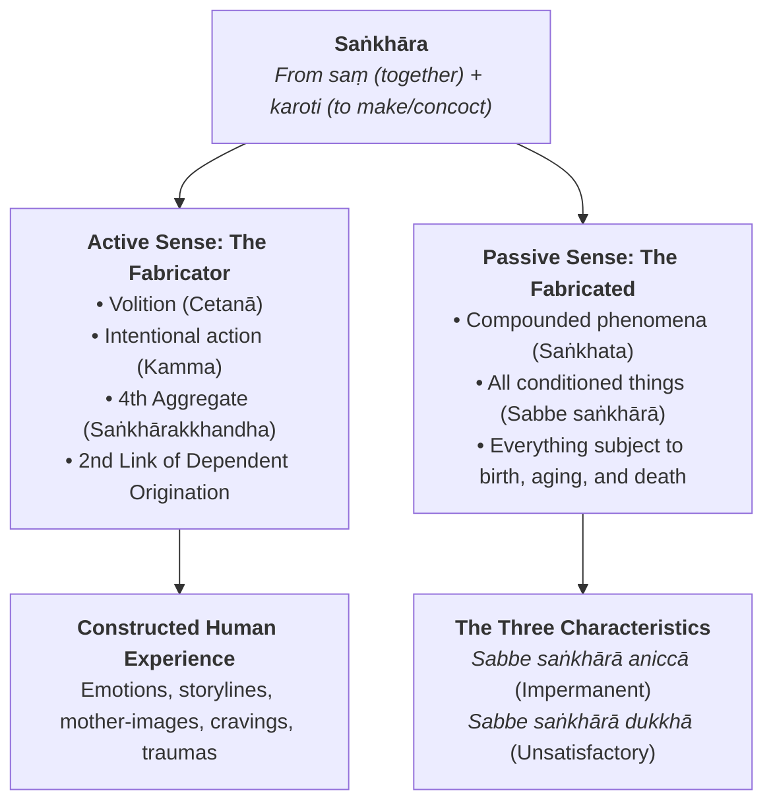

### 1.2 The Three Canonical Tiers of Saṅkhāra

To understand *saṅkhāra* in practice, the practitioner must navigate three distinct contextual levels across the Suttas:

| Level | Context | Canonical Formula | Practical Meaning |
| :--- | :--- | :--- | :--- |
| **1. Universal Conditioned Reality** | Metaphysics & Existential Reality | *Sabbe saṅkhārā aniccā, sabbe saṅkhārā dukkhā* (Dhp 277-278) | Every physical, biological, emotional, and astronomical phenomenon that is assembled from causes is impermanent and incapable of providing lasting satisfaction. The only thing *not* a saṅkhāra is the Unconditioned (*Asaṅkhata Dhātu* / *Nibbāna*). |
| **2. Dependent Origination (*Paṭiccasamuppāda*)** | The Causal Chain of Suffering | *Avijjā-paccayā saṅkhārā; saṅkhāra-paccayā viññāṇaṃ* (SN 12.2) | Ignorance conditions volitional formations, which in turn drive consciousness toward rebirth and moment-to-moment psychological becoming (*bhava*). |
| **3. The Fourth Aggregate (*Khandha*)** | Moment-to-Moment Cognition | *Saṅkhārakkhandha* (SN 22.79 *Khajjaniya Sutta*) | The inner workshop that crafts volitions, memories, plans, reactions, and concepts. It is the aggregate that *fabricates all five aggregates into experience*. |

### 1.3 The Master Chef of the Aggregates (SN 22.79)
In the *Khajjaniya Sutta* ("Chewed Up"), the Buddha gives an astonishing definition of the fourth aggregate that anticipates modern cognitive construction:

> *"And why, monks, do you say 'fabrications' (saṅkhāras)? Because they fabricate fabricated things, that is why they are called fabrications. And what are the fabricated things that they fabricate? They fabricate form into 'form'... feeling into 'feeling'... perception into 'perception'... fabrications into 'fabrications'... consciousness into 'consciousness'. Because they fabricate fabricated things, monks, they are called fabrications."*  
> — **SN 22.79**

The other four aggregates provide the raw material:
* **Form (*Rūpa*):** Raw light, sound vibrations, physical pressure.
* **Feeling (*Vedanā*):** Bare hedonic tone—pleasant, unpleasant, neutral.
* **Perception (*Saññā*):** The recognition label—"tree," "voice," "threat," "mother."
* **Consciousness (*Viññāṇa*):** Bare sensory awareness at the six sense doors.

**Saṅkhāra is the Master Chef.** It takes the raw temperature, the bare sound, and the momentary perception, adds past trauma, pride, fear, and desire, and serves up a three-course psychological banquet: *"My mother never respected my career, and her silence at dinner proves she favors my brother."*

---

## 2. The Triad of Fabrication: Kāya, Vacī, and Citta

In the *Cūḷavedalla Sutta* (MN 44), the enlightened nun Dhammadinnā provides the practical operational map for observing and deconstructing fabrications in meditation:

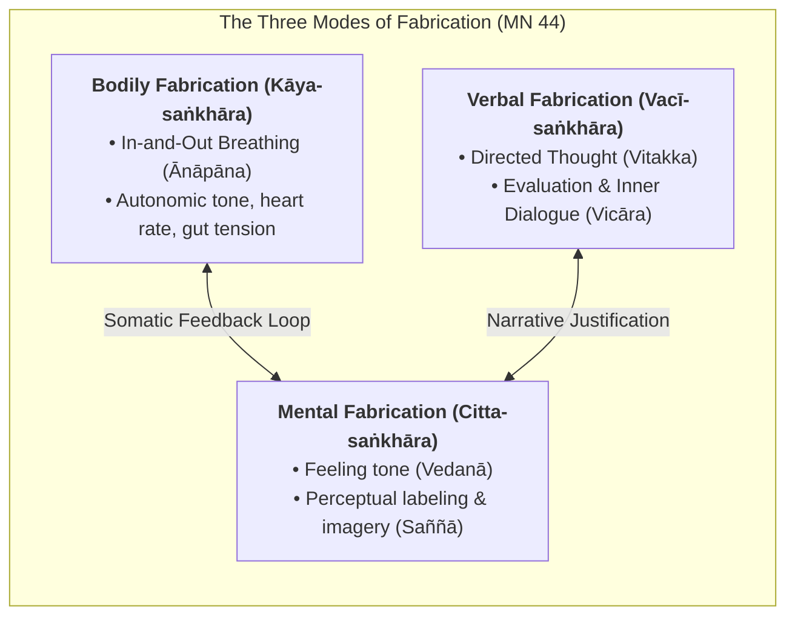

### 2.1 Bodily Fabrication (*Kāya-saṅkhāra*)
* **Definition:** The breath (*ānāpāna-sati*). Why is the breath called bodily fabrication? Because the breath shapes, enlivens, and modulates the physical body.
* **Contemplative Insight:** When the mind fabricates anger, anxiety, or craving, the breath immediately shifts—becoming short, shallow, hot, or tight. 
* **The Intercession Point:** You cannot always control a racing thought directly, but by calming the bodily fabrication (*passambhayaṃ kāyasaṅkhāraṃ*), you deprive the mental fire of somatic oxygen.

### 2.2 Verbal Fabrication (*Vacī-saṅkhāra*)
* **Definition:** Directed thought (*vitakka*) and evaluation (*vicāra*). Before you speak a word aloud, you speak to yourself internally.
* **Contemplative Insight:** Verbal fabrication is the continuous inner narrator—the running commentary that judges, analyzes, defends, and rehearses conversations that may never happen.
* **The Intercession Point:** Recognizing that internal self-talk is not "The Truth"—it is merely *vacī-saṅkhāra*, a sub-vocal acoustic fabrication produced by linguistic habit.

### 2.3 Mental Fabrication (*Citta-saṅkhāra*)
* **Definition:** Feeling (*vedanā*) and Perception (*saññā*).
* **Contemplative Insight:** Why are feeling and perception called mental fabrications? Because they color, flavor, and condition the mind (*citta*). A pleasant feeling tone lures the mind into greed; an unpleasant tone triggers aversion; a perception of "enemy" triggers defensiveness.
* **The Intercession Point:** Seeing how an image or feeling tone hijacks the mind allows the meditator to uncouple the perception from the ensuing emotional storm.

---

## 3. Cognitive Engine & Predictive Processing: The Pre-Emptive Conductor

As documented in your foundational research (*Navigating the Storm*), a central psychological discovery is that:
> **"Mental fabrication becomes full before sensory experience is complete."**

### 3.1 The Mind as a Predictive Engine (The Neuroscience Bridge)
Modern cognitive science (Karl Friston's *Active Inference*, Andy Clark's *Predictive Brain*, and Lisa Feldman Barrett's *Theory of Constructed Emotion*) confirms precisely what the Buddha outlined 2,500 years ago:
1. **The Brain Does Not Wait for the World:** The nervous system is not a passive receiver of sensory input. If the brain waited for bottom-up sensory signals to reach the cortex and finish processing, ancestral humans would have been eaten by predators.
2. **Top-Down Projection:** The brain is a **prediction engine**. It constantly projects top-down generative models (*saṅkhāras* and *saññās*) onto the incoming stream of sensory data.
3. **Sensory Data as Error Signals:** Incoming sensory data (*phassa*) is only used to correct prediction errors. When conditioning is deep and trauma is active, the top-down prediction completely overpowers the bottom-up sensory facts.

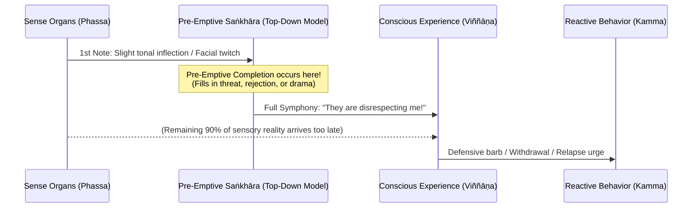

### 3.2 The Manic Conductor
In your talks and writings, you describe the mind as a **manic conductor** standing before an orchestra. The conductor hears the very first scrape of a violin bow (a curt text message, a partner’s sigh, an ambiguous email from a boss) and, before the musicians have even played three measures, frantically conducts an entire **five-movement tragedy of abandonment, disrespect, or impending ruin**.

By the time the actual person finishes their sentence, the mind has already convicted them, executed them, mourned the relationship, and retreated into fortress walls. **The fabrication finished before the senses completed their work.**

---

## 4. Ajahn Sumedho’s Radical Teaching: "Where is Your Mother Right Now?"

In your notes on teacher lineages, one of the most transformative, destabilizing, and liberating discourses on *saṅkhāra* comes from **Ajahn Sumedho’s 1978 talk at Osel Ling / Chithurst**, titled *"Asking Yourself Questions."*

### 4.1 The Dialogue: Deconstructing the Mother
Ajahn Sumedho directly confronts the student's unquestioned conceptual reality:

> *"Seeing your own conceptions about meditation, about Buddhism, about practice, about methods, about yourself, about the people you live with...  
> **Where is your mother right now?**  
> In that very doubt, that very image, that very memory, perception that comes as a saṅkhāra.  
> **It's not your mother.**  
> Then you go home and you look directly at your mother with your physical eye. You say, 'That's my mother. You are my mother.'  
> **But that's also saṅkhāra.**  
> It's consciousness of a physical object. It's impermanent. And your concept of mother.  
> And then you start thinking: 'Mother means this, mother did this, mother was this way, that way.' On and on like this. Memories of history, of past experience. Pleasant, unpleasant.  
> And so we create mothers in our minds out of all these perceptions, imaginations.  
> **In actuality, all it is, are the five khandhas and their natural state of changing.**"  
> — **Ajahn Sumedho (1978)**

### 4.2 The Student’s Existential Panic: "A Soap Bubble?"
When the student hears this, ego-panic (*saṃvega* mixed with resistance) erupts:

> *"The question arises: 'You mean my mother is only a soap bubble? You're trying to say that my mother doesn't really exist?'  
> And that's a thinking conceptualization. But surely, how can you just dismiss the whole universe as a soap bubble?  
> And that's doubting, not being sure, feeling angry, worried, or fearful, feeling aversion...  
> We cherish certain concepts about the universe, about mothers and fathers, about ourselves, about husbands and wives, the nature of existence.  
> And when those concepts are threatened, somebody says it's only a delusion, we feel upset.  
> **But that feeling upset is a saṅkhāra!**  
> Fear, doubt—just keep that constant reflection, looking at it closely rather than trying to figure out, rationalize, justify, explain."  
> — **Ajahn Sumedho (1978)**

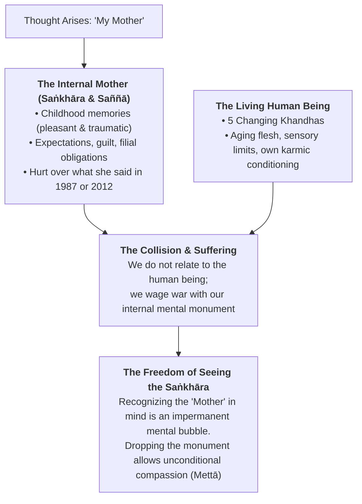

### 4.3 Why the "Mother" is the Ultimate Test of Saṅkhāra
Why did Ajahn Sumedho choose the archetype of the **Mother** rather than a tree, a cup, or a car?
1. **The Deepest Emotional Imprint:** The mother is the original ground of biological survival, warmth, trauma, and identity. If the Dhamma can deconstruct the "Mother" into an impermanent, ownerless *saṅkhāra*, it can deconstruct anything.
2. **The Living Person vs. The Internal Monument:** Most adult human beings never actually meet their living mothers. They meet their *childhood memory* of their mother, their *resentment* of their mother, or their *unmet longing* for their mother. When the living 75-year-old mother speaks, the adult child does not hear the fragile, imperfect elderly woman; they hear the omnipotent maternal authority from their childhood bedroom.
3. **The Shifting Personality in the Mother's Presence:** As Ajahn Sumedho further illuminates in *Direct Realization (Collected Works Vol. 3)*:
   > *"In order to become your personality, you have to start thinking and remembering things: 'I am Ajahn Sumedho, and I don't like to be called Bob!' Then I become that person, and that person arises and ceases. You begin to really see how personality-view (sakkāya-diṭṭhi) is always dependent on other conditions. You are not really a permanent person; your personality changes. You are a different person at different times. When you are with your mother, when you are with your best friend, when you are with the boss at work, your personality changes to fit the different perceptions that exist between mother, boss, and best friend. There is no kind of permanent personality there."*
4. **The Compassion of De-Fabrication:** Seeing that "Mother" is a *saṅkhāra* is **not callous nihilism**. It does not mean treating your mother coldly. Paradoxically, **it is the only way to truly love her.** When you dismantle the rigid mental monument of what a mother "should" be, you finally see the frail, conditioned human being standing before you, carrying her own generational karma and fears. Compassion (*karuṇā*) replaces grievance.

---

## 5. Saṅkhāra in the Architecture of Recovery & Habit Patterns (Past MMR Archives to Active Groups)

In your foundational teachings for **Marin Mindful Recovery (MMR)** (now archived and serving as deep curriculum for your active **Living Mindfulness Meditation Group** and **Living Mindfully ESCOM Club**), you brought this profound Thai Forest teaching into the trenches of addiction, trauma, and behavioral relapse.

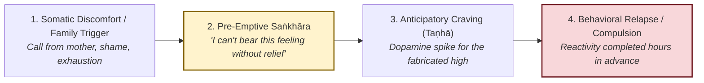

### 5.1 The Relapse Before the Relapse: Mental Fabrication as the First Slip
In traditional 12-Step and recovery parlance, it is well known that *"relapse occurs long before the substance touches the lips."* In Buddhist psychology, **relapse begins as a subtle saṅkhāra**:
1. **The Fabricated Rescue Narrative:** When unpleasant feeling tone (*vedanā*) arises—loneliness, resentment, physical restlessness—the mind fabricates a narrative of chemical or behavioral escape: *"Just one drink / one pill / one binge will take the edge off and reset me."*
2. **The Anticipatory Dopamine Spike:** Modern addiction neuroscience demonstrates that dopamine does not peak during consumption; it peaks during **anticipation** (*saṅkhāra*). The mind fabricates the fantasy of relief, flooding the brain with longing before the physical act occurs.
3. **Fabricating Justification:** The inner committee convenes: *"I've worked hard all week,"* *"My family was impossible today,"* *"Nobody understands the pressure I'm under."* These are purely verbal fabrications (*vacī-saṅkhāra*) manufactured to rationalize crossing a boundary.

### 5.2 Family of Origin & The Mother Saṅkhāra in Recovery
In recovery and mindfulness groups, family dynamics—and particularly relationships with mothers and fathers—remain the single highest trigger for emotional dysregulation and compulsive habits:
* **The "Tape Loop" of Resentment:** An individual sits in a room, entirely safe, but their mind is playing a 30-year-old audio-visual tape loop of maternal criticism or parental neglect.
* **The Chemical Solution to a Mental Ghost:** People relapse trying to medicate an unpleasant emotional state created entirely by an **internal ghost**—a *saṅkhāra* that exists nowhere in physical space.
* **The Liberating Awakening:** When a practitioner realizes that the mother they are angry at right now is *a mental formation arising in the present moment*, a tectonic shift occurs. You cannot fix the past, nor can you compel an aging parent to give you the validation you crave. But you *can* observe the "Mother Saṅkhāra" arise, recognize it as impermanent, and refuse to pick up a substance or lash out to extinguish a soap bubble.

---

## 6. The Spectrum: From Toxic Fabrication to the "Raft" of Noble Fabrication

A dangerous trap in spiritual practice is **Premature De-Fabrication**—believing that because all fabrications are impermanent, one should immediately stop all planning, thinking, striving, and intentional effort.

### 6.1 Unwholesome vs. Wholesome Fabrications

The Buddha did not teach the immediate cessation of all fabrications. He taught the deliberate cultivation of **Wholesome Fabrications (*Kusala Saṅkhāra*)** to dismantle Unwholesome ones (*Akusala Saṅkhāra*):

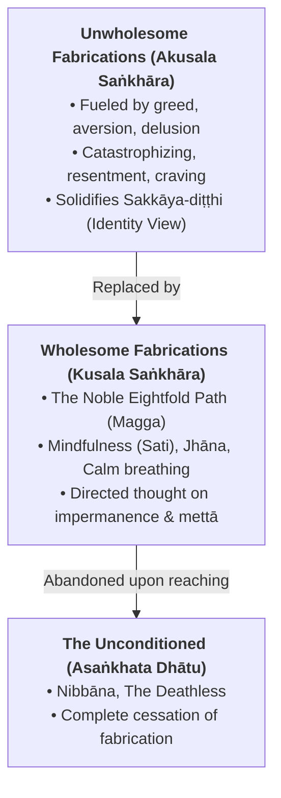

### 6.2 The Raft Simile (MN 22) and "Skill in Fabrication"
In the *Alagaddūpama Sutta* (MN 22), the Buddha compares the Dhamma to a **raft fabricated from grass, twigs, branches, and leaves**:
* A traveler comes to a great expanse of water with perils on this side and safety on the other.
* They gather materials and construct a raft (*saṅkhāra*). Using the raft, paddling with hands and feet, they cross safely to the far shore.
* Once on the far shore, would it be wise to hoist the raft onto their head and carry it everywhere because it was so useful? No. They leave the raft behind and walk on.
* **The Practical Lesson:** You do not discard the raft in mid-river! Mindfulness, ethical restraint (*sīla*), breath regulation (*ānāpāna*), and loving-kindness (*mettā*) are all **deliberately fabricated states**. They are constructed rafts used to cross the river of delusion. Only when the far shore is attained is the fabrication abandoned.

---

## 7. The Twin Pillars: The Interlocking Dance of Sakkāya-Diṭṭhi and Saṅkhāra

Your research documents the intimate symbiosis between **Personality View** and **Mental Fabrication**:

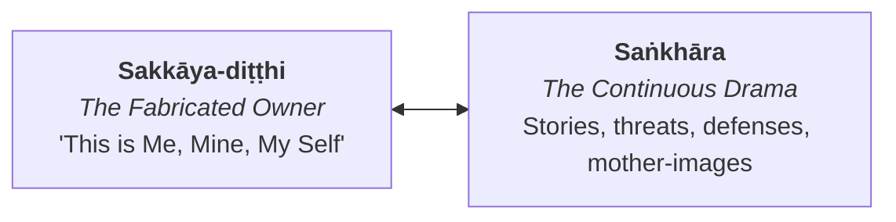

1. **Sakkāya-diṭṭhi Needs Saṅkhāra to Exist:**  
   The "Self" is not a solid substance; it is an active verb. It must be continuously re-fabricated every millisecond through memory, self-talk, and pride. If the mind stops fabricating stories for ten seconds, the illusion of an autonomous self temporarily dissolves into bare presence.
2. **Saṅkhāra Needs Sakkāya-diṭṭhi for Gravity:**  
   Without an assumed "owner," mental fabrications are harmless passing clouds—thoughts arise, play for a second, and vanish without leaving a scratch. But the moment *sakkāya-diṭṭhi* attaches to the thought (*"This thought is ABOUT ME; this is MY mother; this is MY career"*), the cloud turns into a hurricane.

---

## 8. Tactical Contemplative Toolset: Protocols for De-Fabricating Experience

To translate these deep insights into daily life, recovery, and meditation, use the following five actionable protocols:

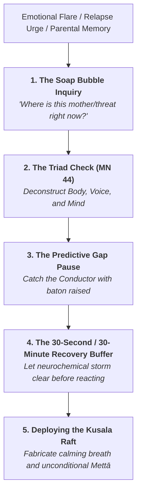

### Protocol 1: Ajahn Sumedho’s "Soap Bubble" Inquiry
* **When to Use:** When overwhelmed by grief, family resentment, or childhood baggage.
* **The Inquiry:**
  1. Close your eyes and ask: *"Where is the person I am angry at / worried about right now?"*
  2. Notice the mental picture, the sound of their voice, the contraction in the chest.
  3. Recognize: *"This image is not the person. It is a saṅkhāra. A memory bubble floating in the spacious room of awareness."*
  4. Watch the bubble pop on its own without trying to force it away.

### Protocol 2: The Triad Check (MN 44 Deconstruction)
When emotional activation spikes, systematically scan the three levels of fabrication:
1. **Check Kāya-saṅkhāra (Breath/Body):** Where has the breath clamped down? Unclench the diaphragm, soften the belly, lengthen the exhale.
2. **Check Vacī-saṅkhāra (Internal Voice):** What sentence is the inner narrator repeating? (*"They shouldn't have done that,"* *"I can't stand this"*). Note it simply as *"talking, talking, sound in the head."*
3. **Check Citta-saṅkhāra (Feeling & Label):** What hedonic tone is present? Unpleasant (*dukkha-vedanā*). What label is applied? *"Disrespect."* Separate the raw sensation from the label.

### Protocol 3: Catching the Conductor (The Predictive Gap)

#### The Mechanism: Why the Protocol is Necessary
The human nervous system operates by **predictive processing** (top-down predictive coding). When sensory contact (*phassa*) occurs—such as a terse three-word email, an ambiguous glance from a spouse, or a subtle change in someone's vocal inflection—the sense organs have only delivered **5% to 10%** of the raw sensory reality.

However, the mind's **"Conductor"** (the internal survival engine fueled by past conditioning, *saṅkhāra*, and identity protection) does not wait for the remaining 90% of sensory reality to finish arriving. The Conductor raises its baton at the first note and frantically conducts an entire **five-movement tragedy, betrayal, or catastrophe**. 

By the time the other person finishes speaking, or by the time you open the email, you are no longer responding to what actually occurred; you are reacting to the internal symphony the Conductor composed in advance.

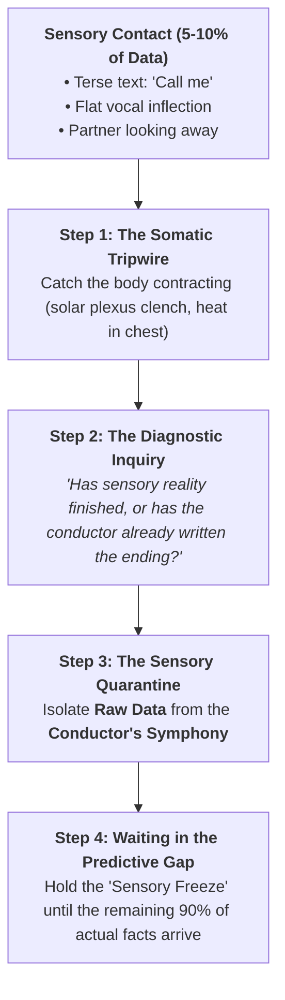

#### The 4-Phase Operational Execution

1. **Phase 1: Detect the Somatic Tripwire (Catching the Baton Raised):**
   * *Principle:* Cognitive predictions happen in milliseconds, often beneath conscious awareness. You cannot always catch the lightning-fast thought first, but you **can always catch the body's alarm**.
   * *Action:* Notice the immediate physical contraction: gut tightening, solar plexus dropping, throat closing, breathing becoming shallow, or fingers hovering tensely over the keyboard. Recognize: *"The Conductor has just stepped onto the podium."*

2. **Phase 2: Fire the Diagnostic Inquiry:**
   * *Action:* Instantly interrupt the automatic cascade by internally voicing the core question:
     > **"Has sensory reality actually concluded, or has my Conductor already written the ending?"**
   * This question forces a cognitive shift from *participating* in the drama to *observing* the mental machinery (*sati*).

3. **Phase 3: The Sensory Quarantine (Raw Data vs. The Symphony):**
   * *Action:* Draw a razor-sharp mental line between the objective sensory fact and the cognitive hallucination:

| Sensory Trigger | Raw Data (The 10% Reality) | The Conductor's Symphony (The 90% Saṅkhāra) |
| :--- | :--- | :--- |
| **Work Calendar** | Invitation: *"Quick check-in at 3:00 PM"* | *"They found a major error in my work; I'm getting laid off; my security is gone."* |
| **Spouse / Family** | Flat, unsmiling tone: *"Did you pick up the dry cleaning?"* | *"She is disgusted with me; I am an inadequate partner; this marriage is failing."* |
| **Mother (Sumedho Simile)** | Sigh over the phone after telling her your plans | *"She disapproves of my life choices; I am forever an ungrateful child."* |
| **Recovery / Craving** | Wave of restlessness and fatigue on a Friday evening | *"I cannot survive this weekend without a drink/substance; this discomfort will never end."* |

4. **Phase 4: Inhabit the Predictive Gap (Sensory Freeze):**
   * *Action:* Consciously refuse to speak, type, retaliate, or seek chemical relief while the symphony is playing. 
   * Take three slow, grounded breaths, feel the physical contact of your feet on the floor, and allow the remaining 90% of actual reality to unfold in real time. 
   * When you wait in the gap, you discover that the vast majority of anticipated catastrophes were entirely fictitious soap bubbles.

### Protocol 4: The 30-Second / 30-Minute Recovery Buffer
* In active recovery, an urge to react, send a venomous text, or pick up a substance is fueled by an adrenaline-dopamine cascade that lasts roughly 20–30 minutes if not re-stimulated.
* **Rule:** When the "Rescue Saṅkhāra" arises, commit to a mandatory 30-minute somatic quarantine. Go for a walk, wash the dishes mindfully, breathe. Never make a life decision or break a recovery commitment while under the influence of an acute mental fabrication.

### Protocol 5: The "Who is the Chef?" Inventory
* Ask: *"Which sub-personality in the internal boardroom cooked this dish?"*
  * Was it the **Wounded Child** demanding maternal approval?
  * Was it the **Righteous Judge** demanding moral perfection from others?
  * Was it the **Addict** looking for an excuse to relapse?
* Name the chef. Once identified, the chef loses the power to impersonate the CEO of your consciousness.

---

## 9. Curriculum & Discussion Prompts for Group Practice (Sunday Living Mindfulness Group & Thursday ESCOM Club)

For use in your active weekly gatherings—the **Living Mindfulness Meditation Group** (Sunday evenings) and the **Living Mindfully ESCOM Club** (Thursdays at 2:00 PM), informed by past recovery archives and contemplative inquiries:

### Reflection Prompts on Ajahn Sumedho’s Mother Teaching:
1. *When you think of your mother (or a primary caregiver), how much of what you feel is responding to the living person today, and how much is a conversation with a mental monument from the past?*
2. *What happens to your heart and nervous system when you realize: "The mother I am arguing with in my head is a saṅkhāra arising right now"? Does that bring grief, fear, or relief?*
3. *How has clinging to the concept of how a parent "should" have been prevented you from offering compassion to the imperfect human being who actually existed?*

### Reflection Prompts on Saṅkhāra and Recovery:
1. *Can you identify a recent time when your mind fabricated an entire catastrophe before sensory reality had even concluded? What was the first note that set off the symphony?*
2. *In moments of temptation or craving, what is the specific "story of relief" (vacī-saṅkhāra) that your mind fabricates to justify giving in?*
3. *How can we use the "raft" of wholesome fabrications (conscious breath, community check-ins, prayer, service) without turning them into rigid dogma or another perfectionistic identity trap?*

---

## 10. The Macrocosmic Dimension: Are Saṅkhāras Purely Internal or Field-Conditioned?

A pivotal contemplative and philosophical inquiry arises when practicing with *saṅkhāras*: **Are mental fabrications strictly local, intra-psychic events generated inside an isolated human skull, or are they nodal expressions conditioned by external, non-local fields?**

Western reductive materialism frames the mind as an enclosed computer running private software within the cranial vault. However, both advanced Buddhist metaphysics (Huayan, Yogācāra) and contemporary frontier physics and biology (Quantum Field Theory, Rupert Sheldrake’s Formative Causation, and Ervin Laszlo’s Akashic Field) suggest that **saṅkhāra is a non-local, participatory phenomenon.**

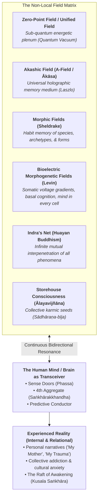

---

### 10.1 Rupert Sheldrake’s Theory of Formative Causation & Morphic Resonance

Biologist Rupert Sheldrake posited that natural systems (molecules, crystals, cells, instincts, behaviors, and cultural patterns) are shaped not merely by physical constants and genetic code, but by **Morphic Fields** governed by **Morphic Resonance**:
* **Nature Has Habits, Not Immutable Laws:** Repeated actions, thoughts, and forms build up an accumulated memory in the morphic field of a species. Once a pattern is learned by enough individuals, it becomes easier for subsequent individuals to learn it across space and time without physical contact.
* **Saṅkhāra as a Morphic Groove:** In Pāli, *saṅkhāra* literally means a habitual concoction. Every time human beings reenact an unexamined emotional pattern—such as the panic of abandonment, filial guilt, maternal idealization, or addictive craving—they deepen a **morphic groove** in the collective field.
* **Why the "Mother" is Hardwired Beyond Personal Biography:**
  When you experience an emotional charge around your mother, you are not merely processing your personal 40 or 60 years of biological memory. You are tuning into the vast, ancient **morphic field of mammalian motherhood**—millions of years of dependency, survival fear, attachment, and boundary battles. The intensity of the "Mother Saṅkhāra" described by Ajahn Sumedho is so overpowering because it is an ancient collective morphic basin into which your individual mindstream effortlessly falls.

---

### 10.2 Dr. Michael Levin: Bioelectric Fields, Basal Cognition, and Mind in Every Molecule

While Rupert Sheldrake theorized that non-material "morphic fields" guide bodily form and behavioral memory, developmental biologist **Dr. Michael Levin** (Tufts University, Allen Discovery Center) has experimentally demonstrated the concrete biophysical and computational reality of this phenomenon through **Bioelectricity** and the **Technological Approach to Mind Everywhere (TAME)** framework:

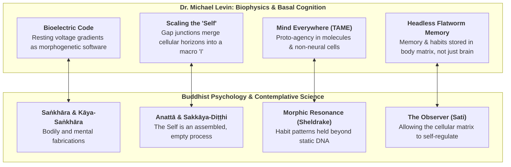

#### 1. Beyond Brain-Centric Chauvinism: Cognition All the Way Down
* **Mind Without a Brain:** Western neuroscience long maintained that intelligence, memory, and agency require a centralized brain and neocortex. Levin’s research shatters this brain-centric dogma by proving that **basal cognition** operates across all biological scales.
* **Proto-Agency in Every Cell and Molecule:** Single cells (like amoebae, paramecia, and macrophages), gene-regulatory networks, and even macromolecular complexes exhibit memory, goal-directed behavior, preference, and the ability to solve novel problems in physiological, metabolic, and anatomical spaces. Consciousness and mind are not magical epiphenomena appearing solely in primates; agency is an ancient, continuum property of living matter.

#### 2. The Bioelectric Code as the Living Morphogenetic Field
* **DNA is Hardware, Not the Blueprint:** DNA codes for proteins and cellular building blocks, but it does *not* contain the architectural blueprint specifying anatomical shape, organ placement, or symmetry.
* **The Voltage Gradient Software:** Levin discovered that cells communicate via **slow-moving bioelectric resting potentials across gap junctions**, forming non-neural computational circuits. This bioelectric field holds the **collective shape memory** of the organism.
* **Rewriting the Bioelectric Saṅkhāra:** By altering the bioelectric voltage gradients in planarian flatworms or frog embryos, Levin's lab can instruct normal, genetically unedited cells to grow an extra head, two tails, or functional eyes on the belly! The physical matter and DNA remain identical, but the **bioelectric fabrication (*saṅkhāra*)** guiding cellular coordination has been rewritten.

#### 3. Scaling the "Self" (The Biophysical Construction of Anattā)
* **How 37 Trillion Cells Become an "I":** Levin demonstrates how individual cellular agents merge their micro-selves into a macroscopic collective "Self" through electrical coupling:
  * When gap junctions open between cells, electrical signals and calcium ions flow freely. The cells can no longer tell whose boundary is whose; their informational horizons merge, giving birth to a singular higher-order cognitive agent with macro-goals (e.g., *"regenerate this arm"*).
  * **The Cancer Dynamic:** When an individual cell decouples bioelectrically from the collective network, it forgets the macroscopic "Self." It shrinks its cognitive horizon down to its individual perimeter, treating the rest of the body as external environment. It multiplies selfishly and migrates—which we classify as **cancer**. Cancer is essentially an identity disorder at the cellular level.
* **The Buddhist Synthesis:** Levin’s work provides breathtaking empirical evidence for **_Sakkāya-diṭṭhi_ (Personality View)** and **_Saṅkhāra_ (Mental Fabrication)** in somatic biology. The "Self" is not an indivisible soul or a fixed essence; it is a dynamic, multi-scale bioelectric consensus continually constructed and maintained. It is empty of permanent substance (*anattā*), assembled through conditions (*saṅkhata*).

#### 4. Somatic Memory and Kāya-Saṅkhāra
* Levin’s experiments showed that when planarian flatworms learn a maze task and are subsequently **decapitated**, the tail regenerates an entirely new brain and yet **retains the learned memory** from the original organism.
* This proves that memory, habit conditioning, and emotional trauma (*saṅkhāras*) are encoded within the **bioelectric and somatic matrix of the whole body**, not exclusively in cerebral synapses.
* This explains why Buddhist body-awareness meditation (*kāyagatāsati*) and the calming of bodily fabrications (*kāya-saṅkhāra*) can access and dissolve deep somatic conditioning that purely intellectual or talk therapy cannot reach.

---

### 10.3 The Quantum Ground: The Zero-Point Field (ZPF) and the Unified Field

In quantum electrodynamics (QED) and Quantum Field Theory, empty space (*the vacuum*) is fundamentally non-empty:
* **The Zero-Point Field (ZPF):** Even at absolute zero, space seethes with ground-state energy, virtual particle-antiparticle pairs fluctuating in and out of manifestation. Matter does not exist in empty space; matter is a localized excitation of the underlying field.
* **David Bohm’s Implicate and Explicate Order:**
  Theoretical physicist David Bohm proposed that our experienced physical and mental universe is the **Explicate (Unfolded) Order**, which continuously emerges from and collapses back into an undivided, multidimensional **Implicate (Enfolded) Order**—the *Holomovement*.
* **Saṅkhāra as Explicate Ripples:** A mental fabrication (*saṅkhāra*) is an explicate ripple emerging from the implicate quantum plenum. It is not created out of nothing inside the brain; it is an enfolding and unfolding of the unified field of reality.

---

### 10.4 Ervin Laszlo’s Akashic Field (The A-Field)

Systems philosopher Ervin Laszlo synthesized the Quantum Vacuum with the ancient Vedic and Buddhist concept of **Ākāsa** (the primordial space-element):
* **The In-Forming Plenum:** Laszlo proposes that the sub-quantum zero-point vacuum acts as a holographic information medium—the **Akashic Field (A-Field)**—which records, conserves, and non-locally transmits the traces of all physical and conscious events throughout cosmic history.
* **The Interconnected Memory Bank:** In Buddhist philosophy, *ākāsa* is the space in which all four primary elements (*mahābhūta*) move. Laszlo’s model shows that our individual psychological fabrications are constantly "reading from" and "writing to" this subtle cosmic field. When you experience an inexplicable intuitive resonance, a collective panic, or a shared epiphany, you are tapping the A-Field.

---

### 10.5 Indra’s Net (*Indrajāla*): The Huayan Vision of Mutual Interpenetration

In the Mahāyāna *Avataṃsaka Sūtra* (Flower Garland Sutra), developed to supreme philosophical heights by the Chinese Huayan masters (Fazang, Dushun), reality is described as **Indra’s Net**:
* **The Metaphor:** In the celestial palace of the god Indra hangs an infinite net stretching in all dimensions. At every vertex of the net hangs a glittering jewel.
* **Mutual Reflection (*Shishi Wu'ai*):** Looking closely at any single jewel, you see reflected on its polished surface the reflections of all other infinite jewels in the net. Furthermore, the reflections in that reflection contain the reflections of every other jewel, *ad infinitum*.
* **The Radical Implication for Saṅkhāra:**  
  There is no such thing as an "isolated private thought." Every *saṅkhāra* that arises in your mind is an intersectional node reflecting the entire web of existence. Your relationship with your mother reflects your ancestors, the economic pressures of your childhood, the cultural norms of your era, and the biological evolution of the species. When one jewel in Indra's Net trembles with anger, fear, or compassion, the entire net shifts.

---

### 10.6 Yogācāra Buddhism: Storehouse Consciousness (*Ālayavijñāna*) & Collective Karma (*Sādhāraṇa-Kamma*)

Centuries before modern depth psychology or field theories, the Yogācāra masters (Asaṅga and Vasubandhu) formulated the architecture of the **Storehouse Consciousness (*Ālayavijñāna*)**:
1. **Individual Seeds (*Asādhāraṇa-bīja*):** Private karmic traces resulting from personal choices and actions.
2. **Collective / Shared Seeds (*Sādhāraṇa-bīja*):** Karmic impressions held in common by all beings in a shared realm.
* **The Co-Fabrication of the World (*Bhājana-loka*):** Yogācāra explains that the physical environment and shared cultural neuroses are not objective, self-existing realities standing outside mind; they are the externalized ripening of *collective saṅkhāras*. The shared world is literally co-fabricated by the collective karma of the beings inhabiting it.

---

### 10.7 The Transceiver Model of Consciousness: Tuning In vs. Generating

If *saṅkhāras* participate in non-local fields, the traditional materialist model of the brain must be revised:

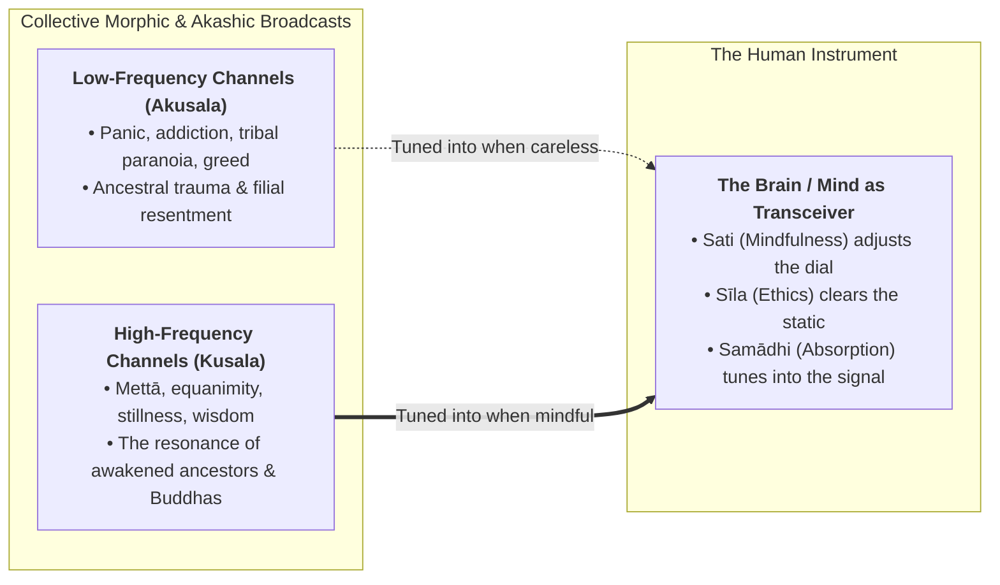

* **The Television Analogy:** If your television displays a violent, chaotic scene, the violence is not generated inside the wiring of the television set. The television is merely a **transceiver** transducing an electromagnetic signal passing through the room. Smashing the TV does not destroy the broadcast.
* **The Ego as an Unconscious Tuner:** When you feel an acute surge of despair, addictive craving, or maternal indignation, you are not creating that energy out of whole cloth. **Your receiver has tuned into the dense, turbulent morphic frequency of collective human suffering.**
* **The Sound of Silence (*Nāda*):** In Ajahn Sumedho’s practice of listening to the internal "sound of silence" (the high-pitched cosmic background resonance), the meditator intentionally detunes from the noisy chatter of personal and collective *saṅkhāras* and tunes directly into the unconditioned, silent substrate of pure consciousness.

---

### 10.8 Revolutionary Implications for Recovery and Daily Life

Understanding that *saṅkhāras* are field-conditioned provides two immense, practical breakthroughs for the practitioner:

#### 1. The Radical Depersonalization of Addiction and Trauma (*Anattā*)
* In traditional recovery, guilt and shame are rampant: *"Why do I have these terrible cravings? What is wrong with me? Why can't I get over my mother?"*
* **The Field Perspective:** You realize that the craving or resentment is **not a personal flaw.** It is a passing weather system in the collective morphic field of humanity. When a practitioner in your Sunday evening or Thursday group (or historically in recovery groups) feels a sudden urge to react or relapse, they can observe:
  > *"This urge is not 'me' or 'mine.' This is the ancient, restless hunger of the human nervous system sweeping through the room. I do not have to buy the broadcast."*
* This completely dissolves shame, making *anattā* (not-self) an immediate, practical shield against relapse.

#### 2. The Feedback Loop: Personal Healing as Collective Field Remediation
* Through the lens of Indra’s Net and Morphic Resonance, **your personal practice is never merely private.**
* Every time you pause, catch the "Conductor" with baton raised, refuse to indulge a toxic mother-story, or sit through an addictive craving with bare mindful presence:
  * You are not just freeing your own local nervous system.
  * **You are actively degrading the morphic groove of suffering in the collective field.**
  * You are carving a new groove of sobriety, clarity, and compassion into Indra’s Net, making it marginally easier for the next person in your family line, your recovery community, or the wider world to choose freedom over unconscious reactivity.

---

## Concluding Synthesis: The Spacious Shore of Freedom

To walk the spiritual path is not to destroy thought, emotion, or family history. It is to see them for what they are: **temporary concoctions of conditions, empty of an enduring self, like clouds passing across an infinite sky.**

When you see that your mother, your trauma, your identity, your successes, and your cravings are *saṅkhāras*—soap bubbles blown by the winds of habit and non-local field conditioning—the desperate need to defend, attack, or numb yourself collapses.

You step off the frantic treadmill of mental manufacturing and rest in the unshakeable stillness of the Unconditioned: **the silent, aware, loving space that was here before the first fabrication arose, and will remain long after the last one dissolves.**
