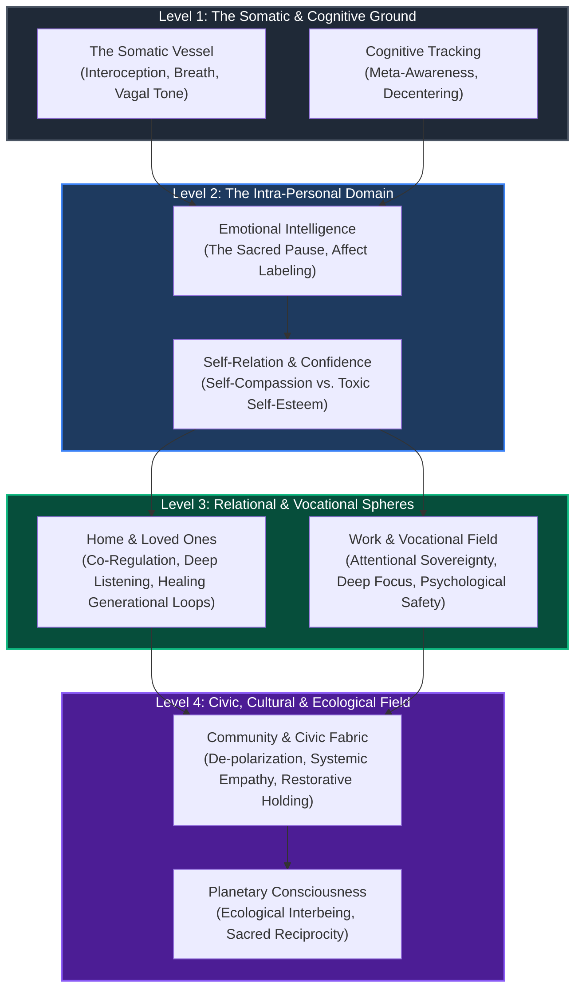
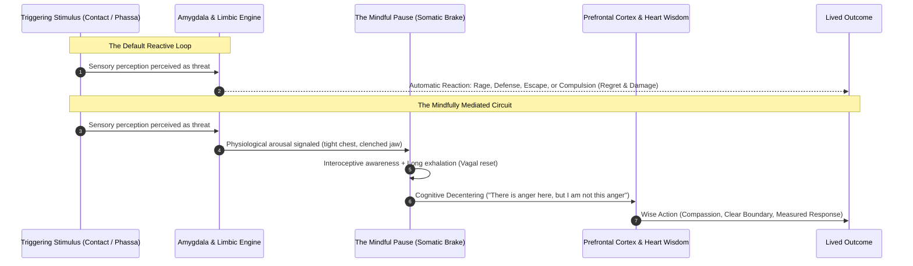
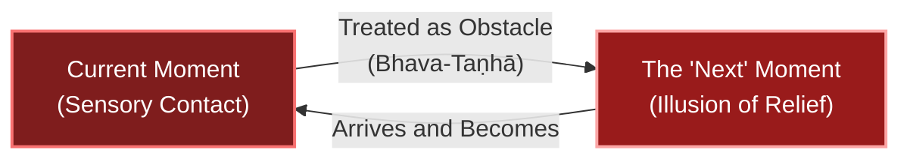
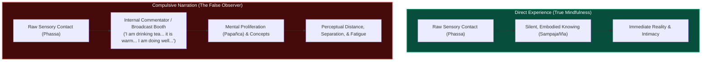
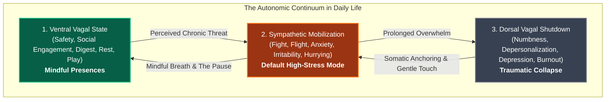
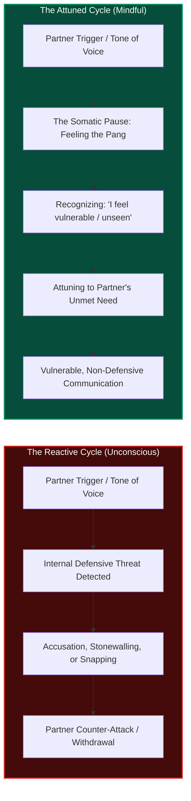
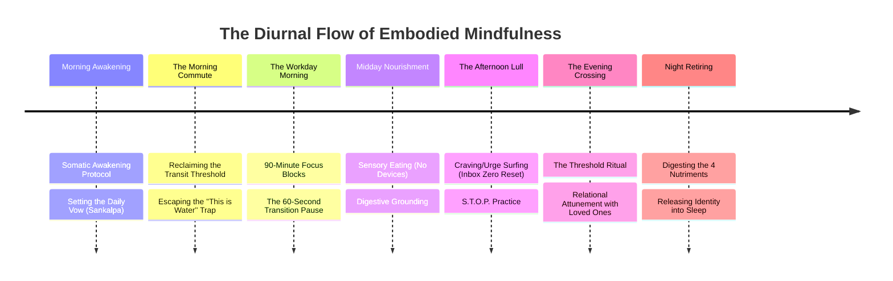

---
aliases:
  - Mindfulness in Daily Life - A Comprehensive Architecture
  - Mindfulness in Daily Life
  - The Architecture of Daily Mindfulness
tags:
  - mindfulness
  - daily-life
  - emotional-intelligence
  - somatic-mindfulness
  - relationships
  - mental-health
  - well-being
  - neurobiology
  - satipatthana
  - systemic-harmony
  - communication
  - leadership
Created: 2026-10-03
Companion Notes:
  - "[[A Synthesis of Mindfulness - The Four Pillars of Awareness]]"
  - "[[Mindfulness Summary]]"
  - "[[The Cultivation of Mindfulness]]"
  - "[[Definition _ Attributes of Mindfulness]]"
  - "[[Yogic Model of Mindfulness_Somatic Mindfulness]]"
  - "[[Becoming Aware of Being Unaware]]"
  - "[[How Mindfulness Builds Confidence]]"
  - "[[Rick - Mindfulness Foundations]]"
  - "[[David Foster Wallace]]"
  - "[[Pausing]]"
  - "[[A_Comprehensive_Architecture_of_Stress_and_Suffering]]"
  - "[[The Architecture of Trauma - Somatic Imprints, Karma, and Healing]]"
Status: Complete Comprehensive Report
---

# Mindfulness in Daily Life: A Comprehensive Architecture of Presence, Emotional Intelligence, and Systemic Harmony

> *"Between stimulus and response there is a space. In that space is our power to choose our response. In our response lies our growth and our freedom."*  
> — **Viktor E. Frankl**

> *"Learning how to think really means learning how to exercise some control over how and what you think. It means being conscious and aware enough to choose what you pay attention to and to choose how you construct meaning from experience. Because if you cannot exercise this kind of choice in adult life, you will be totally hosed."*  
> — **David Foster Wallace**, *This is Water*

> *"As mindfulness is internally present, one is aware: 'Mindfulness is internally present in me.' As mindfulness is not internally present, one is aware: 'Mindfulness is not internally present in me.'... As the arisen mindfulness is developed and brought to fulfillment, one is aware of that."*  
> — ***Satipaṭṭhāna Sutta*** (Majjhima Nikāya 10:42)

---

## Executive Summary: The Field-Test of Awakening

Mindfulness is frequently packaged in modern culture as an isolated therapeutic technique—a 15-minute morning retreat on a cushion or a consumer app designed to lower blood pressure. While formal contemplative training serves as an indispensable laboratory, treating mindfulness as a compartmentalized activity fundamentally misunderstands its nature and neuters its transformative power.

**Mindfulness (*Sati*) is not a sanctuary from life; it is an orientation toward life itself.** It is the disciplined, affectionate cultivation of lucid, non-reactive presence across every domain of human existence. When extracted from the monastery and brought into the marketplace, mindfulness evolves into a multi-tiered architecture:
1. **An Intra-Personal Anchor:** Transforming our internal dialogue, healing the split between intellect and body, and dismantling the toxic illusions of comparative self-esteem.
2. **An Affective Engine (Emotional Intelligence):** Creating the "Sacred Pause" that disrupts automatic amygdala reactivity, regulates affective states, and transmutes compulsion into conscious volition.
3. **A Relational Bridge:** Cultivating deep somatic attunement, active listening, and compassionate boundaries with partners, children, and parents.
4. **A Vocational Paradigm:** Restoring deep focus, cognitive sovereignty, and psychological safety amidst the fragmented demands and hyper-connectivity of modern work.
5. **A Civic & Planetary Ethic:** Transcending tribal polarization, countering algorithmic rage, and restoring our ecological kinship with the living Earth.

This treatise synthesizes traditional contemplative phenomenology (Abhidhamma, Satipaṭṭhāna), contemporary neuropsychology, relational dynamics, and systemic sociology into an operational blueprint for living an embodied, awake life in the contemporary world.

---



---

## Part I: The Operational Architecture — Moving from Cushion to Concrete

### 1.1 The Epistemological Shift: Laboratory vs. Field

Formal sitting meditation (*Samatha* and *Vipassanā*) is the testing ground. In the quiet of the meditation hall, sensory noise is subdued so that the subtle mechanics of mind—the arising and passing of sensations, the grasping of craving (*Taṇhā*), and the contractions of aversion—can be observed under high magnification.

However, if mindfulness remains confined to the meditation hall, it degenerates into a subtle form of spiritual escapism. **Daily life is the true field test.** 
* The traffic jam, the demanding email thread, the sick child crying at 2:00 AM, the provocative political argument at the Thanksgiving table—these are not "distractions" from our spiritual practice. **They are the practice.**
* As taught in the *Satipaṭṭhāna Sutta*, mindfulness is to be maintained *"when walking, standing, sitting, or lying down; when speaking or keeping silent; when eating, drinking, chewing, and savoring; when answering the calls of nature."* Presence must saturate the entire diurnal cycle.

### 1.2 The Four Pillars Operationalized in Daily Living

Expanding upon the core foundations developed across our research archives, daily mindfulness rests upon four dynamic pillars:

| Pillar | Core Mechanism | Daily Life Translation | Failure Mode (Default Setting) |
| :--- | :--- | :--- | :--- |
| **1. The Somatic Ground** | Interoceptive grounding, vagal tone regulation, sensory clarity. | Checking in with bodily tension during meetings; feeling feet on floor while walking. | "Disembodied Head Syndrome"; chronic intellectualization; ignoring physiological exhaustion. |
| **2. Cognitive Tracking** | Meta-awareness; cognitive decentering (*Anatta*); noticing impermanence (*Anicca*). | Recognizing: *"A narrative of impending failure is running"* rather than *"I am a failure."* | Fusion with mental chatter; believing every anxious forecast; rumination and catastrophic spiraling. |
| **3. The Quality of Ingestion** | Mindful filtering of the 4 Nutriments (Physical food, Sensory contact, Volition, Consciousness). | Curating information diet; conscious engagement with smartphones; noticing emotional toxicity. | Compulsive doomscrolling; mindless snacking; consuming outrage-driven media that fuels anger. |
| **4. Relational Interconnectedness** | Co-regulation, *Ahimsa* (non-harming), systemic awareness, deep empathy. | Pausing before snapping at a partner; attuning to unspoken emotional distress in a colleague. | Self-referential solipsism; transactional relationships; viewing others as obstacles to our agenda. |

### 1.3 The Mechanics of "The Pause": The Neurobiology of the Sacred Gap

At the center of applied mindfulness lies **The Pause**. Under the grip of stress, evolutionary survival circuits operate with blistering speed: sensory contact triggers the amygdala, releasing corticotropin-releasing hormone (CRH), activating the sympathetic-adrenomedullary (SAM) axis, and initiating fight-or-flight within milliseconds. The rational prefrontal cortex (PFC) is effectively bypassed.

The mindful pause interrupts this reflexive subcortical hijack:
1. **Interoceptive Awakening:** The practitioner detects the physiological flare-up—tightening jaw, accelerated heart rate, hollow gut sensation.
2. **The Somatic Brake:** By anchoring attention in a single conscious exhalation (stimulating the vagus nerve and engaging the parasympathetic brake), physiological arousal is modulated.
3. **Decentering Space:** A cognitive gap opens between the incoming stimulus and the outgoing behavior.
4. **Wise Volition (*Cetanā*):** Instead of an automatic, conditioned *reaction* rooted in past trauma or defensive pride, the individual chooses a creative, deliberate *response*.



### 1.4 Becoming Aware of Being Unaware: Deconstructing the "Default Setting"

As illuminated by David Foster Wallace in *This is Water*, the default setting of adult consciousness is an unconscious, automatic, and intensely self-centered conviction: *I am the absolute center of the universe; my immediate needs, frustrations, and desires are the primary reality.*

To live mindfully in daily life requires first recognizing the insidious signs of **unawareness**:
* **Rigid Dogmatism:** Believing with absolute certainty that your perspective on an issue, person, or political event is the unvarnished objective truth.
* **Negative Transference:** When someone irritates you, assuming their behavior is an intentional attack directed at you, rather than recognizing your own internal projection and the person's own private suffering.
* **Chronic Hurrying:** Operating under the unconscious delusion that real life exists only in the *next* moment—the next meeting, the weekend, the retirement—rendering the current moment a mere obstacle to be rushed through.
* **Compulsive Narration:** Commenting silently on everything: evaluating, rating, interpreting, and narrating life from an internal broadcast booth instead of tasting direct experience.

Recognizing that we have drifted into unawareness is not a failure; **it is the exact moment mindfulness has re-awakened.**

---

### 1.5 Deep Dive: Chronic Hurrying — The Trance of Future-Becoming (*Bhava-Taṇhā*)

Among the most pervasive symptoms of modern spiritual amnesia is **Chronic Hurrying**—the invisible, reflexive habit of rushing through the present moment to get to the "next thing."



#### The Teaching of Howie Cohn (Labor Day Retreat 2026)
As Insight Meditation teacher **Howie Cohn** poignantly illuminated during the **Labor Day Retreat 2026**, hurrying is not merely an external scheduling issue; it is a profound internal addiction—a subtle, unrelenting resistance to being where we actually are.
* Howie observed how practitioners carry this frantic momentum even into the quietest meditation retreat: hurrying through breakfast to make it to the hall on time, hurrying across the walking path to finish the lap, hurrying to settle onto the cushion, and then hurrying the breath in hopes of achieving stillness!
* In ordinary daily life, this habit manifests as an existential restlessness. We rush to finish washing the dishes so we can sit down; we rush through sitting down so we can check our messages; we rush through the commute so we can start work; we rush through work so we can go home.
* Howie calls attention to the essential contemplative question: **"What is the rush? Where are you trying to get to?"** The unexamined assumption is that *peace, completion, or satisfaction exists just around the corner in the next moment*. But because the mind is conditioned to hurry, when that "next moment" arrives, the same engine of impatience instantly colonizes it. You never actually arrive anywhere.

#### Ajahn Sumedho: "The Knowing is the Knowing"
Theravada Forest Tradition elder **Ajahn Sumedho** strikes at the very root of this frantic momentum with his foundational teaching: **"The knowing is the knowing"** (and its companion contemplation, *"Right now, it's like this"*).
* **The Knowing Does Not Hurry:** The unconditioned quality of awareness—the knowing faculty (*citta* / *vijānāti*)—is already present, unmoving, and whole. The sky does not rush to produce the next cloud; awareness does not rush to register the next sensation.
* **Rushing Belongs to the Conditions:** Rushing is an energy of *sankhāra* (conditioned mental formations), fueled by *Bhava-taṇhā* (the thirst to become, to attain, to arrive). When we identify with the rush, we become the frantic person struggling through time. 
* But as Ajahn Sumedho emphasizes, when you rest in **the knowing**:
  > *"You are aware of the feeling of hurrying. The feeling of hurrying is like this: tension in the chest, rapid breathing, an agitation in the mind. But that which knows the hurrying is not in a hurry."*
* Stepping back into "the knowing is the knowing" immediately severs the identification with speed. Hurrying is revealed as just another transient visitor passing through the unmoving stillness of awareness.

#### The Broader Contemplative Lineage
This diagnosis echoes across the masters of contemplative wisdom:
* **Ajahn Chah:** *"If you have a desire to finish quickly, that is craving (*taṇhā*). Do everything with a mind that lets go. If you are sweeping the path, sweep just to sweep. If you walk, walk just to walk. Don't walk to reach the end of the path. If you do, you miss the walking."*
* **Thich Nhat Hanh:** *"There is no way to peace; peace is the way."* He noted that modern people live in the "trance of future-orientation," walking as if their feet are on fire. He taught walking meditation as an antidote: planting each foot as if kissing the earth, whispering: *"I have arrived; I am home."*
* **Tara Brach:** Identifies the "Trance of Rushing" as a somatic manifestation of our core belief in our own deficiency. We hurry because deep down we fear that if we stop moving, an unbearable emptiness, inadequacy, or vulnerability will catch up with us.

#### Somatics & Neurobiology of the Forward Lean
Physiologically, chronic hurrying keeps the sympathetic nervous system on a constant low-grade drip of catecholamines. Somatically, it presents as **The Forward Lean**:
* Center of gravity tilted forward past the pelvis.
* Subtle chronic bracing in the diaphragm and pelvic floor.
* Sub-vocalized urgency ("Quick, next, move, hurry").
This chronic posture signals to the amygdala that a predator is in pursuit, maintaining allostatic wear. Healing chronic hurrying is thus a radical somatic reclamation: dropping back into the heels, softening the belly, and realizing that **this moment is the only moment you will ever inhabit.**

---

### 1.6 Deep Dive: Compulsive Narration — Why Mental Commentary is Not Mindfulness

A frequent, insidious trap for mindfulness practitioners—and a hallmark of the unawakened default setting—is **Compulsive Narration**: the relentless, running voiceover in the mind that describes, evaluates, categorizes, and critiques everything that occurs.



#### Why Compulsive Narration is the Antonym of Mindfulness

Many people mistakenly believe: *"Because I am verbally noting everything I do in my head, I am being mindful."* This is a fundamental cognitive error. Compulsive narration is **not** mindfulness; it is **conceptual mediation**, ego defense, and mental exhaustion.

1. **Living in the Menu Instead of Eating the Food:**
   * Narration creates a verbal intermediary between consciousness and reality. When you take a sip of water and the mind instantly says, *"Ah, cold water, very refreshing, I am hydrating myself mindfully,"* you are not tasting the water—**you are listening to yourself talk about tasting the water**.
   * It replaces the vivid, non-conceptual immediacy of *Phassa* (direct sensory contact) with words, symbols, and concepts. It is the difference between feeling the warmth of sunlight on your bare arm and reading an essay about solar radiation.

2. **Mental Proliferation (*Papañca*):**
   * In the Pali Canon, the Buddha singled out *Papañca* (conceptual proliferation / cognitive embellishment) as the primary engine that locks human beings into suffering (*Dukkha*).
   * Compulsive narration is simply the Default Mode Network (DMN) doing what it always does—chattering, categorizing, and maintaining ego identity—except it has cleverly co-opted mindfulness vocabulary to masquerade as spiritual awareness.

3. **An Ego Defense Mechanism Against Vulnerability:**
   * Why does the mind compulsively narrate? Because **raw reality is too intimate, unpredictable, and uncontrolled**.
   * Direct somatic sensation—grief, deep joy, acute physical pain, or the vast, pregnant silence of the present—demands total surrender. The ego feels threatened by raw, unmediated contact. By narrating the experience, the mind inserts a safe buffer zone: *"If I am describing it, I am in control of it; it cannot overwhelm me."*

4. **The Fabrication of a "Spectator Self":**
   * Compulsive narration reinforces the illusion of a split: a "me" in here watching an "experience" out there. It constructs an imaginary commentator sitting in a broadcast booth inside the cranium, reporting on life as if it were a sporting event.
   * But as **Ajahn Sumedho** emphasizes, true knowing is completely silent:
     > *"Knowing is without words. When you hear the sound of a bell, you know it instantly. You don't have to say 'bell' to know the bell. The verbal thinking comes second; the knowing comes first."*
   * Awareness does not need subtitles.

5. **Diagnostic Distinction: Skillful Mental Noting vs. Compulsive Narration**
   Practitioners often confuse the two because contemplative traditions (such as the Mahasi Sayadaw lineage) utilize mental noting. However, their nature and function are diametrically opposed:

| Feature | Skillful Mental Noting (*Sati-sampajañña*) | Compulsive Narration (*Papañca*) |
| :--- | :--- | :--- |
| **Pacing & Weight** | Light, sparse, gentle tap (a single word: *"rising"*, *"hearing"*, *"tension"*). | Continuous, verbose, run-on internal monologue ("Now I am doing this because..."). |
| **Function** | A temporary raft to tether attention to the somatic anchor, then released. | An ongoing cognitive defense mechanism to manage anxiety and maintain control. |
| **Relationship to Reality** | Points directly to raw sensory sensation; dissolves upon contact. | Replaces raw sensation with concepts, judgments, explanations, and narratives. |
| **Somatic Feeling** | Spacious, quiet, clarifying, relaxing. | Tight, fatiguing, head-heavy, discursive. |
| **The Knowing Quality** | Rests in silent awareness (*the knowing*). | Rests in the conceptual narrator (*the thinker*). |

When we drop compulsive narration, we fall out of the head and directly into the living, vibrating actuality of life. The internal sports broadcaster is finally relieved of duty, and the silence of true knowing takes its seat.

---

## Part II: Emotional Intelligence (EQ) & The Intra-Personal Sanctuary

```
                    ┌──────────────────────────────────────────────┐
                    │        THE INTRA-PERSONAL DOMAIN             │
                    │         (Relationship with Self)             │
                    └──────────────────────┬───────────────────────┘
                                           │
         ┌─────────────────────────────────┴─────────────────────────────────┐
         ▼                                                                   ▼
┌─────────────────────────────────┐                         ┌─────────────────────────────────┐
│     EMOTIONAL REGULATION        │                         │     SOVEREIGN SELF-RELATION     │
│  • Affect Labeling (Name it to  │                         │  • Dismantling Toxic Self-Esteem│
│    Tame it)                     │                         │  • Self-Compassion (Metta)      │
│  • De-identification (Decenter) │                         │  • "Taking Your Seat" (Nichtern)│
│  • Riding Craving Waves (Brewer)│                         │  • Equanimity (Upekkha)         │
└─────────────────────────────────┘                         └─────────────────────────────────┘
```

### 2.1 The Neurobiology of Emotional Intelligence: Name It to Tame It

Emotional Intelligence (EQ) is not an innate personality trait; it is a muscle sustained by mindfulness. 

When difficult emotions arise—shame, resentment, jealousy, terror—unconscious minds either **suppress** them (driving them deeper into somatic neuromuscular blocks) or **act them out** (projecting them onto others). Mindfulness introduces a third way: **compassionate witnessing and affect labeling**.

* **Affect Labeling ("Name It to Tame It"):** Functional neuroimaging reveals that silently noting an emotional state (e.g., *"There is anxiety,"* *"There is hurt,"* *"There is self-doubt"*) activates the right ventrolateral prefrontal cortex (rVLPFC) and simultaneously dampens metabolic hyperactivity in the amygdala.
* **Dis-identification from Mental Weather:** Mindfulness teaches the practitioner to distinguish the sky from the clouds. Grief, fury, and desire are transient weather systems passing through the vast, open space of awareness. They are not the sky itself.

### 2.2 Dismantling Toxic Self-Esteem: The Move to Self-Compassion

Modern culture worships "self-esteem," yet psychological research and contemplative inquiry demonstrate that self-esteem is an unstable, fragile construct. 
* Self-esteem is inherently **comparative**: it requires feeling "better than average," smarter than peers, or more successful than competitors.
* When failure, aging, error, or criticism strikes, the house of self-esteem collapses instantly into shame, imposter syndrome, and self-loathing.

Mindfulness dismantles this exhausting pendulum by substituting **Self-Compassion (*Karuṇā*)** and **Somatic Trust**:
1. **Mindfulness of Imperfection:** Recognizing that making mistakes, feeling insecure, and experiencing setbacks are not proof of defectiveness; they are the shared heritage of human incarnation.
2. **The End of Internal Warfare:** Replacing the brutal, punitive Inner Critic with the voice of an unconditionally loving mentor. When a mistake occurs, the mindful inquiry is not *"How could you be so stupid?"* but *"This hurts; what does this moment need for healing and wise correction?"*
3. **The Dissolution of Identity Reification (*Sakkāya-diṭṭhi*):** By realizing that the "ego" is an ongoing, fluid process rather than a static entity, there is no monolithic "self" that needs to be constantly defended, promoted, or mourned.

### 2.3 Working with Habit Loops, Craving, and "Inbox Zero" Compulsion

In daily modern life, our dopamine systems are relentlessly exploited. We suffer from what the Buddhist tradition calls *Bhava-taṇhā*—the frantic, thirsty craving to become something else, to be somewhere else, to resolve an unbearable internal emptiness.

This plays out practically in small daily compulsions:
* Compulsively checking email every 4 minutes to achieve "Inbox Zero."
* Grabbing the smartphone the second we encounter a 30-second pause at a red light or elevator.
* Mindlessly grazing on sugar or snacks when confronted with an intimidating work task.

**The Mindful Taming Protocol (Jud Brewer Model):**
1. **Identify the Trigger:** Boredom, anxiety about an upcoming deadline, loneliness.
2. **Locate the Craving Somatically:** Instead of obeying the urge to click or eat, turn attention 180 degrees inward. Where does the itch live? Is it a tightening in the throat? An emptiness in the solar plexus? A restlessness in the hands?
3. **Bring Curious Awareness (*Dhamma-vicaya*):** Dial up interest. Is the sensation warm or cool? Solid or vibrating? Does it move?
4. **Urge Surfing:** Craving operates like an ocean wave: it rises, peaks, and if not fed by cognitive rumination, naturally crests and dissipates within 90 seconds. By resting in awareness without indulging or fighting, we rewire the striatal habit loops of the brain.

### 2.4 "Taking Your Seat" Amidst the Eight Worldly Winds

As explored in Ethan Nichtern’s work on mindfulness and confidence, life continuously buffets us with **The Eight Worldly Winds (*Aṭṭha Loka-dhamma*)**:

$$\begin{array}{rcccl}
\text{Gain} & \longleftrightarrow & \text{Loss} \\
\text{Pleasure} & \longleftrightarrow & \text{Pain} \\
\text{Praise} & \longleftrightarrow & \text{Blame} \\
\text{Fame / Recognition} & \longleftrightarrow & \text{Insignificance / Disregard}
\end{array}$$

The unmindful person is like an inflatable "tube man" at a car dealership: puffed up with ecstatic vanity when praised or promoted, and collapsing into despair and self-hatred when criticized or ignored.

Mindfulness cultivates genuine confidence—not an arrogant armor, but **Upekkhā (Equanimity and Radical Resilience)**:
* **Taking Your Seat:** Literally and metaphorically owning your presence on this earth without needing to apologize for existing or puff yourself up to appear formidable.
* **Sensitivity Without Collapse:** As Dr. Richard Davidson's neuroscientific research on master meditators demonstrated, mindfulness does not numb us to pain or criticism. In fact, seasoned meditators often feel raw sensation *more* acutely in the present moment, but their brains display **zero anticipatory bracing** beforehand and **zero ruminative proliferation** afterward. The wind blows; the skyscraper sways; the foundation remains unshakable.

---

## Part III: Mental and Physical Well-Being — The Mind-Body Symphony

### 3.1 Down-Regulating the Allostatic Load: Polyvagal Realities

Chronic stress in daily life is characterized by allostatic overload—the wear and tear on cardiovascular, neuroendocrine, and immune systems caused by chronic sympathetic activation or freeze/dorsal-vagal shutdown.



* **The Body is Already Mindful:** As highlighted in our yogic and somatic inquiries, the intellect wanders constantly into hypothetical futures and unchangeable pasts, but **the physical body exists only in the present moment**. 
* Whenever attention anchors in somatic reality—feeling the pressure of shoes on the earth, the temperature of air entering the nostrils, the tension releasing from the pelvic floor—the nervous system receives immediate biological confirmation that there is no predator in the room. Ventral vagal tone is restored.

### 3.2 Somatosensory Portals for Daily Well-Being

Mindfulness transforms physical activities from mindless chores into somatic recharge stations:

1. **Mindful Eating (The Tangerine Practice):**
   * Instead of eating lunch while responding to Slack messages or watching YouTube, eating becomes an exercise in full sensory awakening.
   * Engaging the sight, scent, texture, and complex flavor profiles of the food. Recognizing the sunlight, rain, soil, and labor embedded within a single piece of fruit. Chewing thoroughly before reaching for the next bite; listening to visceral satiety cues.
2. **Mindful Movement & Posture Reset:**
   * Checking the "alignment of ease": spine tall, chest broad and receptive, shoulders dropped away from ears, tongue released from the roof of the mouth.
   * Transforming ordinary walking—between rooms, across parking lots, down corridors—into walking meditation. Feeling the weight transfer from heel to ball to toe, sensing the earth supporting each stride.
3. **Transition Rituals:**
   * Modern exhaustion stems from continuous context switching. We jump from an intense budget spreadsheet directly into a high-stakes client call without clearing the mental cache.
   * Inserting a **60-Second Cleanse** between activities: closing eyes, taking three deep abdominal sighs, allowing the mental residue of the previous task to dissolve before stepping into the new arena.

---

## Part IV: The Crucible of Relationships — Mindful Attunement with Loved Ones

If you want to test how mindful you are, spend a weekend with your family. Intimate relationships are the ultimate crucible where our deepest attachments, infantile wounds, and reactive habits are exposed.



### 4.1 Co-Regulation and the Relational Nervous System

Human nervous systems do not operate as isolated islands; through mirror neuron networks and auditory/facial prosody, they constantly co-regulate or co-dysregulate one another.
* When a parent or partner walks into a room carrying unacknowledged, suppressed rage, every nervous system in the house picks up the threat frequency, triggering reciprocal defensive posturing.
* Conversely, when one person embodies a calm, grounded, open presence (*Ventral Vagal safety*), they act as an emotional tuning fork, inviting the dysregulated partners or children back into homeostasis.

### 4.2 The Five Tenets of Mindful Intimacy

1. **Deep, Generous Listening (Listening to Understand, Not to Rebut):**
   * The default habit in domestic conversations is to listen halfway while internally drafting our defense, rebuttal, or unsolicited advice.
   * Mindful listening means setting aside the ego's defense briefcase. Giving another human being our complete, uninterrupted attention is the purest form of generosity (*Dāna*).
2. **Releasing the Urge to Be "Right":**
   * Relationship conflicts rarely center on factual accuracy; they center on **emotional validation**. The unmindful demand to "win the argument" sacrifices connection at the altar of pride.
   * Mindfulness asks: *"Do I want to be right, or do I want to be in loving relationship?"*
3. **Interrupting Generational Trauma Loops:**
   * When a child screams or throws a tantrum, an unconscious parent reacts with the identical rage or shaming their own parents used on them.
   * Mindfulness introduces the conscious wedge: recognizing the ancestral ghost in the room, taking a breath, soothing the inner child's terror, and responding to the actual child with firm, compassionate presence.
4. **Compassionate Boundaries and Non-Enmeshment:**
   * Mindfulness is not passive capitulation or boundary-less accommodation. True compassion (*Karuṇā*) includes clear boundaries: *"I love you deeply, and I cannot allow you to speak to me in that tone."*
   * It allows us to hold space for a partner's grief or distress without adopting it into our own pain-body or attempting to compulsively "fix" it.
5. **Domestic Chores as Sacred Communion:**
   * Washing dishes, taking out the trash, folding laundry—these are traditionally treated as resentful burdens.
   * Mindful presence turns these into acts of silent affection and somatic meditation: feeling the warm soapy water, blessing the home that shelters the family, transforming resentment into service.

---

## Part V: Mindfulness in the Workplace & Vocational Arena

### 5.1 Reclaiming Sovereignty in the Attention Economy

The modern knowledge workplace is structured around distraction: real-time chat pings, infinite notification red dots, concurrent video conferences, and cultural praise for frantic responsiveness. This hyper-fragmentation induces continuous partial attention, devastating the brain’s deep cognitive faculties and exhausting executive resources in the anterior cingulate cortex (ACC).

**Applied Vocational Mindfulness Practices:**
* **Monotasking as Spiritual Discipline:** Rejecting the myth of multitasking. Doing one thing with absolute devotion: when writing code, write code; when analyzing financials, analyze financials; when speaking to a colleague, be solely there.
* **The Structured Communication Rhythm:** Batching communications. Stepping out of reactive real-time panic into deliberate, scheduled windows for correspondence.
* **The Transition Threshold:** Taking three mindful breaths before joining a video conference or entering a meeting room. Arriving physically and mentally at the same time.

### 5.2 Mindful Leadership & Collaborative Psychological Safety

A mindful organization begins with mindful leaders. Leadership is fundamentally the management of collective energy, psychological safety, and focus.

| Workplace Scenario | Unconscious Default Behavior | Mindful Leadership Behavior |
| :--- | :--- | :--- |
| **High-Pressure Crisis / Project Delay** | Blame allocation; panic-driven micromanagement; radiating anxiety down the ladder. | Grounded somatic calm; clear retrospective inquiry; stabilizing the team’s problem-solving focus. |
| **Critical Feedback Delivery** | Punitive critique or avoidant sugarcoating that breeds passive-aggression. | Compassionate directness; feedback rooted in mutual growth; decoupling behavior from self-worth. |
| **Cross-Functional Disagreement** | Territorial defensiveness; political posturing; winning the narrative. | Meta-awareness of differing incentives; inquiry into systemic blockages; seeking collaborative synthesis. |
| **Imposter Syndrome & Burnout** | Pushing through with workaholism; hiding insecurities; projecting false bravado. | Vulnerability and authentic humility; honoring human limits; redefining success beyond frantic output. |

---

## Part VI: The Extended Field — Community, Nation, and Global Interconnection

```
                                  ▲
                                 / \
                                /   \
                               /     \
                              /       \
                             / GLOBAL  \
                            / ECOLOGY   \
                           /─────────────\
                          /   NATION &    \
                         /   CIVIC LIFE    \
                        /───────────────────\
                       /    LOCAL COMMUNITY  \
                      /      & NEIGHBORHOOD   \
                     /─────────────────────────\
                    /    VOCATION & HOME LIFE   \
                   /─────────────────────────────\
                  /      THE INTRA-PERSONAL       \
                 /            SANCTUARY            \
                └───────────────────────────────────┘
```

### 6.1 Transcending "McMindfulness": The Inescapable Ethical Container (*Sīla*)

A dangerous distortion in contemporary culture is **"McMindfulness"**—the stripping of mindfulness from its ethical and communal roots to use it solely as a productivity booster, military target-acquisition tool, or corporate stress-patch that excuses exploitative working conditions.

As preserved in the ancient *Abhidhamma* psychology:
* **Attention without Ethics is not Sati:** A sniper aiming at an innocent target possesses intense concentration, steady breathing, and one-pointed focus. However, because his mind is conditioned by killing, violence, and delusion, the Buddhist tradition declares that **mindfulness is absent**.
* True mindfulness (*Sammā-Sati*) can only co-arise with wholesome mental factors: non-greed (*Alobha*), non-hatred (*Adosa*), conscience/moral shame (*Hiri*), and moral dread of harming others (*Ottappa*).
* Mindfulness naturally flowers into an active commitment to **Ahimsa (Non-Harming)**, social justice, and systemic equity.

### 6.2 Civic Mindfulness: De-Polarizing the Political Fabric

Our national and global political spheres are gripped by collective limbic hyper-reactivity. Algorithmic social media platforms profit directly by generating outrage, sorting human populations into tribal echo chambers, and reducing political adversaries to subhuman caricatures.

Mindfulness offers the essential civic medicine:
1. **Recognizing Ideological Attachment:** Watching how the ego hooks itself onto political identities. When an opposing political headline appears, noticing the physical surge of indignation, dopamine gratification, and self-righteousness.
2. **De-Weaponizing Nuance:** Refusing to succumb to binary, black-and-white tribalism. Having the courage to entertain complex systemic truths and acknowledge legitimate concerns held by ideological opponents.
3. **Compassionate Civic Engagement:** Responding to injustice not from burning, toxic hatred that consumes the activist from within, but from fierce, loving protection of human dignity (the lineage of Mahatma Gandhi, Martin Luther King Jr., and Thich Nhat Hanh).

### 6.3 Ecological Mindfulness: Restoring Kinship with the Living Earth

At its ultimate horizon, mindfulness dissolves the hallucination of human separation from the natural world.
* Drawing inspiration from Indigenous wisdom and deep ecology, we recognize that the breath entering our lungs is the exhalation of trees and marine phytoplankton; our bodies are borrowed minerals from the crust of the earth; the water circulating through our blood is part of the global hydrologic cycle.
* Ecological mindfulness moves us from an exploitative, extractive relationship with nature to one of **Sacred Reciprocity**. We consume resources with reverence; we mourn planetary wounds with open hearts; and we act with urgency as mindful stewards of future generations.

---

## Part VII: The Daily Life Integration Blueprint — An Operational Toolkit

To ensure this architectural treatise does not remain mere intellectual theory, the following structured practices provide a concrete blueprint for embedding mindfulness throughout daily life.



### 7.1 Morning Calibration: Establishing the Somatic Ground
* **Do Not Touch the Device:** Upon waking, resist touching the smartphone for the first 15–30 minutes. Reaching for notifications immediately surrenders your mental sovereignty to the agenda of the outside world.
* **The Somatic Grounding Check:** Lie in bed for 2 minutes feeling the entire physical organism: heart beating, sheets on skin, breath filling the rib cage.
* **The Sankalpa (Conscious Dedication):** Articulate a deliberate orientation for the day: *"May my actions today cause no unnecessary harm. May I meet stress with spaciousness. May I be an instrument of peace in every room I enter."*

### 7.2 In-the-Trenches Micro-Practices

#### 1. The S.T.O.P. Protocol (Emergency De-escalation)
Whenever triggered, hurried, or anxious:
* **S — Stop:** Pause all physical activity and speech for a single moment.
* **T — Take a Breath:** Take one slow, long inhalation followed by an extended, audible exhalation to trigger the vagal brake.
* **O — Observe:** Note the internal weather with neutral curiosity. What sensations are in the body? What thoughts are racing? What emotion is active?
* **P — Proceed:** Re-engage with the situation from deliberate, conscious choice.

#### 2. The Transit & Commute Practice (Escaping "This is Water")
* When stuck in heavy traffic, in a slow supermarket checkout line, or waiting for an elevator:
* Notice the default impulse to tap feet, grip the steering wheel, and curse the delays.
* Silently reflect: *"Every single person around me is living a complex, messy, fragile human life just like mine. Some may be rushing to an emergency room; some may be carrying heartbreak; all want to be happy and free from suffering."*
* Drop the shoulders; relax the belly; send silent wishes of ease to the surrounding humans.

#### 3. The Pre-Meeting / Pre-Doorway Threshold Ritual
* Before crossing the threshold into your home after work, or before unmuting your microphone on a high-stakes call:
* Place a hand on the door handle (or touch the desk surface).
* Take two full breaths. Consciously leave behind the previous emotional drama. Step forward with fresh eyes.

### 7.3 Evening Digest: Releasing the Day
* **Reviewing the 4 Nutriments:** Before sleep, reflect briefly on what was ingested today:
  * *Food:* Was the body fed with care or hurried compulsion?
  * *Sensory Contact:* Did you consume hours of toxic digital outrage, or balance it with natural beauty, silence, and truth?
  * *Volitions:* What intentions drove your labor today? Pride? Fear? Service? Love?
  * *Consciousness:* Releasing the mental storylines into the stillness of night.
* **Forgiveness Meditation:** Forgiving yourself for where you fell short of your ideals today; forgiving others who caused unintentional friction; resting in the spaciousness of being.

---

## Part VIII: Master Comparison Matrix — Default Mode vs. Mindfully Integrated Life

| Dimension | The Unconscious Default Mode | The Mindfully Integrated Life | Transformative Outcome |
| :--- | :--- | :--- | :--- |
| **Self-Concept** | Fragmented ego; volatile self-esteem; constant self-criticism. | Somatic ground; radical self-compassion; dis-identification from thoughts. | Unshakable internal resilience; peace with flawed humanity. |
| **Emotional State** | Reactive impulsivity; suppression or explosive acting-out. | Affect labeling; non-judgmental acceptance; the Sacred Pause. | High emotional intelligence; mastery over habit loops and addictions. |
| **Physical Body** | Disembodied intellectualization; chronic muscular tension; ignored signals. | Interoceptive clarity; polyvagal regulation; somatic anchoring. | Down-regulated allostatic load; deep nervous system restoration. |
| **Loved Ones & Family** | Defensive scorekeeping; interrupting; projecting generational wounds. | Co-regulation; deep empathic listening; compassionate boundaries. | Secure relational attachment; generational healing; sacred domestic life. |
| **Work & Vocation** | Continuous distraction; frantic multitasking; imposter syndrome. | Deep monotasking; attentional sovereignty; psychological safety. | High creative yield; sustainable excellence without burnout. |
| **Community & Nation** | Tribal outrage; algorithmically fed malice; othering opponents. | Nuanced discernment; non-violent communication; civic empathy. | Healing of the social fabric; principled, compassionate activism. |
| **The Biosphere** | Extractive consumerism; nature as dead commodity; climate dread. | Sacred reciprocity; visceral ecological kinship; reverence for all life. | Sustainable, grounded participation in the planetary web of life. |

---

## Conclusion: The Unfolding Path

Mindfulness in daily life is not a fixed summit to be conquered, nor a moralistic standard against which to judge our shortcomings. It is an **ever-renewing invitation to return home to this moment**.

We will forget. We will lose our temper. We will grab the phone when bored. We will get hooked by the eight worldly winds. We will judge ourselves and others. 

**The miracle of mindfulness is that liberation does not depend on never falling into unawareness; it depends entirely on the gentleness, warmth, and immediacy with which we return.**

The instant we notice that we have been lost in thought, we are already awake. In that very second, the nervous system softens, the clouds part, the somatic ground welcomes us back, and we take our seat once more in the living reality of the present moment.

---

### Internal Obsidian Cross-References & Study Path
* For the foundational neurobiological models of trauma and somatic imprints: see [[The Architecture of Trauma - Somatic Imprints, Karma, and Healing]].
* For deep inquiry into stress fabrication, choice overload, and conditionality: see [[A_Comprehensive_Architecture_of_Stress_and_Suffering]].
* For the four foundational operational pillars: see [[A Synthesis of Mindfulness - The Four Pillars of Awareness]].
* For exploring confidence, the worldly winds, and taking your seat: see [[How Mindfulness Builds Confidence]].
* For breaking compulsive habits and urge surfing: see [[10-Minute Mindfulness Practice - Tame Bad Habits_]].
* For working with clues of unconsciousness and cognitive distortions: see [[Becoming Aware of Being Unaware]].
