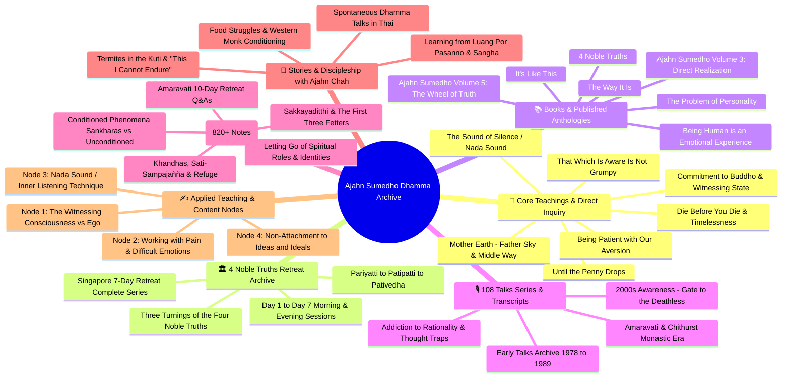

# Master Mind Map - Ajahn Sumedho Archive & Content Nodes

This master mind map organizes and indexes the complete **Ajahn Sumedho (Luang Por Sumedho)** teaching repository in your vault—spanning **1,000+ files** across root discourses, 7-day retreat archives, published books, 108 audio transcripts, and 820+ thematic synthesis notes.

---

## 🗺️ Interactive Master Mind Map

---

## 📂 Subfolder Architecture & Content Mapping

Below is the complete structural breakdown of the subfolders located within `_A_My Research\_My Teachers\Ajahn Sumedho`:

| Subfolder Path | File Count | Core Purpose & Contents | Primary Thematic Focus |
| :--- | :--- | :--- | :--- |
| **`4 Noble Truths Retreat/`** | 9 files | Complete 7-Day Singapore retreat transcript series and index files. | Dukkha, Samudaya, Nirodha, Magga; Three Turnings (*Sacce, Kicce, Kate*). |
| **`Ajahn Sumedho_notes/`** | 11 files | Structured analytical study notes, AI summaries, and thematic syntheses. | Fetters of identity, language as attachment, unconditioned awareness. |
| **`Ajahn Sumedho_sources/`** | 61 files | Source reference documents, audio talk markups, Spirit Rock retreats. | Monastic retreat lectures, raw dialogue notes, study background. |
| **`Books/`** | 8 files | Primary PDF book transcriptions and published volumes by Luang Por Sumedho. | *Direct Realization*, *The Wheel of Truth*, *The Way It Is*, *Personality*. |
| **`Synthesis of Teachings/`** | 821 files | Extensive topical compendium of Amaravati retreat Q&As, daily reflections. | Deep granular cross-references on every aspect of Buddhist practice. |
| **`Transcripts/`** | 117 files | Complete *108 Talks by Luang Por Sumedho* audio transcript collection. | Historical chronological audio talks (1978–2010s). |

---

## 📜 Curated Index of Primary Root Notes

The root directory contains 50+ curated high-priority study notes and direct teaching summaries:

### 1. Awareness, Presence & The Witnessing State
* 📄 `[[Commitment to Buddho -The Witnessing Position -Ajahn Sumedho.md]]`
* 📄 `[[Mindfulness - 2005 - Ajahn Sumedho - Summary and Transcript.md]]`
* 📄 `[[Silence Is to Be Realized - Ajahn Sumedho.md]]`
* 📄 `[[Not Bering A Witness but Witnessing Experience.md]]`
* 📄 `[[Witnessing Who You Really Are Ajahn Sumedho 29.03.2023.md]]`
* 📄 `[[_Common Base Instructions by Ajahn Sumedho.md]]`

### 2. Emotional Agility & Disarming Defenses
* 📄 `[[That Which Is Aware Is Not Grumpy - Ajahn Sumedho - Sum and Trans.md]]`
* 📄 `[[Ajahn Sumedho - Being Patient with Our Aversion.md]]`
* 📄 `[[Ajahn Sumedho - Attachment to Thought is Insecure - Summary Only.md]]`
* 📄 `[[Ajahn Sumedho - Addiction to Rationality - 2010.md]]`
* 📄 `[[I think therefore I doubt - Ajahn Sumedho.md]]`
* 📄 `[[NOTES - Ajahn Sumedho - I_m Right - You_re Wrong (part...).md]]`

### 3. Ultimate Truth & Non-Duality
* 📄 `[[Ajahn Sumedho - Die Before You Die - 1993.md]]`
* 📄 `[[Ajahn Sumedho - Inclining to nibbana - 1984.md]]`
* 📄 `[[Ajahn-Sumedho - Awakening-from-the-dream-of-life-1989.md]]`
* 📄 `[[Ajahn Sumedho - Mother Earth - Father Sky and the Middle Way.md]]`
* 📄 `[[Ajahn Sumedho - Timelessness - Talks From Thailand - Sum and Trans.md]]`
* 📄 `[[Until the penny drops - Ajahn Sumedho.md]]`

### 4. Monastic Stories & Teacher Relations
* 📄 `[[_Ajahn Sumedho stories_.md]]`
* 📄 `[[Learning from Luang Por Sumedho - Ajahn Pasanno.md]]`
* 📄 `[[_Reflections of a Monk_ Ajahn Sumedho's Teachings.md]]`

---

## 🔑 Key Teaching Signatures of Luang Por Sumedho

1. **The Sound of Silence (*Nāda* Inner Vibration)**:
   Using the subtle, high-pitched background sound in consciousness as an object of meditation to cut through conceptual thinking and anchor in pure awareness.
2. **"That Which Knows" (*Buddho*)**:
   Stepping back into the witnessing space rather than being identified with the thoughts, emotions, or bodily sensations that arise and pass away.
3. **"That Which Is Aware Is Not Grumpy"**:
   Recognizing that awareness itself is never angry, impatient, depressed, or sick—suffering only arises when we identify with the changing emotional weather.
4. **Three Turnings of the Four Noble Truths**:
   * *Statement*: There is suffering.
   * *Prescription*: Suffering is to be understood.
   * *Realization*: Suffering has been understood and let go of.
5. **The Problem of Personality (*Sakkāyaditthi*)**:
   Seeing through the conditioned belief in a permanent self, allowing compassion and presence to function without ego defense.
