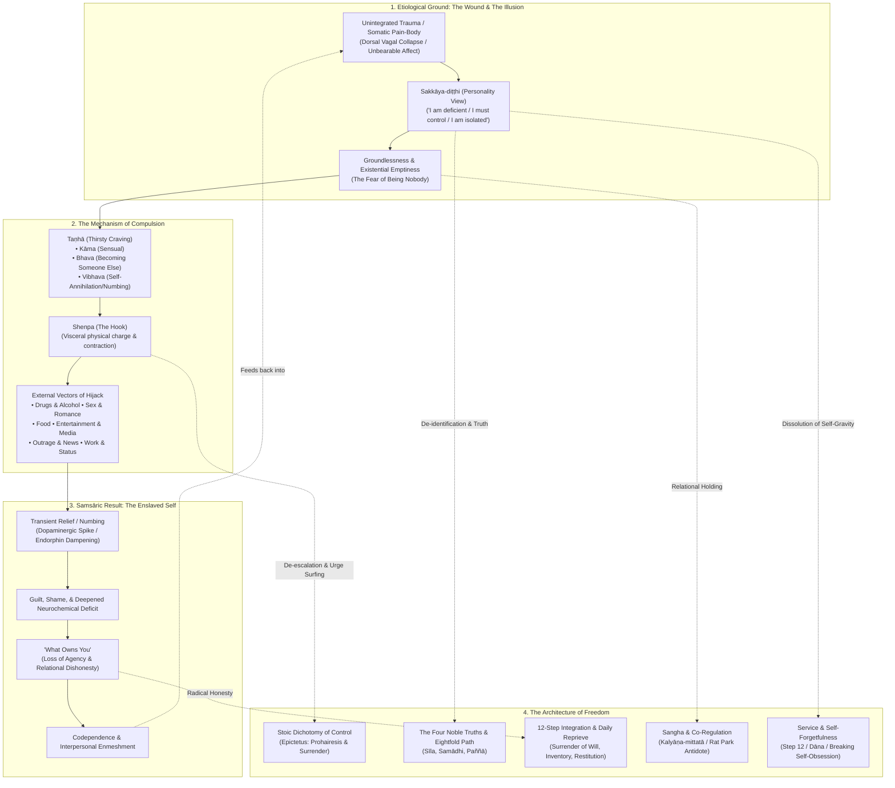
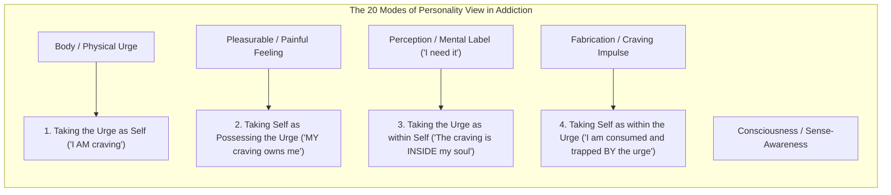
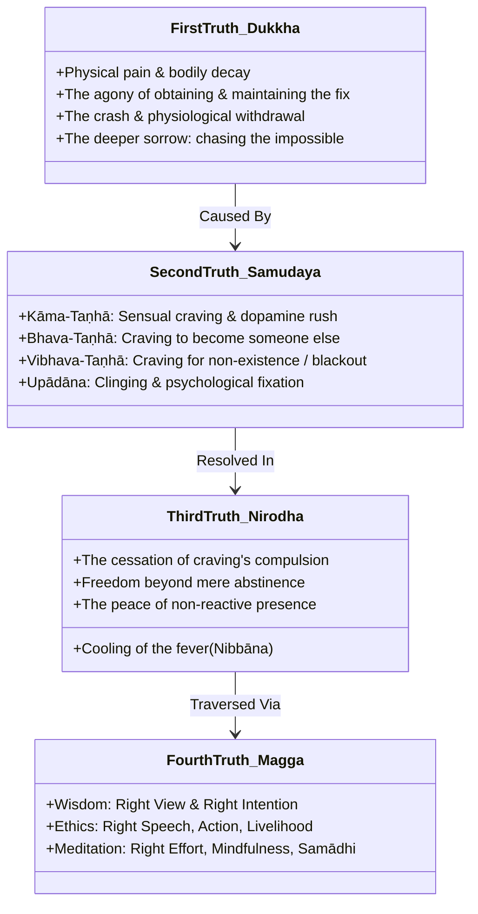
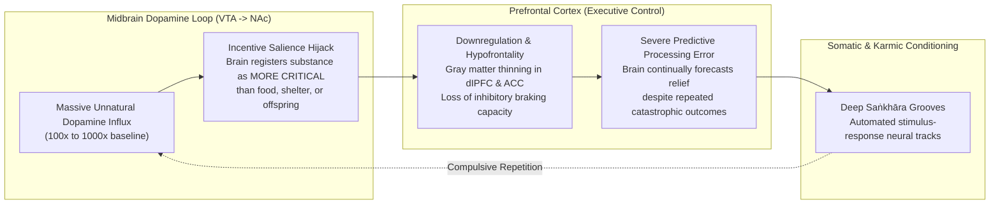
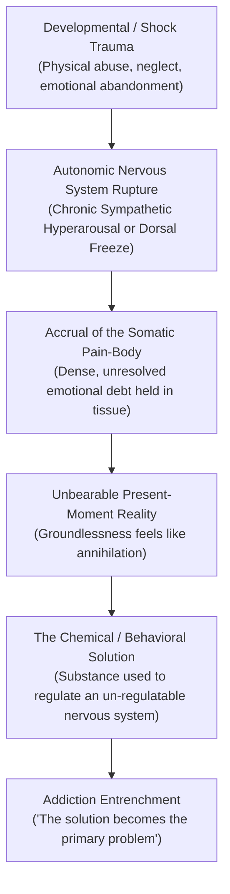
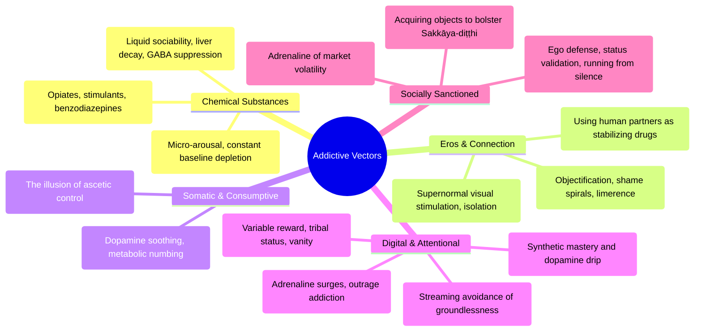
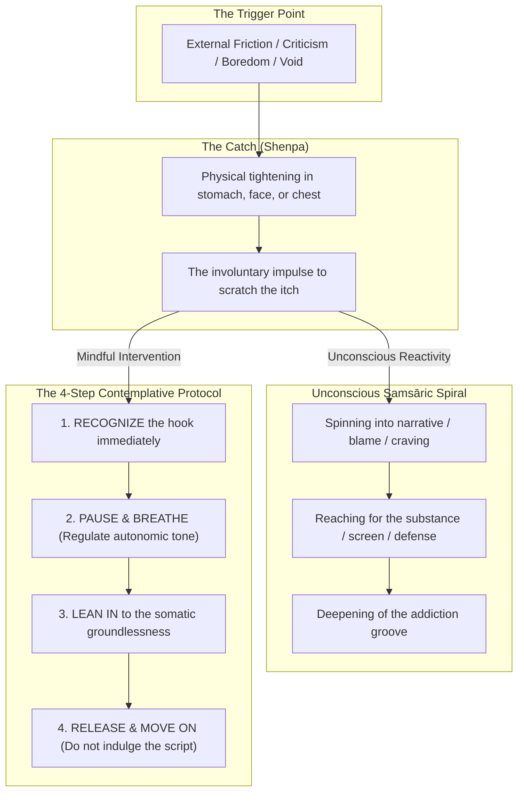
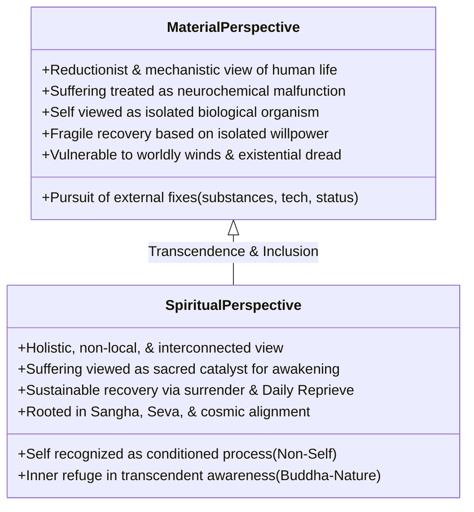
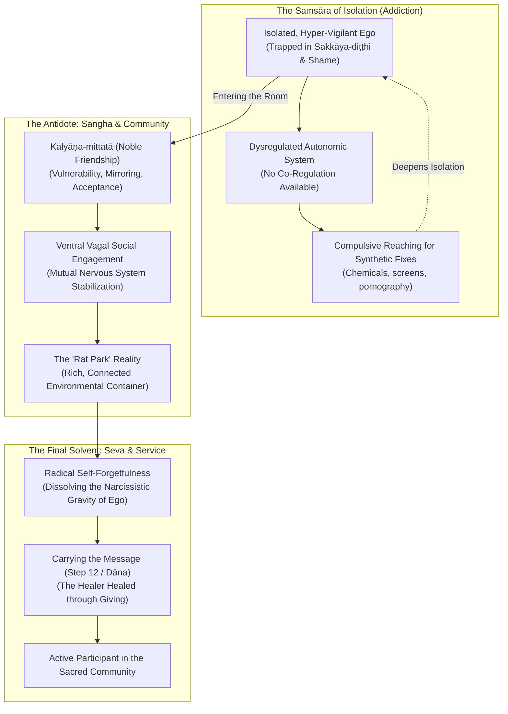
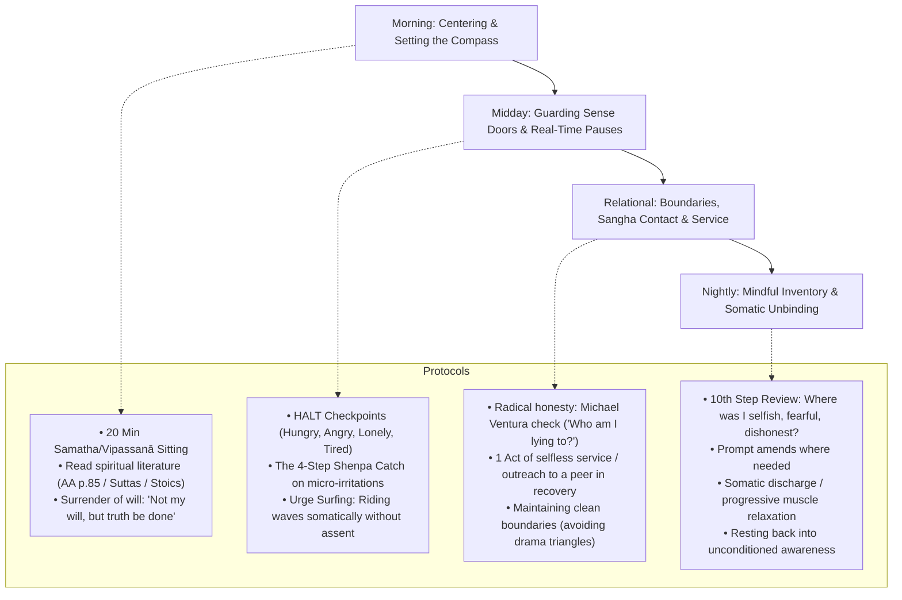

# The Architecture of Recovery: Sakkāya-Diṭṭhi, Trauma, Sangha, and the Path from Compulsion to Liberation

> **Location:** `_A_My Research/_Recovery and Addiction/`  
> **Source Synthesis:** Early Buddhist Phenomenology (*Samyutta Nikāya*, *Majjhima Nikāya*, *Dhammacakkappavattana Sutta*, *Upaddha Sutta* SN 45.2), Thai Forest Tradition (Ajahn Chah, Ajahn Sumedho, Thanissaro Bhikkhu), Tibetan Contemplative Psychology (Pema Chödrön on *Shenpa* and Groundlessness), Classical Stoicism (Epictetus, Marcus Aurelius, Seneca), Twelve-Step Epistemology (Bill Wilson, AA Grapevine *Emotional Sobriety*, *Daily Reprieve* AA p. 85), Modern Traumatology & Somatic Neuroscience (Dr. Gabor Maté, Dr. Peter Levine, Dr. Bessel van der Kolk, Dr. Stephen Porges), and Vault Archives (`_Recovery and Addiction`, `_Buddhism`, `_Trauma`, `_Living Mindfully Meetings`).  
> **Created:** 2026-10-03 12:45:00-07:00  
> 
> ### Companion Notes & Vault Pentology Integration
> * Foundational Treatise: [[Report - The Conditioning Process in Humans, Evolution, Consciousness, Karma, Trauma, and the Architecture of Freedom]]
> * Pillar 1: [[Report - Personality View, Identity, Worldly Winds, and Protection]]
> * Pillar 2: [[Report - Saṅkhāra, Mental Fabrications, Ajahn Sumedhos Teaching on the Mother, and Mindful Recovery]]
> * Pillar 3: [[Report - The Observer, Reacting vs. Observing in Meditation, Mediation, and Active Life]]
> * Pillar 4: [[Report - Karma, Skillfulness, Sakkayaditthi, and Sankharas, How to Treat Experience]]
> * Clinical & Somatic Foundations (Today's Reports):
>   * [[The Architecture of Stress and Suffering]]
>   * [[The Architecture of Trauma - Somatic Imprints, Karma, and Healing]]
> * Local Vault Seeds:
>   * [[Shenpa and Recovery]] | [[What Owns You]] | [[Daily Reprieve... spiritual condition]] | [[Main Themes - Buddhism and Recovery]] | [[12 Steps]] | [[AA Preamble]]

---

## Master Architecture Hub: The Framework of Liberation

> [!IMPORTANT] Master Synthesis Hub: Recovery as Awakening
> This report forms the culmination and practical clinical application of the five-part contemplative and psychological series:
> 
> 1. **The Core Delusion:** [[Report - Personality View, Identity, Worldly Winds, and Protection|Sakkāya-diṭṭhi]] — How the illusion of a solid "I" creates the insatiable hole that addiction attempts to fill.
> 2. **The Habit Engine:** [[Report - Saṅkhāra, Mental Fabrications, Ajahn Sumedhos Teaching on the Mother, and Mindful Recovery|Saṅkhāra & Mental Fabrication]] — The cognitive-somatic machinery constructing cravings, rationalizations, and relapse loops.
> 3. **The Witnessing Consciousness:** [[Report - The Observer, Reacting vs. Observing in Meditation, Mediation, and Active Life|The Observer]] — The space of bare awareness that allows urge surfing without compulsive enactment.
> 4. **The Law of Action:** [[Report - Karma, Skillfulness, Sakkayaditthi, and Sankharas, How to Treat Experience|Karma & Skillfulness]] — Treating craving as unchosen old karma (*purāṇa-kamma*) met with liberating new choice (*nava-kamma*).
> 5. **Somatic Etiology:** [[The Architecture of Stress and Suffering|Stress]] & [[The Architecture of Trauma - Somatic Imprints, Karma, and Healing|Trauma]] — Healing the unintegrated nervous system debts that fuel the impulse to self-medicate.



---

## 1. Executive Summary & Foundational Paradigm

Addiction is commonly reduced to either a **moral failure of willpower** by conservative societal frameworks or a **narrow biomedical brain disease** by clinical reductionism. Neither model captures the holistic phenomenological truth.

When illuminated through the cross-pollination of **Early Buddhist psychology**, **classical Stoicism**, **modern somatic traumatology**, and **Twelve-Step clinical wisdom**, addiction reveals itself as:

> **A brilliantly adaptive, desperately conditioned, yet ultimately tragic survival strategy deployed by a fragmented nervous system to soothe unintegrated trauma and escape the agonizing friction of an insecure, fabricated ego-identity (*Sakkāya-diṭṭhi*).**

The addict is not in love with the needle, the bottle, the screen, or the partner; the addict is in love with the **cessation of intolerable psychic and somatic pain**. As Dr. Gabor Maté famously synthesized: *“The question is not why the addiction, but why the pain.”* And as the Buddha recognized in the First Noble Truth, the deepest root of pain is *upādānakkhandhā dukkhā*—clinging to the five aggregates of conditioned experience as "me" and "mine."

True recovery is not the grim, teeth-gritting suppression of urges through isolated willpower. **Willpower is a finite biological reserve easily exhausted by stress.** Rather, lasting liberation is an **ontological shift**:
1. Dismantling the false owner (*Sakkāya-diṭṭhi*) that drives self-centered craving and fear.
2. Meeting visceral hooks (*Shenpa*) with somatic curiosity and equanimity rather than panic.
3. Anchoring the dysregulated nervous system in the holding container of **Sangha** (community co-regulation).
4. Breaking the narcissistic gravity of addiction through selfless **Service** (*Seva*).
5. Securing a **Daily Reprieve** contingent on the continuous maintenance of our spiritual condition.

---

## 2. Sakkāya-Diṭṭhi (Personality View): The Root Architect of Addiction

In all Buddhist phenomenology, no concept cuts more ruthlessly to the core of addictive pathology than **[[Report - Personality View, Identity, Worldly Winds, and Protection|Sakkāya-diṭṭhi]]** (Pāli: *sakkāya* = existing body/aggregate collection; *diṭṭhi* = view/dogma). It is the foundational fetter (*saṃyojana*)—the habitual misapprehension that within the changing flow of sensations, feelings, perceptions, fabrications, and consciousness, there exists an enduring, unified, autonomous, and vulnerable "Self."

### 2.1 The Addict's Ego: The Fragile, Demanding Emperor
In active addiction, *Sakkāya-diṭṭhi* runs rampant across two polarized, alternating extremes:
* **The Grandiose Self (Ego-Inflation):** *"I am above the rules. Normal people might get addicted, but I can manage this. Nobody understands what I carry. I am entitled to relief."*
* **The Defeated Self (Ego-Deflation & Terminal Uniqueness):** *"I am uniquely broken. God and the universe have singled me out for suffering. My pain is too deep for normal remedies. Nothing can help me."*

Both positions are identical in their structural architecture: **they are hyper-fixations on the phantom "I."** Alcoholics Anonymous describes this with surgical precision as *"self-will run riot"*—an individual demanding that the universe, partners, children, and biochemical realities conform to the ego's script. When reality inevitably refuses, the resulting friction (*dukkha*) feels existential, demanding chemical or behavioral oblivion.



### 2.2 The 20 Modes of Sakkāya-Diṭṭhi Applied to Addiction
Canonical suttas (*Mahāpuṇṇama Sutta* MN 109, *Paṭisambhidāmagga*) detail 20 modes of personality view across the 5 aggregates (*khandhas*). In the context of active craving:
1. **Rūpa (Form/Body):** Believing the nervous system’s visceral tremors, elevated heart rate, and dopamine depletion are *"who I am."*
2. **Vedanā (Feeling Tone):** Believing unpleasant sensations (*dukkha-vedanā*) must be immediately eliminated, and pleasant sensations (*sukha-vedanā*) must be artificially sustained. The inability to tolerate neutral feeling (*adukkham-asukha*) manifests as chronic, itchy boredom.
3. **Saññā (Perception):** Reifying conceptual labels: *"I am an alcoholic/junkie and will always fail"* vs. *"A drink represents sophisticated sophistication, romance, and freedom."*
4. **Saṅkhāra (Fabrications):** Fusing with the thought-loops of rationalization: believing the internal narrative that says, *"Just one won't hurt,"* or *"You've had a hard week, you deserve this."*
5. **Viññāṇa (Consciousness):** Mistaking the knowing faculty for an embattled, isolated observer who is being attacked by external circumstances.

### 2.3 The Trap of the "Recovery Identity"
Crucially, *Sakkāya-diṭṭhi* can colonize recovery itself. While adopting the identity of "recovering addict" is an indispensable **conventional raft** (*kula*) in early stages—providing life-saving humility, peer connection, and cognitive structure—if reified into an absolute, metaphysical truth, it can become its own subtle prison.

The contemplative perspective views the label not as an eternal essence, but as a provisional tool. The practitioner learns to shift from:
* *"I am an addict whose core nature is broken and dangerous,"* to:
* *"Addiction is an intensely conditioned biological, psychological, and karmic process currently passing through the open sky of awareness. It can be observed, understood, de-conditioned, and released."*

---

## 3. The Four Noble Truths of Addiction and Recovery

The Buddha’s foundational teaching—the *Dhammacakkappavattana Sutta* (SN 56.11)—is framed not as religious dogma, but as an ancient medical and psychological protocol: Diagnosis, Etiology, Prognosis, and Treatment Plan. It matches the architecture of addiction with absolute fidelity.



### 3.1 First Noble Truth (Dukkha): The Inherent Friction of the Fix
The truth of suffering is lived by every addict in acute, harrowing detail:
* **Dukkha-dukkha (Direct Physical and Emotional Pain):** The agony of hangovers, tremors, chemical withdrawal, shattered relationships, financial ruin, and moral compromise.
* **Vipariṇāma-dukkha (The Suffering of Change and Transience):** The tragic impermanence of the high. The first drink or hit delivers relief; within minutes or hours, tolerance sets in, receptor sites downregulate, and the substance ceases to deliver joy, functioning only to temporarily stave off agonizing withdrawal. The hedonic treadmill accelerates until the substance turns completely against the user.
* **Saṅkhāra-dukkha (The Conditioned Fragility of Existence):** The baseline existential vulnerability of being a human being. The realization that no matter how skillfully one manages external variables, conditioned phenomena (*saṅkhāras*) can never provide unshakeable, lasting safety.

### 3.2 Second Noble Truth (Samudaya): The Three Strands of Taṇhā
Craving (*Taṇhā*—literally "thirst") is the psychological ignition of addiction. Buddhist analysis identifies three specific varieties, all instantly recognizable in addictive behavior:
1. **Kāma-Taṇhā (Sensual Craving):** The relentless pursuit of sensory delight and biochemical euphoriants—taste, numbness, sexual stimulation, visual novelties, auditory saturation.
2. **Bhava-Taṇhā (Craving to "Become"):** Craving an altered state of identity. The shy person drinking to feel confident, charismatic, and powerful; the disenfranchised person seeking status through money or street reputation; the intellectual addicted to ideological superiority. It is the craving for the ego to *be somebody*.
3. **Vibhava-Taṇhā (Craving for Non-Being / Annihilation):** The shadow drive of addiction. The desperate impulse to obliterate consciousness, shut down the excruciating inner critic, erase trauma memories, and reach the peaceful oblivion of the blackout. Vibhava-taṇhā is the death drive (*Thanatos*) disguised as sedation.

### 3.3 Third Noble Truth (Nirodha): The Reality of Cessation
Nirodha offers the radical, hopeful prognosis: **compulsion can cease**. Cessation is not merely "white-knuckling" or remaining sober while burning with internal resentment and deprivation (what Twelve-Step fellowship calls "being a dry drunk"). 

*Nirodha* means the **cooling of the fever**. When the fuel (*upādāna*) is no longer thrown upon the fire of craving, the fire naturally goes out. In recovery, this is the profound discovery that one can experience a craving sensation in the body, acknowledge its presence without fear or struggle, and watch it crest, dissolve, and vanish without picking up the drink, drug, or smartphone.

### 3.4 Fourth Noble Truth (Magga): The Eightfold Path as a Recovery Program
The Noble Eightfold Path provides an integrated, non-linear blueprint for whole-person rehabilitation:

| Eightfold Path Factor | Contemplative Meaning | Clinical & Recovery Translation |
| :--- | :--- | :--- |
| **Right View (*Sammā-diṭṭhi*)** | Understanding Karma, Dukkha, & Non-Self | Admitting powerlessness; recognizing that substances cannot fix internal voids; seeing cause and effect clearly. |
| **Right Intention (*Sammā-saṅkappa*)** | Renunciation, Non-ill will, Compassion | The decision to surrender the drug/behavior; willingness to cultivate self-compassion and forgive past harms. |
| **Right Speech (*Sammā-vācā*)** | Truthful, non-divisive, gentle communication | Breaking the addict's code of lies and pretense; transparent honesty in meetings, therapy, and family life. |
| **Right Action (*Sammā-kammanta*)** | Non-harming, ethical conduct, sobriety | Abstaining from intoxicating substances and compulsive sexual exploitation; making direct amends for past wreckage. |
| **Right Livelihood (*Sammā-ājīva*)** | Honest, non-exploitative livelihood | Transitioning out of criminal or soul-draining professions into honest, ethical work aligned with recovery. |
| **Right Effort (*Sammā-vāyāma*)** | Preventing and abandoning unwholesome states | Guarding the sense doors; proactive relapse prevention; replacing toxic habits with healthy somatic outlets. |
| **Right Mindfulness (*Sammā-sati*)** | Present-moment awareness of 4 Foundations | Urge surfing; monitoring internal states (HALT: Hungry, Angry, Lonely, Tired); somatic tracking of triggers. |
| **Right Concentration (*Sammā-samādhi*)** | Unification of mind and deep stillness | Developing the calm, steady nervous system baseline necessary to remain grounded without chemical intervention. |

---

## 4. Classical Stoicism & The Inner Citadel

Classical Stoic philosophy provides an extraordinarily potent operational partner to Buddhist mindfulness and Twelve-Step practice. Both traditions share a common insight: **our suffering flows not from external events, but from our judgments and emotional interpretations of those events.**

```
                     ┌────────────────────────────────────────┐
                     │           STATION OF EVENTS            │
                     │  (External World / Past Traumas /      │
                     │   Unprovoked Bodily Craving Sensations)│
                     └───────────────────┬────────────────────┘
                                         │
                                         ▼
                     ┌────────────────────────────────────────┐
                     │          THE STOIC SCREEN              │
                     │   "Is this within my control or not?"  │
                     └─────────┬────────────────────┬─────────┘
                               │                    │
              NOT WITHIN CONTROL                    WITHIN CONTROL
           (Epictetus: Ouk Eph' Hēmin)           (Epictetus: Eph' Hēmin)
                               │                    │
                               ▼                    ▼
             ┌─────────────────────────┐   ┌─────────────────────────┐
             │       AMOR FATI         │   │       PROHAIRESIS       │
             │   Radical Acceptance &  │   │  Present Intention,     │
             │   Surrender of Results  │   │  Ethical Response,      │
             │   ("Thy will be done")  │   │  Mindful Action         │
             └─────────────────────────┘   └─────────────────────────┘
```

### 4.1 Epictetus and the Dichotomy of Control
In Chapter 1 of the *Enchiridion*, Epictetus draws the immortal boundary:
> *"Some things are in our control (*eph' hēmin*) and others not (*ouk eph' hēmin*). Things in our control are opinion, pursuit, desire, aversion, and, in a word, whatever are our own actions. Things not in our control are body, property, reputation, command, and, in one word, whatever are not our own actions."*

This is the exact philosophical underpinning of the **Serenity Prayer** (authored by Reinhold Niebuhr and adopted worldwide by Twelve-Step fellowships):
* *The serenity to accept the things I cannot change:* The past; our childhood trauma; whether our spouse leaves or stays; global economic turbulence; the automatic emergence of a neurochemical craving in the brain.
* *The courage to change the things I can:* My volitional assent (*synkatathesis*); whether I pick up the phone to call a sponsor; whether I pause and breathe; my ethical conduct in this immediate moment.
* *The wisdom to know the difference:* The core discernment that protects the recovering mind from exhaustion and despair.

### 4.2 Marcus Aurelius: Impressions vs. Impulses
In *Meditations* (Book V, 19 and VIII, 36), Marcus Aurelius instructs himself on how to handle violent psychic triggers (*phantasiai*):
> *"Wipe out the impression. Check the violent impulse. Quench the appetite. Keep the ruling faculty in its own power."*

In modern cognitive terms, when an addict passes a bar, a former drug spot, or a triggering smartphone app, the mind experiences an immediate, automatic **impression** (*phantasia*): an adrenaline spike, a vivid image of pleasure, and an urge. The Stoic recognizes that the first impression is an involuntary biological reflex (old karma). **Freedom resides in withholding assent.** The addict does not have to obey the impression. By inserting a gap between impression and action, the "ruling faculty" (*hēgemonikon*—the observing prefrontal executive) retains sovereign command.

### 4.3 Amor Fati and Transforming the Past into Compost
The addict is routinely haunted by remorse, guilt, and shame over past wreckage—ruined marriages, abandoned children, lost careers, squandered fortunes. Guilt is simply *Sakkāya-diṭṭhi* looking backward and beating itself up.

The Stoic principle of **Amor Fati** (love of one's fate) insists that whatever has happened could not have happened otherwise given the causal conditions that existed. In recovery, this does not mean excusing harm; it means **transforming the wreckage into spiritual compost**. As Step 9 of Alcoholics Anonymous promises: *"We will not regret the past nor wish to shut the door on it... No matter how far down the scale we have gone, we will see how our experience can benefit others."* The former addict’s darkest moments become their greatest asset—the precise medicine needed to reach another drowning human being.

---

## 5. Conditioning, Neurobiology, and the Hijacked Nervous System

To cultivate genuine compassion for oneself and others in recovery, one must understand the biological architecture of the trap. Addiction is not a defect of character; it is the **systematic hijacking of evolutionarily ancient survival circuits**.



### 5.1 Evolutionary Mismatch and Supernormal Stimuli
For 99% of human evolutionary history, dopamine served as an exquisite learning molecule designed to orient organisms toward scarce survival imperatives: calorie-dense berries, clean water, sexual reproduction, and tribal safety.

The modern industrial world, however, has engineered **supernormal stimuli**: distilled spirits, synthesized opiates, concentrated cocaine, hyper-palatable industrial foods, instant high-definition pornography, and algorithmic social media feeds. These vectors blast the ventral tegmental area (VTA) and nucleus accumbens (NAc) with neurochemical surges that never existed in nature. 

The ancient mammalian brain does not distinguish between a hit of methamphetamine and survival; it registers the chemical surge as **an existential survival event of infinite value**. Consequently, when a person is deprived of the substance, their nervous system does not merely experience disappointment; it triggers an acute survival alarm equivalent to being suffocated or starved.

### 5.2 Neuroplasticity, Saṅkhāras, and the Practice of Urge Surfing
As established in our companion research on [[Report - Saṅkhāra, Mental Fabrications, Ajahn Sumedhos Teaching on the Mother, and Mindful Recovery|Saṅkhāra]], habits are biological grooves etched into synaptic networks (*Hebbian learning: neurons that fire together, wire together*).

The good news of modern neuroscience is **neuroplasticity**: what has been conditioned can be de-conditioned. This is the physiological basis of **Urge Surfing** (pioneered by Dr. Alan Marlatt). 
* A craving is not an escalating, permanent wall that will continue rising until it crushes you; it is an **ocean wave**.
* Biologically, an acute craving spike typically crests within **15 to 20 minutes** if not reinforced by rumination or physical ingestion.
* When an individual uses the capacity of [[Report - The Observer, Reacting vs. Observing in Meditation, Mediation, and Active Life|The Observer]] to sit with the physical sensations of the wave—noticing the tight chest, dry mouth, or hollow stomach without reacting—the brain is forced to undergo **extinction learning**. The association between trigger and consumption is severed, and new prefrontal inhibitory pathways are constructed.

---

## 6. Trauma, Somatics, and the Pain-Body

In our recent investigation on [[The Architecture of Trauma - Somatic Imprints, Karma, and Healing|The Architecture of Trauma]], we examined how trauma is not merely an event in external time, but a **frozen somatic imprint held in the autonomic nervous system**.



### 6.1 Gabor Maté’s Etiological Insight
In *In the Realm of Hungry Ghosts*, Dr. Gabor Maté demonstrates that every severe addiction encountered in clinical practice is rooted in **early childhood adversity, developmental disruption, or relational trauma**. 
* Early environmental stress disrupts the natural development of endorphin and dopamine receptor systems in the infant brain.
* When trauma is unintegrated, the body remains locked in chronic autonomic dysregulation: either the frantic agitation of sympathetic hyperarousal (anxiety, panic, rage) or the vegetative numbness of dorsal vagal collapse (depression, dissociation, deadness).
* **The addictive vector is an instinctive form of self-medication.** The anxious individual uses alcohol or benzos to stimulate GABA and calm their screaming sympathetic system. The depressed, dissociated individual uses stimulants or cocaine to jumpstart dopamine and feel alive. The emotionally shattered individual uses opiates to mimic the brain's missing maternal endorphins of safety and love.

### 6.2 Eckhart Tolle’s Pain-Body and the Buddhist Hungry Ghost (*Peta*)
In spiritual literature, this unintegrated somatic field is described with terrifying accuracy:
* **The Pain-Body (Eckhart Tolle):** A semi-autonomous field of accrued emotional pain that lives in the human psyche and body. The pain-body has its own survival imperative: it feeds on drama, conflict, crisis, self-pity, and destructive substances. In active addiction, the pain-body takes over the mental steering wheel, whispering rationalizations to induce the relapse that will give it another feast of suffering.
* **The Hungry Ghost Realm (*Peta-loka*):** In Buddhist cosmology, hungry ghosts are depicted with massive, swollen bellies and pinhole-sized mouths and throats. No matter how much they consume, they can never swallow enough to nourish their gigantic empty stomachs. This is the exact phenomenology of addiction: attempting to satisfy an **infinite spiritual and somatic deficit** with **finite material substances**.

---

## 7. Codependence and the Relational Field: The Disease of Lost Selfhood

Addiction is fundamentally an interpersonal disease. Where there is chemical or behavioral dependency, there is virtually always an interlocking web of **codependence** within the relational matrix.

```
       ┌────────────────────────────────────────────────────────┐
       │             THE DRAMA TRIANGLE OF ADDICTION            │
       │                  (Stephen Karpman)                     │
       └───────────────────────────┬────────────────────────────┘
                                   │
              ┌────────────────────┴────────────────────┐
              ▼                                         ▼
   ┌──────────────────────┐                  ┌──────────────────────┐
   │      THE RESCUER     │                  │     THE PERSECUTOR   │
   │  "I will fix you,    │ ───────────────> │  "Look at what you   │
   │   cover for you,     │                  │   did to me! You are │
   │   and manage you."   │                  │   killing this family│
   └──────────┬───────────┘                  └──────────┬───────────┘
              │                                         │
              │                                         │
              └───────────────────┬─────────────────────┘
                                  ▼
                       ┌──────────────────────┐
                       │      THE VICTIM      │
                       │  "Nobody understands │
                       │   me. I had to use;  │
                       │   it's your fault!"  │
                       └──────────────────────┘
```

### 7.1 Defining Codependence: Externalized Sakkāya-Diṭṭhi
Codependence is not merely "caring too much." It is **the externalized twin of addiction**.
* While the chemical addict uses a bottle or drug to regulate their internal state, **the codependent uses other people’s emotional states, behaviors, and crises to regulate their own internal void**.
* Codependence is *Sakkāya-diṭṭhi* projected outward: *"My identity, worth, and emotional safety are entirely contingent upon managing, fixing, and policing you."*
* It involves an almost complete collapse of internal boundaries: when the addict is angry, the codependent panics; when the addict is sober, the codependent feels an eerie purposelessness because their identity was built around being the long-suffering rescuer.

### 7.2 Michael Ventura and the Pathology of Lies: "What Owns You"
In the vault note [[What Owns You]], cultural critic Michael Ventura articulates the spiritual decay that occurs when addiction and codependence force an individual into systematic dishonesty:
> *"The people you have to lie to, own you. The things you have to lie about, own you. When your children see you owned, then they are not your children anymore, they are the children of what owns you. If money owns you, they are the children of money. If your need for pretense and illusion owns you, they are the children of pretense and illusion. If your fear of loneliness owns you, they are children of the fear of loneliness. If your fear of the truth owns you, they are children of the fear of truth."*

Addiction cannot survive in an environment of radical, compassionate transparency. It requires secrecy, half-truths, omitted details, and relational gaslighting to maintain its supply. When an addict or codependent lies to preserve the addiction, they surrender their sovereignty: **they are owned by the lie**. Recovery begins the moment this pretense is abandoned.

### 7.3 Transforming the Drama Triangle into the Empowerment Dynamic
Healing codependence requires stepping off the Karpman Drama Triangle (Victim, Rescuer, Persecutor) and entering the **Empowerment Dynamic**:
1. **From Rescuer to Coach/Kalyāṇa-mitta:** Relinquishing the delusion that one can "save" another person. Offering support and love while allowing the individual to experience the full dignity and natural consequences of their choices.
2. **From Persecutor to Challenger:** Ceasing moral condemnation and passive-aggressive bitterness; stating clear, loving, non-negotiable boundaries.
3. **From Victim to Creator:** Taking 100% radical responsibility for one's own nervous system, needs, and recovery.

---

## 8. Taxonomy of Addictive Vectors: The Modern Arena of Compulsion

In the 21st century, the field of addiction has expanded far beyond the classic domains of alcohol and street narcotics. The commodified consumer landscape systematically exploits the human vulnerability to *Shenpa* and *Taṇhā*.



### 8.1 Chemical Vectors: Drugs and Alcohol
Chemical dependencies remain the most brutally acute manifestations of the disorder because of their direct pharmacological alteration of blood chemistry and neural receptors.
* **Alcohol:** Culturally celebrated yet neurochemically devastating. It operates as a broad-spectrum nervous system depressant, temporarily muting the prefrontal cortex's self-criticism while unleashing massive rebound anxiety (hangxiety) as glutamate surges to compensate for depressed GABA.
* **Opiates (Fentanyl, Heroin, Oxycodone):** The ultimate chemical mimic of love and attachment. They flood the endogenous opioid system, extinguishing all physical and existential pain, only to leave the user with profound hyperalgesia (heightened sensitivity to pain) and unbearable somatic agony upon withdrawal.

### 8.2 Eros & Romance: Sex, Pornography, and Limerence
Sexual addiction and romantic obsession are frequently misunderstood as excess libido. In reality, they are **intimacy avoidance disorders and dopamine regulation addictions**.
* **Pornography:** Delivers supernormal, novel visual stimuli that flood the brain with dopamine without requiring the relational vulnerability, emotional risk, or mutual presence of real human connection.
* **Romantic Obsession (Limerence):** The addictive projection of the missing "Divine Mother" or ideal parent onto an external partner. The addict is not in love with the human being; they are addicted to the biochemical cocktail of hope, validation, and terror of abandonment.

### 8.3 Food and Metabolic Numbing
Food is the first soothing mechanism human beings ever encounter: an infant is held against warm maternal flesh and fed milk, intertwining survival, love, tactile comfort, and caloric satiety.
* When trauma or stress reactivates the somatic pain-body, turning to hyper-palatable foods (refined sugars, fats, processed carbohydrates) is an instinctive attempt to biochemically blunt cortisol and trigger serotonin.
* The food addict uses the physical heaviness of a stuffed stomach as a **somatic anchor to numb existential groundlessness**.

### 8.4 Entertainment, Binge-Watching, and Escapism
As explored in vault note [[Shenpa and Recovery]], human beings are terrified of being alone with their unvarnished inner experience:
> *"When you are flying in a commercial jet, notice how uncomfortable the other passengers are with doing nothing. Imagine what would happen if there was no in-flight entertainment, no snacks, nothing to read, and handheld devices were not allowed... We are addicted to these distractions and are quite willing to spend hours, days, and years avoiding the discomfort of being alone with our innermost thoughts."*

Binge-watching multiple seasons of television or scrolling through endless algorithmic video clips is **sensory anesthesia**. It allows the individual to inhabit synthetic narratives, evading the quiet void of their own unresolved emotional life.

### 8.5 Social Media, Vanity (*Māna*), and the Validation Drip
Social media platforms are deliberately engineered using B.F. Skinner’s principles of **variable ratio reinforcement**—the exact psychological mechanism underlying mechanical slot machines.
* Every pull-to-refresh, notification chime, like, and comment represents an unpredictable dopamine reward.
* Beyond neurochemistry, social media weaponizes the Buddhist defilement of **Māna (Conceit / Comparison)**: the chronic compulsion to measure oneself against curated digital facades (*"I am better than," "I am worse than," "I am equal to"*). This constantly agitates *Sakkāya-diṭṭhi*, deepening the sense of inadequacy that drives further compulsive engagement.

### 8.6 World News, Doom-Scrolling, and Outrage Addiction
One of the most insidious, unexamined addictions of the digital era is compulsive consumption of **breaking news and global catastrophe**.
* **The Neurobiology of Outrage:** Moral outrage releases dopamine alongside adrenaline and cortisol. Feeling outraged provides a counterfeit sense of moral clarity, righteous superiority, and vitality.
* **The Illusion of Vigilance:** The anxious ego convinces itself that by tracking every international conflict, political scandal, and environmental crisis in real time, it is "staying informed" and maintaining control. In truth, it is bathing the nervous system in secondary traumatic stress, exacerbating chronic helplessness and panic.

### 8.7 Workaholism and Financial Accumulation
Workaholism is the most socially rewarded, applauded addiction in capitalist culture.
* It allows the individual to flee relational intimacy, family obligations, and somatic stillness under the righteous banner of "providing" and "success."
* It is driven by the terror of being worthless without output: *“I am only what I produce.”*

---

## 9. Pema Chödrön, Shenpa, and Groundlessness: The Contemplative Antidote

In our recovery archives ([[Shenpa and Recovery]]), the Tibetan Buddhist concept of **Shenpa** provides the missing contemplative link between unconscious reaction and mindful liberation.



### 9.1 What is Shenpa?
*Shenpa* is usually translated as "attachment," but Pema Chödrön translates it as **"the hook."** 
* It is the instant, pre-verbal physical charge that arises when our comfort zone is breached.
* It is the tightening of the stomach when someone criticizes us; the flash of heat when cut off in traffic; the sudden restless ache when left alone in a quiet room with nothing to do.
* Shenpa is the **itch**. In addiction, the addict cannot tolerate the itch for even three seconds; they must scratch it immediately with a drink, a cigarette, a chocolate bar, an argument, or an iPhone app.

### 9.2 The Reality of Groundlessness
Beneath every instance of Shenpa lies the universal human fear of **Groundlessness** (*unrootedness*, insecurity, emptiness). Human beings desperately crave a solid, permanent platform to stand on. When life reveals its fluid, uncertain, impermanent nature (*anicca*), we feel off-balance and terrified.

Addiction is our tragic attempt to freeze reality, to construct a false ground out of a chemical state or behavioral ritual. As Pema Chödrön notes:
> *"As far as I am concerned, as long as human beings are constantly scrambling to avoid feelings of groundlessness, there will always be wars, hatred, prejudice, and addiction."*

The radical invitation of mindful recovery is learning to **hang out with groundlessness**—to sit on the meditation cushion or in a meeting and discover that the feeling of having no ground is not death; it is simply open, spacious, unconditioned awareness.

### 9.3 The 4-Step Protocol for De-escalating Shenpa
1. **Acknowledge the Hook:** Catch the Shenpa early, while it is still a small spark, before it becomes a five-alarm wildfire of craving. Start with the small daily irritations: long grocery lines, red lights, minor tech glitches.
2. **Slow Down with the Breath:** Do not move. Take three slow, conscious breaths with extended exhalations, engaging the vagal brake to signal physical safety to the brainstem.
3. **Lean Into the Somatic Sensations:** Instead of turning outward to blame others or reaching for a distraction, drop attention straight into the body. Feel the tightness in the solar plexus, the constriction in the throat, the heat in the chest. Inquire: *"What does this actually feel like without the mental story?"*
4. **Let Go and Step Forward:** Open the hands, relax the jaw, and return to the task at hand without indulging the narrative.

### 9.4 Pema’s Metaphor of the Leather
> *"Suppose you are barefoot in a field of thornbushes. To take away the pain of walking through the field covered in thornbushes, you could criticize the farmer for not cutting down the thornbushes, or you could wish that the field was covered in giant strips of leather. Or you could simply wrap the leather around your foot."*

In addiction, the addict spends decades trying to pave the entire universe in leather: attempting to control other people, manipulate circumstances, and arrange the world so they never feel discomfort. Recovery is realizing that **you will never pave the field of life**. The leather wrapped around your foot is **mindfulness, ethical discipline, and spiritual surrender**.

---

## 10. The Spiritual Perspective vs. The Material Perspective

The fundamental divide between sustained long-term transformation and repetitive relapse lies in the worldview through which one approaches human existence.



### 10.1 The Flaws of the Purely Materialist Framework
The modern Western paradigm is overwhelmingly materialist and reductionist. It posits that:
* The human organism is an isolated, accidental biochemical machine in an indifferent universe.
* Consciousness is merely an epiphenomenon of brain chemistry.
* Psychic suffering is an engineering glitch to be corrected exclusively with external chemicals, digital gadgets, or material comforts.

This perspective leaves the recovering person defenseless against the deeper questions of existence. If one remains sober purely through a materialist lens, sobriety often feels like a gray, grueling exercise in deprivation: *"I am a defective machine who has to deny myself the pleasures that normal machines enjoy."* This mindset inevitably breeds the resentment and dry-drunk cynicism that precipitates relapse.

### 10.2 The Spiritual Paradigm: Transcendent Awareness and the Daily Reprieve
The spiritual perspective—shared by Early Buddhism, mystical traditions, and Twelve-Step wisdom—inverts the materialist premise:
1. **Consciousness is Primary:** You are not your thoughts, your cravings, your brain chemistry, or your traumatic history. You are the open, luminous, witnessing awareness in which all these conditioned phenomena arise and pass away.
2. **Suffering is an Initiation:** Addiction and the collapse of the false self are not meaningless tragedies; they are the fierce grace that shatters the arrogant ego, forcing the individual onto their knees in search of a deeper truth.
3. **The Daily Reprieve Contingent on Spiritual Condition:** As recorded in the foundational recovery note [[Daily Reprieve... spiritual condition]] (quoting *Alcoholics Anonymous*, p. 85):
> *"It is easy to let up on the spiritual program of action and rest on our laurels. We are headed for trouble if we do, for alcohol is a subtle foe. We are not cured of alcoholism. What we really have is a daily reprieve contingent on the maintenance of our spiritual condition."*

Sobriety is not a lifetime membership card stamped once and tucked in a wallet. It is a living, breathing ecosystem. Just as an athlete must train daily to maintain physical conditioning, the recovering practitioner must daily refresh their connection to mindfulness, ethical integrity, prayer/meditation, and service.

### 10.3 The Non-Local Field: Rupert Sheldrake and Michael Levin
As established in our companion study [[Report - Saṅkhāra, Mental Fabrications, Ajahn Sumedhos Teaching on the Mother, and Mindful Recovery|Saṅkhāra]], human consciousness does not exist in isolated skull-sized containers.
* **Morphic Resonance (Rupert Sheldrake):** Behavioral and emotional habits form collective morphic fields. When an addict steps into a bar or hangs out with old drinking companions, they are stepping into a powerful, established morphic field of craving. Conversely, when an addict walks into a recovery meeting or a meditation hall, they step into a field charged with decades of sobriety, honesty, and spiritual intention.
* **Bioelectric Grounding (Dr. Michael Levin):** Cellular networks communicate through collective voltage gradients, scaling local biological signals into higher-order anatomical goals. In the same way, human nervous systems co-regulate and scale up their baseline stability when brought together in conscious, coherent communities.

---

## 11. Sangha, Community, and Service: The Relational Antidote to Isolation

Johann Hari famously summarized the modern paradigm shift in addiction research: **"The opposite of addiction is not sobriety; the opposite of addiction is connection."**



### 11.1 Kalyāṇa-Mittatā: The Entirety of the Holy Life
In the famous *Upaddha Sutta* (SN 45.2), the Venerable Ānanda approaches the Buddha and exclaims:
> *"Venerable Sir, this is half of the holy life: having good friends, noble companions, and noble fellowship (*kalyāṇa-mittatā*)!"*

The Buddha immediately halts him and issues one of the most emphatic corrections in the Canon:
> *"Do not say so, Ānanda! Do not say so! This is the ENTIRETY of the holy life, Ānanda, to have good friends, noble companions, and noble fellowship. When a monastic has a noble friend, it is to be expected that they will develop and cultivate the Noble Eightfold Path."*

For the recovering person, isolation is lethal. Left alone in the echo chamber of their own rationalizing mind, the addict’s cognitive fabrications (*saṅkhāras*) will inevitably orchestrate a relapse. **Sangha is the externalized nervous system that holds the individual until their internal nervous system can stand on its own.**

### 11.2 Polyvagal Theory & Co-Regulation: Biology of the Circle
According to Dr. Stephen Porges’ Polyvagal Theory, human beings are neurobiologically hardwired as obligate social animals.
* An isolated nervous system cannot downregulate high-threat states through solitary willpower; it requires **co-regulation**.
* When a recovering person sits in a meditation sangha or a Twelve-Step meeting, the biological environment triggers the **ventral vagal social engagement system**:
  1. The prosody of calm, compassionate voices.
  2. The safe, non-judgmental eye contact of peers who understand the sickness.
  3. The shared, synchronous breathing and quiet posture of the room.
* This physical co-regulation disarms the amygdala, drops the allostatic load, and creates the baseline physiological safety without which relapse prevention tools cannot function.

### 11.3 The "Rat Park" Experiment: Environment vs. Molecule
In the late 1970s, psychologist Bruce Alexander conducted the groundbreaking **Rat Park** experiments at Simon Fraser University.
* Previously, laboratory rats were placed alone in tiny, bare wire cages with two water bottles: one plain water, one laced with morphine. The isolated rats inevitably consumed the morphine repeatedly until they overdosed and died. This was cited for decades as "proof" that the drug molecule possessed irresistible addictive power.
* Alexander built "Rat Park"—a spacious, stimulating environment 200 times the size of a standard cage, equipped with running wheels, tunnels, platforms, abundant nesting material, delicious food, and 16 to 20 rats of both sexes to socialize and mate with.
* When offered the same choice between plain water and morphine-laced water, the rats in Rat Park almost entirely avoided the drug water, consuming less than a quarter of what the isolated rats drank, and none overdosed. Even when previously addicted rats were moved from solitary cages into Rat Park, they willingly underwent withdrawal to participate in the social life of the park.
* **The Clinical Lesson:** Addiction is not solely an interaction between a chemical and a receptor site; it is a manifestation of **the cage of isolation**. Sangha transforms the solitary cage into Rat Park.

### 11.4 Service (*Seva*, *Dāna*, Step 12): The Solvent of Self-Centered Fear
In the Twelve Steps, Step 12 culminates in: *"Having had a spiritual awakening as the result of these steps, we tried to carry this message to alcoholics, and to practice these principles in all our affairs."*

Why is service the absolute linchpin of long-term recovery?
* **It Destroys the Narcissistic Gravity of Sakkāya-Diṭṭhi:** Active addiction is an agonizing state of complete self-obsession: *"How do I feel? What do they think of me? Will I have enough? What if I get caught?"* The moment an individual sits down with another struggling human being, makes tea at a meeting, cleans the meditation hall, or listens to someone in crisis, their attention is forcibly evacuated from the cramped prison of self-obsession.
* **The Helper Therapy Principle:** In helping another person cross the river of delusion, one's own feet become firmly planted on the opposite shore. Giving away the medicine is what ensures one keeps it.

---

## 12. Tactical Synthesis: The Daily Architecture of Spiritual Reprieve

To translate these deep philosophical and clinical insights into real-world daily practice, the practitioner requires a clear, actionable daily protocol.



### 12.1 The Daily Operational Protocol

#### Phase 1: Morning Alignment (The Fortress of Intention)
* **Stillness Before Screens:** Do not touch smartphones, news feeds, or emails upon waking. Begin with 20 minutes of formal meditation, anchoring the mind in breath and somatic presence.
* **Contemplative Ingestion:** Read a passage of grounding wisdom: a Nikāya sutta, a passage from Marcus Aurelius or Epictetus, or a page of Twelve-Step literature.
* **The Surrender of Sovereignty:** Explicitly acknowledge powerlessness over the conditioned pull of addiction: *"Today, I recognize that my fabricated ego cannot safely manage this life. I surrender my will to the Dhamma, to truth, and to the maintenance of my spiritual condition."*

#### Phase 2: Daytime Navigation (Guarding the Sense Doors)
* **HALT Tracking:** Continuously scan for the four classic relapse vulnerabilities: **H**ungry, **A**ngry, **L**onely, **T**ired. These are physiological alarms requiring biological care, not chemical numbing.
* **The Shenpa Catch:** When an urge, resentment, or anxiety surfaces, deploy the 4-step de-escalation:
  1. *Notice the tightening.*
  2. *Take three slow belly breaths.*
  3. *Locate the physical sensation in the body without the mental story.*
  4. *Let the urge crest and fade.*
* **Stoic Discernment:** When friction occurs with colleagues, spouses, or circumstances, immediately apply Epictetus’ screen: *"Is this within my control? If not, it is none of my business."*

#### Phase 3: Relational Integrity & Sangha Connection
* **The Ventura Honesty Audit:** Regularly ask: *"Am I keeping secrets today? Is there anyone I am lying to? If so, what is owning me?"* Promptly confess compromises to a sponsor or trusted spiritual friend.
* **Peer Outreach:** Make at least one authentic contact with a fellow traveler on the path. Attend your weekly group (e.g., Living Mindfulness on Sundays; ESCOM Club on Thursdays).
* **The Gesture of Dāna:** Perform one quiet act of anonymous service.

#### Phase 4: Nightly Review (Inventory & Somatic Release)
* **The Constructive 10th Step:** Review the day without harsh self-judgment:
  * *Where was I resentful, selfish, dishonest, or afraid?*
  * *Did I withhold kindness or indulge in gossip?*
  * *Do I owe an apology or restitution?*
* **Somatic Discharge:** Release the accumulated physical tension of the day through gentle stretching, restorative yoga, or body scanning.
* **Surrender into Sleep:** Acknowledge that the day is complete; forgive yourself for any clumsiness; rest back into the spacious, loving awareness that was never broken.

---

## 13. Concluding Synthesis: From Broken Addict to Awakened Being

Addiction is often called a curse, and in its active throes, it is indeed a living hell. Yet in the profound paradox of spiritual life, **the desperation of addiction can become the greatest catalyst for human awakening**.

The "normal," well-adjusted person in materialistic society can sleepwalk through decades in superficial comfort—sedated by socially acceptable distractions, mild vanity, and respectable consumerism—never once questioning the reality of the ego (*Sakkāya-diṭṭhi*) or confronting the mystery of existence.

The addict enjoys no such luxury. The addict is driven to the edge of the cliff. Their coping mechanisms fail completely; their ego-defenses collapse in shame; their body and relationships disintegrate. They are forced to confront the fundamental truths of existence:
* That human life without a spiritual anchor is unbearable.
* That the isolated, controlling ego is an illusion.
* That we cannot survive without each other.
* That true freedom is not the license to indulge every impulse, but the serene capacity to remain free in the open sky of the present moment.

When met with the sublime teachings of the **Four Noble Truths**, the operational rigor of **Stoicism**, the somatic medicine of **Trauma Integration**, and the holding love of **Sangha and Service**, the former addict emerges not merely sober, but **awake**.

---

## Cross-Vault Navigational Links & References

* **Foundational Conditioning Treatise:** [[Report - The Conditioning Process in Humans, Evolution, Consciousness, Karma, Trauma, and the Architecture of Freedom]]
* **Pillar 1 (The Ego Architect):** [[Report - Personality View, Identity, Worldly Winds, and Protection]]
* **Pillar 2 (Mental Fabrication & Recovery Archives):** [[Report - Saṅkhāra, Mental Fabrications, Ajahn Sumedhos Teaching on the Mother, and Mindful Recovery]]
* **Pillar 3 (The Free Observer):** [[Report - The Observer, Reacting vs. Observing in Meditation, Mediation, and Active Life]]
* **Pillar 4 (Karma as Experience):** [[Report - Karma, Skillfulness, Sakkayaditthi, and Sankharas, How to Treat Experience]]
* **Fresh Companion Reports:**
  * [[The Architecture of Stress and Suffering]]
  * [[The Architecture of Trauma - Somatic Imprints, Karma, and Healing]]
* **Direct Recovery Vault Notes:**
  * [[Shenpa and Recovery]]
  * [[What Owns You]]
  * [[Daily Reprieve... spiritual condition]]
  * [[Main Themes - Buddhism and Recovery]]
  * [[12 Steps]]
  * [[AA Preamble]]
* **Active Weekly Group Curricula:**
  * `#living-mindfulness-sunday` (Living Mindfulness Meditation Group — Sunday Evenings)
  * `#escom-club-thursday` (Living Mindfully ESCOM Club — Thursdays at 2:00 PM)
