# VISION QUEST
### *A Journey to the Heart of Inner Wisdom*

**Serving Spirit**  
*...a program devoted to personal transformation*

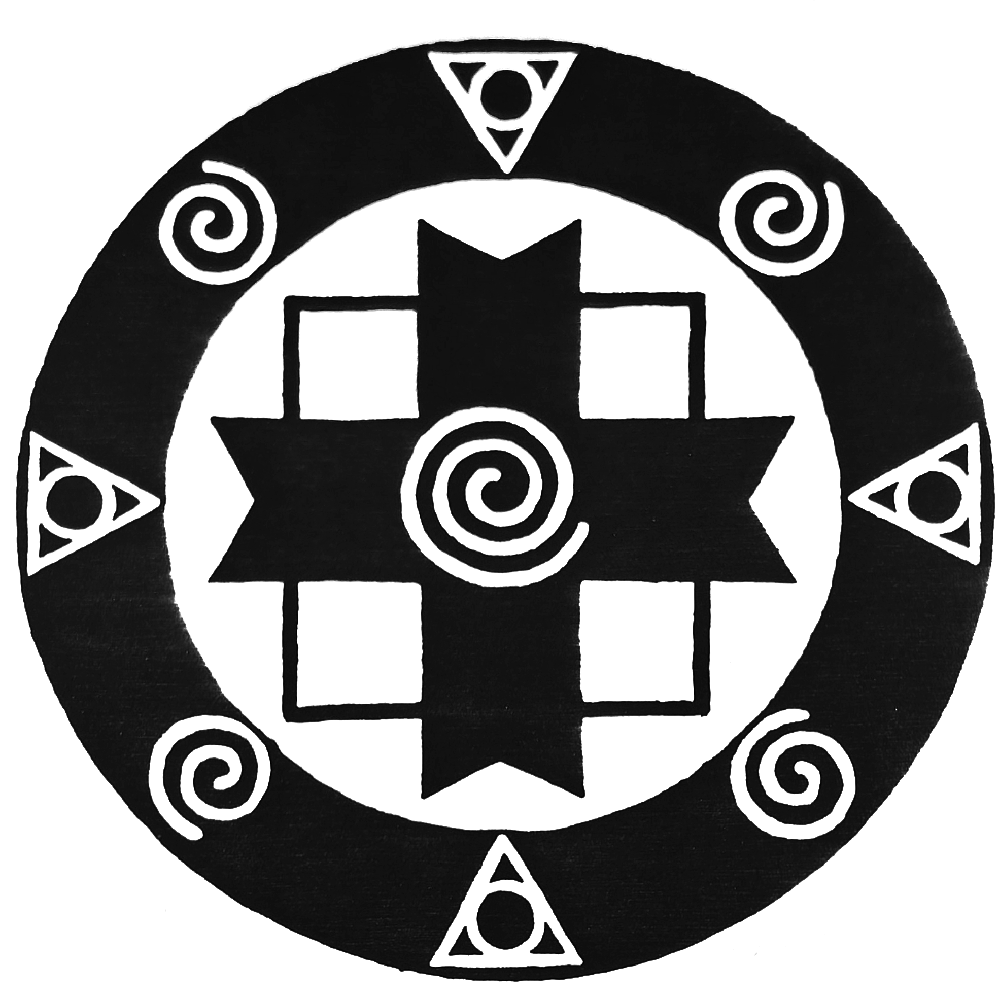

---

## What is a Vision Quest?

A Vision Quest is a search for guidance, strength and purpose in life. It is a ceremony to celebrate a life transition, to deepen understanding, to connect with the spirit, and to find one's individual path. Rites of passage are largely missing in our modern industrial culture. Without a clear threshold from the world of childhood into the world of the adult, many people in our culture never feel they have made this transition, no matter what their outer circumstances.

The Vision Quest experience empowers men, women and young adults to enact the age-old ceremonial pattern of symbolic death of an old life and rebirth into the new. Modern life transitions may be release from addictions, recovery from childhood trauma, movement from one career to another, discovery of a life partner, realizing one's path on the earth or developing connection to a higher power.

In creating a program designed for people of our time and place, we have taken the universal elements of rites of passage. As Vision Quest guides we understand ourselves as midwives, rather than teachers. We feel we are assisting the birth process facilitated by nature, God or whichever power you wish to name. Even though we have been involved in Native American Medicine Teachings, we do not define ourselves solely through those traditions. We are aware that our model of Vision Quest is a modern version of an ancient rite of passage that, in its bare bones, is common to indigenous peoples the world over.

The heart of the Vision Quest is a three day solo at a place the quester chooses. To prepare a participant for this process, pre-trip meetings are held in the month before departure for the wilderness. At these meetings we present a wide range of information concerning the physical, psychological and spiritual dimensions of the quest. We explore the expectations and rationale of the prospective quester. What changes are taking place in a person's life, what are his/her gifts and how can they bring them to the world, what are his/her fears and how can they be used as tools for growth are some of the issues we discuss.

The wilderness portion of the experience takes a full week with the Vision Quest solo taking place over three days and nights. The quester is encouraged to fast during this time, heightening awareness and helping to develop spiritual openness. Events on the quest mirror and illuminate those of ordinary life. The wilderness provides many archetypal teachers. One discovers one's relations in the blooming cactus, the soft song of a bird or the silence of a desert night.

The Vision Quester often returns full of inner strength and light, choosing to return to the wilderness of society guided by the lessons learned from living close to the power of nature. The last day of our wilderness journey is spent in group council. As guides we serve to mirror, integrate and empower each quester as they share the experience of their quest within the group.

The return from the quest can be a time of great energy and joy. Life is new, one has been reborn. But the reincorporation phase is a challenge. How does one bring new Vision back into the world of work, relationship and everyday life? We meet again for a reunion where the sharing of our experience deepens the understanding of our lessons and their integration into our lives. The energy of the Vision Quest flows into us as a healing and from us enters the world.

**AN ECO-SPIRITUAL PROGRAM DEVOTED TO VISION QUEST**  
Tony Robichaud

---

<!-- page: 1 -->
## The Purpose of this Book...

We have tried to consolidate the wealth of information available on spiritual quests into a few useful pieces. Our intent is to bridge the gap between the spiritual knowledge and practices of indigenous peoples and our own sense of what is relevant to modern culture.

In a more practical vein, we have compiled lists of materials and equipment, a basic first-aid outline, and some useful ceremony and ritual ideas that will help you in your own personal quest.

Our wish is to paint a broad picture with enough color that you are inspired to do your own research. This book was made possible by people like you sharing their stories and experiences.

### ...AND SOMETHING ABOUT ME

As a Mental Health Rehab Specialist, my current occupation involves case management and support services for emotionally and psychologically-disabled adults with Conard House in San Francisco. In addition, I have been teaching "Council Process" to various groups including at-risk youth at Sobriety High in San Rafael.

My own spiritual quest has involved Eastern and Western spiritual thought including the teachings of Native Americans. I have been leading vision quests since 1988, and am a member of the Wilderness Guides Council. Trained by a Native American medicine teacher, I earned the right to carry a pipe, conduct sweatlodge, and lead vision quest. It is clear to me that the spiritual quest of the Native Americans makes the perfect vehicle for those of us in twelve step programs seeking the path to our own wholeness. These quests are part of my spiritual path to share with others my experience, strength, and hope.

-- Tony Robichaud

---

<!-- page: 2 -->
## Table of Contents

| Chapter / Section | Page |
| :--- | :---: |
| **An American Indian Prayer** | 3 |
| **Introduction** | 4 |
| **Sitting in Council** | 6 |
| **The Medicine Walk** | 9 |
| **Separation** | 10 |
| &nbsp;&nbsp;&nbsp;&nbsp;The Beginning | 11 |
| &nbsp;&nbsp;&nbsp;&nbsp;Equipment | 12 |
| &nbsp;&nbsp;&nbsp;&nbsp;Medicines | 14 |
| &nbsp;&nbsp;&nbsp;&nbsp;Risks Associated with Climate | 15 |
| &nbsp;&nbsp;&nbsp;&nbsp;Risks Associated with Animals & Plants | 17 |
| &nbsp;&nbsp;&nbsp;&nbsp;Risks Associated with the Terrain | 19 |
| &nbsp;&nbsp;&nbsp;&nbsp;Attitudes & Field Hygiene | 20 |
| **Transition** | 21 |
| &nbsp;&nbsp;&nbsp;&nbsp;Introduction | 22 |
| &nbsp;&nbsp;&nbsp;&nbsp;Rituals | 23 |
| &nbsp;&nbsp;&nbsp;&nbsp;The Potlatch (Giveaway) | 28 |
| **Reincorporation (The Return)** | 29 |
| &nbsp;&nbsp;&nbsp;&nbsp;Emergence Day | 32 |
| &nbsp;&nbsp;&nbsp;&nbsp;Mirroring Circles | 33 |
| **The Medicine Wheel** | 34 |
| &nbsp;&nbsp;&nbsp;&nbsp;The Four Directions | 35 |
| **Appendix** | |
| &nbsp;&nbsp;&nbsp;&nbsp;Appendix A: Wilderness Ethics Statement | 41 |
| &nbsp;&nbsp;&nbsp;&nbsp;Appendix B: Naked Ponies | 44 |
| &nbsp;&nbsp;&nbsp;&nbsp;Appendix C: Fire Prayer | 48 |
| &nbsp;&nbsp;&nbsp;&nbsp;Appendix D: Books Recommended for Vision Quest | 50 |
| &nbsp;&nbsp;&nbsp;&nbsp;Evoking the Name of the Great Spirit | 53 |
| &nbsp;&nbsp;&nbsp;&nbsp;Prayers to the Four Directions | 55 |
| &nbsp;&nbsp;&nbsp;&nbsp;Books Recommended (Additional) | 57 |
| &nbsp;&nbsp;&nbsp;&nbsp;Lost Borders Press | 58 |

---

<!-- page: 3 -->
## AN AMERICAN INDIAN PRAYER

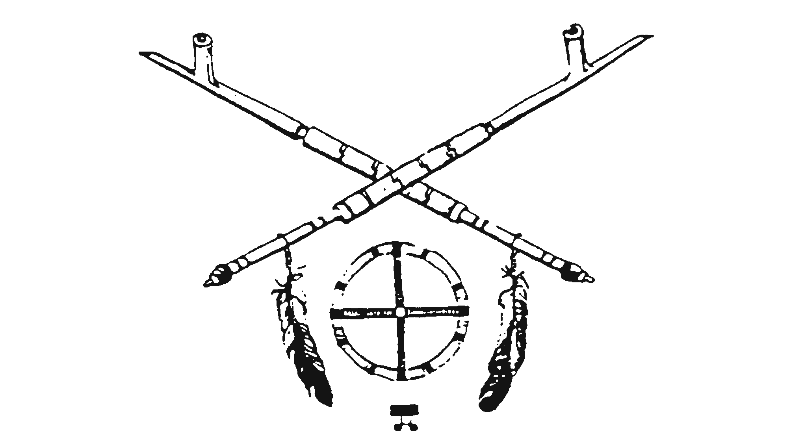

O' GREAT SPIRIT, Whose voice I hear in the winds, And whose breath gives life to all the world, hear me! I am small and weak, I need your strength and wisdom.

LET ME WALK IN BEAUTY, and make my eyes ever behold the red and purple sunset.

MAKE MY HANDS respect the things you have made and my ears sharp to hear your voice.

MAKE ME WISE so that I may understand the things you have taught my people.

LET ME LEARN the lessons you have hidden in every leaf and rock.

I SEEK STRENGTH, not to be greater than my brother, but to fight my greatest enemy -- myself.

MAKE ME ALWAYS READY to come to you with clean hands and straight eyes.

SO WHEN LIFE FADES as the fading sunset, my spirit may come to you without shame.

---

<!-- page: 4 -->
## INTRODUCTION

You have chosen to experience a Vision Quest. What does this really mean? "Where there is no vision, the people will perish." So spoke a prophet of old. In times of social upheaval, visions evolve; values undergo fundamental change; personal and social goals shift radically.

Adult life is no longer the predictable plateau it was once considered to be. There are many points during the so-called "productive years" and beyond that require painful adaptation to changing conditions: moving, separations, and divorce, life-threatening illnesses or the death of loved ones, job changes, radical alterations in life style, traumatic learning experiences, the "empty nest," retirement, and, of course, the approach of your own death for which our culture so little prepares us.

Jung wrote of "the psychic revolution of life's noon." The middle years, he believed, were a time of massive psychological changes, a process during which one's vision of life's meaning undergoes an important transformation:

> Thoroughly unprepared we take the step into the afternoon of life. Worse still, we take this step with the false presumption that our truths and ideals will serve us as hitherto. But we cannot live the afternoon of life according to the program of life's morning -- for what was great in the morning will be little at evening, and what in the morning was true will at evening have become a lie.
> 
> A human being would certainly not grow to be seventy or eighty years old if this longevity had no meaning for the species to which he belongs. The afternoon of human life must also have a significance of its own and cannot be merely a pitiful appendage to life's morning.
> 
> -- C.J. Jung in "Modern Man's Search for a Soul"

The transformations of the adult years and the discovery of the significance of life's afternoon does not occur in a single event or with one flash of insight. Rather they are a series of upheavals in personal life. Each is both a death and a rebirth: the loss of something important and the gaining of something new. Each constitutes a crisis of meaning. Each requires that we rediscover significance, find or create a new vision to guide us through the next chapter of our personal life story.

---

<!-- page: 5 -->
We live in a materialistic world without guiding myths or community rituals, and we are the poorer for it. Our ancestors generated rites of passage to mark the significant changes. These rites are as many and as varied as the cultures that form the stream of all social evolution. They give meaning to the personal transformations and they ensure community support for the emotional and behavioral changes we have to make.

We draw upon the past to generate new myths, new rites of passage, new meanings to the personal and social transformations we are experiencing. Our version of this ancient Vision Quest is one such attempt.

The one-week wilderness experience draws upon the power of ancient rites and symbols. It provides you with tools for the creation of your own myths, your own rituals filled with your own meanings. We have fashioned this experience out of underlying principles of such rituals.

In spite of the number and variety of such rituals it is possible to identify certain patterns common to all. One such pattern is the three-phase process through which those seeking their vision are led.

The first phase, **separation**, is a physical departure, real and symbolic, in which you are taken out of the context of daily life, removed from normal contacts and shorn of responsibilities or privileges.

The second phase, **transition**, is a threshold, a time of testing and trial during which you are put into touch with a spiritual source of power, and your sense of personal identity is permanently altered.

The last phase, **reincorporation**, is a return, a time when you come back into the life of the community where, ideally, you are supported in living out externally the internal changes that have taken place during the rite of passage.

---

<!-- page: 6 -->
## SITTING IN COUNCIL

From our first preparation meeting to our reunion after the quest, our "medicine circles" or "councils" provide an essential vehicle of communication for our community. Council, above all, is a place where any individual can express him or herself for the good of the overall group. Indeed, a healthy community does not survive without council. Also known as "the talking circle," council empowers each member to be just who they are without judgment or interruption.

The council circle is a sacred process. Through drumming, prayer, and smudging (purification with sage) we prepare ourselves to speak and listen to each other with our hearts. All members who sit in council are treated with respect because the Great Spirit speaks through everyone. No one is interrupted when they are speaking and everyone waits for their turn around the circle.

Usually a sacred object is passed from one individual to another: a stone or a stick which has a history with the group is held in turn by each speaker and reminds us of our pledge to speak from our hearts. The spirit of council is based on consensus and mutual respect. The talking stick may go around many times and many things may be said, yet the community usually arrives at a point of understanding without argument or blame. So whenever the community needs healing or intimacy in order to grow, we sit in the sacred circle and pass the stick.

When we sit in council, many things are happening apart from the words which are being spoken. Not only are we listening to what is being said, we are also "reading between the lines" and becoming part of a process much larger than we are. We call this "listening from the heart". In other words, many messages are sent and received in the circle which are not directly verbal. The following story illustrates how an underlying and often unspoken meaning emerges from the council experience.

*The following story is an excerpt from "The Way of Council" by Jack Zimmerman & Virginia Coyle*

> I think his name was Joe -- or something equally simple. He was part Hispanic and part Native American. His grandfather, his father's father, was full-blooded and a member of the Pueblo's Council of Elders. Joe had left the Pueblo as a child with his Hispanic mother and had come back during the Depression, when he was twenty, to further his education in the old ways.
> 
> Shortly after Joe's return, the Federal Government made an important proposal to the Pueblo People concerning a land trade and mineral rights. The elders called a council to decide what to do and Joe's grandfather invited him to join the circle as a witness.

---

<!-- page: 7 -->
> Joe waited for the men to enter the kiva before he climbed down the ladder, carrying his rolled-up blanket. He found a place behind his grandfather near the ledge cut into the curved adobe wall that supported clay pots, drums, and bundles of dried blue corn. A fire burned in the pit at the center of the floor. A white reflecting stone sat on one side of the fire opposite the sipapu, which represented the opening in the earth through which the First People arrived from the Underworld.
> 
> The elders sat quietly for several minutes, while Joe listened expectantly for the start of the discussion. Then the Pueblo leader unwrapped a blue and white bundle and took out what looked like a pipe stem. It was about a foot and a half long and had feathers and strands of turquoise tied to one end; the other end was wrapped in leather. Although he had never actually seen it before, Joe knew it was the tribal "talking stick" that was used only for important councils. The leader held the stick gently in his hands for a moment and then told the story of how Deer learned to run like tumbleweed chased by the dry desert wind. Joe dimly remembered the story from his childhood in the Pueblo.
> 
> When the leader finished, he passed the talking stick to the elder on his left, who told a story Joe had never heard before about the ancestors who had built the Pueblo. And so it went, each of the old men adding his tale to the circle, as if he were placing a precious log on the ceremonial fire. Part of Joe became a child again, enthralled with the stories that had defined and sustained his people for generations. The other part grew increasingly confused and restless. When are they going to start discussing the Government's proposal, this part of Joe wondered. Although the stories touched something deep in him, four hours had passed and the proposal had not been mentioned even once.
> 
> When the talking stick returned to the leader, Joe sat up very straight in order not to miss a word of the discussion he assumed would follow. But the leader slowly laid the stick down on the blue and white cloth and closed his eyes. All the others did the same. The only sound was the soft crackling of the fire.
> 
> In the quiet of the kiva with the elders, Joe remembered the sounds of drumming and singing from his childhood -- and he continued to wonder when they would start debating the proposal. After a very long half hour, all the elders stirred at once, as if by silent prearrangement, and looked into each other's eyes, slowly and deliberately. No words were exchanged. There was no debate. Then to Joe's amazement, the men stretched their limbs, immobile all those hours, got to their feet, and filed out of the kiva without saying a word. Joe waited until everyone had left and then hurried to catch up with his grandfather.
> 
> "What's going on?" he blurted out, a little out of breath. The old man stifled a smile and kept on walking. "I thought the council was going to take up the proposal," Joe continued in confusion.
> 
> "We did," his grandfather said in a quiet voice.

---

<!-- page: 8 -->
> "I didn't hear any debate -- and I certainly didn't hear any decision," Joe responded, still mystified.
> 
> "Then you weren't listening," his grandfather answered, and lost his battle with the smile. "In council one listens in the silences between the words with the ears of a rabbit."
> 
> "You mean the council actually took up the proposal and reached a decision?"
> 
> "Yes."
> 
> "In the silence?"
> 
> "And in the stories," his grandfather added, laughing.
> 
> Joe suddenly understood what had happened. At that moment he glimpsed the magic of council and felt his connection to what had happened in the kiva. The way the men listened and spoke, each contributing their part to the truth of the whole circle, struck him as nothing short of miraculous.

---

<!-- page: 9 -->
## THE MEDICINE WALK

The Medicine Walk, a day's journey upon the face of the Earth. A microcosmic form of the threshold trial, the walk is a mirror that reflects the signs and symbols of your inward quest. It will serve as an allegorical guide to your preparations.

Pack your knapsack with a few necessary items excluding food. Take water along if you will be hiking in an area where it is not available. Inform a friend where you are going and when you intend to be back. Then set out at sunrise in some natural area on a wandering, intuitive course, keeping to yourself and sticking your nose into whatever interests you. Though the walk does not necessarily exclude the presence of other people, your objective is to interact with no one until you return at the end of the day. If you are a tenderfoot, make your walk a conservative one, staying close to your vehicle or familiar landmarks. There is no need to endanger life and limb or to challenge the elements. Stop and rest whenever you wish.

As you wander, become aware of Nature's awareness of you. Signs and symbols indicating your life purpose, inherent gifts, personal values or fears, will present themselves. As you discern the beauty of life and the reality of death in the world around you, ask yourself: "Who are my people?" Pay attention to who you think about, worry about, wish was with you, and so forth. The spirits of these people may be important to you during your threshold trial. Find some natural thing that symbolizes your life quest or a quality in yourself. Bring it back and show it to your guide.

When the sun sets, return home. You may eat then, if you wish, or you may continue to fast through the twenty-four-hour period. This walking fast, of no physical harm to your system, will give you an idea of how you will react to a three-or four-day fast.

One of the benefits of fasting is that it points out the profound role food plays in your life story. As the threshold looms you will probably wonder if you are strong enough to "go without" for several days in a wilderness place. Test yourself ahead of time. Practice going without food; skip meals. Some find it difficult to fast when surrounded by a multitude of goodies and a routine of three meals a day. Are you one of those? Find out. You can also help yourself by watching what you put into your body. Traditional preparation for a fasting quest includes abstention from alcohol, drugs, or other substances that poison or inhibit your body and mind.

During the last week of preparation, we recommend that you abstain from eating foods that your experience has told you are likely to build up undigested toxins in your organs, tissues, and blood. Beef, dairy products, nuts, and oily or fried foods are often hard to digest, and can be eliminated. Concentrate on the intake of fresh fruits and vegetables. Rice and fish are good sources of protein. Drink plenty of liquids. Supplement with vitamins. In the end, you are the best judge of what is best for you. We do not prescribe any particular prefast regimen except that you be in good physical shape. Get plenty of sleep. Various physical activities, practiced daily, can be considered ceremonies of preparation are likely to be.

---

<!-- page: 10 -->
# PART I: SEPARATION

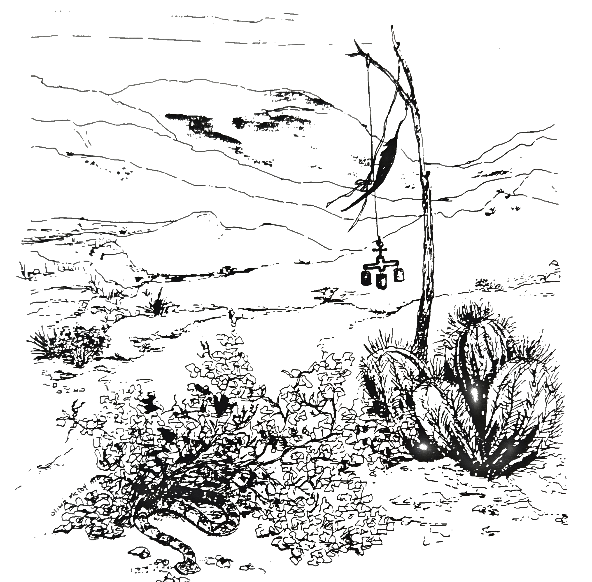

> "Humanity has reached the biological point where it must either lose all belief in the universe or quite resolutely worship it. This is where we must look for the origin of the present crisis in morality.... Henceforth the world will only kneel before the organic centre of its evolution."
> 
> -- Teilhard de Chardin in "The Divine Milieu"

---

<!-- page: 11 -->
## THE BEGINNING

> "Behold, I will do a new thing!"  
> -- Isaiah, 43:19

When you load your pack and climb into the vehicle that will take you into the wilderness, you will be starting the process of severing your ties with your familiar way of life. You will soon confront Nature without the usual technological wrappings.

You follow your ancestors in this quest not to learn to live without technology, but rather to free yourself to recognize natural forms and forces as mirrors reflecting back your spiritual heritage. You cannot reach forward until you reach back -- to your roots.

The journey to the wilderness is purposely long. Enough time will pass to sever connections with your everyday world and allow you to re-orient yourself to your unique past. Like the Native Americans, we think of the earth as our Great Mother. On your quest, you learn to turn toward the earth to quench your spiritual thirst and to find your own peace.

Whether you are facing a crisis in your life, attempting to find its meaning, or seeking a change you do not clearly understand, you can return to the Great Mother. Drink deep of her wisdom. Accept both her harshness and her delights. Learn to understand the language of her creatures. Allow her to chastise and purify you. She will help you find your Way.

All rituals of personal transformation involve some element of risk or threat to your sense of internal stability. The journey into wilderness arouses feelings which can range from slight apprehension to disturbing fear. These fears can be helpful to open personal spiritual doors kept carefully locked by our vigilant minds.

Think of the risks and incumbent fears as handmaidens of Mother Earth to help her teach you about yourself. They strip you of pride, take away your blinders, and waken your senses. They stir you to innovate, to see and do things differently for the first time, to think clearly, to create your own ways of dealing with life, and to see yourself as the Great Mother sees you.

Open yourself to your fears. Agree to assume the spiritual risks. The greater the risk you take, the greater the chance you have for personal growth and the longer the effects of the quest are likely to last.

As you begin preparation for the journey, be aware of these feelings for they show you unmistakably that you have begun the transformative process of severance.

---

<!-- page: 12 -->
## EQUIPMENT

The earliest inhabitants of the wilderness had skills and knowledge not readily available to us. You cannot recreate their tools and efforts, but you can simplify the elaborate technology of your own life.

As you walk to your rendezvous with the Great Mother take as little as you can to ensure your enjoyment and safety. The materials and equipment you will need has been whittled to a minimum by years of trial-and-error. In creating this list, we have considered your safety as well as your physical and psychological well-being.

In assembling your gear, you will be making choices that are symbolic of your attachment to the life you are leaving. Make each choice carefully. Remember that nearly everyone takes too much the first time out. The pack will be your symbol of your personal balance between freedom and security.

### ESSENTIAL EQUIPMENT LIST

- Journal & Pen
- Large plastic garbage bags
- 2 1-gallon jugs
- Boots or athletic shoes
- 1 1-quart canteen
- Plastic or wooden bowl
- Backpack
- Metal cup & spoon
- Sleeping bag & pad
- Toilet paper
- Tarpaulin
- Tooth brush & paste
- Bandanna
- Sweater or jacket
- 50 feet of light rope
- Small cook pot
- Clasp knife (sharp)
- Compass
- Waterproof matches
- Flashlight
- Police whistle
- Moleskin (for blisters)

### WARM WEATHER (ESSENTIAL)

- Sunscreen
- Large brim hat

### OPTIONAL EQUIPMENT

- Sketch book
- Insect repellent
- Musical instrument
- Specimen sack
- Needle & thread
- Tent
- Washcloth & towel
- Wash & dries
- Camera
- Poison oak medicine

---

<!-- page: 13 -->
## EQUIPMENT (DETAILS)

For those unaccustomed to life in the wilderness, the following tips should increase the enjoyment and reduce some of the predictable difficulties. Although these suggestions come from the collective experience of a number of people, your own experience will be your best teacher.

### JOURNAL & PEN

A journal history of your experience of the vision quest is probably your most lasting record. We ask that people share their entries (not the deeply personal ones) as additions to the communal whole. It's important to record your experiences. Even the most vivid experience can fade or bend with time.

During your fast you will see aspects of your life in new and powerful ways, yet you may fail to see the fullest significance of these insights at the time. In keeping a journal and recording as much as you can, you are creating a lasting influence on your life. Months and even years later, your journal can bring back its value and enjoyment.

### BACKPACK

This is a most essential piece of gear. Borrow one first. Pack it and put it on. Have a friend help you tie and adjust the shoulder and hip straps until you are comfortable. Remember, the weight rests on your hips, not on your shoulders.

### WATER JUGS

It is not necessary to buy special sturdy camping jugs, but find the strongest you can. Remember, it doesn't take much of a jolt in the wilderness to poke a hole in one. Clorox bottles are good -- wash them thoroughly, however.

### SLEEPING BAG

Most sleeping bags are designed for all-weather comfort. The better ones are light and small. If you have an older one, the trip leader will check it out if you ask.

### TARPAULIN

You will need one measuring at least 6 by 9 feet. This is one of your most versatile items. It acts as a ground sheet, a sun screen, a make-shift tent, or a barrier against cold. Your tarp should have several strong grommets along each side so you can tie it to trees or bushes in the wind.

---

<!-- page: 14 -->
### BANDANNA

Another essential, your bandanna can be a pot holder, a hat, an ear muff, a sponge, a dust mask, a sun protector, or a tourniquet -- the uses are endless.

### ROPE

You will need 50 feet, cut into smaller lengths if you prefer. It can be clothesline or mountain climber's rope. You use it to tie up and tie down just about everything you have. Food may have to be suspended from trees, firewood may have to be dragged great distances, or you may find many other uses. It is a part of your safety gear.

### CLASP KNIFE

Do not bring a sheath knife. If you fall, a sheath knife can be the cause of your worst injury.

### WATERPROOF MATCHES

Start looking early because these are hard to find. If you can't find them, keep your regular matches in a zip-lock baggie so they'll stay dry.

### POLICE WHISTLE

If you need to call for help, nothing works better -- or lasts longer -- than the sound of a police whistle blown in short bursts.

### OPTIONAL EQUIPMENT

Some people bring cameras, favorite books, sketch books and musical instruments. While art and ritual are, of course, closely connected, the line between entertainment and distraction is narrow. We urge you to avoid bringing anything which could come between you and your quest.

## MEDICINES

The only medicines allowed on the vision quest are prescriptions that do not affect one's perception of reality. The taking of drugs stands in contradiction to the spirit of this experience. The Native American religious practices that involve the use of hallucinogenic drugs are unconnected with the function and meaning of this vision quest.

---

<!-- page: 15 -->
## RISKS ASSOCIATED WITH CLIMATE

The wilderness is not a dangerous place, although like the city it has its own special hazards. Your safety and comfort are made all the more possible by preparation and education. Everyone should know how to recognize the signs of danger and what steps to take should an emergency arise.

The four areas of risk are: Climate, Animals & Plants, Terrain, and Attitude. If you have any questions, doubts, or concerns at all, discuss them with a trip leader.

Our Father Sun is our source of heat and light -- of life itself -- and deserves our love and considerable respect. Most risk in the wilderness comes from the effects of the sun. People seldom spend as much time in the sun as they do on a Vision Quest, so be reasonably and consistently cautious.

### HEAT EXHAUSTION

Heat exhaustion can be a serious threat. You can avoid its likelihood if you stay in the shade during the hottest part of the day, noon to 3:00pm. Symptoms include clammy skin, severe headache, nausea, dizziness, fatigue, possible fainting. If you think you are suffering from heat exhaustion, seek out your partner and return to base camp together. If it is mild, rest in the shade, drink water, wet head gear and/or take a sponge bath.

### SUNBURN

Use sunscreen, even if you tan easily. Avoid lengthy periods in direct sun. Do not rest in the sun -- if you fall asleep, you can be seriously, even fatally, burned. As with heat exhaustion, if you find yourself extremely uncomfortable, seek out your buddy and return to camp together. Symptoms include chills and fever along with the burn.

---

<!-- page: 16 -->
### HYPOTHERMIA

You must bundle up if the temperature drops, even if you feel great. Exercise will warm you a little, but without food you can quickly succumb to hypothermia. The clearest signs are chills and uncontrollable shaking. Put on your driest clothes and get into your sleeping bag, with someone if needs be.

### DEHYDRATION

We cannot overstate the importance of drinking at least three quarts of water each day. You may suffer dehydration if you are separated from your water supply for a number of hours. Remember, you can be losing water in dry climates even if you don't feel thirsty. The symptoms of dehydration are similar to those of heat exhaustion. If you have these symptoms, drink water, rest in the shade, wet your head, drink more water. Find your buddy immediately.

### LIGHTNING

If lightning occurs, seek out a lower-level, sheltered place until the storm passes. Lightning tends to strike higher rather than lower objects: tree tops, ridges, cliffs, etc. Summer storms often produce lightning. If you see a storm approaching, find lower ground even if you don't hear or see any lightning.

### FLASH FLOODS

Sudden and devastating, they are not a frequent occurrence, but it is best to sleep above a place where water has obviously coursed through in the past. Consult with your instructors regarding flash flood conditions.

---

<!-- page: 17 -->
## RISKS ASSOCIATED WITH ANIMALS & PLANTS

The Native Americans honored and respected the great animals of the wild for their physical and spiritual power, and so do we. There are very few animals or plants in the wilderness that can harm you. The precautions we offer are in the event of an accidental encounter. Advice from the most experienced wilderness experts: carry a walking stick wherever you go.

### LARGE ANIMALS

There are no large, dangerous animals except for bears in the mountains. If you are Vision Questing in bear country, remember that bears have been known to react unpredictably to the stimulus of the presence of food and the odor of it (and perhaps other human odors as well). If you should meet up with Bear, by day or night, a loud, moving, aggressive, defensive posture (i.e., agitated yelling, banging, thrashing, screaming) will almost always drive the bear away. If Bear persists, leave your camp and make your way to basecamp or to your buddy. If Bear shows up at night, make certain you have an emergency kit (with flashlight) and warm clothes on. You may wind up spending the night away from your place. The only other large animal, the mountain lion, is furtive and will not harm you.

### SMALL ANIMALS

Smaller animals such as raccoons, badgers, skunks, and rodents pose no danger unless they are cornered. Do not leave food scraps around your camp to attract them or encourage them to stay. If they persist in staying, scare them away from a distance.

### SNAKES

The only snake that can harm you is the rattlesnake. To avoid snakes or any animal, never put your hands or feet where you cannot see (under logs, in holes, etc.). Rattlesnakes are active during daylight hours from spring to early fall, hiding in cracks in rocks, not in holes. When a rattlesnake is startled, it will make a distinct buzzing sound that will indicate its location. Go in the opposite direction fast.

People get sick from snakebite -- quite sick -- but seldom die. If you are bitten, find your buddy and return to base camp immediately. It is difficult to remain relaxed and calm after being bitten, but try not to increase your metabolism by running. Slow your metabolism by deep, slow breathing.

---

<!-- page: 18 -->
### SCORPIONS

Scorpions hide under logs and rocks during the day, but they are active at night. In the morning, shake out your clothes and shoes before dressing. The sting from a scorpion is painful, but not necessarily terrible. Putting mud on the sting helps relieve the pain a little.

### BEES, WASPS, AND OTHERS

If you are allergic to bee stings, please inform a leader before you participate in a quest. Bees and other insects are bothersome but little else. Without the food that attracts them you are unlikely to see them for long.

Ticks and mosquitoes pose no greater threat to you in the wilderness than they do in civilization. We are keenly aware of the dangers of Lyme disease (spread by ticks) in California and will not enter any area reporting these outbreaks.

### TARANTULAS

Harmless giant spiders of the desert, tarantulas pose no threat to the Vision Quester. They avoid humans, as most critters do. If you should meet one, stop and talk awhile.

### POISON OAK

Next to sunburn, poison oak is the scourge of the unprepared. If you are unfamiliar with the appearance of poison oak, ask your leader for a nature lesson before you go. Poison oak will end your quest -- it is a real threat to most people. When in the wilderness, stay on the trail and never push through dense brush unless you can clearly see it contains no poison oak.

### BERRIES, ETC.

Do not eat any berry, fruit, nut, or anything that looks edible. Several edible plants have inedible variations. Common sense dictates that you don't eat anything you didn't bring with you.

---

<!-- page: 19 -->
## RISKS ASSOCIATED WITH THE TERRAIN

Wilderness terrain can be deceptive to a city or suburban dweller. Watch how far up you climb and how far you stray from your campsite. Pay close attention to the location of visible landmarks in relation to your campsite.

### SLIPS AND FALLS

Don't extend yourself beyond your physical capabilities. Be particularly conservative during your fast. Your body will hold energy in reserve and leave you weak and tired as a result. In this condition, you can easily break an ankle or wrist. Watch yourself particularly when you are hiking on rock slides or steep slopes without proper footing.

### GETTING LOST

Without familiar surroundings, it is easy for a person to get lost. Make note of venturing from your campsite, notice prominent features or leave signs to follow when returning. Rocks stacked up or branches wedged up in trees are helpful.

If you become lost, you will undoubtedly feel some panic. Use it to increase your awareness. Remember that your buddy will notice your absence in less than 24 hours. Even without water, by staying quiet and shaded, you can last 72 hours. Sit down and take time to examine your situation before taking some positive action.

By orienting yourself to the four directions (north, south, east, and west) you will not only insure your chances of not getting lost, but you will be performing an ancient ceremonial way of orienting yourself to the universe.

---

<!-- page: 20 -->
## ATTITUDES

### EMERGENCIES

The Native Americans practiced care for themselves through prayer and ritual, not through preventative or corrective medicine. To a large degree, we are beyond modern care during our stay in the wilderness. The following suggestions will help you if you have sustained an injury:

1. Help yourself to remain calm by breathing deeply and slowly. Slow breathing slows your metabolism and calms you down.
2. Stay in the shade and remember to drink your water.
3. In a few minutes after your injury, calmly begin planning how you will inform others.
4. Keep a positive attitude. It clears the mind and reduces stress more than people realize.
5. Look for the lessons in the injury. After all, learning is the reason you have come to the wilderness.
6. If you leave your campsite, note identifying features so you can find your way back.

There is no need to take chances of any kind. There is plenty to enjoy without pretending you are an intrepid pioneer. The quest is a journey inward, not an exploration of the planet.

## FIELD HYGIENE

Your latrine should be at least 200 yards from any water source. Paper is best removed (in a bag containing a little bleach powder) or burned, but should not be buried. Tampons, too, should be removed from the area. When you leave, bury your latrine with at least six inches of cover.

---

<!-- page: 21 -->
# PART II: TRANSITION

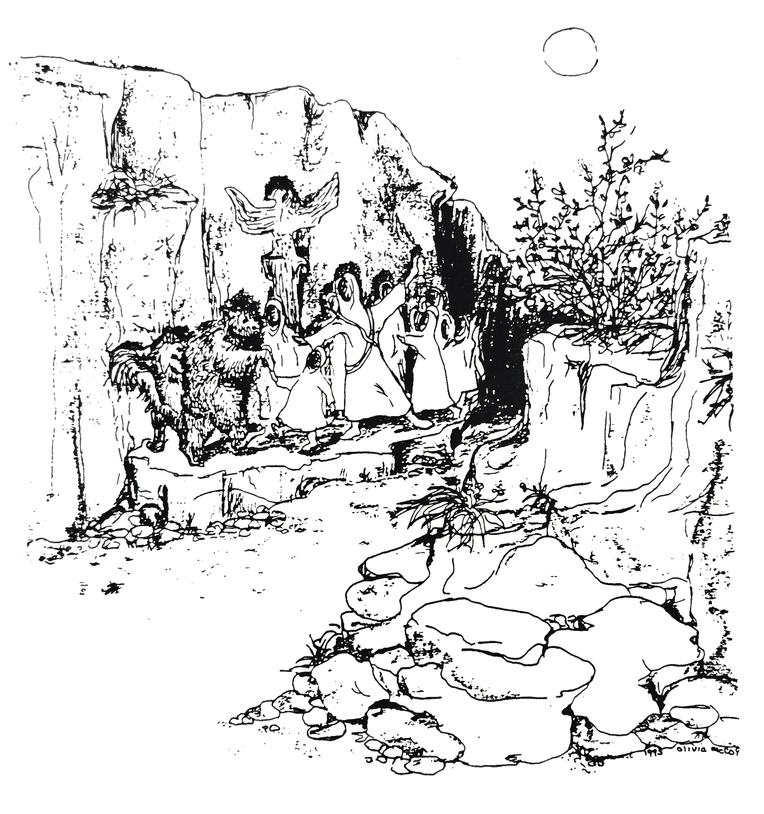

> "I think this must be a sacred place. Down the canyon a ways I could see a totem with a big Phoenix. People in robes were dancing by the glow of the moon and a wolf and large black bear joined them."
> 
> -- Journal Entry, 3rd Night Vigil

---

<!-- page: 22 -->
## TRANSITION: INTRODUCTION

> You do not need to seek reality,  
> it will come to you when you meet its conditions.  
> -- "A Course In Miracles"

The days of your transition time, between your separation and return, will be filled with symbolic experiences and rituals of your own creation.

Our modern society, in advancing technologically, has discarded the practice and value of myth and ritual. More and more, however, people recognize this as a mistake. In casting aside traditional rituals, we have impoverished our lives. We still have a spiritual hunger that material abundance cannot satisfy.

Rituals are not dusty routines created by ancient and forgotten peoples. Within each of us lies the amazing capacity for spontaneous creation of personal and deeply meaningful ritual. We need only surround ourselves with the conditions that nurture it. The Vision Quest provides these conditions.

Rituals are mechanisms by which individuals and groups tap a source of spiritual power that lies beyond conscious will. Rituals make the routine events of our lives significant; rituals create and enhance social harmony and bring people together in startling intimacy. They provide power for individuals to reach deeper within to find greater meaning than they could have imagined.

Somehow our world seems willing to support and encourage a reemergence of ritual as a routine part of modern life. Being alone for three days and nights will give you a chance to get reacquainted with your self, your own distinct sounds and thoughts. In the wilderness, you will create rituals that free a power within you to alter your feelings about yourself and the meaning you have given to your life.

---

<!-- page: 23 -->
## RITUALS

We offer you these rituals as building blocks for your own journey of personal transformation. They are common to many cultures in some form or other. Use them to suit your own quest. Combine them in any way that seems meaningful to you.

### FINDING YOUR PLACE

The idea of sacred ground is common to all spiritual traditions. Modern religions make sacred places of temples, cathedrals, and mosques. Ancient gods lived. Often these holy places were considered off limits to people going about the business of living. In some traditions, like those held by the Yaqui Indians popularized by Carlos Castaneda, each person seeks his own particular "power spot."

A power spot can be a place where you feel secure and comfortable, or a place where you feel you could meet Death on your own terms, or a place where you can hold time still. Or you may settle for a spot that is attractive, with a nice view, for reasons you may not fully understand at the time.

Consider both comfort and safety. Avoid stream beds (flash floods), highest places on the hill (wind), and places overlooking the valley (falls). Even within these modest restrictions you should have no trouble finding your own special spot.

### THE STONE PILE

We require everyone to use the buddy system. You and your buddy are required to agree upon a rendezvous point midway between your campsites, at which you have erected a pile of stones. This ritual links you to your buddy and your buddy to you. On a larger scale, caring for each other symbolizes our responsibility to care for all the human family.

When you approach your stone pile, do so with consciousness and purpose. You will place or move a stone to indicate you are safe and well. Learning and understanding this way of loving is part of your quest.

---

<!-- page: 24 -->
### THE FAST

Of all the ritual paths to spiritual empowerment, the fast is the most common. As you empty yourself of life sustaining food, you empty your spirit of thoughts and feelings that harm you and your relationships. Physical fasting is spiritual feasting.

On your three-day fast, you may find yourself surrounded by a host of spiritual witnesses -- ancient and modern -- who have traveled this same spiritual road to insight.

A short fast cannot harm you in any way -- provided you drink your three quarts of water each day. The physical effects of fasting are less noticeable than the psychological effects. With no meals to organize your day, you will come to close personal terms with one of life's most common security blankets.

Some people report a significant weakness on the second day. Be most careful not to tax yourself and rest frequently. The weakness and occasional dizziness will not last long. You may also find your boredom and annoyance more pronounced.

Make a conscious effort to link these physical and emotional reactions of the body to your spiritual purpose of purification and self-emptying. Whether you feel strong hunger or only weakness, let your body's reaction become a symbol for the spirit's longing. The Arapaho cries out, "Great Spirit, pity me. I am starving. I have nothing to eat." Our cry is for the food of the soul, and now is the time to be heard.

### CRYING FOR A VISION

Our need for illumination and enlightenment is one of the most powerful within us. Experiment with every form our spirit manifests: prayer, beseeching, chanting, meditation, even conversation.

The simplest form is a cry from the center of your being. Just cry out. Do not allow your life-long obedience to social tradition and childhood training to slow or distort your message. No one ever said the spiritual quest was either painless or polite. Cry for a vision -- your vision for your life.

---

<!-- page: 25 -->
### CRYING FOR A VISION (CON'T)

The experience you will have lies on a continuum. On one end lies the mystical out-of-body experience. On the other end lies a quiet appreciation for the natural world. Most people report the experience as a series of small insights into their own identities and the meaning they have given their lives.

You are crying for a vision with which to live the next phase of your life. Whether you are young or old, your vision will guide you in the changes necessary for the transition you face, the crisis you must endure, or the problems you must confront. Finding meaning in your life, gaining courage to do what you want instead of what's expected, or even facing death becomes a welcome responsibility when viewed through your vision.

### FINDING YOUR NAME

The Native American Vision Quest included asking the Great Spirit and the Earth Mother for a name. The name will signify your innermost secret self in the way your birth name signifies your outermost public self. The Native Americans in the wilderness expected to find their name in a dream, or in the shape of a cloud, or in the sudden encounter with an animal or plant.

Other cultures have the same ritual. In some, the secret name can never be revealed. In others, it is used only during holy times and rituals. And in some, the birth name is replaced by the secret name.

You will acquire your special name in a similar fashion. Think of who you really are and what name would be appropriate. Some people tell of having several names come to mind. Your name will come from a source beyond your own understanding. When it comes, you will recognize it instantly.

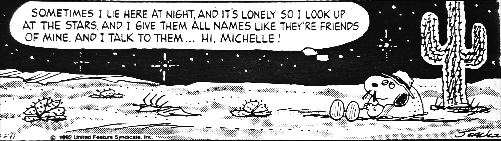

Months from now, when you recall your secret name, you will find yourself flooded with vivid memories and with a sense of inner self that is remarkably sustaining.

---

<!-- page: 26 -->
### YOUR DREAMS

Most people have at least one dream of exceptional clarity and power during the fast. Keep your journal and pen within easy reach at night so you can write down the dream immediately upon waking, before its vivid details fade. Sometimes it takes weeks or even months for a deeper meaning in your dream to become clear to you.

Do not limit your capacity to dream to the sleeping hours only. Dream freely while you are awake. Daydreaming in the silence of nature opens channels of intuition and imagination, bringing you wisdom unavailable in less spiritual surroundings.

### LISTENING TO THE EARTH MOTHER

As modern people, we tend to wink at ancient ideas about spirits in nature and their connection to humankind. The Kalahari Bushmen know the patterns of the plants and animals where they live as accurately as the finest ecologists who study there. These people also feel they are known by the creatures they share the desert with. Learn to think the way the Bushmen think -- that Nature is aware of you and is willing to share.

You may find yourself pondering a problem when suddenly an ant appears on your arm, or a hawk circles overhead. You may be lying under your tarp, lost in the privacy of your own thoughts. Without warning a wind whips the tarp away and fills your face with grit. The Earth Mother is speaking: listen well for her message.

Many people have found that some brutal aspect of the environment -- persistent wind, blinding fog, freezing rain, or unrelenting heat -- became an ally and was the "teacher" they had been seeking. Keep yourself alert and aware so the message can be heard.

Invoke the spirits of your place. Speak aloud to what you fear the most. Abandon all restraint. You may be surprised at the poetry that rises naturally from your heart when you are alone with the wind and stars. Approach the rocks, trees, and odd features of your landscape with reverence and humility. Ask them to teach you what you need to learn -- then watch and listen.

---

<!-- page: 27 -->
### THE CIRCLE AND THE VIGIL

This ritual is perhaps the most important component of the Vision Quest and the one we most strongly urge you to use. By the third day of your fast arrange stones or branches, whatever materials are at hand, in a large circle. It should be big enough to hold you and all your gear. Select the stones with care and work slowly, thinking about what you are doing.

The circle is the universal symbol of the unity of all being. It stands for wholeness and holiness and also affords ritual protection. It encloses its creator in its mandala.

At sunset of the third day, step inside your circle at its south portal and close the door. Your vigil is a symbolic dying of your old self in order to be reborn a new self at sunrise the next morning. You must remain awake to keep your vigil all night to witness the passing of an entire day in the history of the earth, consciously and with great care and attention.

This ritual lies at the heart of widely different cultures. The Hopi of the American Southwest and the knights of King Arthur's fabled court attended to it. The Hopi, dancing on the pounded earth of the sacred circle, and the knight, kneeling motionless on a cold stone floor before an altar, both watched the long night through, praying for a glimpse of the holy and eternal.

By dawn the next day, you will understand the ancient meaning of the rising sun. You will emerge from your circle, changed somehow, with a knowing and full heart which are indescribable.

If you listen closely to the Earth Mother, she will send you a message as you leave. It may be to erase the signs of your visit, or it may be to leave the great circle as a sign of the passing of one of her creatures. Listen for it and obey.

---

<!-- page: 28 -->
## THE POTLATCH -- (GIVE AWAY)

You may not understand what you have gained until long after you have returned to your home. You may, on the other hand, be bursting to tell what you have seen and felt. Before we begin our trip back, as a group we meet one final time to perform a symbolic ritual of sharing, the giving of a potlatch.

Bring back with you some tiny stone or twisted wood, some leaf or flower for someone special, if you wish -- or compose a song, or write a poem to recite for the enjoyment of all. We cannot fully receive holy power unless we make ourselves a channel for its flow to others. But remember it is the willingness to be a channel, to perform the symbolic give-away that matters.

What has happened to you, to your spirit, to your deep personal self, is far from complete. There lies before you one unavoidable challenge -- reincorporation -- which you must navigate alone. Be gentle with yourself.

---

<!-- page: 29 -->
# PART III: REINCORPORATION

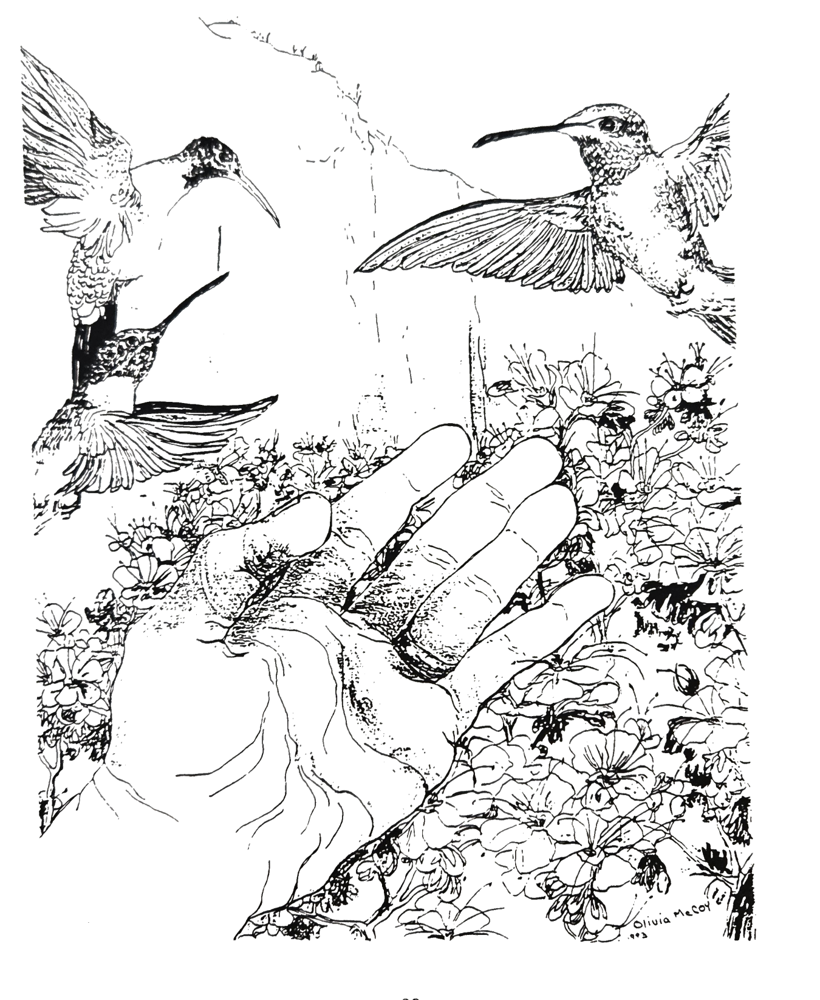

---

<!-- page: 30 -->
## REINCORPORATION (THE RETURN)

The reincorporation, for many, can be a challenging part of the Vision Quest. In some ways it is more difficult to bear than the ordeals of the quest itself.

There are some hints to guide us through the period of the return. Every spiritual tradition teaches the inevitability of the darkness that follows illumination.

> "After Samadhi, we sweep the floor," advises the yogi teacher.

> "Before Satori, the mountain is just a mountain and the river is just a river. During Satori, the mountain is no longer a mountain and the river is no longer a river. After Satori, the mountain is just a mountain and the river is just a river," says the Zen master.

Christian mystics wrote of "the dark night of the soul" that follows illumination, and believed that there are spiritual truths that cannot be experienced in any other way.

One person left us with a journal entry that puts the same idea into direct language:

> I have cried this morning. Am tearful now, just below my throat. Cried to hear the radio, cried to see the buildings and the freeway... Where Was Up With The Sun Down With The Moon? All was jagged and Unknowing. Brotherhood with Birds, Sisterhood with Streams; true Family was lost among the smell of exhaust and the screaming of cars. I would have to fight to keep What's Real alive in my heart and my being... this world knows nothing of it. I was frightened. How could I survive now, in this world once familiar, now estranged? Quietly, I knew I would have to Listen harder. Know Within Myself, look out less... This was A New Way, but it was Remembered and in My Blood For All Time... I wanted to lay fully on Mother Earth and sob, feel Her with me, walk with Lizard again. Today I walked alone... and cried.

Those of us who go directly to the Great Spirit and the Earth Mother as teachers learn that a spiritual high is followed by a low as naturally as the seasons cycle or the tides rise and fall. The task facing each of us is to learn to endure, and to grow through the "descent from the mountain top."

---

<!-- page: 31 -->
The doubts that assail you as you come down from the Vision Quest "high" are as ancient and as time-honored as the rituals you tried to follow on your way up. It helps to remember this when you begin to wonder what happened to the sense of harmony with the universe, the joyous surges of love, and the insights that promised dramatic and permanent changes in your life. At this critical time, people feel that the insights they had are false, little more than wishful thinking. Some conclude they are spiritually inadequate or inferior -- or both.

Your first challenge is to wait out the period of doubt and depression -- it passes. Your second challenge is to recognize and accept that regeneration occurs after the return, not during the quest. Ancient societies ritualized ways of reincorporating the returning member, but ours does not. That is your final challenge -- to be the architect of your own successful return.

Each of us must create for ourselves ways to bring the vision back, to implement the insights we had, to rekindle the love we had for each other but in the world as it really is, not the one we would like it to be. To the extent that you have been truly altered by your confrontation with the Great Mother, you should expect some disorientation as you try to bring these changes back into your life.

Our wilderness experience forges us into a "special community" essential to our individual growth and understanding. As we return to our regular world, we miss the actual community and the idea of community. Our "real" world seems so structured and inflexible and loveless compared to our "community."

It is crucial to recognize that the environment of our special community is a place where our old self can safely "die." It is not and cannot be a place where our old self can safely live. Our living is in the real world with all its ignorance, injustice, and brutality. Keep in mind that ancient peoples regarded the return as both a sacred and a dangerous time. Be gentle with yourself, and with the world.

The changes you seek in yourself or in "your people" cannot take root unless you have the courage to act on your vision, to be the changed person you felt yourself to be in the wilderness. The strength to act must come from within you. It will not come from a grateful world. To act on a vision is to recreate it and to alter your reality is to conform to it.

It often seems that more courage is required to return to the world than to embark on the quest.

---

<!-- page: 32 -->
## EMERGENCE DAY & MIRRORING CIRCLES

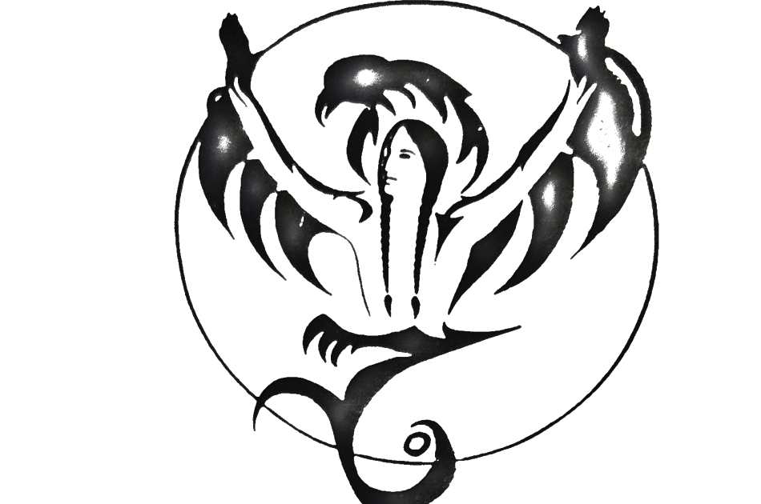

The first days after returning from vigil require careful attention. The community pulls together to act as a kind of spiritual incubator for each participant, nurturing newly found identities or insights like loving parents. Everyone takes turns listening, supporting, "checking-in," or simply being available if needed. There is an aura of openness and intimacy which can help each quester begin to contemplate his or her return to the world "back home."

We come together in council to hear of the wisdom we all share after our time alone. It is in these groups of listeners that we "tell our story." The quester is invited to share of the personal medicine derived from their vision fast. Some tell stories; some read from diaries; some give gifts from the wilderness; some sing songs; others are silent. Whatever the way, the medicine is always powerful, always profound -- for it comes directly from the spirit of the quester.

---

<!-- page: 33 -->
### MIRRORING CIRCLES (CONT'D)

These councils are known as "mirroring circles". The listeners, especially the guides or "elders", reflect back to each individual the unique beauty of their experience. The listening and mirroring is deeply respectful and positive, for each of the other questers has come from their own communion with spirit and therefore naturally uplifts and validates the spirit of the storyteller. The elder guides, having walked through this terrain many times, gently and carefully show the way and give their gifts of insight.

It is in the mirroring circle that we begin to integrate or "make sense" of our experience. Questers often say they remember certain moments or pieces of their mirroring time that became powerful reminders many months later. Sometimes a certain reflection allows us to see a part of ourselves which we had not been aware of. Perhaps a mountain or a tree or a visiting bird has given a sign of unseen inner strength or vulnerability. Whatever the way, each member emerges from the mirroring councils with a profound sense of sharing and increased self-knowledge. We are now fully "birthed" and fortified for our return to the world we have left behind.

---

<!-- page: 34 -->
# THE MEDICINE WHEEL

> It is change, life, death, birth, and learning. This Great Circle is the lodge of our bodies, our minds, and our hearts. The Circle is our Way of Touching, and of experiencing Harmony with every other thing around us. And for those who seek understanding, the Circle is their Mirror.  
> -- Hyemeyohsts Storm in *Seven Arrows*

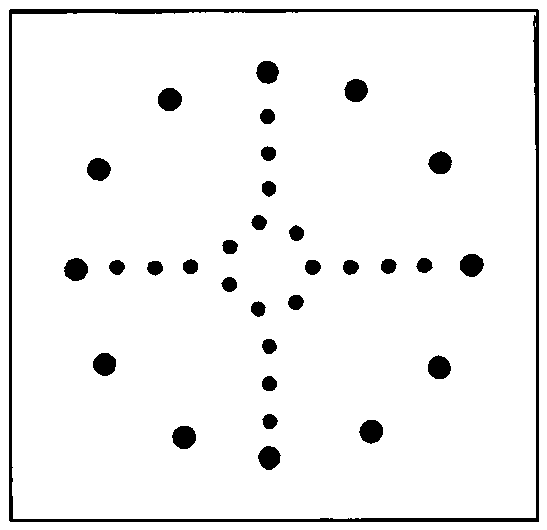

> A universal theology is impossible, but a universal experience is not only possible but necessary.  
> -- From *A Course In Miracles*

---

<!-- page: 35 -->
## THE MEDICINE WHEEL: THE FOUR DIRECTIONS

The Medicine Wheel is an ancient symbol of the universe. Within this Wheel all things are contained, all things are equal. The Vision Quest of life is the way we discover ourselves and find our place on the Medicine Wheel.

In perhaps the easiest terms, the Medicine Wheel can be seen as the four directions of the compass, the four seasons of the year each cloaked in its own color, and the four seasons of a person's life, each with its own purpose, joys, and sorrows.

### THE SPIRIT OF THE EAST (GOLD, EAGLE, FIRE, SPRING)

The medicine power of the East is the power of enlightenment, wisdom, and spiritual vision, our highest goals in life. It is the place of the morning star, the only star which shines with the sun. The medicine of the morning star is wisdom, involving the light of discernment.

The season of the East is spring, the awakening of life from winter and the birth of new life, new seeds, new buds. It is a season of planting seeds and new ideas, new beginnings. The time is sunrise when life awakens from sleep.

### THE SPIRIT OF THE SOUTH (RED, MOUSE, EARTH, SUMMER)

The medicine power of the South is growth occurring so rapidly that trust is needed because there may not be time for evaluation. It is a time of extending out into the world, a time of experiencing, investigating and testing, of putting knowledge, vision, and wisdom to work in the world.

The season is summer, when spring is fulfilled. The sun is direct and hot; there is movement and nature is flourishing. It is the time of the sun dance to celebrate and commune with earth and sun. The power of the living, breathing earth is conspicuous at this time.

---

<!-- page: 36 -->
### THE SPIRIT OF THE WEST (BLACK, BEAR, AIR, AUTUMN)

The medicine power of the West is introspection and self-evaluation from which realization and awareness develop. The growth of summer stops, and during autumn life prepares for the season of renewal in the North during winter. The time is sunset, when life prepares to slow down or sleep.

The West corresponds to our middle years, a time of harvesting ideas matured through testing, experimenting, and investigating in youth. Although fresh new visions never cease, this is when one should discover and develop strength to sustain visions already received and lessons already learned.

### THE SPIRIT OF THE NORTH (WHITE, BUFFALO, WATER, WINTER)

The medicine power of the North is renewal and purity; its quality is objectivity. As there is a time of withdrawing from the external world and entering within oneself, there is also a time of withdrawing and rising above our multicolored, multi-dimensional reality to view our life in objectivity, for cleansing and renewal. At this time we are slowed in the things of the world but we are quickened in spirit.

The season of this direction is winter, when the earth seems to be asleep. The time of day is midnight when we are at rest from the day. Life and the forces of nature renew themselves in sleep for the coming new growth of spring.

---

<!-- page: 41 -->
# APPENDIX A: WILDERNESS ETHICS STATEMENT
*(Agreed Upon by the Wilderness Guides Council)*

Wilderness ethics arise from the establishment of a two-way relationship between the quester and the natural environment. The primary vehicle of this relationship is the ceremony of the Vision Quest. It is hoped that the following guidelines will assist questers in walking gently upon the earth.

1. We do not drive vehicles off established roads.
2. We do not use sound-producing electronic devices in the wilderness. We value the natural silence of wilderness places, being conscious of the sounds we choose to introduce.
3. When hiking with our groups, we avoid making trails and spread out when hiking cross-country (except when crossing fragile cryptogamic soil -- see below). When trails are available, we use them.
4. We avoid stepping on cryptogamic soil (the dark, clumpy fungus that grows on the desert floor). Cryptogamic soil fixes nitrogen, prevents erosion, and creates a nursery that will help support the growth of larger plants in a previously non-arable spot. It is usually best to walk single-file through these areas. We also avoid breaking down banks, especially around basecamp areas, and step carefully on desert pavement, trying not to loosen the soil around these rocks.
5. We don't pick wildflowers and are careful not to trample them while walking. Also we are careful not to damage other desert plants such as cactus and brush, and avoid stepping on or near animal burrows.
6. Springs are crucial to survival for desert animals and human travelers. We do not camp within 1/4 mile of them, and we avoid polluting the area around them with human waste, or damaging vegetation near them. Our presence near these springs will drive animals away.
7. We avoid disturbing animals in any way; their living situation is precarious and to be honored.
8. We leave animal remains, human artifacts, and sensitive archaeological sites in the desert for the enjoyment of others.

---

<!-- page: 42 -->
9. We minimize ground disturbance, moving rocks, leveling ground and modification of campsites. We make every effort to return the ground surface to the way it was when we found it. Using a rake to erase footprints and tire tracks on pull offs, and wearing soft shoes around basecamp and solo sites are steps to help us to minimize our impact.
10. As a general rule we discourage the use of fires. If we do have fires where legal, we use existing fire pits. If no pit already exists, we leave no sign a fire was there. We always use stoves for cooking.
11. We have our groups pack out all toilet paper, tissues and feminine hygiene products. Toilet paper buried in dry country does not break down.
12. We instruct participants to use a trowel to bury human waste to a depth of 4 to 6 inches, replacing the soil to leave few signs of human disturbance. The placement of a large rock over the replaced soil can discourage animals from digging it up.
13. We avoid burying human waste in wash bottoms. Terraces or hillsides that are not desert pavement are a better choice.
14. Our groups carry out all of our garbage and trash, and also take out any other trash we may find.
15. We dismantle any old stonepiles, circles, fire pits, and other human markers we may find. This does not include mining claims (usually a high pile of rocks built around a jar containing a claim). In areas with fire pits, we dismantle all but one.
16. We make every effort not to use a particular desert basecamp area with a group more than once a year. If an area is used more than once, we give ample time (approximately 6 months) for the place to renew itself. This is particularly important in years of drought.
17. We cultivate an enduring relationship of stewardship and prayer with the land, remembering that we are guests in a sacred sanctuary.

---

<!-- page: 44 -->
# APPENDIX B: NAKED PONIES
*by J. Allen Boone in "Kinship With All Life"*

When I was a boy, few pictures interested me more than those of American Indians riding their ponies at full speed through rugged Western country. I wondered how the Indians managed to stay aboard their mounts and navigate them without using bridles, saddles or blankets. I wondered why they did not slide over the animal's head or backward over its tail or off in some other way at sudden changes in speed and direction.

Later I watched American Indians ride in the famous Buffalo Bill's Wild West Show. It amazed me to see how easily and comfortably the riders stayed on their mounts while rounding curves at full speed and making sudden turns. As the years rolled on I had opportunities to travel far and wide. I was privileged to see almost every type of horseman in action; but with all that experience I still could not figure out how the Indians rode their ponies with such co-ordination and rhythm without bridles or saddles.

At last I had the opportunity of meeting Indians in their own country, and of having them share with me some of the secrets of the ancient Indian art of moving in friendly identification with all life. But this secret sharing did not take place until I had been put through a kind of probationary period. The Indians were penetrating in their scrutiny of my character and motives.

Finally I was admitted through the invisible gate which has separated the real American Indian, with his great wealth of wisdom, from the white man. I had to learn that unless one can first walk in mental and spiritual rhythm with an Indian, he cannot really walk with him at all.

I became "inner friends" with an unusually colorful Indian chief. He was all that a man in his position is supposed to be. He was superlative in the role he played in the earth scene; under all tests he was a credit to his species, his tribe and the world he graced so unforgettably. Among the Indians he was particularly admired and respected for his moral worth and for his clear "inseeing," that is, his ability to see into causes and realities behind sense phenomena. He was also greatly esteemed for his wisdom, reticence, physical stamina, fearlessness, leadership qualities, and for his expertness in riding naked ponies. Astride one of those ponies and in motion, he was magnificent. Watching him ride was an experience to be grateful for.

---

<!-- page: 45 -->
Until I reached the point where I could talk with him in that universal speech which does not have to be uttered, communication between the chief and me had to be carried on mostly in sign language with the help of an interpreter. The chief spoke very little English by preference, and even when he spoke in his own Indian language, his words were few, carefully selected, widely spaced and discreetly guarded. He was far more interested in listening to the silent universal language which was being spoken through all things all about him all the time.

Late one afternoon as the chief, the interpreter, and I sat in the lap of Mother Earth watching a lovely sunset, I asked the chief through our interpreter if he would tell me the Indian secret of riding a pony without bridle, saddle or blanket. A profound silence followed which lasted over an hour. Then a few sounds came rumbling from the chief. The interpreter turned in my direction. "The chief says that you asked a good question," he said. There was another long silence. "Is that all?" I finally asked the interpreter. He nodded.

Thereafter whenever the three of us were together I would always find some excuse for asking the chief about riding naked ponies. But I never got an answer. I did not understand this at the time; later I realized that I was on character probation.

Most unexpectedly one day, when I had forgotten to ask my favorite question, the chief wanted to know why I was interested in Indian pony riding. I told him through the interpreter that because of what the dog Strongheart had taught me about relations with animals, I was trying to learn all I could about that mysterious bond which holds all created things in inseparable and harmonious kinship. I said that I believed his pony riding secret could furnish much help for me in that direction.

For some time the three of us sat still. Then the chief began slowly intoning words in his own language, aiming them at the horizon line. When he had finished the interpreter began speaking. "The chief wants me to tell you," he said, "that for you to 'full-know' what you have asked him, you would have to be Indian born, Indian taught, and grow up with an Indian pony as your brother. Then you would understand the Great Mystery. You would be part of the Great Mystery. But he will tell you something about it in sign language and he says for you to catch what you can."

The chief held up his two rugged hands with their palms in my direction. After a pause he placed them gently together in front of his face as though in prayer. Another pause. Then his fingers came down until the tips of them rested on the backs of his hands. The two index fingers then came straight up as though they were one finger. With his hands in that position he slowly

---

<!-- page: 46 -->
made a complete circle with them, finally stopping them in front of his face again and looking at me with a questioning expression on his face.

What I caught from his rhythmical sign language was this: When the chief held his two hands in my direction, I intuitively knew that one of them symbolized an Indian and the other a pony. When his two hands touched in front of his face, it meant friendly and understanding contact between Indian and pony. When the fingers intercrossed and came down onto the backs of his hands, it signified an interrelating of all their interests. When the two index fingers steepled up, it represented "togetherness" blending into "oneness." And when he made the complete circle with his hands in that position, it indicated that Indian and pony were functioning as a single unit in mind, heart, body and purpose. The interpreter told me that I had made "a good catch."

Whenever the chief met an animal or any other living thing, he would pause and establish mental contact with it. While the physical part of the chief walked the earth, the mental and spiritual part of him moved in boundless space, embracing all creation in a comprehensive kinship in which all things were important and all things needed in the divine Plan and Purpose. Ever helping him to understand and move in rhythm with all creation was his companion, counselor, guide and helper--The Big Holy.

The chief never reads books, magazines or newspapers; he never listens to the radio and never watches television. Whenever he wants to know the latest news, whenever he needs fresh wisdom, mental diversion, spiritual nourishment, or clearer vision about some particular problem, he goes to what he calls the Great Library; other people call it the universe. The "Volumes" he consults in this Library are the sun, the moon, the stars, the clouds, growing things, his favorite pony, and all sorts of other animate and inanimate things. He consults them with humility, receptivity and deep reverence. His rich life experience has taught him that the Author speaking through each one of these living manuscripts is The Big Holy.

---

<!-- page: 48 -->
# APPENDIX C: THE FIRE PRAYER
*-- by Mimi Robichaud, Mother of Little Ryder*

**O' GREAT SPIRIT**  
Here, now, we feel your presence in the warmth,  
    of this cleansing fire we build with love.  
We use your gifts -- treasures of our Mother Earth.  
We smell you in her smoke. We know it comes from you  
    and goes back to you with our prayers upon it.  
We, your people, pray that we never forget  
    that you live in the rains that fall to earth,  
    in the rivers that run, in the trees that grow,  
    in the fire and smoke that completes this great circle.  
We come not alone to you, Great Spirit.  
We bring you prayers of hopes and dreams for others.  
We ask you to look upon them with joy of wholeness and love,  
    for they know you live within them.  
Great Spirit, we bring with us prayers for those who live  
    without wholeness in your world,  
    burdened by the many hawks that circle.  
Great Spirit, we bring with us prayers for those who live,  
    without understanding of the sacred river,  
    deafened by the roaring of it in their ears.  
Great Spirit, we do not judge.  
Help us to find you.  
Help us give to those without as you give us this wood to burn,  
    if it means only to see more clearly by a dying ember.  
Let us all see!  
We give these prayers to you out of love, the pure love you  
    surround us with--unselfish and forever.  

*(Each person repeats as their given prayer burns)*  
***"I give this prayer out of pure love."***

---

<!-- page: 50 -->
# APPENDIX D: BOOKS RECOMMENDED FOR VISION QUEST

## Hanta Yo

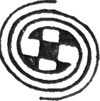

*Seated in this circle, with eyes closed, repeat after me, saying it silently to yourself and for the others that sit with you in this circle:*

These people try very hard.

These people have just as difficult a life as I do, and they try very hard.

They want the same thing I want in their hearts.

They want the joy of looking gently on the earth.

They want the peace of acceptance.

They want the knowledge that they are not alone.

They want to be, and to see, and to feel, and to give, and to receive love; and what I do affects them, every thought I think, every effort I make helps them on their way.

For the sake of the people that sit in this circle with me I will make this effort.

I will not wait to begin, I will set my eyes on God or whatever you chose to call Love and I will walk straight in that direction, and I will never, ever, ever, look back.

I will do this for you who sit with me in this circle and I will do this for me, and no matter how many times I forget, I will simply start over.

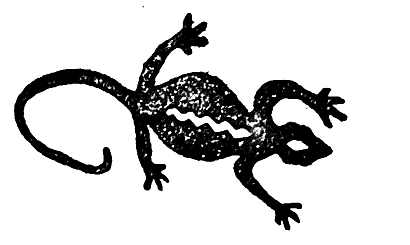

---

<!-- page: 53 -->
## Evoking the Name of the Great Spirit: WAKANTANKA

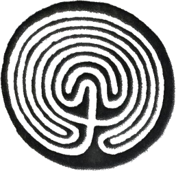

*We evoke your name, Great Spirit.*  
*We vow to learn your way, which is to listen in order to lessen the suffering in the world. You know how to listen in order to understand. We evoke your name in order to practice listening with all our attention and open-heartedness. We shall sit and listen without any prejudice. We shall sit and listen without judging and without reacting. We shall practice listening in order to understand. We shall practice listening so attentively that we are able to hear what the other is saying and also what is left unsaid. We know that just by listening deeply we lessen the pain and suffering in All Our Relations.*

*We evoke your name, Great Spirit.*  
*We vow to learn your way, which is to be still and look deeply into the heart of things and into the hearts of people. We shall practice looking with all our attention and open-heartedness. We shall practice looking with unprejudiced eyes. We shall practice looking without judging and without reacting. We shall practice looking deeply in order to see and understand what the roots of ill-being are. We shall practice your way; that is to use the blade of understanding to cut through the bonds of suffering; to free ourselves and All Our Relations.*

*We evoke your name, Great Spirit.*  
*We vow to practice your aspiration to act with the eyes and heart of compassion. We vow to look to you in the East each morning and pray that you help us to bring Vision and the fire of Spirit to All Our Relations. We vow to look to you in the South each noontime and pray that you help us to bring Healing and Love to All Our Relations. We vow to look to you in the West each evening and pray that you help us to bring Cleansing and Forgiveness to All Our Relations. We vow to look to you in the North each night and pray that you help us to bring Wisdom and the Power of Presence to All Our Relations. We vow to remember as we walk the Good Red Road of service that every word, every look, and every action can bring happiness to another. We pray for your blessing, Great Spirit, that we may become the source of peace and joy for All Our Relations.*

Tony  
*Aho Mitakuye Oyasin*

---

<!-- page: 55 -->
## Prayers to the Four Directions

### The East # 1

*O Great Spirit of the East,*  
*Radiance of the Sun,*  
*Spirit of new beginnings,*  
*O Grandfather Fire,*  
*Great nuclear fire of the Sun.*  
*Power of life-energy, vital spark,*  
*Power to see far, and to imagine with boldness.*  
*Power to purify our senses,*  
*Our hearts and our minds.*  
*We pray that we may be aligned with You,*  
*So that your power may flow through us,*  
*and be expressed by us,*  
*For the good of this planet Earth,*  
*and all living beings upon it.*

### The South # 2

*O Great Spirit of the south,*  
*protector of the fruitful land,*  
*And of all green and growing things,*  
*The noble trees and grasses,*  
*Grandmother Earth, Soul of Nature.*  
*Great power of the receptive,*  
*Of nurturance and endurance,*  
*Power to grow and bring fourth*  
*Flowers of the field,*  
*Fruits of the garden.*  
*We pray that we may be aligned with you,*  
*So that your power may flow through us,*  
*For the good of this planet Earth,*  
*And all living beings upon it.*

### The West # 3

*O Great Spirit of the west,*  
*Spirit of the Great Waters,*  
*Of rain, rivers, lakes and springs.*  
*O grandmother Ocean,*  
*Deep matrix, womb of all life.*  
*Power to dissolve boundaries,*  
*To release holdings,*  
*Power to taste and to feel,*  
*To cleanse and to heal,*  
*Great blissful darkness of peace.*  
*We pray that we may be aligned with you,*  
*So that your power may flow through us,*  
*and be expressed by us,*  
*For the good of this planet Earth,*  
*And all living beings upon it.*

### The North # 4

*O Great Spirit of the North,*  
*Invisible Spirit of the Air,*  
*And of the fresh, cool winds,*  
*O vast and boundless Grandfather Sky,*  
*Your living breath animates all life.*  
*Yours is the power of clarity and strength,*  
*Power to hear the inner sounds,*  
*To sweep out the old patterns,*  
*and to bring change and challenge,*  
*The ecstasy of movement and the dance.*  
*We pray that we may be aligned with You,*  
*So that your powers may flow through us,*  
*And be expressed by us,*  
*For the good of this planet Earth,*  
*and all living things upon it.*

---

<!-- page: 57 -->
## BOOKS RECOMMENDED FOR VISION QUEST

### SEVEN ARROWS
*by Hyemeyohsts Storm -- Harper & Row, Publishers*

This is the quintessential book on the spiritual life of the Native American period. As documentation, SEVEN ARROWS is, without any doubt, the best in an enormous crop of Native American studies. This book is not just recommended, it is required reading for anyone with a serious interest in their own spiritual path.

### EARTH PRAYERS
*Edited by Elizabeth Roberts & Elias Amidon -- HarperSanFrancisco, A Division of HarperCollins Publishers*

365 Prayers, poems, and invocations for honoring the earth. This is an extraordinary collection of prayers from all over the world spanning all historical periods, bringing us together with a common prayer for our planet's people in this time.

### ECOPSYCHOLOGY
*Edited by Theodore Roszak, Mary E. Gomes, & Allen D. Kanner -- Sierra Club Books -- San Francisco*

ECOPSYCHOLOGY marks the coming together of leading-edge psychologists and ecologists to redefine sanity on a personal and planetary scale. Here is the first in-depth exploration of an exciting new field, presenting revolutionary concepts of mental health along with a vision of renewal for the environmental movement.

### THE SOUL UNEARTHED
*Edited by Cass Adams -- A Jeremy P. Tarcher / Putnam Book, published by G. P. Putnam's Sons -- New York*

THE SOUL UNEARTHED is a ground-breaking anthology in celebration of the transformative power of wilderness. "Cass Adams has done us an invaluable service in compiling this anthology. Here, together for the first time, are the voices of wilderness advocates, teachers and guides, supporters of deep ecology, pioneers in the emerging field of ecopsychology, nature writers and poets -- sharing their love for what is wild within and around us. Their stories reflect decades of experience and insight affirming the role of wilderness in personal transformation... They remind us that when we lose contact with the wild, we lose that which springs most spontaneously from our soul." -- From the Foreword by Elizabeth Roberts, Wilderness teacher, guide and coeditor of Earth Prayers and Life Prayers.

### COYOTE MEDICINE
*by Lewis Mehl-Madrona, M.D. -- Simon & Schuster, Inc.*

COYOTE MEDICINE is an entertaining true story, and enchanting exploration of an enduring spiritual tradition, and an encouraging view of a new evolution of healing and caring. Dr. Mehl-Madrona is at home in both the world of his traditional culture and the world of conventional scientific technology. From this perspective he can see the merging trails that lead to the future of health care on this planet. This is a story of hope and heart. -- Doug Boyd, Author of Rolling Thunder, Mad Bear.

---

<!-- page: 58 -->
## LOST BORDERS PRESS

*The following publications may be purchased through your local bookstore or by contacting:*

**LOST BORDERS PRESS**  
Box 55  
Big Pine, CA 93513

### THE WAY OF COUNCIL
*by Jack Zimmerman with Virginia Coyle -- Las Vegas: Bramble Books, 1996*

Clear and compelling exploration of the dynamics of the council tradition as practiced in modern settings, from the corporation boardroom to the high school classroom. A training method in basic communications skills. A must for those who participate in or facilitate groups.

### BETWIXT AND BETWEEN: PATTERNS OF MASCULINE AND FEMININE INITIATION
*Edited by Mahdi, Foster, and Little. La Salle, Illinois: Open Court, 1987. 528 pages.*

A rich and readable compendium of essays on life transition -- from puberty to death -- by well-known contemporaries in anthropology and psychoanalysis. "It is a book whose time has finally come and could serve as the basis for an entirely new genre of training and teaching."

### THE BOOK OF THE VISION QUEST: PERSONAL TRANSFORMATION IN THE WILDERNESS
*by Steven Foster and Meredith Little -- Revised and expanded edition. New York: Prentice Hall, 1988*

In this revised edition of the original classic, two new chapters are added and others are revised and enlarged. Blending diverse heritages, wisdoms, and teachings, the book is a mystical, practical, and intensely personal journey of self-knowledge. "Steven and Meredith are true modern-day visionaries" (Sun Bear).

### THE ROARING OF THE SACRED RIVER: THE WILDERNESS QUEST FOR VISION & SELF-HEALING
*by Steven Foster and Meredith Little, Illustrations by Emerald North -- Lost Borders Press.*

Foster and Little elaborate on an ancient rite of passage that has much-needed resonance for the seeker of today. Leading us step-by-step through the wilderness toward the sacred mountain, it is a story not just of personal healing but of sacrifice, love, and the need to share this healing vision with others.

### WILDERNESS VISION QUESTING AND THE FOUR SHIELDS OF HUMAN NATURE
*by Steven Foster and Meredith Little -- University of Idaho Wilderness Research Center, #16, 1996.*

Wilderness resources Distinguished Lecture. A popular, concise guide to the relationship between the four shields of human nature and the initiatory dynamic of the vision fast. This lecture elicited an enthusiastic response that resulted in the addition of a vision quest course to the graduate curriculum of the School of Wilderness at the University of Idaho.
