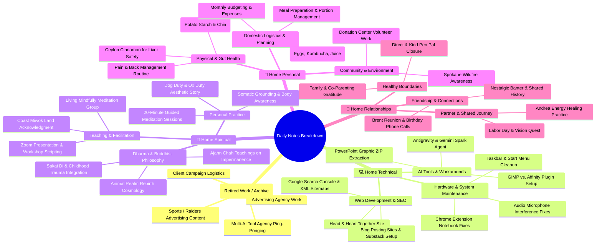

# Daily Notes Categorization Mind Map

This mind map breaks down your daily notes into 5 distinct categories, isolating retired **AVDG** work content from your active home, spiritual, personal, and technical domain folders.

---

## 🗺 Interactive Mind Map

---

## 📁 Proposed Folder Routing Map in Obsidian

To automatically route notes or filter content based on your retirement preferences:

| Domain Category | Purpose & Description | Recommended Vault Folder Path |
| :--- | :--- | :--- |
| 🏢 **AVDG** *(Retired)* | Agency, advertising, client campaigns | `G:\Google Drive (260611)\Obsidian Master Vault\Flashrebob Obsidian\AVDG` *(Archive)* |
| 💻 **Home Technical** | Web dev, SEO, computer setup, AI tools | `G:\Google Drive (260611)\Obsidian Master Vault\Flashrebob Obsidian\__Web Dev information` / `Computer Information` |
| 🧘 **Home Spiritual** | Dharma, Zen teachings, meditation group | `G:\Google Drive (260611)\Obsidian Master Vault\Flashrebob Obsidian\_A_My Teaching` / `Zen` / `Meditations` |
| 🌿 **Home Personal** | Health, gut health, errands, budget | `G:\Google Drive (260611)\Obsidian Master Vault\Flashrebob Obsidian\Personal` / `Health` |
| 🤝 **Home Relationships**| Friends, partner, boundaries, family | `G:\Google Drive (260611)\Obsidian Master Vault\Flashrebob Obsidian\Human Relations` |

---

## ⚙️ Automated Filtering Option for Krisp & Bee Reports

If you prefer, we can update your `krisp_bee_merger.py` script to **automatically filter out AVDG / agency work notes** when generating your daily report so that your daily notes remain 100% focused on your personal, spiritual, technical, and relationship pursuits!
