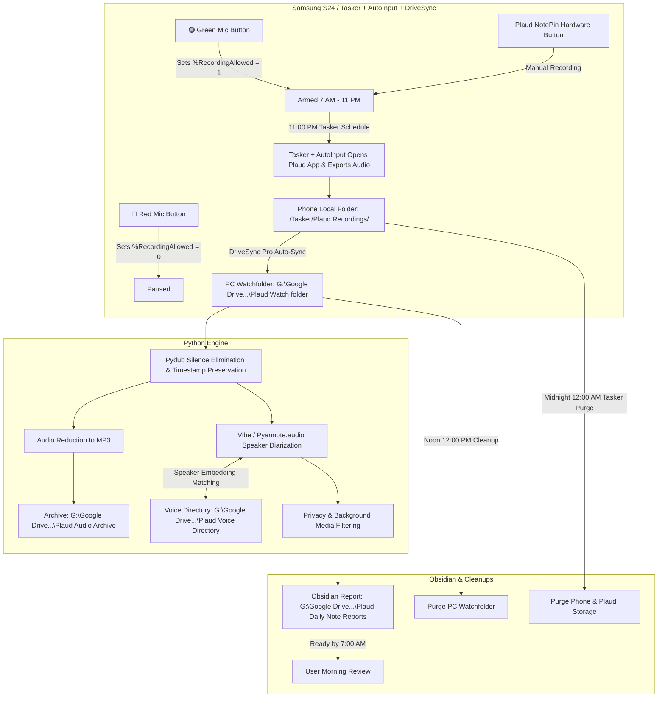

# Plaud NotePin Automated Voice Archiving & Daily Processing System

## Executive Summary
This implementation plan establishes an automated, privacy-focused voice archiving and transcription pipeline for your **Plaud NotePin**. Audio recorded on the Plaud NotePin is synced to your phone's Plaud App, exported via Tasker & AutoInput at 11:00 PM into your phone's local `Plaud Recordings` folder, and automatically synced via **DriveSync Pro** to your PC (`G:\Google Drive (260611)\Plaud Watch folder`).

On your PC, the pipeline processes the raw audio, trims silence with Pydub, performs speaker diarization using **Vibe / pyannote.audio** against your **Plaud Voice Directory**, generates an Obsidian Daily Note Report (matching your updated Bee report structure), and archives reduced MP3s to `Plaud Audio Archive`.

---

## Architecture & Data Flow

---

## Technical Specifications & Workflow Details

### 1. Phone Export & Cloud-Free Transfer Pipeline (11:00 PM)
- **Tasker + AutoInput Workflow**:
  - At **11:00 PM**, Tasker launches the Plaud App on your phone.
  - AutoInput automates the UI sequence to select today's recordings, tap **Export Audio**, and save to `/storage/emulated/0/Tasker/Plaud Recordings/`.
- **DriveSync Pro Auto-Sync**:
  - DriveSync Pro monitors `/storage/emulated/0/Tasker/Plaud Recordings/` and immediately uploads the exported files to `G:\Google Drive (260611)\Plaud Watch folder` on your PC over Wi-Fi.

### 2. Schedule & Cleanup Rules
- **Recording Window**: 7:00 AM – 11:00 PM (bound to `%RecordingAllowed == 1`).
- **Manual Hardware Override**: Manual recordings started directly on the Plaud NotePin device outside 7 AM – 11 PM are preserved and processed.
- **Midnight Cleanup (12:00 AM)**: Tasker purges processed files from phone storage and Plaud App local storage.
- **Noon Cleanup (12:00 PM)**: Python cleans up `G:\Google Drive (260611)\Plaud Watch folder` on PC daily at 12:00 PM.

### 3. Audio Processing (Pydub & MP3 Archive)
- **Silence Trimming**: Pydub removes silent pauses while preserving exact `HH:MM:SS` timestamp offsets.
- **Audio Reduction**: Audio is reduced to 64kbps/128kbps MP3 format and saved to:
  `G:\Google Drive (260611)\Plaud Audio Archive`

### 4. Speaker Diarization & Plaud Voice Directory
- **Diarization Engine**: Vibe / `pyannote.audio`.
- **Voice Directory**: `G:\Google Drive (260611)\Plaud Voice Directory` stores labeled reference samples (`Andy.wav`, `Mom.wav`, `Gordon.wav`).
- **Voice Labeler Helper**: `plaud_voice_labeler.py` extracts unknown voice profiles and prompts you to label them.
- **Privacy / Background Filtering**:
  - Group background conversations identified, summarized, but private details omitted.
  - Background music and TV media identified, noted, but omitted from report data.

### 5. Revised Daily Note Report Structure (Bee & Plaud Specification)
- **Destination**:
  `G:\Google Drive (260611)\Obsidian Master Vault\Flashrebob Obsidian\_A_My Journal and Notes\Plaud Daily Note Reports`
- **File Naming**: `Plaud Daily Note YYMMDD.md`
- **Updated Section Schema**:
  1. **Frontmatter Tags** (Topic & Entity tags).
  2. **Title & Header** (`Date`, `Attendees`, `Total Conversations Processed`).
  3. **📌 Executive & Core Topics Overview (Keywords/Tags)**:
     - Core Topics, Entities & Terms, Key Actions, Keywords/Tags.
  4. **📅 Google Calendar Events Today**.
  5. **📧 Gmail Activity Log**.
  6. **💡 Key Points, Subjects and Themes**.
  7. **📖 Detailed Subject Matter**:
     - Presented strictly in **chronological order** (`HH:MM AM/PM – HH:MM AM/PM`).
     - Distinct conversation topics separated with **bullet points** under each time block header.
  8. **🗣️ Personal Monologues & Direct Thoughts**.
  9. **🧘 Spiritual and Societal Insights**.
  10. **💬 Quoted Expressions & Catchy Phrases**.
  11. **📚 Stories & Case Examples Shared**.
  12. **🧠 Physical & Mental Challenges Table**.
  13. **📻 Miscellaneous Media & References Encountered**.
- **Delivery Time**: Ready by **7:00 AM** daily.

---

## Documentation Location

A copy of this plan is maintained in your Obsidian vault's Web Dev folder:
`G:\Google Drive (260611)\Obsidian Master Vault\Flashrebob Obsidian\__Web Dev information\Plaud NotePin Implementation Plan.md`

---

## Proposed Component Implementation

### Component 1: Tasker & AutoInput Profile (`plaud_export_automation.prf.xml`)
- Automates launching Plaud App at 11:00 PM, triggering AutoInput export sequence to `/Tasker/Plaud Recordings/`.

### Component 2: Audio Processor & Speaker Diarization (`plaud_audio_processor.py`)
- Pydub silence trimming, MP3 archive reduction, Vibe/pyannote diarization with `Plaud Voice Directory`.

### Component 3: Speaker Labeling Tool (`plaud_voice_labeler.py`)
- CLI helper script to inspect unknown voice embeddings and add them to `Plaud Voice Directory`.

### Component 4: Daily Report Generator (`plaud_daily_report_generator.py`)
- Generates reports adhering strictly to the updated Bee & Plaud report structure with chronological bulleted subject matter.

### Component 5: System Documentation (`Plaud_Voice_System_Documentation.md`)
- Technical documentation stored in `__Web Dev information`.

---

## Verification Plan

### Automated Verification
1. **Report Structure Validation**: Verify section #3 header includes `(Keywords/Tags)` and section #7 details are formatted chronologically with bulleted topics.
2. **Audio Reduction & Archive**: Test Pydub silence trimming and MP3 archive saving in `Plaud Audio Archive`.
3. **Noon Cleanup**: Test 12:00 PM watchfolder cleanup.

### Manual Verification
1. **Tasker + AutoInput Export Test**: Run 11:00 PM export task on phone to verify AutoInput exports files to `/Tasker/Plaud Recordings/` and DriveSync Pro syncs to `Plaud Watch folder`.
2. **Speaker Directory Labeling**: Run `plaud_voice_labeler.py` to label initial voice samples.
